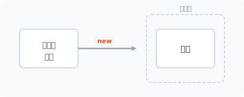
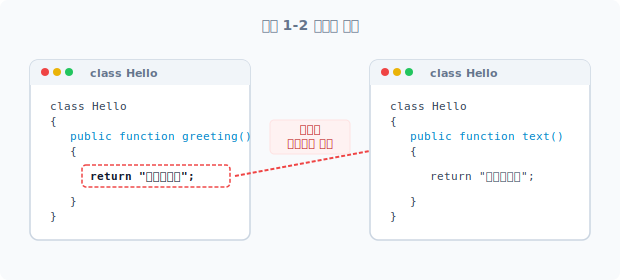
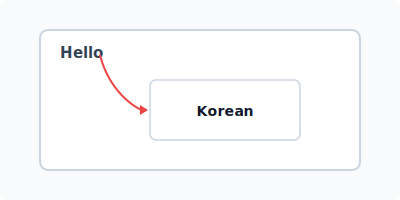
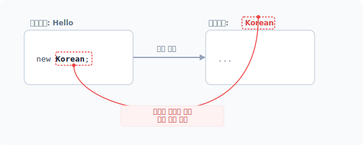
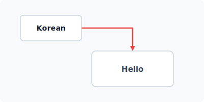
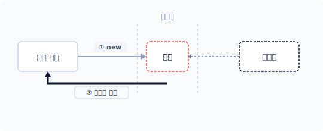
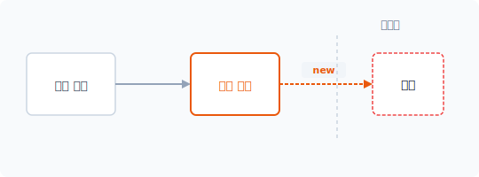
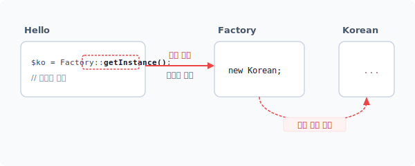
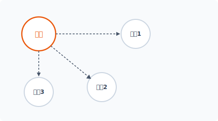
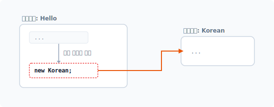


# CHAPTER 1 팩토리 패턴

**factory**
[ |fæktri; |fæktəri ]

팩토리 패턴은 생성 패턴 중에서도 가장 기본이 되는 패턴이며 클래스의 객체 생성 처리를 위임합니다. 팩토리 패턴을 학습하기에 앞서 클래스와 객체지향의 개념을 간단히 살펴봅시다. 그리고 의존성 주입과 그 문제점을 살펴보고 이를 팩토리 패턴으로 해결해봅시다.¹

## 1.1 클래스와 객체지향

객체지향 프로그램을 실행하려면 먼저 클래스를 선언하는 과정이 필요합니다. 클래스 선언은 객체를 생성하는 청사진과 같습니다. 또한 클래스에는 객체에서 처리할 행동²들을 결정합니다.

### 1.1.1 객체지향
객체지향 프로그래밍object-oriented programming (이하 OOP) 개념은 1970년대부터 사용한 개발 방법론입니다. OOP 개발 방법은 C++나 자바와 같은 언어에서 오래 전부터 도입해 사용하고 있습니다. 최근에는 대규모 소프트웨어 설계에 유용한 OOP 개발 방식이 인기를 얻고 있습니다.

---
¹ 팩토리 패턴을 다른 말로 생성자 패턴이라고도 합니다.
² 행동은 객체에서 동작 수행해야 하는 처리 로직을 의미합니다.

서비스에는 다양한 사용자 경험이 요구되는 등 각종 사항들이 증가하고 있습니다. 이로 인해 프로그램의 기능이 복잡해지고 규모도 점점 커지고 있습니다. 또한 코드에서 처리하는 일이 다양해짐에 따라 기존의 절차지향적 개발은 한계에 부딪혔습니다. 이러한 이유로 객체지향 개발과 디자인 패턴이 인기를 얻고 있습니다.³

현대 프로그래밍 개발에서 OOP를 이해하지 않고는 고급 프로그래밍을 다루는 데 어려움이 있습니다. 또한 최근 인기 있는 프레임워크들을 사용하려면 객체지향 개발 방법을 숙지하고 있어야 합니다. 심지어 객체지향 방식을 사용하여 코드를 작성하지 않으면 협업이 어려울 정도로 개발 환경에서 OOP가 보편화되었습니다.

### 1.1.2 클래스
객체지향 개발의 첫 단추는 클래스를 선언하는 것입니다. 사용하는 프로그램 언어에 따라 선언하는 방식에 조금씩 차이가 있지만, OOP를 지원하는 현대 프로그래밍 언어에서는 클래스를 선언할 때 class 키워드를 사용합니다. 다음은 PHP에서 클래스 파일을 생성하는 예제입니다.

#### 예제 1-1 Factory/01/Hello.php
```php
<?php
// 클래스 파일 선언
class Hello
{
    public function greeting()
    {
        return "안녕하세요";
    }
}
```

[예제 1-1]의 Hello 클래스는 인사말을 출력하는 간단한 코드입니다. 클래스 파일을 생성할 때는 PSRPHP Standard Recommendation⁴ 규격에 맞게 작성하는 것을 권장합니다.

---
³ PHP 언어는 절차지향적, 객체지향적 프로그램이 모두 가능합니다. 최근 프레임워크들은 설계가 객체지향 방식으로 전환되었습니다. 대표적으로 라라벨(Laravel), 코드이그나이터(codeIgniter)와 같은 프레임워크 등이 있습니다. 필자가 JINYPHP도 OOP로 개발되었습니다.
⁴ PSR 규격에서는 하나의 클래스를 한 개의 파일로 생성하는 것을 권장합니다. PSR 규격에 맞게 클래스 파일을 생성하면 오토로드, 컴포저를 통해 자동 include 처리할 수 있다는 것이 장점입니다.

### 1.1.3 객체
객체지향 개발을 위한 첫 단추로 클래스를 선언했습니다. 하지만 클래스를 선언했다고 해서 객체지향 코드를 바로 실행할 수 있는 것은 아닙니다. 객체지향 코드를 실행하기 위해서는 클래스를 통해 객체를 생성해야 합니다. 객체 생성은 new 키워드를 사용합니다.

```
$변수 = new <클래스 이름>(인자, 인자, 인자);
```

이 코드를 보면 알 수 있듯이 <클래스 이름> 앞에 new 키워드를 붙입니다. 이렇게 작성된 코드는 선언된 클래스를 이용해 객체 생성과 반환을 같이 실행합니다. new 키워드는 컴파일, 인터프리터 과정에서 선언된 클래스에 따른 객체를 생성하고 이를 메모리에 할당합니다. 이처럼 언어에서 객체를 생성하는 과정을 인스턴스화라고 합니다. 그리고 인스턴스화를 통해 생성된 객체를 인스턴스라고 합니다. 인스턴스와 객체는 모두 같은 말입니다.

#### 그림 1-1 인스턴스 생성




객체를 생성하는 new 키워드는 예약어입니다. 다른 프로그래밍 언어에서도 new 예약어를 사용해 클래스의 객체를 생성하는 경우가 많습니다. 생성, 반환된 객체는 대입 연산자(=)를 이용하여 $변수에 저장합니다. PHP의 변수는 다양한 타입의 데이터를 담을 수 있는 메모리 공간입니다.⁵ 생성된 객체도 변수에 담아 사용할 수 있습니다.

### 1.1.4 객체 사용
앞에서 클래스 선언과 인스턴스화 방법에 대해 알아봤습니다. 객체는 클래스 선언을 기반으로 만들어집니다. 인스턴스화는 선언된 클래스를 이용하여 실제 메모리에 할당할 객체를 생성하는 과정입니다. 즉, 인스턴스화는 new 키워드로 생성된 객체를 반환합니다.

---
⁵ 객체 생성은 클래스 선언에 맞게 객체를 생성하고 메모리에 공간을 할당합니다.

다음은 Hello 클래스 파일을 읽어와 객체를 생성하는 코드입니다. 클래스는 데이터와 함수를 하나의 그룹으로 묶습니다. 이러한 과정을 캡슐화라고 합니다. 캡슐화된 객체의 함수를 사용하기 위해서는 행위(메서드)를 호출해야 합니다.

#### 예제 1-2 Factory/01/index.php⁶
```php
<?php
// 클래스 파일을 읽어옵니다.
include "hello.php";

// 객체를 생성합니다.
$obj = new Hello;

// 행위 호출
echo $obj->greeting();
```

```
$ php index.php
안녕하세요
```

[예제 1-2]는 Hello 클래스 선언하고 new hello로 새로운 객체를 생성하며 greeting() 메서드를 호출해서 인사말을 출력합니다.

## 1.2 의존성

### 1.2.1 객체지향
개발에서 하나의 객체로 처리할 수 있는 일은 매우 한정적입니다. 객체지향 프로그래밍은 수많은 객체의 집합을 설계하는 것입니다. 생성된 다수의 객체는 상호 작업을 위한 관계를 설정해 주어야 합니다.

관계(Relation)는 객체 간 동작을 위해 접근하는 것입니다. 개별 객체는 요구되는 역할을 수행하기 위한 책임이 부여됩니다. 객체지향은 부여된 책임 간의 관계를 설정하고, 상호 동작을 수행하여 로직을 처리합니다.

---
⁶ PSR 규격에서는 클래스 생성 시 중괄호를 붙이는 컨벤션을 요구합니다. 하지만 필자는 객체 생성 매개변수의 유무를 구분하기 위해 중괄호를 생략합니다.

여 로직을 처리합니다.

객체의 관계가 설정되면 객체 간에 상호 작용이 발생합니다. 문제를 해결하기 위해 책임 있는 객체는 각각의 서브 책임을 가진 다른 객체에 소속된 문제 해결을 위임합니다. 객체들은 이 과정에서 정보를 주고받는데 이를 대화(message)라고 합니다. 객체는 서로 메시지를 전달하며 고유의 기능을 실행합니다.

### 1.2.2 의존
의존은 객체지향에서 객체의 관계를 설정합니다. 객체지향 개발 방식은 절차지향 방식과 달리 해결해야 하는 기능과 관련된 책임을 캡슐화로 분배합니다.

객체는 각자 고유한 역할을 분담하고 있어 하나의 객체만으로 동작하는 것은 의미가 없습니다. 객체의 관계는 다른 말로 객체가 서로 결합한다는 의미입니다. 이 객체 간 결합을 의존성이라고 합니다. 캡슐화된 객체는 서로 관계를 맺고 대화를 통해 동작을 수행합니다.

#### 그림 1-2 객체의 분리



객체 내부에서 다른 객체를 생성하면 두 객체 사이에 의존성이 발생합니다. 또한 외부에 의해 결합 관계가 발생하는 것을 의존성 주입이라고 합니다. 예제를 통해 의존 관계를 확인해보겠습니다.

#### 예제 1-3 Factory/02/Korean.php
```php
<?php
// 클래스 파일 선언
class Korean
{
```

public function text()
    {
        return "안녕하세요";
    }
}
```

Korean 클래스는 '안녕하세요' 문자를 반환하는 코드입니다. 다음 코드는 [예제 1-1]에서 살펴본 hello.php의 Hello 클래스 코드를 다음과 같이 수정합니다.

#### 예제 1-4 Factory/02/hello.php
```php
<?php
// 클래스 파일 선언
class Hello
{
    public function greeting()
    {
        // return "안녕하세요";
        // 새로운 객체를 생성합니다.
        $ko = new Korean;
        return $ko->text();
    }
}
```

greeting() 메서드에서 바로 인사말을 반환했던 [예제 1-2]와 달리, [예제 1-4]의 Hello 클래스는 greeting() 메서드 내에 새로운 객체를 생성하는 코드를 삽입합니다. 그리고 새로 생성된 객체에 있는 text() 메서드를 호출합니다. 메서드 결과값을 반환하여 '안녕하세요'를 출력합니다.

#### 그림 1-3 객체 내에서 또 다른 객체 생성



Hello 클래스와 Korean 클래스의 관계를 그림으로 바꾸면 [그림 1-3]과 같습니다.

### 1.2.3 객체 선택
[예제 1-3]에서는 Korean 클래스 객체 1개만 생성했습니다. 만약 생성할 클래스가 다르다면 어떻게 해야 할까요? 클래스를 조건에 맞게 구체적으로 직접 지정한 후 객체를 생성해야 합니다.

```php
<?php
if($type) {
    $obj = new className1;
} else {
    $obj = new className2;
}
```

이 코드와 같이 조건에 따라 생성되는 객체가 다르면 객체를 유연하게 생성할 수 없습니다. 만일 새로운 조건이 추가된다면 조건에 맞는 객체 생성 로직을 수정해야 합니다. 이처럼 어떤 객체를 어떻게 생성 처리할지에 따라 의존성과 유연성을 결정합니다.

### 1.2.4 강력한 결합
[예제 1-3]은 객체 메서드 안에서 Korean 객체를 생성합니다. 하나의 객체가 또 다른 객체를 생성하면 두 객체에는 결합 관계가 발생합니다. Hello 클래스의 greeting() 메서드 내용을 좀 더 자세히 살펴봅시다.

```php
...
// 새로운 객체를 생성합니다.
$ko = new Korean;
...
```

greeting() 메서드 코드 내에서 클래스 이름을 직접 지정해 객체를 생성하면 강력한 결합 관계가 발생합니다. 강력한 결합 관계가 발생하면 클래스 이름 등이 변경될 때 이름을 통해 생성된 코드를 모두 직접 찾아 수정해야 합니다.

강력한 객체의 결합 코드는 향후 유연한 코드 확장을 방해하고 변경과 수정을 어렵게 만드는 원인이 됩니다.

### 1.2.5 클래스 변경
앞에서 우리는 객체의 의존성과 결합 관계의 문제점을 살펴보았습니다. 이를 어떻게 개선해야 할까요? 이것이 디자인 패턴을 학습하는 목적입니다. 팩토리 패턴은 객체 생성 시 확장과 수정을 쉽게 하기 위한 설계 방법입니다.

[예제 1-3]의 객체 생성 과정을 다시 한 번 살펴보고 문제점과 디자인 패턴의 필요성에 대해 알아보겠습니다. 상위 객체인 Hello는 클래스 이름을 직접 지정하여 Korean 객체를 생성합니다. 이처럼 객체를 직접 생성하는 코드를 삽입하면 객체를 생성하는 과정에서 강력한 객체 결합 관계가 발생합니다.

#### 그림 1-4 객체의 생성과 결합 관계



강력한 결합 관계는 코드의 '수정, 변경'을 어렵게 합니다. 예를 들어 고객의 요청으로 기능 개선이 필요해졌고 이로 인해 클래스 이름도 변경되어야 한다면 어떻게 해야 할까요? 이 경우 개발자는 해당 클래스를 사용하는 곳 전부를 일일이 수정해야 합니다. 그러나 결합 관계에 있는 클래스를 모두 추적하여 수정하는 것은 매우 불편하므로, 이를 개선하기 위해 좀 더 유연하게 객체 결합 관계를 처리하는 방법이 필요합니다.

객체지향 개발에서 객체 간 의존성은 객체를 생성할 때마다 발생합니다. 그리고 코드에서 직접 생성한 객체는 의존성이 강력해서 유지 보수와 수정이 어렵습니다. 이처럼 의존 관계가 강력한 결합 관계를 느슨한 결합 관계로 변경하면 문제를 해결할 수 있습니다. 이번 장에서 학습할 팩토리 패턴은 클래스 구조를 변경하여 생성되는 객체의 구조를 느슨한 관계로 변경합니다.

## 1.3 의존성 주입

본격적인 팩토리 패턴을 학습하기 전에 객체의 관계 의존성에 대해 좀 더 자세히 알아봅시다. 객체의 의존성은 내부적 발생과 외부적 발생으로 구분할 수 있습니다. 객체의 관계가 외부적 요인으로 결합되었다면 이를 의존성 주입이라 합니다. 의존성 주입이 발생되면 객체는 일반이 아닌 복합 객체 형태의 모습을 갖게 됩니다.

### 1.3.1 복합 객체
복합 객체는 하나의 객체가 다른 객체의 정보를 가진 구조입니다. 객체의 정보는 클래스의 프로퍼티 값을 통해 다른 외부 객체를 가리킵니다. 이처럼 복합 객체는 종속적이고 연관 관계를 갖는다는 특성이 있습니다. 예제 코드를 통해 복합 객체에 대해 학습해보겠습니다.

#### 예제 1-5 Factory/03/hello.php
```php
<?php
// 클래스 파일 선언
class Hello
{
    // 객체 저장소
    private $korean;

    public function __construct($obj)
    {
        $this->korean = $obj;
    }

    public function greeting()
    {
        // return "안녕하세요";
        // 복합 객체를 호출합니다.
        return $this->korean->text();
    }
}
```

기존 Hello 클래스를 복합 구조의 선언으로 변경합니다. 외부 의존성 주입을 위해 생성자 메서드를 추가합니다. 생성자 메서드는 클래스 생성 시 외부로부터 매개변수를 받을 수 있으며 이

때 전달되는 인자값은 객체입니다. Hello 객체는 외부에서 전달받은 매개변수(객체)를 내부 프로퍼티에 저장합니다. 이로써 두 클래스는 종속적 연관 관계를 가집니다.

### 1.3.2 생성과 주입
의존성 주입은 객체에 또 다른 객체의 정보를 전달하는 것을 말합니다. 외부에서 전달받은 객체(정보)를 내부 프로퍼티에 저장함으로써 복합 구조 형태로 변경됩니다.

#### 그림 1-5 객체 의존성 주입



복합 구조로 변경된 Hello 클래스를 실행하는 코드를 작성합니다. 생성자를 통해 결합될 Korean 객체를 주입합니다.

#### 예제 1-6 Factory/03/index.php
```php
<?php
// 클래스 파일을 읽어옵니다.
include "hello.php";
include "korean.php";

// 객체를 생성합니다.
$korean = new Korean;

// 의존성을 주입합니다.
$obj = new Hello($korean);

// 행위 호출
echo $obj->greeting();
```

```
$ php index.php
안녕하세요
```

상위 클래스인 Hello를 복합 객체로 설계 변경합니다. 의존성을 전달하려는 Korean 객체를 미리 생성하고 생성된 Korean 객체를 Hello 객체의 초깃값 인자로 전달합니다. Hello 객체는 생성자로부터 전달받은 Korean 객체를 내부 프로퍼티에 저장합니다. Hello는 연관 관계로 변경되며 Korean 객체와 의존성을 가집니다.

## 1.4 의존 관계의 문제점

앞에서 우리는 객체지향의 다양한 클래스 선언과 객체 생성 방법에 대해 알아봤습니다. 이처럼 모든 객체의 생성 과정에서는 의존성이 발생합니다. 팩토리 패턴의 목적은 객체 생성 시 발생하는 강력한 의존 관계를 보다 느슨하게 만드는 것입니다.

### 1.4.1 new 키워드
객체 생성은 객체지향 개발의 시작 단계이며, 객체지향에서는 선언된 클래스를 사용해 객체를 생성합니다. 전형적으로 new 키워드는 선언된 클래스를 기반으로 객체를 생성하는 인스턴스화 작업을 수행합니다. 객체지향에서 객체 생성은 피할 수 없는 과정이고, 인스턴스화를 통해 객체가 생성되면 의존성도 발생합니다. 즉 new 키워드로 직접 객체를 생성하는 것은 강력한 결합 관계인 코드가 됩니다.

#### 그림 1-6 new 키워드와 의존성



그렇다고 해서 new 키워드를 사용하지 않고 객체를 생성할 수는 없습니다. new 키워드는 객체를 생성하는 유일한 방법이기 때문입니다.

### 1.4.2 변화 대응
코드에서 직접 new 키워드를 사용하면 객체 간에 강력한 의존 관계를 갖는 구조적 문제가 발생합니다. 프로그램 코드는 마치 살아 있는 생물처럼 지속적으로 변화하고 발전합니다. 하지만 객체의 강력한 의존 관계는 코드의 유연성을 떨어뜨리고 변화와 발전을 방해합니다.

그렇다면 어떻게 객체 생성 과정에서 강력하지 않은 연관 관계를 만들 수 있을까요? new 키워드를 사용하지 않고 객체를 만드는 다른 방법은 없을까요? 디자인 패턴에서는 이 문제점을 해결하기 위해 생성 패턴을 제안합니다.

#### 그림 1-7 생성 패턴 응용



그중에서도 팩토리 패턴은 객체의 생성을 별개의 클래스로 구축하여 위임 처리합니다.

### 1.4.3 생성 위임
생성 패턴에서는 객체 생성을 위임하여 별개의 클래스로 분리하고, 객체 생성 과정을 담당할 별도의 클래스를 선언합니다. 프로그램 내에서 필요한 객체를 생성하고 관리하는 캡슐화된 클래스를 선언하는 것입니다.

프로그램 내에서 객체 생성이 필요한 경우 분리 설계된 팩토리 객체에 생성을 위임합니다. 즉 실제 코드가 new 키워드를 직접 사용하지 않고 팩토리의 객체를 호출하는 것으로 대체합니다. 이와 같이 객체의 요청과 생성을 별도의 클래스로 분리함으로써 느슨한 결합 관계로 변경합니다. 또한 이처럼 디자인 패턴에서 객체를 생성하고 캡슐화하여 위임하는 것을 공장(factory)이라고

합니다. 공장은 무언가 만들어내는 곳을 의미하는데, 주로 새로운 객체를 생성합니다. 패턴의 이름을 보면 목적과 역할을 유추해볼 수 있습니다.

### 1.4.4 객체 공장
개발자마다 선언된 클래스의 객체를 생성하는 방법이 다양합니다. 하지만 팩토리 패턴에서는 새로운 객체를 생성할 때 new 키워드를 코드에 직접 작성하지 않고, 일정한 규격에 맞춘 메서드나 함수를 이용합니다. 팩토리 패턴은 클래스를 생성하는 방법이라고 이해하면 쉽습니다. 팩토리 패턴에서는 객체 생성 처리를 규격화하여 관리합니다. 마치 공장에서 물건을 찍어내듯이 객체를 생성한다는 의미에서 팩토리 패턴이라고 부릅니다.

디자인 패턴은 이렇게 강한 연관 관계인 객체를 느슨한 관계로 바꾸고, 느슨한 결합은 보다 다양한 코드 변화를 처리할 수 있습니다. 팩토리는 객체의 생성 작업을 분리하며 분리된 객체의 생성 처리는 방법에 따라 크게 2가지로 나눌 수 있습니다.

* 클래스로 분리
* 메서드로 분리

일반적인 팩토리는 개별 클래스로 분리해 위임을 처리하는 방법을 말합니다. 이와 달리 단순 팩토리(simple factory) 패턴은 기존 클래스에 생성 메서드만 추가하여 객체를 생성/처리합니다(단순 팩토리는 1.6절 참고).

## 1.5 팩토리 패턴

팩토리 패턴에 대해 본격적으로 학습해보겠습니다. 앞에서는 팩토리 패턴을 학습하기 위해 객체 생성과 문제점, 의존성에 대해 알아보았습니다. 팩토리 패턴은 객체 생성을 위임할 수 있는 클래스를 정의합니다. 팩토리 패턴의 클래스는 객체 생성을 담당하고 객체의 생성을 느슨한 관계가 되도록 처리합니다.

### 1.5.1 느슨한 결합
객체지향 프로그램의 첫 단추로 클래스를 선언했다면 그 다음으로 할 일은 객체를 생성하는 것입니다. 하지만 객체 생성은 객체 간 결합 관계를 발생시키고, 이러한 결합 관계는 객체 간에 의존성을 부여합니다. 팩토리 패턴에서는 [예제 1-3]과 달리 코드에서 직접 클래스의 이름을 지정해 객체를 생성하지 않으며, 별도의 객체에 필요한 객체를 생성하도록 책임을 위임합니다.

다음 예제는 객체 생성을 책임질 Factory 클래스를 선언합니다.

#### 예제 1-7 Factory/04/factory.php
```php
<?php
// 팩토리 클래스
class Factory
{
    static public function getInstance()
    {
        echo "팩토리: 객체를 생성하여 반환합니다.\n";
        return new Korean();
    }
}
```

Factory 클래스는 생성할 객체를 반환하는 메서드를 가지고 있습니다. Factory 클래스의 getInstance() 메서드로 객체를 생성하고 생성된 객체를 반환합니다.

### 1.5.2 동적 팩토리
팩토리 패턴은 분리된 factory 클래스의 객체를 통해 필요로 하는 모든 객체의 생성을 위임합니다. 팩토리 패턴은 앞에서 문제로 언급했던 강력한 결합 관계 발생을 줄이고, 코드에서 new를 직접 사용하지 않고도 객체를 생성합니다. 앞에서 설계한 Factory 클래스를 이용해 기존의 Hello 클래스를 수정하여 Factory 클래스의 getInstance() 메서드를 정적static 타입으로 호출합니다.

#### 예제 1-8 Factory/04/hello.php
```php
<?php
// 클래스 파일 선언
```

class Hello
{
    public function greeting()
    {
        // return "안녕하세요";
        // 새로운 객체를 생성합니다.

        // $ko = new Korean;
        // return $ko->text();

        $ko = Factory::getInstance(); // 팩토리 호출
        return $ko->text();
    }
}
```

[예제 1-8]에서는 new 키워드를 직접 사용하지 않고 Factory 클래스의 getInstance() 메서드가 Korean 클래스의 객체를 생성하여 반환합니다. Factory 클래스는 Korean 객체의 생성 작업을 위임하는 역할을 수행합니다.

#### 그림 1-8 Factory 클래스를 활용한 객체 생성



> [!NOTE]
> Factory 클래스를 사용하기 위해서는 new 키워드를 이용하여 팩토리 객체를 생성해야 합니다. new 키워드를 사용하지 않기 위해 Factory 클래스의 getInstance() 메서드를 정적 타입으로 선언하고 호출했습니다.

다음은 작성한 코드를 실행하는 메인 소스입니다. 필요한 클래스 선언 파일을 include하여 같이 실행합니다.

#### 예제 1-9 Factory/04/index.php
```php
<?php
// 클래스 파일을 읽어옵니다.
```

include "factory.php";
    include "hello.php";
    include "korean.php";

    // 객체를 생성합니다.
    $obj = new hello;

    // 행위 호출
    echo $obj->greeting();
```

```
$ php index.php
팩토리: 객체를 생성하여 반환합니다.
안녕하세요
```

팩토리 패턴으로 변경된 코드를 통해 코드 자체에서 생성되는 강력한 의존 관계를 분리하고 느슨한 의존 관계로 변경했습니다. 앞에서 지적했던 의존 관계 문제가 해결되었습니다. 하지만 팩토리 패턴을 사용하면 객체를 직접 생성하는 것과 달리 Factory 객체를 통해 호출call하는 처리 과정이 한 단계 더 필요합니다. 이는 불필요한 호출 증가로 프로그램 성능 저하를 초래합니다. 그러나 객체 생성을 다른 객체에 위임함으로써 내부적인 결합을 제거하고, 동적으로 객체를 관리할 수 있다는 장점도 있습니다.

### 1.5.3 클래스의 선택
팩토리 패턴은 객체 생성을 위임합니다. 다음 예제를 보면서 객체 생성 위임에 대해 더 학습해봅시다. 새로운 인사말을 출력하기 위해 영어로 된 인사말 클래스(English)를 하나 더 만듭니다.

#### 예제 1-10 Factory/05/English.php
```php
<?php
// 클래스 파일 선언
class English
{
    public function text()
    {
        return "hello world";
    }
}
```

}
}
```

인사말 객체지향 프로그램은 Korean, English 클래스의 객체를 생성하고 관리합니다. Factory 클래스를 다음과 같이 변경합니다.

#### 예제 1-11 Factory/05/factory.php
```php
<?php
// 팩토리 클래스
class Factory
{
    static public function getInstance($type=null)
    {
        echo "팩토리:객체를 생성하여 반환합니다.\n";
        if($type == "ko") {
            return new Korean();
        } else if($type == "en") {
            return new English();
        }
    }
}
```

[예제 1-11]은 팩토리 패턴이 여러 객체의 생성을 책임집니다. 이때는 생성할 객체를 선택할 수 있는 조건 로직이 필요한데, 이 경우 외부의 매개변수값을 받아 처리할 수 있습니다. Factory 클래스의 getInstance() 메서드는 조건을 통해 Korean과 English 객체를 선택적으로 생성/반환할 수 있습니다. 조건이 추가/변경될 때마다 다른 객체를 생성하고 반환할 수 있습니다.

다음 예제의 Hello 클래스도 변경된 Factory 클래스에 맞게 수정합니다.

#### 예제 1-12 Factory/05/hello.php
```php
<?php
// 클래스 파일 선언
class Hello
{
    public function greeting($type)
    {
```

{
        // return "안녕하세요";
        // 새로운 객체를 생성합니다.

        // $ko = new Korean;
        // return $ko->text();

        $ko = Factory::getInstance($type); // 팩토리 호출
        return $ko->text();
    }
}
```

Factory 클래스는 2개의 클래스를 선택적으로 객체 생성하므로 Factory::getInstance() 메서드에 생성할 객체명에 대한 조건값을 같이 전달합니다.

#### 그림 1-9 부장(팩토리)이 어떤 사원(객체)에게 지시를 내릴지 결정하는 것과 유사함



예를 들면 회사에서 부장이 사원1, 사원2, 사원3 등을 직접 지정해 선택적으로 담당할 일을 시키는 것과 같습니다. 이때 사원은 매개변수로 전달받는 방법과 유사하게 선택될 수 있습니다. 메인 예제 코드도 2개의 인사말을 모두 출력할 수 있도록 수정해보겠습니다.

#### 예제 1-13 Factory/05/index.php
```php
<?php
// 클래스 파일을 읽어옵니다.
include "factory.php";
include "hello.php";
```

include "korean.php";
    include "English.php";

    // 객체를 생성합니다.
    $obj = new hello;

    // 행위 호출
    echo $obj->greeting("en")."\n";
    echo $obj->greeting("ko")."\n";
```

```
$ php index.php
팩토리:객체를 생성하여 반환합니다.
hello world
팩토리:객체를 생성하여 반환합니다.
안녕하세요
```

[예제 1-13]에서는 2가지 언어의 인사말을 출력하는 팩토리 패턴을 구현합니다. 더 많은 언어 인사말을 출력할 때는 간단하게 인사말 클래스를 선언하고 조건만 추가합니다. 팩토리 패턴은 객체의 생성 처리를 동적으로 위임하므로, 이처럼 향후 클래스가 추가되거나 변경돼도 코드를 쉽게 수정할 수 있습니다.

### 1.5.4 형식 안정성
팩토리 클래스는 프로그램 내부에서 필요한 객체를 생성하는 역할을 수행합니다. 또한 다수의 객체를 생성할 때는 이를 선택하기 위해 매개변수를 전달합니다. 이때 전달되는 매개변수의 타입은 대부분 문자열을 사용합니다. 팩토리 클래스는 전달받은 매개변수를 비교해 일치하는 객체를 생성하고 반환합니다. 하지만 전달받은 매개변수를 판별하지 못해 정확히 생성해야 할 객체를 결정하지 못하는 경우도 있습니다(조건 불일치).

예를 들어 한국어 인사말은 ko 코드를 사용합니다. 실수로 ko 코드가 아닌 kr 코드를 입력하면 팩토리 패턴은 정확한 객체를 생성하지 못하기 때문에 프로그램이 실행되지 않습니다. 이처럼 매개변수가 코드의 오류를 발생시키는 원인인 경우도 많습니다. 프로그램이 안전하게 동작하도록 하기 위해 상수const를 사용하는 것도 좋은 방안입니다. 다음은 상수를 이용해 변경한 예제 코드입니다.

#### 예제 1-14 Factory/05/factory2.php
```php
<?php
// 팩토리 클래스
class Factory
{
    const KOREAN = "ko"; // 상수 사용
    const ENGLISH = "en"; // 상수 사용
    static public function getInstance($type=null)
    {
        echo "팩토리:객체를 생성하여 반환합니다.\n";
        if($type == self::KOREAN) {
            return new Korean();
        } else if($type == self::ENGLISH) {
            return new English();
        }
    }
}
```

메인 코드도 팩토리에서 선언된 상수를 이용해 인자값을 전달합니다. 이처럼 상수를 이용하면 많은 실수를 줄일 수 있습니다.

#### 예제 1-15 Factory/05/index2.php
```php
<?php
// 클래스 파일을 읽어옵니다.
include "factory2.php";
include "hello.php";
include "korean.php";
include "English.php";

// 객체를 생성합니다.
$obj = new hello;

// 행위 호출
echo $obj->greeting(Factory::ENGLISH)."\n";
echo $obj->greeting(Factory::KOREAN)."\n";
```

```
$ php index2.php
팩토리:객체를 생성하여 반환합니다.
hello world
```

팩토리:객체를 생성하여 반환합니다.
안녕하세요
```

실행 결과는 [예제 1-13]과 동일합니다.

## 1.6 단순 팩토리

단순 팩토리simple factory는 팩토리 패턴의 특징과 처리 로직을 간략하게 작성한 것입니다. 기존 팩토리 패턴에서 단점이었던 별개의 Factory 객체를 생성하지 않습니다. 그 대신 자신의 객체에 필요한 객체를 생성하는 전용 메서드를 추가합니다.

### 1.6.1 메서드
전형적으로 팩토리 패턴은 생성/관리하는 객체를 별도의 클래스로 분리하여 위임합니다. 하지만 객체 생성을 위해 새 클래스가 늘어나는 것이 부담되는 경우도 있습니다. 새로운 클래스가 늘어날 경우 추적 관리할 코드가 많아진다는 단점이 있습니다.

단순 팩토리는 이러한 관점에서 등장한 패턴으로, 별도의 팩토리 클래스를 생성하지 않고 자기 자신의 클래스에 객체 생성을 처리할 수 있는 전용 메서드를 추가하는 것입니다. 다음과 같이 Hello 클래스의 객체 생성 코드를 수정합니다. 단순 팩토리를 적용한 Hello 클래스는 내부적으로 필요한 생성 객체만 처리할 수 있는 메서드를 갖고 있습니다.

#### 예제 1-16 Factory/05/hello.php
```php
<?php
// 클래스 파일 선언
class Hello
{
    public function greeting()
    {
        // return "안녕하세요";

        // 새로운 객체를 생성합니다.
```

// $ko = new Korean;
        $ko = self::factory(); // 단순 팩토리 호출
        return $ko->text();
    }

    // 단순 팩토리
    public static function factory()
    {
        return new Korean;
    }
}
```

이전에는 직접 new를 통해 Korean 객체를 생성했지만, 변경된 코드에서는 내부적으로 필요한 객체를 생성하는 전용 factory() 메서드가 추가되었습니다.

#### 그림 1-10 내부 메서드를 호출하는 단순 팩토리



내부의 factory() 메서드는 Korean 객체를 생성합니다. 메서드를 호출함으로써 필요한 객체의 생성을 분리할 수 있습니다.

### 1.6.2 단순 팩토리
단순 팩토리는 객체 생성 과정이 복잡하지 않을 경우 추가 클래스 파일을 생성하지 않고도 팩토리 패턴을 적용할 수 있다는 것이 장점입니다. 단순 팩토리 패턴은 생성자 디자인 패턴 중 가장 많이 사용됩니다.

이 패턴은 너무 간단해서 자신도 모르게 무의식적으로 사용할 수도 있습니다. 또한 '이게 무슨

디자인 패턴인가?'라는 의문이 들 수도 있습니다. 패턴 연구자 중에는 단순 팩토리를 생성 패턴에 포함시키지 않는 사람도 많은데, 이는 기존의 객체 생성 방식과 유지 보수 측면에서 비효율적입니다. 그만큼 쉽고 간단합니다.

단순 팩토리는 정적static 팩토리 패턴이라고도 부르며, 객체에서 직접 객체 생성을 처리합니다. 원칙적으로 팩토리 패턴은 클래스를 사용해 사용과 생성을 분리합니다.

## 1.7 장점과 단점
팩토리 패턴을 통해 객체를 생성하면 유연한 코드 작성이 가능하고 동작도 쉽게 변경할 수 있습니다. 팩토리 패턴에 대한 장단점 몇 가지를 정리해봅시다.

### 1.7.1 장점
첫 번째, 코드에서 생성과 관련된 모든 처리를 별도의 클래스 객체로 위임할 수 있습니다. 사용과 생성을 분리하는 과정에서 중복된 코드를 정리하는 효과도 있습니다.

두 번째, 유연성과 확장성이 개선됩니다. 개발 과정에서 클래스 이름이 변경돼도 코드를 일일이 수정하지 않고 팩토리 객체를 통해 손쉽게 변경할 수 있습니다.

세 번째, 팩토리 패턴은 어떤 객체를 생성할지 모르는 초기 단계 코드에 매우 유용합니다. 일단 객체를 먼저 호출해서 사용한 후 쉽게 수정할 수 있기 때문입니다.

### 1.7.2 단점
팩토리 패턴은 객체 생성을 위임하는 데 별도의 새로운 클래스가 필요합니다. 관리할 클래스 파일이 늘어난다는 것도 단점입니다. 이 단점을 보완하기 위해 단순 팩토리를 사용할 수도 있습니다.

## 1.8 관련 패턴

팩토리 패턴은 앞으로 학습할 모든 패턴에 응용할 수 있으며, 팩토리 메서드 패턴(3장)과 추상 팩토리 패턴(4장)으로 발전합니다.

### 1.8.1 팩토리 메서드 패턴
팩토리 메서드 패턴(3장)은 생성과 사용을 분리하는 데 별도의 클래스가 필요합니다. 팩토리 메서드는 객체 생성을 위임하여 처리하는 과정에서 요청과 생성 코드를 분리해 작성합니다.

개발 초기에는 다양한 클래스가 선언되고 생성 과정이 자주 변경됩니다. 팩토리 메서드는 보다 유연한 객체 생성 처리를 위해 템플릿화된 메서드 기능을 추가합니다.

### 1.8.2 추상 팩토리 패턴
추상 팩토리 패턴(4장)은 팩토리 패턴을 기반으로 확장된 팩토리 메서드를 좀 더 발전시킨 패턴입니다. 객체 생성을 집합 단위로 분리하여 관리할 수 있습니다.

## 1.9 정리

우리가 처음으로 학습한 팩토리 패턴은 너무 간단한 개념이라 디자인 패턴이 아니라고 하는 사람도 있습니다. 팩토리 패턴을 하나의 패턴으로 인정하기 시작한 것은 얼마 되지 않았습니다. 실제로 팩토리 패턴은 1990년대 초까지만 해도 패턴으로 인정받지 못했습니다.

팩토리 패턴은 객체 생성 과정을 분리하여 처리합니다. 객체 생성 과정에서 발생하는 new 키워드의 문제점을 해결하고 느슨한 객체 생성을 관리합니다. 또한 팩토리 패턴은 다양한 클래스의 객체 생성을 쉽게 처리하며, 생성하는 객체를 정의할 수 없거나 변경이 있는 경우 객체 생성을 매우 유용하게 관리할 수 있습니다.

팩토리 패턴이 프록시 패턴과 결합하면 객체 생성을 위임받을 때 권한에 따라 접근하는 것을

제어할 수 있습니다. 특정한 객체 생성에서 보안 또는 권한 등의 처리가 필요할 때도 응용할 수 있는 좋은 패턴입니다. 단순 팩토리 패턴은 메서드를 통해 객체 생성을 관리합니다. 가장 간단하고 깔끔하게 클래스의 객체를 생성하는 의존적인 연관 관계를 해소할 수 있습니다.

