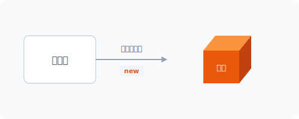
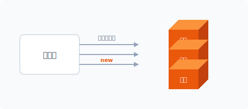
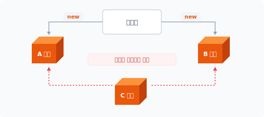
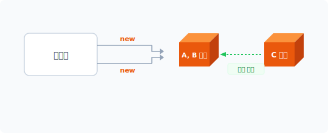
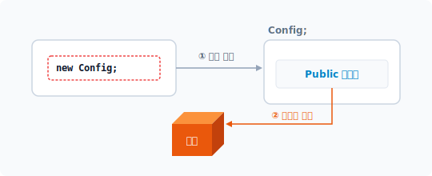
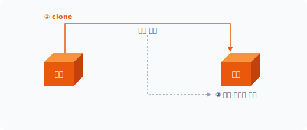
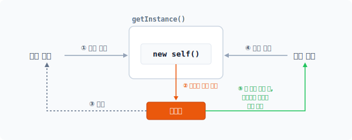
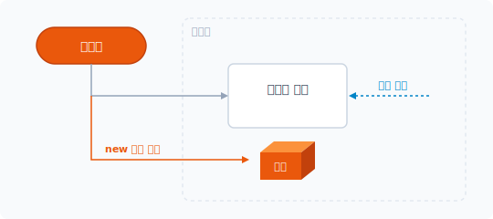


# Chapter 2. 싱글턴 패턴

싱글턴 패턴은 생성 패턴 중 가장 많이 주목받는 패턴 중 하나입니다. 싱글턴은 자원 공유를 위해 객체 생성 개수를 1개로 제한합니다.

## 2.1 객체 생성

클래스는 선언 후 객체를 생성해야 사용할 수 있습니다. 객체 생성은 내부 new 키워드를 사용합니다. new 키워드의 또 다른 중복 객체 생성 특징에 대해 알아봅시다.

### 2.1.1 new 키워드
선언된 클래스를 객체로 생성하는 과정을 인스턴스화라고 합니다. 인스턴스화는 선언된 클래스를 기반으로 객체를 생성해 메모리에 할당하는 작업을 수행합니다. 그리고 이 모든 일을 수행하게 만드는 명령어가 new 키워드입니다. [예제 2-1]은 간단한 인사말을 출력하는 클래스입니다.

#### 예제 2-1 Singleton/01/index.php
```php
<?php
class Hello
{
    public function greeting()
    {
        return "안녕하세요.\n";
    }
}
...
```

new는 프로그래밍 언어의 예약 키워드입니다. 선언한 Hello 클래스의 객체를 new 키워드로 생성합니다.

```php
$obj = new Hello;
```

Hello 클래스의 객체를 생성해 변수 $obj에 저장합니다. 이 코드를 그림으로 설명하면 다음과 같습니다.

#### 그림 2-1 객체 생성



클래스를 이용해서 객체를 생성하는 방법은 new 키워드가 유일하며, new 키워드를 사용하지 않고 객체를 생성할 수는 없습니다. 많은 언어에서 선언된 클래스를 이용해 객체를 생성할 때 new 키워드로 설계하는 경우가 많습니다.

### 2.1.2 객체의 중복
객체의 인스턴스화 과정을 좀 더 살펴봅시다. 객체 생성이란 선언된 클래스에 따른 객체를 메모리에 할당하는 동작입니다. 이러한 객체 생성 과정은 new 키워드를 통해 반복 생성할 수 있는데, 다음과 같이 new 키워드를 이용해 클래스의 동일한 객체를 여러 개 생성할 수 있습니다.

```php
...
$obj1 = new Hello;
$obj2 = new Hello;
$obj3 = new Hello;
$obj4 = new Hello;
$obj5 = new Hello;
```

이 코드의 의미는 한 번 선언된 클래스를 이용해 동일한 객체를 제한 없이 무제한으로 생성할 수 있다는 것입니다. 즉 시스템 자원이 허락하는 한 무제한으로 객체를 생성할 수 있습니다.

#### 그림 2-2 객체 중복 생성



선언된 클래스는 객체를 생성하기 위한 모형 틀과 같고, 이 모형 틀을 이용해 동일한 객체를 수없이 생성할 수 있습니다. 이런 이유로 객체를 붕어빵과 붕어빵 틀에 비유하여 설명하는 경우도 많습니다. 이는 객체지향의 원리이며 특징입니다.

## 2.2 유일한 객체

앞에서 알아본 것과 같이 객체지향에서는 하나의 클래스를 이용하여 객체를 무제한 생성할 수 있습니다. 이러한 객체지향의 특징은 장점이면서 때로 단점이 되기도 합니다. 그 이유를 살펴봅시다.

### 2.2.1 자원 공유
객체지향에서 new 키워드로 생성한 객체는 각각 독립된 자원입니다. 독립된 자원이란 서로 다른 메모리 영역을 차지하고 있다는 것을 의미합니다. 만일 생성된 하나의 객체를 공유할 경우 복수 객체를 생성하는 new 키워드의 특징이 문제가 됩니다.

#### 그림 2-3 객체 공유 문제



선언된 클래스는 하나지만 new 키워드로 생성된 객체는 2개입니다. 별도의 C 객체가 동일한 클래스로 생성된 객체라고 착각하여 정보에 접근할 때 문제가 발생합니다. A, B 객체는 단지 생성을 위한 클래스 선언만 같을 뿐, 서로 다른 메모리에 생성된 전혀 다른 객체입니다. 따라서 객체가 동일하지 않으므로 객체의 상태값을 공유할 수 없습니다.

### 2.2.2 스코프
프로그램에서는 변수를 크게 전역 변수와 로컬 변수로 구분합니다. 변수가 접근할 수 있는 영역을 구분하는 것입니다. 이러한 변수의 접근 영역 구분을 다른 용어로 스코프scope라고 합니다. 전역 변수는 프로그램 전반에서 접근 가능한 공용 변수로 데이터를 쉽게 공유할 수 있다는 장점이 있습니다. 함수는 대표적으로 변수의 접근 영역을 구분하는 프로그래밍 방식입니다. 하지만 함수들은 변수 영역이 서로 나뉘어 있기 때문에 함수 간 데이터를 공유하기 힘들듭니다. 이러한 이유로 이전에는 전역 변수를 활용해 함수 간 값을 공유 처리했습니다.

예를 들어 PHP에서는 전역 변수 접근을 위한 global 키워드를 제공합니다. 함수 안에 있는 변수명 앞에서 global 키워드를 이용하면 함수 밖의 변수에 접근할 수 있습니다. 또는 $GLOBALS 슈퍼 변수를 이용할 수도 있습니다. 다음은 $GLOBALS 슈퍼 변수를 이용해 전역 변수에 접근하는 예제입니다.

#### 예제 2-2 Singleton/02/index.php
```php
<?php
$conf = [
    'name'=>'jiny',
    'version'=>'1.0'
];

class foo
{
    public function conf()
    {
        return $GLOBALS['conf']; // 전역 변수 접근
    }
}

$obj = new foo;
print_r($obj->conf());
```

foo 클래스의 conf() 메서드는 클래스 밖에 있는 $conf 변수에 접근하여 값을 읽은 후 반환합니다.

```
$ php index.php
Array
(
    [name] => jiny
    [version] => 1.0
)
```

global 키워드나 $GLOBALS 슈퍼 변수로 외부의 전역 변수값을 참조하는 방식은 오래 전부터 사용해온 방법입니다.

하지만 전역 변수로 외부의 값을 공유하면 다양한 문제가 발생할 수 있기 때문에 전역 변수로 값을 공유할 때는 스코프의 변수 범위를 보다 면밀하게 관리해야 합니다. 잘못하면 사이드 이펙트(부작용)side effect으로 오동작이 발생할 수 있어 디버깅에 많은 어려움이 있습니다.

## 2.3 싱글턴

전역 변수처럼 생성한 객체를 공유하려면 하나의 객체만 존재해야 합니다. 객체가 중복 생성되면 공유할 수 없습니다. 싱글턴은 다른 생성 패턴과 달리 하나의 객체만 생성을 제한하는 패턴입니다. 그리고 생성된 객체는 공유되어 어디서든 접근할 수 있습니다.

### 2.3.1 유일한 객체
싱글턴이라는 이름만으로도 동작을 유추할 수 있습니다. 옛말에 '사공이 많으면 배가 산으로 간다'는 말이 있습니다. 싱글턴이라는 단어는 '하나', '단독'과 같은 의미입니다.[^1]

응용 프로그램에서 전역 변수, 공용 장치 등은 하나의 객체만 필요한 경우가 많습니다. 예를 들면 컴퓨터에서 키보드 입력 장치는 하나입니다. 여러 대의 프린터가 연결되어 있어도 프린터로 전송하는 데이터 스풀spool은 하나입니다. 또한 프로그램의 환경 설정 파일도 하나만 있습니다.

이런 것이 여러 개 존재한다면 시스템과 프로그램은 자주 충돌할 것입니다. 충돌을 방지하려면 단일 객체를 사용해야 하며, 싱글턴은 하나의 객체만 유지하게 하는 생성 패턴입니다. 싱글턴 패턴은 다음과 같은 상황에서 매우 유용합니다.

* 공유 자원 접근
* 복수의 시스템이 하나의 자원에 접근할 때
* 유일한 객체가 필요할 때
* 값의 캐시가 필요할 때

### 2.3.2 전역 객체
일반적인 절차지향적 프로그래밍 방법에서 전역 변수는 global 키워드를 사용해 쉽게 접근합니다. 전역으로 선언된 변수는 하나만 존재하므로 값을 공유하기가 편합니다. 하지만 객체를 생성해 공유하려면 어떻게 해야 할까요? 객체는 중복 생성이가능하기 때문에 생성된 객체를 공유하려면 약간의 속임수가 필요합니다.

[^1]: 다른 말로 단일체 패턴이라고도 부릅니다.

객체를 공유하려면 객체를 복수로 생성하는 문제가 해결되어야 합니다. 그리고 생성되는 객체를 1개의 단일 객체로 유지해야 합니다. 단일 객체는 여러 곳에서 접근을 시도해도 결국은 동일한 객체를 사용하게 됩니다.

[그림 2-4]를 보면서 예를 들어봅시다. 하나의 클래스로 생성된 객체의 상태값을 공유하려면 객체 생성을 제한해야 합니다. 여기서 '제한한다'는 의미는 new 키워드를 사용할 때 서로 다른 A, B 객체가 생성되는 것이 아니라 동일한 객체 1개만 유지한다는 것입니다. 그리고 이러한 기능을 처리하는 패턴을 싱글턴이라고 합니다.

#### 그림 2-4 객체에 접근하는 방법만 다를 뿐 같은 객체를 사용한다



싱글턴 패턴을 적용하면 몇 번의 new 명령을 수행해도 동일한 객체를 반환하며, 1개의 객체만 존재하므로 객체를 공유해도 문제 발생 소지가 적습니다. 싱글턴은 전역 변수를 객체 형태로 변형해놓은 전역 객체입니다.

객체지향 프로그램에서 객체 1개만으로 프로그램을 작성하는 경우는 없습니다. 프로그램 설계 시 수많은 클래스 선언과 객체가 생성되고 각각의 객체는 고유한 책임을 집니다.

이러한 객체들은 서로 관계를 맺으며 복잡한 동작을 수행합니다. 모든 객체는 상호 관계 속에서 작용하며 동작하고, 객체의 상호 관계 속에는 공유 객체도 존재합니다. 서로 다른 객체가 값을 공유할 때나 중복되는 자원을 줄일 때 싱글턴 패턴을 적용합니다.

### 2.3.3 보증
싱글턴에서 중요한 핵심은 '어떻게 하나의 객체만 생성할 수 있는가'입니다. 싱글턴은 객체의 관계 속에서 상호 작용하기 위한 값을 저장하고 전달하는데, 값을 전달하기 위해서는 공용 객체가 필요합니다. 싱글턴 패턴은 new 키워드 이용해 객체를 생성하는 방법을 원천적으로 금지

합니다. 클래스의 생성자 접근 제한으로 인해 new 키워드의 객체 생성 동작을 방해합니다. 객체 생성이 제한된 싱글턴은 대신 객체를 생성할 수 있는 메서드를 추가하며, new 키워드 대신 객체 생성 메서드 호출만으로 객체를 생성할 수 있습니다.

또한 싱글턴은 내부 참조체가 있어 자신의 객체를 보관합니다. 즉 내부적으로 중복 생성을 방지하는 로직(플라이웨이트 패턴[^2])이 있습니다. 싱글턴은 참조체를 통해 하나의 객체만 갖도록 보증하지만, 싱글턴 패턴을 적용하면 클래스 상속과 복수 객체를 생성할 수 있는 객체지향의 장점은 포기해야 합니다.

## 2.4 싱글턴 설계

본격적으로 싱글턴 패턴 코드를 작성해보겠습니다. 일반 클래스의 구조를 싱글턴 패턴으로 변경하기 위한 구조에 대해 학습합니다.

### 2.4.1 객체 생성 과정
싱글턴 패턴을 구현하기 위해서는 먼저 어떻게 클래스를 이용하여 객체를 생성하는지 그 프로그램 언어 원리부터 알아야 합니다. new 키워드는 객체를 생성할 때 선언된 클래스의 생성자를 호출합니다. 생성자는 PHP 언어에서 매직 메서드Magic Method[^3]로 정의합니다. 자바에서는 클래스명과 동일한 메서드를 사용합니다.

#### 예제 2-3 Singleton/03/Config.php
```php
<?php
class Config
{
    public function __construct()
    {
        echo __CLASS__."가 생성되었습니다.\n";
    }
}
```

[^2]: 3부 구조 패턴에서 자세히 다룹니다.
[^3]: '__'로 시작하는 매직 메서드는 PHP 클래스 내에서 특수한 목적으로 사용됩니다.

PHP의 경우 생성자의 메서드 이름이 고정되어 있습니다. 클래스 안에 \_\_construct() 메서드를 추가하면 사용자가 정의한 생성자로 동작되며, 생성자가 필요 없는 경우 생략할 수 있습니다. 선언된 클래스의 객체를 생성할 때 사용자 정의 생성자가 같이 실행됩니다. 다음은 객체를 생성하는 메인 코드입니다.

#### 예제 2-4 Singleton/03/index.php
```php
<?php
include "Config.php";

// 객체를 생성합니다.
$obj = new Config;
```

```
$ php index.php
Config가 생성되었습니다.
```

#### 그림 2-5 생성자를 통한 객체 생성



new 키워드를 통해 객체가 생성될 때 클래스의 생성자가 실행되어 함께 동작하는 것을 확인할 수 있습니다.

### 2.4.2 접근 권한
객체지향은 프로퍼티와 메서드를 선언할 때 접근 권한을 다음과 같이 설정합니다. 싱글턴 패턴을 학습하기 위해서는 객체의 접근 권한 속성을 숙지해야 합니다.

객체지향에는 클래스의 접근을 제어할 수 있는 3가지 속성이 있습니다.

* Public
* Private
* Protected

public은 모든 접근이 가능한 권한이고 private은 내부적인 접근만 허용하며 protected는 상속된 경우만 허용합니다.

[예제 2-3]을 통해 알 수 있듯이 객체를 생성할 때는 생성자가 함께 동작합니다. 일반 클래스를 싱글턴 패턴으로 변환하려면 new 키워드로 객체를 생성하지 못하게 방해해야 합니다. 이를 위해 생성자의 접근 권한을 변경합니다.

### 2.4.3 생성자 제한
싱글턴 패턴으로 변환하기 위해서는 new 키워드가 객체를 생성하지 못하게 해야 합니다. 만일 [예제 2-3]과 같이 선언된 클래스의 생성자를 동작하지 못하도록 막으면 어떻게 될까요? 다음 코드의 생성자 부분을 주의 깊게 살펴봅시다.

```php
public function __construct()
{
    echo __CLASS__."가 생성되었습니다.\n";
}
```

생성자의 접근 제한 속성은 public으로 되어 있으며, 이것은 어디서든 접근 가능한 속성입니다. 생성자는 기본적으로 public 속성을 사용합니다. 다른 객체에서 생성자에 접근하지 못하게 접근 속성을 private으로 변경하고 예제 소스를 다시 한 번 실행합니다.

#### 예제 2-5 Singleton/04/Config.php
```php
<?php
class Config
{
    private function __construct()
    {
```

echo __CLASS__."가 생성되었습니다.\n";
    }
}
```

생성자의 접근 제어 속성을 단지 public에서 Private으로 변경했을 뿐인데, 이전과 달리 객체를 생성하지 못하고 오류가 발생합니다

```
$ php index.php
PHP Fatal error: Uncaught Error: Call to private Config::__construct() from invalid context in D:\jiny\pettern\Singleton\04\index.php:6
Stack trace:
#0 {main}
 thrown in D:\jiny\pettern\Singleton\04\index.php on line 6
```

이를 통해 알게 된 사실은 new 키워드가 클래스의 객체를 생성할 때 생성자를 public으로 하여 접근한다는 것입니다. 사실 private은 클래스 내부에서만 호출 가능한 속성이므로 외부에서 생성자를 실행하지 못하는 것은 당연합니다.

생성자를 꼭 public으로 선언할 필요는 없으며, 이처럼 생성자의 속성을 임의로 변경할 수 있습니다. 싱글턴 패턴은 생성자를 제어하는 부분부터 시작합니다.

> [!NOTE]
> \_\_construct() 생성자 메서드는 new 키워드에서 호출이 이루어집니다. new 키워드를 통해 클래스의 객체를 생성하지 않으면 \_\_construct() 생성자를 호출하지 않습니다.

### 2.4.4 복제 방지
클래스의 객체를 생성하는 방법은 new 키워드가 유일합니다. 하지만 예외적으로 객체를 생성할 방법이 하나 더 있는데, 기존에 생성된 객체를 복제하여 새로운 객체를 만드는 것입니다. PHP는 객체를 복사할 수 있는 clone 키워드를 같이 제공합니다. 그리고 clone 복제가 될 때 실행되는 \_\_clone() 매직 메서드가 있습니다.

#### 그림 2-6 복제 시 매직 메서드가 실행됨



객체 생성 과정을 완벽하게 제한하기 위해서는 복제 메서드도 private으로 수정합니다.

```php
private function __clone()
{
    ...
}
```

이제 어떤 방법으로도 클래스의 객체를 생성할 수 없습니다.

## 2.5 인스턴스 생성

싱글턴으로 변경한 클래스는 외부적으로 객체를 생성할 수 없으며, 싱글턴 패턴이 적용된 클래스 객체를 생성하려면 내부에서 선언된 메서드를 호출해야 합니다.

### 2.5.1 생성 메서드
클래스를 사용하기 위해서는 먼저 객체를 생성해야 합니다. 하지만 new 키워드로 생성할 수 있는 방법이 막혀 있습니다. 외부적으로 고립된 싱글턴 클래스의 객체를 어떻게 만들어야 할까요? 싱글턴 패턴에서는 내부적으로 객체를 생성할 수 있도록 특수한 메서드를 추가합니다. 다음 예제에서 추가 구현된 getInstance() 메서드를 확인합니다.

#### 예제 2-6 Singleton/05/Config.php
```php
<?php
class Config
{
    private function __construct()
    {
        echo __CLASS__."가 생성되었습니다.\n";
    }

    private function __clone()
    {
        echo __CLASS__."가 복제 되었습니다.\n";
    }

    // 싱글턴 객체 생성 메서드
    public static function getInstance()
    {
        echo __CLASS__."객체를 생성합니다.\n";
        return new self();
    }

}
```

싱글턴으로 변경된 Config 클래스는 자체적으로 객체 생성을 위한 getInstance() 메서드를 추가로 구현합니다. getInstance() 메서드는 자기 자신의 클래스를 객체로 생성하여 반환합니다.

```php
return new self();
```

getInstance() 메서드 타입은 정적 메서드로 작성합니다. 싱글턴 클래스는 아직 객체가 존재하지 않으므로 객체를 통해 메서드에 접근할 수 없습니다. 정적 타입으로 메서드를 선언하면 객체 없이도 메서드를 호출할 수 있습니다.

다음 예제에서는 정적 메서드 호출을 통해 싱글턴 객체를 생성합니다.

#### 예제 2-7 Singleton/05/index.php
```php
<?php
include "Config.php";
```

```php
// 객체를 생성합니다.
$obj = Config::getInstance();
```

싱글턴 객체를 생성하는 메서드를 호출합니다. 싱글턴에서는 객체를 생성하는 것이 아니라 객체 생성을 요청한다는 것이 더 정확한 표현입니다. 객체 생성을 요청한다는 의미에서 생성 패턴의 팩토리와 유사합니다.

```
$ php index.php
Config객체를 생성합니다.
Config가 생성되었습니다.
```

싱글턴 클래스의 정적 메서드를 이용하여 객체를 생성했습니다.

### 2.5.2 참조체
싱글턴의 정적 메서드 getInstance()는 자체적으로 자기 자신의 클래스 객체를 생성해 반환하지만, 외부에서 정적 메서드를 여러 번 호출하면 매번 다른 객체를 생성하여 반환합니다. 그 이유는 생성, 반환되는 방식이 new self()이기 때문입니다. 정적 메서드 안에 new 키워드를 사용했기 때문에 객체지향의 특징인 다중 객체 생성이 가능한 것입니다.

따라서 완벽한 싱글턴 패턴은 객체 생성을 외부의 접근 권한만으로 제한할 수 없습니다. 싱글턴 패턴은 어떤 경우라도 1개의 객체만 생성해야 하며 이를 위해 플라이웨이트 패턴에서 응용되는 참조체를 도입합니다. 싱글턴은 내부적으로 하나의 객체만 보장하기 위해 자체 객체를 저장하는 참조체reference를 갖고 있습니다. 참조체를 통해 자신의 객체가 생성되었는지 판단합니다.

다음 예제는 참조체를 추가한 코드입니다.

#### 예제 2-8 Singleton/06/Config.php
```php
<?php
class Config
{
    private static $Instance = NULL; // 참조체
```

private function __construct()
    {
        echo __CLASS__."가 생성되었습니다.\n";
    }

    private function __clone()
    {
        echo __CLASS__."가 복제 되었습니다.\n";
    }

    public static function getInstance()
    {
        if (!isset(self::$Instance)) {
            echo __CLASS__."객체를 생성합니다.\n";
            self::$Instance = new self();
        }

        echo __CLASS__."객체를 반환합니다.\n";
        return self::$Instance;
    }

}
```

싱글턴의 getInstance() 메서드는 자기 자신의 객체를 생성할 때 참조체를 판별합니다. 조건문을 통해 참조체의 값을 판별하며, 참조체 변수에 객체가 존재하면 새로운 객체를 생성하지 않고 참조체에 저장된 객체를 반환합니다. 참조체 변수에 저장된 객체가 없는 경우 클래스 자신의 객체를 생성하여 참조체 변수에 저장한 후 반환합니다.

#### 그림 2-7 참조체를 이용한 객체 관리



참조체가 적용된 싱글턴 객체를 다시 생성해봅시다.

#### 예제 2-9 Singleton/06/index.php
```php
<?php
include "Config.php";

// 객체를 생성합니다.
$obj = Config::getInstance();
$obj = Config::getInstance();
```

참조체를 통해 정적 메서드를 여러 번 호출해도 하나의 객체만 반환됩니다.

```
$ php index.php
Config객체를 생성합니다.
Config가 생성되었습니다.
Config객체를 반환합니다.
Config객체를 반환합니다.
```

### 2.5.3 플라이웨이트 패턴
생성한 객체를 공유하는 패턴으로 플라이웨이트 패턴이 있습니다. 싱글턴 패턴은 가장 간단한 형태의 플라이웨이트 패턴이 결합한 형태입니다. 싱글턴은 내부 참조체를 통해 생성한 객체를 공유합니다. 싱글턴은 객체를 처음 생성할 때 참조체에 객체를 저장합니다. if 조건을 통해 참조체의 객체 존재 여부를 검사하고, 공유되는 객체가 있을 경우 참조체를 반환합니다.

싱글턴은 플라이웨이트 패턴의 처리 로직을 추가함으로써 유일한 객체 생성을 보장받습니다. 싱글턴을 구현하기 위해 플라이웨이트 패턴의 참조체를 같이 적용하는 것은 클래스 설계 시 코드의 양을 증가시키는 단점이 됩니다. 짧고 간단한 작은 코드라도 매번 플라이웨이트 패턴의 참조체 확인이 같이 실행되므로 반복되다 보면 성능에 영향을 줄 수 있습니다.[^4]

[^4]: 플라이웨이트 패턴은 12장에서 자세히 다룹니다.

### 2.5.4 2가지 책임
패턴 구조를 엄밀하게 따져보면, 싱글턴 패턴은 다음과 같이 2개의 책임을 갖고 있는 객체이므로 객체지향의 단일 책임 원칙을 위반합니다. 첫 번째, 클래스의 설계는 본연의 목적을 해결하기 위해 고유한 처리 로직을 갖고 있습니다. 따라서 클래스는 목적을 해결하기 위한 본연의 책임을 자체적으로 갖고 있습니다

두 번째, 중복된 객체 생성을 방지하기 위한 책임입니다. 싱글턴은 자체적으로 참조체가 있습니다. 참조체를 통해 중복 객체 생성을 방지하기 위한 처리 로직도 포함합니다.

객체지향의 원칙을 반드시 적용해야 하는 것은 아닙니다. 예외적인 상황과 목적을 위해 위반하는 경우도 많습니다.

## 2.6 정적 클래스

싱글턴 패턴을 사용하지 않고 정적 클래스를 이용해 전역 변수처럼 객체를 공유하는 경우도 있습니다. 정적 클래스가 사용을 공유한다는 측면에서 싱글턴 패턴과 유사해 보일 수도 있지만 근본적인 차이가 있습니다. 이번에는 정적 클래스에 대해 알아보고 싱글턴과의 차이점을 살펴봅시다.

### 2.6.1 정적
정적static이라는 용어는 프로그래밍 언어에서 변수를 선언할 때 자주 등장합니다. 프로그래밍 언어에 변수를 선언하면 메모리 자원을 할당합니다. 그리고 변수를 사용한 후에는 다시 시스템에 메모리 자원을 반환합니다. 프로그램을 개발할 때는 한정된 자원(메모리)을 유용하게 사용하는 것이 중요합니다. 시스템의 자원을 관리하지 못하면 시스템이 성능을 제대로 발휘하지 못하거나 프로그램 동작에 문제가 발생합니다.

클래스는 객체를 생성하기 위한 선언문으로, 단순한 설계도라고 볼 수 있지만 클래스 자체로는 실행할 수 없습니다. 클래스로 객체를 생성한 후 메서드 호출이 이루어져야 비로소 실제 동작이 수행됩니다.

객체지향에서도 클래스로 객체를 생성할 경우 변수처럼 시스템의 메모리 자원에 할당받습니다. 하지만 정적 클래스는 객체 생성 없이 클래스 선언을 통해 프로그램을 실행할 수 있습니다. 정적 클래스는 메모리 자원을 할당받지 않고 어떻게 실행할 수 있을까요?

일반적인 클래스는 할당된 메모리의 객체를 통해 호출되지만, 정적 클래스는 객체를 생성하지 않고 소스 코드의 클래스 선언 자체를 객체로 인식하여 접근합니다. 클래스로 생성된 객체는 여러 개를 만들 수 있지만, 정적 클래스는 소스 코드를 이용하기 때문에 여러 개의 객체로 인식되지 않습니다. 클래스를 정적으로 사용할 경우 존재하는 객체는 1개입니다.

#### 그림 2-8 클래스에 직접 접근해 사용하는 정적 호출



이처럼 정적 클래스가 선언된 하나의 자원만 사용한다는 점은 싱글턴 패턴과 유사합니다. 정적 클래스도 하나의 클래스만 보장하므로 동일한 효과를 볼 수 있습니다.

### 2.6.2 static 선언
앞 절에서 정적 클래스의 특징에 대해 간단히 알아봤습니다. 이번에는 실제로 정적 클래스를 선언하고 호출해보겠습니다. 클래스에서 정적 메서드를 정의할 때는 static 키워드를 사용합니다. static 키워드를 같이 선언하면 해당 메서드를 정적 방식으로 호출할 수 있습니다.

[예제 2-10]은 정적 클래스를 선언하고 호출하는 예입니다.[^5]

[^5]: PHP 언어에서는 클래스의 정적 메서드를 호출할 때 -> 대신 ::을 사용합니다.

#### 예제 2-10 Singleton/07/config.php
```php
<?php
// 정적 클래스
class Config
{
    static public $conf = NULL;

    public static function set($val)
    {
        self::$conf = $val;
    }

    public static function get()
    {
        return self::$conf;
    }
}

Config::set("hello");
echo Config::get();
```

```
$ php config.php
hello
```

[예제 2-10]은 정적 클래스를 선언했지만 객체는 생성되지 않습니다. 대신 클래스의 메서드를 정적으로 접근하여 호출합니다. 프로그램에서 공용 변수가 필요할 때는 정적 클래스의 특징을 이용합니다.

### 2.6.3 차이점과 한계
정적 클래스는 객체를 메모리에 생성하지 않으므로 메모리 관리 차원에서 보면 효율적인 관리 방법입니다. 하지만 싱글턴 패턴은 메모리 자원에 할당하여 동적 객체를 만듭니다. 반대로 정적 클래스는 코드가 실행되면서 고정으로 바인딩됩니다. 정적 클래스와 일반 클래스의 차이는 메모리의 상주와 비동적 차이의 여부입니다.

싱글턴은 외부에서 객체를 생성할 수 있는 방법이 없습니다. 싱글턴 패턴은 내부적으로 자기

자신의 객체를 저장하기 위해 정적 프로퍼티와 정적 메서드를 사용합니다. 싱글턴은 선언된 정적 메서드를 통해 자체 객체를 생성하며, 생성된 객체는 정적 프로퍼티에 저장합니다.

복잡한 싱글턴 구조보다 정적 클래스가 더 유용한 것처럼 보입니다. 하지만 개발 언어에서는 정적 클래스와 일반 클래스를 엄밀히 구분하여 처리합니다.

일반 클래스와 정적 클래스를 구분하여 처리하는 이유는 객체지향의 다형성 때문입니다. 다형성은 인터페이스를 통해 클래스의 다양한 동작을 수행할 수 있도록 구현을 대체하지만, 정적 클래스는 다형성을 위한 인터페이스를 사용할 수 없습니다.

유일성 측면에서 싱글턴 패턴 대신 정적 클래스를 사용할 수도 있을 것입니다. 싱글턴 패턴을 사용하지 않고 정적 클래스만 사용한다면, 필요한 모든 동작 기능이 정적 클래스 안에 존재해야 합니다.

또한 정적 클래스가 다른 클래스와 관계를 맺거나 클래스의 초기화 동작이 복잡할 경우 정적 클래스만으로는 처리하기 어려워집니다.

## 2.7 싱글턴 확장

싱글턴 확장은 일반적으로 잘 사용하지 않지만 싱글턴 클래스를 상속받을 수 있습니다.

### 2.7.1 제한 범위
싱글턴도 클래스입니다. 객체를 생성할 수 있으며 상속할 수도 있습니다. 하지만 싱글턴으로 변형된 클래스는 직접 상속받을 수 없습니다. 통상적으로 싱글턴을 상속받을 수 없는 이유는 생성자의 제한으로 객체를 생성할 수 없기 때문입니다. 싱글턴은 생성자가 public이 아닌 private으로 선언되기 때문에 선언된 클래스로 객체를 생성하고 확장할 수 없습니다.

### 2.7.2 Protected 속성
싱글턴의 생성자 속성을 변경하면 싱글턴으로 변경된 클래스를 상속받을 수 있습니다. 객체지

향 속성 중 상속만 접근이 허용된 protected가 있습니다. Protected는 new를 통한 생성자 접근을 외부에서 제한할 수 있어 싱글턴 패턴의 private 대신 사용할 수 있으며, Protected 상태에서 상속할 수도 있습니다.

[예제 2-11]은 protected 접근 권한으로 변경된 코드입니다.

#### 예제 2-11 Singleton/08/config.php
```php
<?php
class Config
{
    protected static $Instance = NULL; // 속성변경

    protected function __construct() // 속성변경
    {
        echo __CLASS__."가 생성되었습니다.\n";
    }

    protected function __clone() // 속성변경
    {
        echo __CLASS__."가 복제 되었습니다.\n";
    }

    public static function getInstance()
    {
        if (!isset(self::$Instance)) {
            echo __CLASS__."객체를 생성합니다.\n";
            self::$Instance = new self();
        }

        echo __CLASS__."객체를 반환합니다.\n";
        return self::$Instance;
    }

}
```

Config 클래스만 수정하여 다시 실행합니다. 결과는 private 싱글턴과 동일합니다.

```
$ php index.php
Config객체를 생성합니다.
Config가 생성되었습니다.
```

```
Config객체를 반환합니다.
Config객체를 반환합니다.
```

### 2.7.3 상속
이번에는 Protected로 변환된 싱글턴 클래스를 상속하고 확장합니다. 생성자가 제한된 클래스를 선언합니다.

#### 예제 2-12 Singleton/09/Config.php
```php
<?php
class Config
{
    protected static $Instance = NULL;

    protected function __construct()
    {
        echo __CLASS__."가 생성이 되었습니다.\n";
    }

    protected function __clone()
    {
        echo __CLASS__."가 복제 되었습니다.\n";
    }

}
```

생성이 제한된 Config 클래스는 어떤 경우에도 객체를 생성할 수 없습니다. 다음으로 Config 클래스를 상속받는 Env 클래스를 선언합니다.

#### 예제 2-13 Singleton/09/Env.php
```php
<?php
class Env extends Config
{
    public function setting()
    {
```

echo "시스템 환경을 설정합니다.\n";
    }

    public static function getInstance()
    {
        if (!isset(self::$Instance)) {
            echo __CLASS__."객체를 생성합니다.\n";
            self::$Instance = new self();
        }

        echo __CLASS__."객체를 반환합니다.\n";
        return self::$Instance;
    }

}
```

상속받은 Env 클래스에는 내부 정적 메서드가 있습니다. 정적 메서드 getInstance()는 싱글턴의 객체를 생성합니다.

#### 예제 2-14 09/index.php
```php
<?php
include "Config.php";
include "Env.php";

// 객체를 생성합니다.
$obj2 = new Env;
```

```
$ php index2.php
PHP Fatal error: Uncaught Error: Call to protected Config::__construct() from invalid context in D:\jiny\pettern\Singleton\09\index2.php:7
Stack trace:
#0 {main}
 thrown in D:\jiny\pettern\Singleton\09\index2.php on line 7
```

Env 클래스는 protected 속성의 생성자를 가진 클래스를 상속합니다. 생성자가 protected 속성으로 제한되어 객체를 생성할 수 없습니다.

객체를 생성하려면 [예제 2-15]와 같이 싱글턴 메서드를 호출합니다. 반환받은 객체를 이용하여 확장된 객체에 접근할 수 있습니다.

#### 예제 2-15 Singleton/09/index2.php
```php
<?php
include "Config.php";
include "Env.php";

// 싱글턴 객체를 생성합니다.
$obj = Env::getInstance();

// 확장된 메서드를 실행합니다.
$obj->setting();
```

싱글턴 클래스가 상속되기는 했지만, 객체 생성은 상속받은 클래스의 내부 정적 메서드를 호출해야 합니다.

```
$ php index.php
Env객체를 생성합니다.
Config가 생성이 되었습니다.
Env객체를 반환합니다.
시스템 환경을 설정합니다.
```

이처럼 클래스를 통해 객체를 생성할 수 있는 예외적인 방법이 있습니다. 정확한 의미에서 싱글턴은 아닐 수 있지만, 싱글턴 패턴을 변형해 클래스를 상속하는 방법을 알아보았습니다.

## 2.8 자원 처리
싱글턴 패턴은 자주 사용되는 디자인 패턴입니다. 하지만 다른 설계자들은 싱글턴을 안티 패턴으로 분류하는 경우도 있습니다. 그 이유를 알아보겠습니다.

### 2.8.1 경합 조건
싱글턴은 하나의 객체만 생성하는 패턴이지만 특수한 환경에서 단일 객체 생성을 보장하지 못하는 경우도 있습니다. 멀티 스레드 환경에서 싱글턴 패턴을 사용할 때는 주의해야 합니다. PHP 외 다른 프로그래밍 언어에서는 멀티 스레드 환경을 제공하며, 자바와 같은 멀티 스레드

조건에서 싱글턴의 객체 생성이 동시에 요청되는 경우 경합성이 발생합니다.

경합 조건은 동일한 메모리나 자원에 동시에 접근하는 것을 말합니다. 2개 이상의 스레드가 동일한 자원을 사용할 경우 충돌이 발생합니다. 경합성은 메서드의 원자성atomic의 결여로 2개의 객체가 만들어지는 오류가 발생합니다.

싱글턴 패턴은 멀티 스레드 환경의 특성과 경합성 문제를 해결하기 위해 늦은 바인딩을 사용합니다. 싱글턴은 정적 호출을 통해 생성 호출하기 전에는 객체를 만들지 않습니다. 최초의 생성 호출이 발생할 때 객체를 생성하고 생성된 객체는 내부 참조체에 저장됩니다.

싱글턴 패턴은 클래스에 객체를 요청할 때 객체를 생성하여 자원(메모리)에 할당합니다. 늦은 바인딩을 통해 객체 생성을 동적으로 처리하는데 이를 늦은 초기화lazy initialization라고 부릅니다. 하지만 늦은 바인딩도 경합성 충돌을 해결할 수는 없습니다.

경합성과 늦은 초기화 문제를 좀 더 보완하기 위해 시스템 부팅 시 필요한 싱글턴의 객체를 미리 생성합니다. 싱글턴으로 처리할 부분을 부팅 시 미리 처리한다면 참조체를 구별하는 if문의 오동작을 방지할 수 있습니다. 미리 공유 자원을 만듦으로써 프로그램 실행 도중 발생할 경합성 충돌을 최소화할 수 있습니다.

하지만 프로그램 실행 중 한 번도 사용되지 않는 객체가 있을 수 있는데, 불필요한 객체를 모두 생성하여 메모리에 상주시키는 것은 메모리 낭비입니다. 또한 매번 공유 자원의 객체에 접근할 때마다 자원 중복 여부를 체크하는 것도 번거롭습니다.

### 2.8.2 메모리
시스템의 자원에는 한계가 있습니다. 메모리 자원 또한 유한하므로 효율적으로 관리해야 합니다. 메모리가 필요할 때 동적으로 할당받고 사용 후에는 반환합니다. 클래스로 객체를 생성하는 과정은 시스템의 메모리 자원에 할당하는 것과 동일합니다. 싱글턴은 시스템에 유일한 객체를 생성합니다. 자원이 필요할 때 동적으로 할당받을 수 있지만, 정적으로 생성된 자원을 해제하여 반환하기는 어렵습니다.

싱글턴으로 생성한 객체는 공유 자원으로 분류합니다. 공유 자원은 모든 객체가 접근하여 사용할 수 있으며, 언제 쓰일지 모르기 때문에 프로그램이 종료될 때까지 생존합니다. 이처럼 싱글

턴 패턴으로 생성한 자원은 프로그램이 종료될 때까지 메모리에 상주합니다. 싱글턴 패턴은 프로그램 내에서 해제하기 어려운 공유 자원을 많이 사용합니다. 이러한 점에서 싱글턴 패턴을 안티 패턴으로 분류하기도 합니다.

## 2.9 관련 패턴
싱글턴 패턴은 여러 패턴의 구성 요소(객체)를 생성하는 기본 패턴입니다. 다양한 패턴과 결합하여 사용할 수 있습니다.

### 2.9.1 팩토리 메서드와 추상 팩토리
팩토리 메서드 패턴(3장)과 추상 팩토리 패턴(4장)은 모두 객체를 생성하는 패턴입니다. 이러한 패턴을 구현하는 과정에서 구체화된 하나의 객체만 필요한 경우도 있을 것입니다. 이때 싱글턴 패턴을 같이 적용해 복합적인 생성 패턴을 설계할 수 있습니다.

### 2.9.2 빌더 패턴
빌더 패턴(5장)은 의존성 있는 객체를 싱글턴으로 생성할 때 결합하여 사용합니다. 관계에 따라 의존되는 객체의 생성 순서가 있을 수 있습니다. 빌더는 생성 순서와 단계, 복합한 절차 등을 갖고 있습니다.

### 2.9.3 파사드 패턴
파사드 패턴(11장)은 외부에서 객체에 접근할 수 있는 API와 같은 단일 창구입니다. 이때 외부와 통신하는 복수의 객체를 만들 필요는 없습니다. 싱글턴 패턴을 같이 적용하면 단일화된 접속 창구를 설계할 수 있습니다.

### 2.9.4 프로토타입 패턴
싱글턴은 단일 객체를 유지 관리합니다. 싱글턴을 유지하면서 동일한 객체가 추가로 필요한 경우 프로토타입 패턴을 결합하여 사용할 수 있습니다.

## 2.10 정리
싱글턴은 패턴 카탈로그에서 4대 패턴에 들어가는 인기 패턴입니다. 클래스 내에서 하나의 객체만 사용할 경우 해당 클래스를 싱글턴 패턴으로 사용할 수 있습니다. 프레임워크에서는 싱글턴 패턴을 다양한 곳에서 폭넓게 사용합니다.

싱글턴 생성 과정에서 다른 클래스를 의존하는 경우도 있습니다. 이와 같은 의존 관계가 있을 경우 필요한 의존 클래스를 먼저 처리한 후 싱글턴 객체를 생성해야 합니다.

싱글턴은 패턴을 처음 접하는 사람에게 매력적인 패턴 중 하나입니다. 또한 자신의 코드를 뽐내고 싶어 하는 사람이라면 더욱 더 그럴 것입니다. 싱글턴을 올바르게 사용하기 위해서는 숙달된 경험이 필요합니다.

