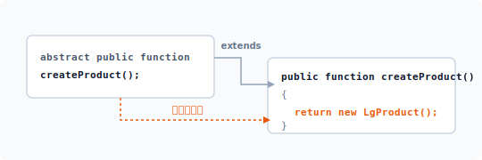
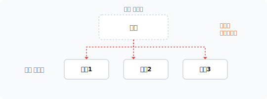
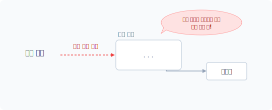
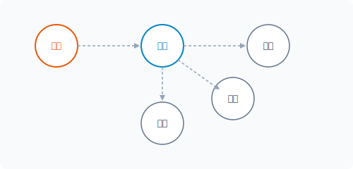
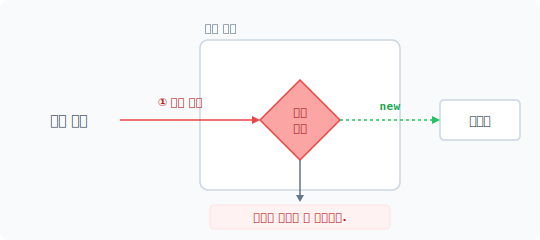


# CHAPTER 3 팩토리 메서드 패턴 (factory method)

팩토리 메서드 패턴은 팩토리 패턴의 확장 패턴으로, 팩토리 패턴과 템플릿 메서드 패턴이 결합된 패턴입니다.[^1]

## 3.1 추상화
팩토리 메서드는 추상화 기법을 사용하여 패턴을 확장하므로, 팩토리 메서드 패턴을 이해하기 위해서는 먼저 객체지향의 추상화에 대한 개념을 학습해야 합니다.

### 3.1.1 추상 개념
복잡하고 어려운 기능을 한눈에 파악하는 것은 쉽지 않습니다. 또한 이해하기 위해 많은 시간과 노력을 들여야 합니다. 추상abstract은 사전적 의미로 중요한 부분만 분리하여 이해하기 쉽게 만드는 작업입니다. 사실 우리가 모듈의 복잡한 기능에 대해 이해할 때 처음부터 세부적인 부분 하나 하나를 면밀히 살펴보지는 않습니다.

만일 파악하려는 기능이 요약된 정보가 있다면 보다 쉽게 이해할 수 있을 것입니다. 객체에 추

[^1]: 팩토리 메서드 패턴은 팩토리 패턴과 템플릿 메서드 패턴이 결합된 구조이므로 디자인 패턴을 처음 학습할 때는 이해하기 어려울 수 있습니다.

상적 개념을 적용하는 이유는 객체의 동작을 보다 쉽게 파악하기 위해서입니다. 그렇다면 코드 작성 시 복잡한 기능을 어떻게 요약해서 정보를 만들어야 할까요? 먼저 기능을 이해하기 위해 세부 사항을 분리합니다.

### 3.1.2 코드 요약
추상화 작업은 코드를 요약하는 것입니다. 요약 시 상세한 내용은 무시합니다. 요약된 정보만으로도 실제 구현된 코드를 상세히 파악하지 않고 동작을 쉽게 이해할 수 있습니다.

추상화 작업을 위해서는 먼저 요약된 정보와 실제 구현부를 분리합니다. 다음과 같이 클래스를 요약하여 추상화를 작성합니다.

PHP 언어에서는 class 키워드 앞에 abstract 키워드를 붙여 추상 클래스를 작성합니다. [예제 3-1]은 Factory 클래스를 추상 클래스로 선언합니다.

#### 예제 3-1 FactoryMethod/01/factory.php
```php
<?php
abstract class Factory
{
    ...
}
```

추상적 구조의 골격을 형성합니다. 추상 클래스를 이용하여 구조에서 정보 부분만 분리할 수 있습니다.

## 3.2 패턴 확장

추상화를 통해 팩토리 패턴을 확장합니다. 중요한 부분만 분리하여 추상 클래스의 골격을 형성합니다.

### 3.2.1 팩토리
팩토리 패턴은 객체지향을 지원하는 현대적modern 프로그래밍에서 가장 폭넓게 사용되는 패턴 중 하나입니다. 예제 코드를 보며 팩토리 패턴을 복습하고 확장 방법에 대해서도 알아봅시다. 다음은 상품을 처리하는 객체입니다.

#### 예제 3-2 FactoryMethod/02/LgProduct.php
```php
<?php
// LG 노트북 생성 클래스
class LgProduct
{
    public function name()
    {
        echo "LG Gram laptop";
    }
}
```

제품을 관리하는 LgProduct 클래스를 선언합니다. 선언된 클래스를 사용하려면 객체를 생성해야 하며 객체 생성은 팩토리 패턴으로 구현합니다. 팩토리 패턴에서는 학습한 것처럼 객체 생성 요청을 별도의 클래스로 분리합니다. 다음과 같이 Factory 클래스를 선언합니다. Factory는 선언된 LgProduct 클래스의 객체 생성을 담당합니다.

#### 예제 3-3 FactoryMethod/02/factory.php
```php
<?php
// 팩토리
class Factory
{
    public final function create()
    {
        return new LgProduct();
    }
}
```

Factory 클래스는 객체 생성을 담당하는 create() 메서드를 갖고 있습니다. 팩토리 패턴을 적용하여 create() 메서드에 객체 생성을 위임하며 메인 코드는 다음과 같습니다.

#### 예제 3-4 FactoryMethod/02/index.php
```php
<?php
// 팩토리(Factory)
require "factory.php";
require "LgProduct.php";

$fac = new Factory;
$pro = $fac->create(); // 팩토리 패턴
$pro->name();
```

```
$ php index.php
LG Gram laptop
```

Factory 클래스를 통해 선언한 LgProduct 클래스의 객체를 생성합니다.

### 3.2.2 추상화
앞에서 작성한 팩토리 패턴에 추상화를 결합하고 패턴을 확장해 구현합니다. 추상화를 적용하면 팩토리 패턴은 팩토리 메서드 패턴과 추상 팩토리 패턴 2가지 형태로 구분됩니다.

예제 코드를 통해 확장된 패턴을 학습합니다. 기존의 Factory 클래스를 추상 클래스로 변경하는데, 추상 클래스를 적용하는 것은 객체를 생성하고 사용하는 것을 분리하기 위해서입니다.

#### 예제 3-5 FactoryMethod/03/factory.php
```php
<?php
// 팩토리 추상화
abstract class Factory
{
    public final function create()
    {
        // return new LgProduct();
        // 하위 클래스로 위임
        return $this->createProduct();
    }

    // 추상 메서드 선언
    abstract public function createProduct();
}
```

변경된 Factory 클래스 안에는 추상 메서드도 선언되어 있습니다.

추상 클래스의 객체를 생성하면 다음과 같이 오류가 발생합니다. 추상화된 메서드를 가진 클래스만으로는 독립적인 객체를 생성할 수 없는데, 이는 추상 메서드에 실제적인 구현부가 없기 때문입니다.

```
$ php index.php
PHP Fatal error: Uncaught Error: Cannot instantiate abstract class Factory in D:\jiny\pettern\FactoryMethod\03\index.php:8
Stack trace:
#0 {main}
 thrown in D:\jiny\pettern\FactoryMethod\03\index.php on line 8
```

객체를 생성하기 위해서는 추상 클래스를 상속받은 하위 클래스를 만들어 실제적인 추상 메서드의 구현부를 작성해야 합니다. 이처럼 추상화는 선언과 구현이 자연스럽게 분리됩니다. 또한 추상화로 분리된 클래스 사이에는 의존성이 발생합니다.

### 3.2.3 인터페이스
인터페이스는 클래스를 설계하는 방법을 규정하는 약속과 같습니다. 인터페이스를 적용하면 반드시 인터페이스에 선언된 정의에 따라 클래스에 구현합니다. 추상 클래스에도 인터페이스와 유사한 선언적 규정을 정의할 수 있습니다. 추상 클래스는 구체화되지 않은 추상 메서드를 선언할 수 있는데, 이는 인터페이스와 유사합니다.

```php
//추상 메서드 선언
abstract public function createProduct();
```

선언된 추상 메서드는 인터페이스와 동일하게 상속받은 하위 클래스에서 반드시 메서드를 구현해야 합니다. 하위 클래스에 메서드 구현을 강제화함으로써 실제적인 동작 처리를 위임합니다. 추상화는 실제적인 동작을 하위 클래스에 위임함으로써 추상 클래스 안에서 미리 위임된 메서드를 사용할 수 있습니다. create() 메서드 안을 살펴보면 하위 클래스에 있을 createProduct()를 미리 호출하여 사용하는 것을 볼 수 있습니다.

```php
public final function create()
{
    // return new LgProduct();
    // 하위 클래스로 위임
    return $this->createProduct();
}
```

### 3.2.4 템플릿 메서드 패턴
추상화를 통해 확장된 팩토리 메서드 패턴은 이후에 학습할 템플릿 메서드 패턴(23장)과 유사한 모습을 갖고 있습니다. 템플릿 메서드 또한 추상화 기법을 통해 정의와 구현을 분리해서 사용하기 때문입니다. 팩토리 메서드도 실제 생성되는 알고리즘을 하위 메서드로 위임하는데, 실제 구현을 위임한다는 측면에서 팩토리 메서드 패턴과 유사하다고 볼 수 있습니다.

```php
public final function create()
{
    // return new LgProduct();
    // 하위 클래스로 위임
    return $this->createProduct();
}
```

수정된 앞의 예제를 다시 살펴봅시다. 이전에는 create() 메서드가 직접 LgProduct 객체를 생성하여 반환했습니다. 하지만 추상화를 적용한 예제에서는 실제 객체 생성을 createProduct() 메서드로 위임합니다. 추상 클래스의 create() 메서드에서 호출한 createProduct() 메서드는 추상화 선언만 되어 있고, 아직 실제 구현 코드가 없습니다.

```
                          추상 클래스
                     ┌──────────────────┐
                     │    상위 클래스   │
                     │  ┌────────────┐  │
                     │  │ 추상 메서드│  │
                     │  └──────┬─────┘  │
                     └─────────┼────────┘
                               │
                               ▼
                     ┌─────────┼────────┐
                     │    하위 클래스   │
                     │  ┌──────┴─────┐  │
  개발 코드 ─────────┼─>│실제구현메서드│  │
      ▲              │  └────────────┘  │
      └──────────────┼──────────────────┘
                     └──────────────────┘
```
[그림 3-1] 추상화를 이용한 메서드 선언

이처럼 추상화를 사용하면 아직 실제 내용이 구현되지 않은 상태에서도 미리 메서드를 호출하여 사용할 수 있습니다.

### 3.2.5 패턴 차이
팩토리 메서드 패턴과 템플릿 메서드 패턴에는 유사한 동작이 있습니다. 또한 해결하려는 목적에 따라 두 패턴에 차이가 있습니다. 유사한 2개의 패턴을 결합해서 사용하므로 팩토리 메서드 패턴을 이해하는 것은 어려울 수 있습니다.

두 패턴의 공통점은 추상화를 사용해 객체를 생성하며, 상위 클래스에서 정의를 결정하고 하위 클래스에 구체적인 처리를 위임한다는 것입니다. 필요에 따라 템플릿 메서드 패턴을 먼저 학습해도 좋습니다.

## 3.3 상위 클래스
팩토리 메서드는 추상화를 이용해 팩토리 패턴을 재구성했습니다. 추상 클래스로 변경되면 클래스는 강제적으로 상위 클래스와 하위 클래스로 분리됩니다. 먼저 추상 클래스 타입의 상위 클래스에 대해 알아봅시다.

### 3.3.1 분리
추상화는 클래스의 골격 구조를 변경합니다. 일반 클래스가 추상화로 변경되면, 클래스는 추상 클래스와 구현 클래스로 분리됩니다. 추상 클래스란 abstract 키워드를 이용해 변경된 타입의 클래스를 말합니다. 추상화로 선언된 클래스는 일반적인 클래스 선언보다 객체의 결합 관계를 더 느슨한 관계로 변경합니다. 추상화가 적용되면 실제 추상 클래스는 상위 클래스 하나뿐이며 하위 클래스는 일반 클래스와 동일해집니다. 추상화로 분리된 상세한 구현은 하위 클래스로 위임하여 작성합니다. 위임을 통해 분리된 하위 클래스는 실제 내용을 자유롭게 변경하거나 처리할 수 있는 느슨한 관계를 갖게 됩니다.

### 3.3.2 공통된 기능
추상화를 진행하면 클래스는 상위 클래스와 하위 클래스로 분리되고, 분리된 클래스는 상속을 통해 결합됩니다.

추상화의 상위 클래스는 추상 클래스입니다. 추상 클래스는 설계 규약만 표현할 수 있는 인터페이스와 달리 행위 메서드를 추상 클래스 안에 같이 구현할 수 있습니다. 추상 클래스 안에 직접 구현된 메서드는 상속할 경우 하위 클래스에서도 사용 가능합니다. 추상 클래스가 implements 대신 extends를 사용하는 것도 상속이라는 특징 때문입니다.

상속은 상위 클래스의 특징을 포함하는 포괄적 승계를 의미합니다. 따라서 추상 클래스도 메서드를 구현해 하위 클래스에서 필요한 기능을 전달할 수 있습니다. 주로 하위 클래스에서 사용되는 공통된 메서드 위주로 추상 클래스 안에 구현합니다.

### 3.3.3 개념적 정의
분리된 객체의 추상 클래스가 가진 특징은 인터페이스와 같은 개념적 메서드 선언이 가능하다는 것입니다. 이를 추상 메서드라고 합니다.

다음은 추상 클래스로 변경한 factory의 일부 코드입니다. 다음과 같이 추상 메서드로 선언한 것을 볼 수 있습니다.

```php
//추상 메서드 선언
abstract public function createProduct();
```

추상 메서드는 인터페이스와 같이 정의 부분만 선언되며 실제 구현부는 존재하지 않습니다. 실제 구현부는 상속받는 하위 클래스에서 구현하며 인터페이스와 사용법이 유사합니다. 다만 메서드 선언 앞에 abstract 키워드가 붙는다는 차이가 있습니다.

추상 클래스에 선언적 메서드를 정의했다면 상속받은 하위 클래스는 선언된 메서드의 실제 구현부를 반드시 만들어야 합니다. 추상 클래스 또한 인터페이스의 규약과 같이 구현부 작성 의무가 존재합니다. 이를 '하위 클래스에 구현을 위임한다'고 표현합니다. 이러한 위임은 추상화의 특징입니다.

### 3.3.4 템플릿
팩토리 메서드와 템플릿 메서드의 공통점은 템플릿 구성입니다. 템플릿은 모두 추상화를 통해 구성합니다. 그렇다면 템플릿template이란 무엇일까요? 템플릿의 사전적 의미는 '형판', '견본', '본보기'이며 자주 사용하는 모습을 본떠 만들어둔 것을 말합니다.

추상화된 메서드를 이용해 객체를 구성하는 모습이 비슷하다는 점에서 템플릿의 개념을 도입한 것입니다. 상위 클래스에서는 구조의 모습만 정의하며 실제 모습은 하위 클래스로 위임합니다. 추상화 기법은 템플릿 설계 시 요약과 세부 정보를 분리하는 데 유용합니다.

### 3.3.5 계층 구조
객체지향의 추상화는 일반 클래스를 개념적 클래스와 구현 클래스로 분리합니다. 개념적 클래스를 추상 클래스, 구현 클래스를 일반 클래스라고 합니다. 이렇게 분리된 클래스는 상속을 통해 계층적 구조를 갖게 됩니다.

```
      추상 클래스 ─────────────>  개념적 클래스
                                       │
                                       │ extends
                                       ▼
      일반 클래스 ─────────────>   구현 클래스
```
[그림 3-2] 추상화로 인한 계층적 상속 구조

상위 클래스에서는 문제 해결을 위한 공통 부분과 개념을 정의하는데, 상속 시 필요한 공통 기능 및 인터페이스와 유사한 개념적 선언들로 구성됩니다. 즉 상위 클래스는 구조화된 뼈대를 형성하는 역할을 하며, 하위 클래스는 상위 클래스에서 선언한 뼈대를 바탕으로 실제 구현부를 작성합니다. 상위 클래스는 구조적 골격만 형성할 뿐 실제 구현 내용은 팩토리 메서드 패턴마다 다르게 적용할 수 있기 때문에 하위 클래스에서 작업합니다.

템플릿화된 구조적 골격은 다양한 생성 패턴에 응용할 수 있습니다. 기존 팩토리가 고정적인 생성 패턴들만 결합한다면, 팩토리 메서드는 느슨한 생성으로 결합합니다. 팩토리와 팩토리 메서드가 유사한 성격일 경우 생성 방법을 팩토리 메서드로 통일할 수 있습니다. 또한 템플릿의 특징을 이용해 세부적인 생성 방법을 다르게 결정할 수도 있습니다.

## 3.4 하위 클래스

팩토리 메서드는 '추상 클래스+구현 클래스'로 분리됩니다. 상위 클래스를 상속받아 하위 클래스에 실제 기능을 구현합니다. 여기서는 예제에 코드를 추가하면서 하위 클래스의 특징과 구현 방법에 대해 학습해보겠습니다.

### 3.4.1 상속
추상화를 통해 확장된 팩토리 메서드는 상위 추상 클래스만으로 실제 객체를 생성할 수 없습니다. 실제 객체를 만들기 위해서는 추상 클래스를 상속받아 구현 클래스를 만들어야 합니다.

다음은 추상 클래스를 상속받아 구현한 하위 클래스입니다.

#### 예제 3-6 FactoryMethod/03/ProductFactory.php
```php
<?php
// 팩토리 메서드 구현 부분
class ProductFactory extends Factory
{
    public function __construct()
    {
        echo __CLASS__."를 생성합니다.\n";
    }

}
```

추상 클래스는 extends를 이용하여 상속받습니다. 하위 구현 클래스에는 추상 클래스에서 선언된 추상 메서드의 실제 구현을 작성합니다. 추상 메서드를 포함한 추상 클래스를 상속받는 경우, 반드시 하위 메서드에서 실제 구현부를 작성해야 합니다. 이는 강제적 의무 사항입니다. 만일 구현하지 않고 실행하면 다음과 같은 오류가 발생합니다.

```
$ php index.php
PHP Fatal error: Class ProductFactory contains 1 abstract method and must therefore be declared abstract or implement the remaining methods (Factory::createProduct) in D:\jiny\pettern\FactoryMethod\03\ProductFactory.php on line 12
```

이러한 오류가 발생되는 이유는 행동이 없는 메서드를 포함한 객체를 생성할 수 없기 때문입니다. 마치 인터페이스 규약과 같습니다.

### 3.4.2 메서드 구현
실제적인 하위 메서드를 구현해봅시다. 추상화가 적용되면 실제적인 동작을 실행하는 코드가 분리되어 하위 클래스에 위치합니다. 상위 추상 클래스는 인터페이스적인 성격과 유사하게 메서드의 형태만 선언되어 있습니다. 먼저 상위 클래스에 메서드가 어떻게 선언되었는지 확인합니다. 하위 클래스 구현 시 상위 클래스에서 선언된 형태와 모양이 일치하지 않으면 오류가 발생하기 때문입니다.

```php
//추상 메서드 선언
abstract public function createProduct();
```

상속받은 하위 클래스에 createProduct() 메서드 구현을 작성합니다.

#### 예제 3-7 FactoryMethod/03/ProductFactory.php - 내용 추가
```php
<?php
// 팩토리 메서드 구현 부분
class ProductFactory extends Factory
{
    public function __construct()
    {
        echo __CLASS__."를 생성합니다.\n";
    }

    public function createProduct() // 추상 메서드 오버라이딩
    {
        return new LgProduct();
    }
}
```

하위 클래스는 상속받은 추상 클래스의 메서드를 오버라이드합니다. 상위 클래스의 추상 메서드 선언과 하위 클래스의 오버라이드를 통해 상황별로 대응할 수 있는 실제 동작 메서드를 다르게 정의할 수 있습니다.

#### 그림 3-3 추상 메서드 오버라이드



> [!NOTE]
> 추상 팩토리 패턴은 구성(composition)을 이용하여 객체를 생성합니다.

객체 생성 오버라이드로 구현된 추상 메서드를 좀 더 살펴봅시다. 실제 객체는 하위 클래스에서 생성합니다. createProduct() 메서드는 new 키워드로 객체를 직접 생성해 반환합니다. 예전에는 클래스 이름을 구체적으로 직접 명시하여 객체를 생성했습니다. 반면에 팩토리 메서드 패턴은 위임된 하위 클래스에서 메서드 호출로 객체를 생성합니다.

```php
public function createProduct()
{
    return new LgProduct();
}
```

필요한 객체가 있을 경우 new 키워드를 직접 사용하여 객체를 생성하지 않고, 추상화로 재구현된 메서드를 호출함으로써 객체 생성을 처리합니다.

팩토리 메서드 패턴은 객체 생성을 메서드 호출로 반환받기 때문에 이를 활용하는 상위 추상 클래스는 보다 느슨한 코드를 작성할 수 있습니다. 단계별 클래스를 상속하고 하위 클래스로 위임함으로써 의존성을 제거할 수 있습니다. 이처럼 팩토리 메서드 패턴은 객체를 생성하는 뼈대를 형성할 때 자주 응용합니다.

실체 객체를 생성하고 반환받기 위해서는 상속받은 하위 클래스를 사용합니다. 실제화된 하위 클래스의 객체를 통해 요청된 객체의 생성을 처리할 수 있습니다.

[예제 3-8]은 완성된 팩토리 메서드 패턴을 적용한 메인 코드입니다.

96 1부 생성 패턴

예제 3-8 FactoryMethod/03/index.php

```php
<?php
// 팩토리(Factory)
require "factory.php";
require "LgProduct.php";
require "ProductFactory.php";

$fac = new ProductFactory;
$pro = $fac->create();
$pro->name();
```

요청된 객체 생성은 하위 구현 클래스의 메서드 호출로 이루어집니다. 구현부 안에 있는 create() 메서드가 new 키워드를 이용해 최종 객체를 생성하고 반환합니다.

```
$ php index.php
ProductFactory를 생성합니다.
LG Gram laptop
```

필요한 객체가 있을 경우 사용자는 팩토리 안에 있는 메서드만 호출하면 됩니다. 최종 생성되는 객체는 구현 메서드에서 자유롭게 수정할 수 있습니다.


### 3.4.3 객체를 생성하는 객체

생성 패턴의 특징은 생성을 담당하는 객체가 요청된 객체를 생성한다는 것입니다. 팩토리 메서드는 일반 팩토리 패턴보다 동작이 다소 복잡합니다. 팩토리 메서드에서 주목할 것은 객체 생성을 위한 인터페이스를 정의하는 것입니다. 인터페이스를 통해 의존성을 낮추고 보다 일반적인 코드로 생성 패턴을 구현할 수 있습니다.

또는 추상화를 통해 쉽게 위임된 객체의 생성 코드를 분리할 수도 있으며, 객체 생성을 처리하는 메서드에서 if 조건으로 새로운 클래스를 추가할 수도 있습니다.


### 3.4.4 다형성

객체지향의 다형성은 구현 객체를 규격에 맞게 다양한 형태로 구현할 수 있는 것을 의미하며,

3장 팩토리 메서드 패턴 97

객체에 다형성을 적용하려면 인터페이스 처리가 필요합니다. 팩토리 메서드는 추상화를 통해 하위 클래스에 다형성을 부여합니다. 또한 상위 클래스에서 선언된 추상화를 통해 규격에 맞는 하위 메서드를 다르게 구현할 수 있습니다. 다형성의 특징과 추상화 기법을 응용하면 상속받은 클래스마다 다른 기능의 메서드를 구현할 수 있습니다.

#### 그림 3-4 다형성 오버라이드



이처럼 추상화의 다형성은 실제 동작하는 객체의 생성을 다양하게 처리하는 데 적용하며, 어떤 객체를 생성해야 할지 예측할 수 없을 때 매우 유용합니다. 다형성을 이용한 생성 패턴 구현은 추상 팩토리에서 자세히 학습합니다.


### 3.4.5 개방-폐쇄 원칙

개방-폐쇄 원칙(Open-Closed Principle, 이하 OCP)은 객체지향의 설계 원칙 중 하나로, 바뀌지 않는 공통된 부분을 분리하여 관리합니다. 객체지향 방법론에서 OCP 원칙을 적용하는 대표적인 방법은 다형성입니다.

팩토리 패턴은 객체 생성을 다른 클래스로 캡슐화 처리한 것입니다. 하지만 팩토리 메서드의 경우 추상화를 통해 객체 생성을 더욱 유연하게 분리할 수 있습니다. 코드를 분리할 때 OCP 원칙을 적용할 수 있습니다.

기존의 코드가 임의적으로 변하도록 놔두는 것은 좋지 않습니다. 인터페이스를 통해 다형성을 적용하면 메서드를 여러 가지 방법으로 재사용할 수 있습니다.

98 1부 생성 패턴

### 3.4.6 의존성

생성 패턴은 객체의 생성 과정을 외부에 공개하지 않기 위해 사용합니다. 또한 생성 패턴을 사용하면 직접적으로 new 키워드를 사용하는 빈도가 줄어듭니다.

#### 그림 3-5 객체 생성을 대신 처리



객체 생성 과정에서 강한 의존 관계를 느슨한 관계로 처리할 수 있도록 변경하는데, 그 이유는 의존성을 줄이기 위해서입니다.


### 3.4.7 캡슐화와 관리

팩토리 메서드는 팩토리 패턴과 달리 캡슐화된 객체를 다시 하위 클래스로 분리합니다. 분리된 클래스는 상속을 통해 실체 객체 생성 처리가 위임됩니다. 패턴에게 객체 생성을 요청할 경우, 사용하는 코드에서는 자세한 객체 생성 방식을 알 필요가 없습니다.

팩토리 메서드 패턴은 클래스 결합도가 낮고 유연성이 좋습니다. 또한 기능 개선 시 기능을 보완하기 위한 리팩터링 작업도 편리합니다.


## 3.5 매개변수

객체 생성 과정을 분리함으로써 다양한 객체 생성을 처리할 수 있는데, 이때 객체 생성을 매개변수화하여 선택적으로 생성할 수도 있습니다. 분리된 객체는 어떤 객체를 최종 생성, 반환해야 하는지 결정합니다.

3장 팩토리 메서드 패턴 99

### 3.5.1 재위임

팩토리 패턴은 객체 생성을 분리된 클래스로 위임하는 반면, 팩토리 메서드는 추상화를 통해 정의와 구현을 재분리합니다. 실제적인 객체 생성은 재분리된 하위 클래스에서 이루어집니다.

#### 그림 3-6 객체 생성을 위한 중간 단계가 존재함



예를 들어 팩토리 패턴은 부장이 사원을 지정하여 직접 일을 시키는 것이고, 팩토리 메서드 패턴은 중간에 위치한 과장에게 일을 위임하는 것입니다. 팩토리 메서드 패턴은 팩토리 패턴보다 하위 클래스 파일이 하나 더 생기므로 파일 수가 늘어나지만 하위 클래스를 추가함으로써 객체지향의 다양성을 적용할 수 있습니다.


### 3.5.2 다형성을 이용한 클래스 선택

팩토리 패턴에서는 매개변수를 이용해 객체를 선택 생성하는 방법에 대해 알아보았습니다. 팩토리 메서드도 매개변수를 이용해 다양한 객체를 선택 생성할 수 있습니다. 팩토리 메서드는 추상 클래스를 상속받아 하위 클래스를 추가합니다. 팩토리 메서드 패턴은 객체의 생성을 군집화하고 군집된 객체를 매개변수로 선택합니다.

> [!NOTE]
> 매개변수는 생성 패턴에서의 메서드로 전달되는 값입니다. 매개변수는 생성할 객체를 선택하는 조건 판별값으로 사용합니다. 팩토리 패턴에서는 매개변수와 조건문을 이용해 다양한 객체를 선택하고 생성할 수 있습니다.

100 1부 생성 패턴

예제 3-9 FactoryMethod/04/SamsungProduct.php

```php
<?php
// 삼성 노트북 생성 클래스
class SamsungProduct
{
    public function name()
    {
        echo "Samsung Always laptop";
    }
}
```

객체를 선택할 수 있도록 추상 클래스 안에 있는 create() 메서드에 매개변수를 추가합니다. create($model)로 매개변수를 전달받지만, 실제 객체 생성은 하위 클래스에서 이루어집니다. 전달받은 값을 다시 추상 메서드의 인자값으로 전달합니다.

예제 3-10 FactoryMethod/04/Factory.php

```php
<?php
// 팩토리 추상화
abstract class Factory
{
    public final function create($model)
    {
        // return new LgProduct();
        // 하위 클래스로 위임
        return $this->createProduct($model);
    }

    // 추상 메서드 선언
    abstract public function createProduct($model);
}
```

하위 클래스는 이렇게 전달받은 매개변수값을 이용하여 군집에 필요한 객체를 생성합니다.


### 3.5.3 매개변수 팩토리(parameterized factory method)

뒤에서 학습할 추상 팩토리 패턴은 2개 이상의 추상 클래스를 사용하여 더 큰 객체의 그룹을 형성할 수 있습니다. 하지만 단일 그룹의 객체일 경우 팩토리 메서드의 매개변수만으로도 충분히 구현할 수 있습니다.

3장 팩토리 메서드 패턴 101

히 구현할 수 있습니다.

대형 프로그램을 개발하다 보면 생각보다 많은 수의 객체를 생성해야 합니다. 또한 객체 관계 설정이 복잡해지고 객체 생성을 처리하는 코드 위치도 분산됩니다. 객체 생성을 한 곳에 집중해서 처리하면 유지 보수와 수정이 수월합니다.

팩토리 메서드에서 입력받은 매개변수를 처리할 때 매개변수에 맞는 클래스를 선택하여 객체를 생성합니다.

예제 3-11 FactoryMethod/04/ProductFactory.php

```php
<?php
// 팩토리 메서드 구현 부분
class ProductFactory extends Factory
{
    public function __construct()
    {
        echo __CLASS__."를 생성합니다.\n";
    }

    public function createProduct($model)
    {
        if($model == "LG") {
            return new LgProduct();
        } else if($model == "SAMSUNG") {
            return new SamsungProduct();
        }
    }
}
```

생성되는 객체는 매개변수값에 의해 선택적으로 만들어집니다.

예제 3-12 FactoryMethod/04/index.php

```php
<?php
// 팩토리(Factory)
require "factory.php";
require "LgProduct.php";
require "SamsungProduct.php";
```

102 1부 생성 패턴

```php
require "ProductFactory.php";

$fac = new ProductFactory;
$pro = $fac->create("LG");
$pro->name();

echo "\n";

$pro = $fac->create("SAMSUNG");
$pro->name();
```

```
$ php index.php
ProductFactory를 생성합니다.
LG Gram laptop
Samsung Always laptop
```

이처럼 생성 패턴은 분산된 객체의 생성 처리가 한 곳에 집중되도록 개선합니다. 수정이 필요할 경우 하위 클래스만 변경하면 되므로 유지 보수가 쉽습니다.


### 3.5.4 오류 처리

매개변수를 이용하다 보면 객체 생성 과정에서 오류가 발생할 수 있는데, 그 이유는 매개변수값과 일치하지 않는 조건이 발생하기 때문입니다. new 키워드로 객체를 생성할 때 선언된 클래스 파일을 읽을 수 없는 경우도 있습니다. 이러한 오류를 방지하기 위해 생성 패턴에서 객체를 생성할 때 예상되는 오류들을 체크하는 코드를 삽입할 수 있습니다.

#### 그림 3-7 오류 검사 패턴



3장 팩토리 메서드 패턴 103

또한 객체를 생성할 때 예외 처리 코드를 추가하여 다양한 오류들을 방지할 수도 있습니다.


## 3.6 관련 패턴

팩토리 메서드 패턴을 학습할 때 템플릿 메서드 패턴을 함께 학습하면 유용합니다. 팩토리 메서드 패턴은 템플릿 메서드 패턴을 함께 응용하기 때문입니다.


### 3.6.1 템플릿 메서드 패턴

팩토리 메서드에서 골격과 생성을 분리할 때 템플릿 메서드 패턴을 응용하는 등, 템플릿 메서드 패턴(22장)과 팩토리 메서드 패턴은 매우 밀접한 관계에 있습니다.


### 3.6.2 싱글턴 패턴

팩토리 메서드 패턴은 보통 하나의 객체로 사용하는데, 이를 위해 싱글턴 패턴(2장) 방식이나 정적 클래스로 구현합니다. 구현부에서 실제 객체를 생성할 때 싱글턴 패턴을 응용해 중복 생성을 방지합니다.


### 3.6.3 복합체 패턴

복합체 패턴의 컴포넌트는 추상화되어 있습니다. 컴포넌트의 leaf와 composite는 다형성을 적용하여 구체적 행위가 하위 클래스로 위임됩니다. 또한 컴포넌트는 템플릿화되어 구현되지 않은 메서드를 호출해 사용할 수 있습니다. 추상화와 템플릿 처리 과정은 팩토리 템플릿과 유사한 구조로 되어 있습니다.


### 3.6.4 반복자 패턴

반복자 패턴은 메서드를 반복적으로 호출합니다. 반복해서 생성되는 객체가 있을 경우 팩토리 메서드 패턴을 함께 적용합니다.

104 1부 생성 패턴

메서드 패턴을 함께 적용합니다.


## 3.7 정리

팩토리 메서드 패턴은 구조화를 통해 선언부와 실현 구현부를 서로 분리합니다. 팩토리 메서드는 프레임워크와 같은 응용 프로그램에서 많이 이용하는 패턴 중 하나입니다.

팩토리 메서드 패턴을 이용하면 응용 프로그램에 클래스가 종속되지 않도록 관리할 수 있는데, 그 이유는 객체의 생성 과정을 캡슐화하고 이를 분리하여 관리할 수 있기 때문입니다. 이는 알고리즘을 처리할 때 프로세스별로 구별하여 구현하는 것과 비슷합니다.

3장 팩토리 메서드 패턴 105

