
# CHAPTER 4. 추상 팩토리 패턴 (abstract factory)

**ab·stract·fac·tory**
[ 'æbstrækt | 'fæktri; 'æbstrækt | 'fæktəri ]

팩토리 메서드를 확장한 추상 팩토리에 대해 학습해봅시다. 우리는 앞에서 이미 몇 개의 생성 패턴을 살펴보았습니다. 추상 팩토리 패턴은 큰 규모의 객체군을 형성하는 생성 패턴입니다.


## 4.1 팩토리 메서드

추상 팩토리를 학습하기 위해서는 팩토리 메서드 패턴에 대한 이해가 필요합니다. 팩토리 메서드는 객체 생성을 담당하는 클래스를 추상화하여 선언과 구현을 분리한 확장 패턴입니다.


### 4.1.1 패턴 유사성

팩토리 패턴(1장), 팩토리 메서드 패턴(3장), 추상 팩토리 패턴은 매우 유사한 생성 패턴입니다. 유사한 성격과 모습 때문에 추상 팩토리만의 특징을 혼동할 수 있습니다. 그래서 초보 개발자들은 팩토리 메서드 패턴과 추상 메서드 패턴을 혼동해서 잘못 사용하는 경우가 많습니다. 팩토리 패턴과 팩토리 메서드 패턴의 차이는 추상화입니다. 또한 팩토리 메서드 패턴과 추상 팩토리 패턴의 차이는 추상화된 그룹을 형성하고 관리하는 것입니다.

106 1부 생성 패턴

#### 그림 4-1 패턴의 유사성

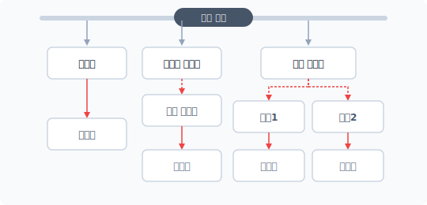

따라서 추상 팩토리를 학습하려면 팩토리 패턴, 팩토리 메서드 패턴의 특징과 차이점을 알아야 합니다. 만일 이해되지 않는다면 앞의 패턴을 다시 확인한 후 추상 팩토리를 학습하는 것이 좋습니다.


### 4.1.2 객체 생성의 종속성

객체지향은 관계를 형성하기 위해 객체 내에서 직접 new 키워드를 이용해 또 다른 객체를 생성합니다. 하나의 객체가 서브 객체를 직접 생성하면 두 객체 간에는 강한 종속 의존성이 형성됩니다.

프로그램은 사용자 요구에 대응하고 버그를 수정하기 위해 시간이 흐를수록 계속해서 코드를 수정해야 합니다. 만약 작성한 코드에 강력한 종속적 객체 결합이 있다면 다양한 변화에 맞춰 수정하는 것이 어려울 수 있습니다.

생성 패턴은 이처럼 객체 간에 존재하는 강력한 종속 관계를 해결하기 위한 기법으로, new 키워드를 이용하여 객체를 직접 생성하지 않고 다른 클래스로 위임하여 객체를 생성합니다.

별도로 분리된 객체에 생성을 요청하면 객체 간의 직접적인 종속 관계를 제거할 수 있습니다. 생성 패턴은 메서드를 호출함으로써 필요한 객체를 생성합니다.

4장 추상 팩토리 패턴 107

### 4.1.3 추상화와 위임 처리

팩토리 패턴과 팩토리 메서드 패턴의 주된 차이점은 추상화입니다. 팩토리 메서드 패턴은 추상화를 통해 2개의 클래스로 분리됩니다.

팩토리 메서드의 상위 클래스는 추상적 선언입니다. 추상적 선언은 하위 클래스에서 적용되는 인터페이스와 유사합니다. 또한 하위 클래스에 필요한 공통 내용을 포함합니다.

#### 그림 4-2 팩토리 메서드의 추상화 구조

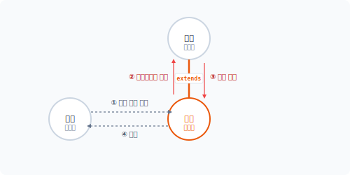

하위 클래스는 추상화된 상위 클래스를 상속받습니다. 추상 메서드는 상위 클래스에서 정의한 인터페이스에 따라 하위 클래스에서 오버라이드되고, 실제 동작하는 메서드의 내용으로 구현됩니다.


### 4.1.4 상속과 다형성

일반적인 상속은 상위 클래스의 내용을 포함하는 객체의 확장입니다. 하지만 추상 클래스의 상속은 하위 클래스에서 구체적 행위를 규정하는 선언이라고 할 수 있습니다.

108 1부 생성 패턴

#### 그림 4-3 일반 상속과 추상 상속

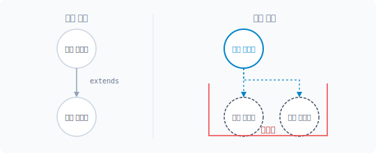

추상화는 하위 클래스에 객체지향의 다형성을 부여합니다. 다형성을 이용하면 형태와 틀은 같지만 실제 처리 내용은 다르게 클래스를 만들 수 있습니다. 하지만 다형성을 적용하면 여러 개의 하위 클래스를 만들어야 한다는 단점도 있습니다.

매개변수를 통해 생성을 선택적으로 처리하는 방법을 사용하면 추상화와 다형성의 단점을 보완할 수 있지만, 객체지향의 특징인 다형성을 완전히 배제할 수는 없습니다.


## 4.2 그룹

추상 팩토리는 여러 개의 팩토리 메서드를 그룹으로 묶은 것과 유사합니다. 추상 팩토리는 생성 패턴을 그룹 형태로 변경합니다.


### 4.2.1 추상 클래스

팩토리 메서드는 팩토리 패턴을 추상화함으로써 클래스의 선언과 구현을 분리합니다. 추상화는 인터페이스의 특징을 이용해 실제적 객체의 생성 동작을 하위 클래스로 위임하고, 하위 클래스는 상위 추상 클래스에서 선언된 인터페이스에 따라 메서드를 구현합니다. 구현되는 메서

4장 추상 팩토리 패턴 109

드는 상위 추상 메서드를 오버라이드합니다.

예를 들어 자동차 생산 과정을 처리하는 코드를 작성해봅시다. 클래스 설계 시 추상화를 적용하여 객체의 생성을 분리합니다.

예제 4-1 AbstractFactory/01/factory.php

```php
<?php
// 추상 클래스
abstract class Factory
{
    abstract public function createTire();
    abstract public function createDoor();
}
```

추상 클래스에 2개의 부품 객체를 생산하는 메서드를 선언합니다. 선언된 메서드는 실제적인 내용이 없는 추상 메서드입니다. 추상 메서드는 인터페이스와 유사한 역할을 합니다.


### 4.2.2 다형성을 이용한 군집 형성

추상화는 다형성을 적용해 여러 개의 하위 클래스를 생성할 수 있습니다. 팩토리 메서드는 추상 클래스와 하위 클래스를 1개로만 구성합니다. 반면에 추상 팩토리는 다형성을 적극적으로 활용하여 다수의 하위 클래스를 생성하고 관리하는 것이 특징입니다.

다형성을 적용하기 위해 추상 클래스를 상속받습니다. 추상 클래스를 상속받은 하위 클래스는 위임된 동작을 서로 다르게 정의할 수 있는 객체로 만들 수 있습니다. 상속을 통해 다형성을 적용한다는 것은 하위 클래스가 하나의 군으로 형성될 수 있다는 것입니다.

추상 팩토리는 추상화의 다형성을 이용하여 객체 생성군을 형성하고 추상화와 다형성을 이용하여 집합 단위의 객체 생성을 관리할 수 있습니다. 즉 추상화와 상속을 극대화해 다형성의 특징을 응용합니다.

110 1부 생성 패턴

### 4.2.3 공장

추상 팩토리(abstract factory)는 다양한 객체 생성 과정에서 그룹화가 필요할 때 매우 유용한 패턴이며 공장의 개념을 추상화합니다. 공장은 생산품을 만들어내는데, 하나의 군으로 묶인 그룹들을 공장으로 취급합니다. 추상 팩토리는 단위 객체들을 생산하는 공장 시스템과 같습니다.


## 4.3 팩토리 그룹

추상 팩토리의 특징은 추상화를 통해 그룹을 만들 수 있다는 것입니다. 팩토리 메서드는 추상 팩토리와 동일하게 추상화 과정을 적용할 수 있지만 단일 그룹으로 제한합니다.


### 4.3.1 그룹

생성 패턴의 목적은 클래스의 객체 생성 처리를 묶어서 관리하는 것입니다. 이전에 학습한 팩토리 패턴, 팩토리 메서드 패턴 또한 객체 생성을 하나의 클래스로 묶어서 처리합니다. 팩토리 메서드의 경우 추상화를 적용해 단일 클래스를 분리, 확장하고 추상화된 클래스는 여러 개의 하위 클래스에 상속합니다.

예를 들면 유사한 객체의 생성을 묶어서 2개 이상의 하위 클래스로 상속해 동작을 구분할 수 있습니다. 분리된 하위 클래스는 공통된 상위 추상 클래스를 상속받을 수 있습니다.

#### 그림 4-4 추상 클래스 상속 구조

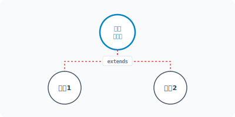

4장 추상 팩토리 패턴 111

유사한 생성을 담당하는 하위 클래스들은 각자 고유의 그룹으로 볼 수 있습니다. 팩토리 메서드에서는 하나의 하위 클래스만 가질 수 있고, 추상 팩토리에서는 복수의 하위 클래스를 가질 수 있습니다.


### 4.3.2 가상화 관점의 추상화

추상 팩토리, 팩토리 메서드 모두 단일 클래스를 추상화합니다. 이렇게 추상화를 사용하는 이유는 구체적인 객체 생성 로직을 알지 못하기 때문입니다.

#### 그림 4-5 구체적인 내용을 알 수 없음

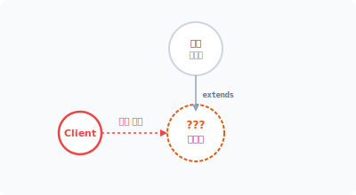

구현 로직을 알지 못하기 때문에 가상화를 통해 이를 대체합니다. 추상화에서 가상은 인터페이스를 적용하고 실제 객체 생성은 하위 클래스에서 담당하는 것입니다. 추상 팩토리는 복수의 팩토리 메서드 패턴을 결합하여 하나의 가상화된 객체 생성군을 형성합니다. 추상 팩토리는 좀 더 크고 복잡한 객체군을 만들 수 있습니다. 특히 추상 팩토리는 가상화 그룹을 2개 이상 처리합니다.


### 4.3.3 하위 클래스: 한국 공장

추상 팩토리를 학습하기 위해 다음과 같은 예를 만들어보겠습니다. 규모가 있는 다국적 자동차 회사의 차량을 생산한다고 가정합시다. 이 회사의 생산 공장은 한국과 미국 두 곳에 있어 각각의 생산 지역을 그룹화합니다.

112 1부 생성 패턴

앞으로 우리는 2개의 그룹을 생성할 것입니다. 우선 하나의 그룹을 생성합니다. 한국 공장은 koreaFactory, 미국 공장은 stateFactory입니다. 추상화를 적용해 하위 클래스를 구현합니다.

예제 4-2 AbstractFactory/01/KoreaFactory.php

```php
<?php
// 한국 공장 팩토리
class KoreaFactory extends Factory
{
    public function __construct()
    {
        echo __CLASS__."객체를 생성합니다.\n";
    }

    public function createTire()
    {
        return new KoreaTireProduct;
    }

    public function createDoor()
    {
        return new KoreaDoorProduct;
    }
}
```

하나의 객체군을 만드는 것은 팩토리 메서드와 동일합니다.

하위 클래스는 조건을 매개변수로 처리하지 않았습니다. if문이나 switch문 없이 직접 2개의 객체를 생성하는 메서드로 구현합니다. 필요하다면 메서드명을 통해 생성 객체를 구분할 수 있습니다.


## 4.4 공장 추가

추상 팩토리는 그룹을 통해 복수의 공장을 생성할 수 있습니다. 추상 팩토리를 사용하는 목적은 복수의 객체 생성을 담당하는 군집을 관리하는 것입니다.

4장 추상 팩토리 패턴 113

### 4.4.1 프로젝트

프로젝트의 규모가 커질수록 많은 클래스 파일과 객체가 요구되는데, 이때 팩토리 패턴이나 팩토리 메서드 패턴을 사용하여 필요한 객체 생성을 한 곳으로 모은 후 관리하는 것이 편리합니다. 만일 더 큰 규모의 프로젝트를 수행한다면 하나의 생성 패턴으로 모든 객체를 생성 처리하는 것이 힘들 수 있습니다.

이때는 유사한 객체의 생성을 그룹화하여 처리하는 것이 좋습니다. 추상 팩토리의 개념은 생성 패턴을 그룹화하기 위해 도입된 것입니다. 추상 팩토리는 복잡하고 규모가 큰 프로젝트를 수행하기 위해 복수의 생성 패턴의 그룹을 처리하며 추상 팩토리는 다수의 독립적 그룹을 형성합니다.


### 4.4.2 그룹 추가

팩토리 메서드는 단일 그룹을 관리하지만 추상 팩토리는 복수의 그룹을 관리할 수 있습니다. 추상 팩토리에서 새로운 그룹을 만드는 것은 앞의 예제에서 객체의 생산 공장을 추가하는 것과 같습니다.

#### 그림 4-6 추상화를 통한 그룹 형성

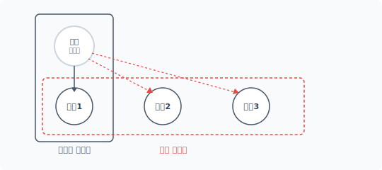

상위 추상 클래스를 상속받을 하위 클래스를 추가로 생성합니다. 추상 클래스에서 정의한 인터페이스 규격에 맞게 새로운 그룹의 내용을 구현합니다. 하위 클래스는 추상화 규약에 따라 실제 처리 로직을 자유롭게 작성하고, 추상화는 인터페이스와 같이 별도의 로직을 정의하지 않습니다. 이러한 특징이 적용되어 독립된 그룹을 형성할 수 있습니다.

114 1부 생성 패턴

### 4.4.3 하위 클래스: 미국 공장

복수의 그룹은 팩토리 메서드 패턴이 중복되어 적용되는 것을 의미합니다. 추상 팩토리는 여러 개의 공장이 있는 생산 단지와 같습니다.

기존 팩토리 메서드로 구현된 패턴을 추상 팩토리로 확장합니다. 다음과 같이 새로운 객체 생성군을 가진 클래스를 추가하는데, StateFactory는 미국에 있는 공장을 의미합니다. StateFactory 또한 동일하게 상위 Factory 추상 클래스를 상속받습니다.

예제 4-3 AbstractFactory/01/StateFactory.php

```php
<?php
// 미국 공장 팩토리
class StateFactory extends Factory
{
    public function __construct()
    {
        echo __CLASS__."객체를 생성합니다.\n";
    }

    public function createTire()
    {
        return new StateTireProduct;
    }

    public function createDoor()
    {
        return new StateDoorProduct;
    }
}
```

StateFactory는 추상 클래스인 Factory를 상속하며 다형성이 적용된 상태입니다. 또한 상위 추상 클래스에서 선언된 추상 메서드를 구현하고 추상 메서드에서는 별도로 분리된 객체를 생성합니다. 미국 공장에서만 사용하는 타이어와 도어 부품 객체도 생성합니다.

하나의 부품을 한국과 미국 공장에서 같이 사용할 수도 있는데, 규격 차이로 나누어 적용한다고 가정하고 이를 공장별로 그룹화하여 분리합니다.

4장 추상 팩토리 패턴 115

### 4.4.4 객체 분리를 활용한 은닉성 활용

추상 팩토리는 추상 클래스를 응용한 객체 구현 방법을 사용하고 추상 클래스는 실제 구현 내용이 없는 추상 메서드를 선언합니다. 추상 메서드는 구체적 내용을 정의하는 인터페이스 규약과 유사합니다. 하위 클래스가 추상 메서드를 가진 추상 클래스를 상속하면 반드시 약속된 선언에 따라 오버라이드하여 메서드를 만들어야 합니다.

추상화는 인터페이스를 전달하고 상속을 통해 실제 로직을 하위 클래스에 구현합니다. 인터페이스도 실제 생성되는 로직을 하위 클래스에 구현하는데, 이는 실제 동작하는 구현부를 외부로부터 감출 수 있습니다. 이러한 객체지향 특징을 은닉성이라고 부릅니다.

#### 그림 4-7 추상화를 통한 은닉성

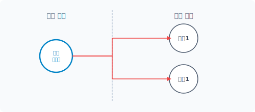

추상 팩토리는 객체를 분리함으로써 은닉성을 적용합니다. 분리된 하위 클래스는 독립적인 그룹을 생성하여 외부로부터 감출 수 있습니다.


### 4.4.5 목적성

추상 팩토리는 특정 클래스에 의존하지 않습니다. 해결해야 하는 문제에 따라 객체 생성 그룹을 형성합니다. 문제가 다양할 경우 새로운 객체를 생성해 그룹을 추가합니다. 해결해야 할 주제가 변할 때마다 목적(문제)에 따른 그룹을 변경하여 적용합니다. 하지만 각각의 그룹들은 서로 호환성을 가지며 동일한 인터페이스에 의해 호출됩니다.

116 1부 생성 패턴

#### 그림 4-8 동일한 인터페이스로 다른 목적을 수행

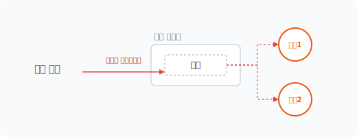

추상 팩토리는 이러한 목적성에 따라 그룹 간 호환성을 유지합니다. 목적이 변경될 경우 필요한 객체를 생성하는 그룹을 교체할 수 있는데, 이는 객체 생성을 담당하는 클래스와 이를 호출하는 클라이언트 클래스를 분리할 수 있기 때문입니다.


## 4.5 부품 추가 실습

추상 팩토리를 적용하여 실제 생성하는 객체 클래스를 설계해봅시다.


### 4.5.1 부품 추상화

앞 절에서 2개의 추상 팩토리 그룹을 생성했습니다. 그룹은 KoreaFactory와 StateFactory 하위 클래스이고, 두 그룹은 독립된 객체를 생성하여 반환합니다.

#### 그림 4-9 추상화 그룹

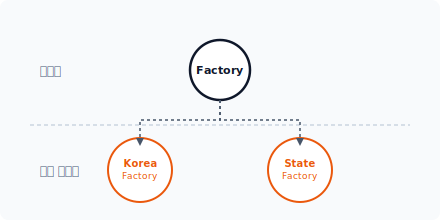

4장 추상 팩토리 패턴 117

Tire와 Door 객체를 생성하는 것은 두 그룹의 공통 기능이지만, KoreaFactory와 StateFactory에서 생산되는 Tire와 Door 객체에는 약간의 차이가 필요합니다.

두 그룹에서 직접 Tire와 Door 객체를 생성하지 않고 공통된 부품의 호환성을 위해 추상화를 진행합니다. 각 부품을 추상 클래스로 선언하여 타이어 객체를 생성합니다.

예제 4-4 AbstractFactory/01/TireProduct.php

```php
<?php
// 타이어 부품
// 추상 클래스
abstract class TireProduct
{
    abstract public function makeAssemble();
}
```

#### 그림 4-10 타이어 부품 추상화

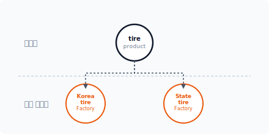

자동차 도어(Door)도 추상 클래스로 선언합니다.

예제 4-5 AbstractFactory/01/DoorProduct.php

```php
<?php
// 도어 부품
// 추상 클래스
abstract class DoorProduct
{
    abstract public function makeAssemble();
}
```

118 1부 생성 패턴

#### 그림 4-11 도어 부품 추상화

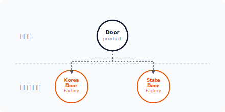

추상 클래스는 직접 구현하지 않고 하위 클래스에 위임합니다. 추상 클래스와 같이 공통된 인터페이스를 적용하면 은닉성을 보장하면서 목적에 맞는 독립된 설계를 다양하게 진행할 수 있습니다.

> [!NOTE]
> 단순한 인터페이스만 상속할 때는 추상 클래스보다 인터페이스를 통해 구현 적용하는 것이 더 나을 수도 있습니다.


### 4.5.2 KoreaFactory

먼저 KoreaFactory 그룹에서 생성하는 객체를 살펴봅시다. KoreaFactory 클래스는 2개의 객체를 생성한 후 반환합니다.

```php
public function createTire()
{
    return new KoreaTireProduct;
}

public function createDoor()
{
    return new KoreaDoorProduct;
}
```

실제 구현은 KoreaTireProduct 클래스와 KoreaDoorProduct 클래스 안에 선언되어 있습니다. 그리고 실제 클래스는 앞에서 선언한 추상 클래스를 상속받습니다.

4장 추상 팩토리 패턴 119

#### 그림 4-12 KoreaFactory 객체 생성 흐름도

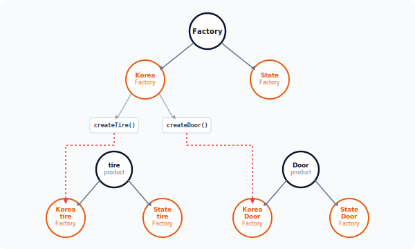

KoreaTireProduct 클래스는 추상화 상속을 통해 다른 클래스와 호환성을 가질 수 있습니다. 하위 클래스의 실제 구현을 위해 추상 클래스(TireProduct)를 상속받습니다.

예제 4-6 AbstractFactory/01/KoreaTireProduct.php

```php
<?php
// 추상 클래스 적용
// 한국 규격 타이어
class KoreaTireProduct extends TireProduct
{
    public function __construct()
    {
        echo "Product =".__CLASS__."객체를 생성합니다.\n";
    }

    public function makeAssemble()
```

120 1부 생성 패턴

{
        echo "메서드 호출 ".__METHOD__."\n";
        echo "한국형 타이어 장착\n";
    }
}
```

KoreaDoorProduct 클래스는 호환성을 위해 추상 클래스인 DoorProduct를 상속받습니다. 하위 클래스에서 실제 구현을 작성합니다.

예제 4-7 AbstractFactory/01/KoreaDoorProduct.php

```php
<?php
// 추상 클래스 적용
// 한국 규격 도어
class KoreaDoorProduct extends DoorProduct
{
    public function __construct()
    {
        echo "Product =".__CLASS__."객체를 생성합니다.\n";
    }

    public function makeAssemble()
    {
        echo "메서드 호출 ".__METHOD__."\n";
        echo "한국형 도어 장착\n";
    }
}
```

생성 클래스를 추상 팩토리에서 분리한 그룹별로 독립해서 설계할 수 있습니다.


### 4.5.3 StateFactory

이번에는 두 번째 StateFactory 그룹에서 필요로 하는 클래스를 선언해봅시다. StateFactory 클래스도 동일한 상위 Factory 클래스를 상속받으며 KoreaFactory와 동일한 구현 메서드가 있습니다.

```php
public function createTire()
{
```

4장 추상 팩토리 패턴 121

```php
    return new StateTireProduct;
}

public function createDoor()
{
    return new StateDoorProduct;
}
```

하지만 생성하는 객체의 클래스는 다릅니다. StateTireProduct와 StateDoorProduct 클래스의 객체를 생성하여 반환합니다.

#### 그림 4-13 StateFactory 객체 생성 흐름도

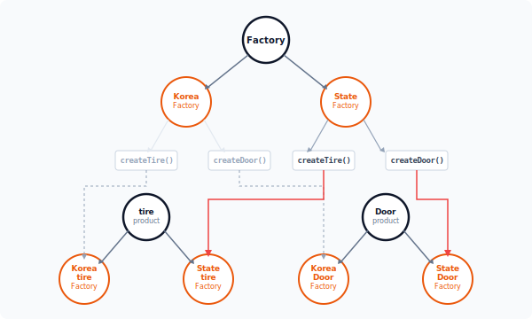

이처럼 StateFactory와 KoreaFactory는 추상화를 통해 동일한 인터페이스를 적용하지만 실제 내부 구현은 하위 클래스가 독립적으로 설계합니다. StateTireProduct 클래스도 호환성을 위해 추상 클래스 TireProduct를 상속받으며 하위 클래스에서 실제 구현을 작성합니다.

122 1부 생성 패턴

예제 4-8 AbstractFactory/01/StateTireProduct.php

```php
<?php
// 추상 클래스 적용
// 미국 규격 타이어
class StateTireProduct extends TireProduct
{
    public function __construct()
    {
        echo "Product =".__CLASS__."객체를 생성합니다.\n";
    }

    public function makeAssemble()
    {
        echo "메서드 호출 ".__METHOD__."\n";
        echo "미국형 타이어 장착\n";
    }
}
```

StateDoorProduct도 호환성을 위해 추상 클래스 DoorProduct를 상속받아 하위 클래스를 실제 구현합니다.

예제 4-9 AbstractFactory/01/StateDoorProduct.php

```php
<?php
// 추상 클래스 적용
// 미국 규격 도어
class StateDoorProduct extends DoorProduct
{
    public function __construct()
    {
        echo "Product =".__CLASS__."객체를 생성합니다.\n";
    }

    public function makeAssemble()
    {
        echo "메서드 호출 ".__METHOD__."\n";
        echo "미국형 도어 장착\n";
    }
}
```

이처럼 추상 팩토리는 객체의 생성을 그룹화하여 관리합니다. 그룹화 과정에서 생성되는 클래

4장 추상 팩토리 패턴 123

스들은 유사한 구조를 가집니다.


## 4.6 패턴 결합

추상 팩토리를 적용하여 객체의 생성을 그룹화하고 그룹화된 객체를 결합하여 실행합니다.


### 4.6.1 클라이언트

앞에서 살펴본 예제들의 추상 팩토리는 Tire와 Door 객체를 한국과 미국 2개의 그룹으로 분리합니다. 각 그룹은 다시 추상 클래스를 통해 실제 그룹에 맞게 객체를 생성합니다.

다음에는 이를 응용하여 화면에 결과를 출력합니다. 먼저 메인 코드를 작성하고 필요한 클래스를 추가합니다.

예제 4-10 AbstractFactory/01/index.php

```php
<?php
// 추상 팩토리 및 그룹 정의
require "Factory.php";
require "KoreaFactory.php";
require "StateFactory.php";

// 호환성 정의
require "DoorProduct.php";
require "TireProduct.php";

// 한국 상품 그룹
require "KoreaDoorProduct.php";
require "KoreaTireProduct.php";

// 미국 상품 그룹
require "StateDoorProduct.php";
require "StateTireProduct.php";

echo "추상 팩토리 패턴을 실습합니다.\n";

// 한국 공장
```

124 1부 생성 패턴

```php
$korea = new KoreaFactory;

$ham = $korea->createTire();
$ham->makeAssemble();

$bread = $korea->createDoor();
$bread->makeAssemble();

echo "\n";

// 미국 공장
$state = new StateFactory;

$ham = $state->createTire();
$ham->makeAssemble();

$bread = $state->createDoor();
$bread->makeAssemble();
```

$korea와 $state 2개의 그룹 객체를 생성하고 각 그룹 객체에 선언된 생성 메서드를 호출합니다.

```
$ php index.php
추상 팩토리 패턴을 실습합니다.
KoreaFactory객체를 생성합니다.
Product =KoreaTireProduct객체를 생성합니다.
메서드 호출 KoreaTireProduct::makeAssemble
한국형 타이어 장착
Product =KoreaDoorProduct객체를 생성합니다.
메서드 호출 KoreaDoorProduct::makeAssemble
한국형 도어 장착

StateFactory객체를 생성합니다.
Product =StateTireProduct객체를 생성합니다.
메서드 호출 StateTireProduct::makeAssemble
미국형 타이어 장착
Product =StateDoorProduct객체를 생성합니다.
메서드 호출 StateDoorProduct::makeAssemble
미국형 도어 장착
```

4장 추상 팩토리 패턴 125

이와 같이 추상 클래스를 이용하면 여러 공장에서 제품을 생산하는 것처럼 복수의 생성 그룹을 적용할 수 있습니다. 또한 각각의 그룹은 목적에 맞는 객체를 독립적으로 생성할 수 있습니다.


### 4.6.2 새로운 부품

추상 팩토리는 생성 패턴을 그룹화된 구조로 분리합니다. 추상 클래스를 상속받는 하위 클래스를 추가해 새로운 그룹을 쉽게 만들 수 있지만 그룹의 하위 클래스를 추가하는 것은 쉽지 않습니다.

앞에서 살펴본 [예제 4-10]에서 KoreaFactory와 StateFactory는 추상화를 통해 분리된 그룹이며 각 그룹에서 호환성을 유지하기 위해 실제 객체도 추상화합니다. KoreaTireProduct와 StateTireProduct가 공통된 추상 클래스 TireProduct를 상속받는 것을 볼 수 있습니다. KoreaDoorProduct와 StateDoorProduct도 공통된 DoorProduct를 갖습니다.

각 그룹에서 새로운 부품인 Engine을 추가해야 한다고 가정해봅시다. 새로운 부품을 추가할 때는 추상 클래스 그룹으로 분리된 모든 클래스에 Engine 부품 관련 코드를 삽입해야 합니다.

추상 클래스의 경우 그룹을 나누는 것은 쉽지만 서브 생성 객체를 추가하는 것은 어렵습니다. 이처럼 하나의 패턴이 문제를 완벽하게 해결할 수 있는 것은 아닙니다. 패턴을 적용할 때는 장단점을 잘 파악하여 적절하게 사용하는 것이 중요합니다.


## 4.7 장점과 단점

추상 팩토리는 생성 클래스를 그룹별로 분리할 수 있으며 클래스의 군을 쉽게 변경할 수도 있습니다.


### 4.7.1 장점

추상 팩토리는 생성 패턴을 독립적으로 동작하도록 분리하며 분리된 하나의 그룹별로 객체를 선택하여 생성합니다. 추상 팩토리의 그룹은 동일한 처리 로직을 갖고 있고, 다른 그룹으로 변경돼도 하위 클래스를 통해 선택적 객체를 다르게 생성할 수 있습니다. 추상 팩토리는 큰 변화

126 1부 생성 패턴

없이 시스템의 군을 생성하고 변경할 수 있습니다.

추상 팩토리의 일부는 인터페이스와 같은 역할을 합니다. 인터페이스는 코드를 일관적으로 유지하고 실제 구현을 다르게 실행시킬 수 있다는 장점을 갖고 있습니다.


### 4.7.2 단점

추상 팩토리의 경우 새로운 종류의 군을 추가하는 것이 쉽지 않습니다. 이는 기존 군에서 새로운 군을 추가하여 확장할 때 모든 서브 클래스들이 동시에 변경돼야 하는 추상 팩토리의 특징 때문입니다. 새로운 클래스 제품군이 추가되면 클래스 제품에 대한 구조를 설계하고, 이를 다시 추상 팩토리의 구조에 등록해야 합니다. 매번 새로운 종류를 추가할 때마다 구조를 재설계하는 것은 확장성 부분에서 좋지 않습니다.

추상 팩토리의 그룹은 계층적 구조를 가지며 계층을 확장하면서 그룹을 관리합니다. 추상 팩토리는 팩토리 메서드와 매우 비슷하지만 관리할 그룹이 많다는 차이가 있습니다. 또한 계층의 크기가 커질수록 복잡한 문제가 발생합니다.


## 4.8 관련 패턴

추상 팩토리와 유사한 특징을 가지고 있는 다음 패턴과 같이 활용됩니다.


### 4.8.1 빌더 패턴

추상 팩토리는 인터페이스를 이용하여 객체를 조립합니다. 하지만 빌더는 더 크고 복잡한 객체를 조립하거나 생성할 때 사용됩니다.


### 4.8.2 팩토리 메서드 패턴

추상 팩토리는 팩토리 메서드를 더욱 확장합니다. 생성 패턴을 그룹화하여 단위별로 객체 생성하며 객체를 조립하는 과정에서 팩토리 메서드 패턴이 응용됩니다.

4장 추상 팩토리 패턴 127

### 4.8.3 복합체 패턴

추상 팩토리는 추상화를 통해 객체 생성을 조합합니다. 조합된 객체는 복합 객체의 특징을 가집니다.


### 4.8.4 싱글턴 패턴

유일한 객체 생성이 필요하다면 일부 객체는 싱글턴 방식으로 변경할 수 있습니다. 싱글턴 패턴을 이용하면 중복을 배제하고 객체를 생성할 수 있습니다.


## 4.9 정리

추상 팩토리 패턴은 팩토리 메서드 패턴을 포함하며 팩토리 부분을 추상화해 그룹으로 확장합니다. 생성된 그룹을 통해 전체를 쉽게 변경할 수도 있습니다.

추상 팩토리는 객체 생성 과정이 프로세스 공정과 같습니다. 같은 방식으로 생성할 때 적용하면 좋은 패턴입니다.

128 1부 생성 패턴

