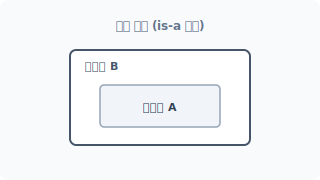
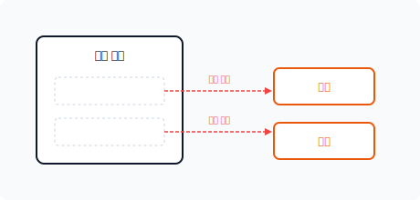
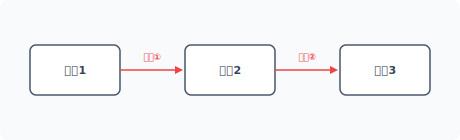
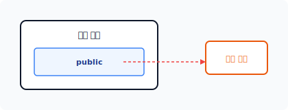
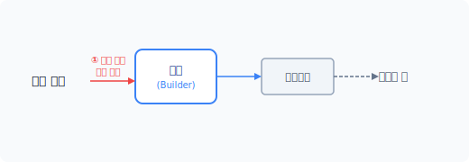
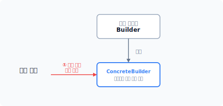
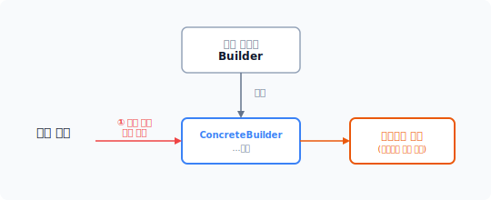
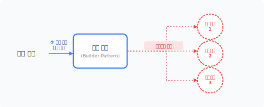


# CHAPTER 5. 빌더 패턴 (builder)

**build·er**
[ 'bɪldə(r) ]

빌더 패턴은 추상 팩토리를 확장하여 크고 복잡한 객체를 생성할 수 있습니다.


## 5.1 건축물

builder의 사전적 의미는 '건축물을 짓는 사람 또는 회사'입니다. 즉 커다란 구조의 큰 물체를 설계하고 만드는 것을 의미합니다.


### 5.1.1 객체 생성

생성 패턴의 주요 목적은 객체의 생성 과정을 한 곳에 집중화하는 것입니다. 패턴을 사용하여 객체를 생성 관리하는 이유는 인스턴스화 과정에서 발생하는 강력한 의존 관계를 해소하기 위해서입니다. 객체지향에서 객체의 종류는 크게 단일 객체와 복합 객체 2가지가 있습니다.

기본적으로 클래스는 하나의 객체입니다. 단일 객체란 하나의 클래스로 생성된 객체를 말합니다. 객체는 데이터와 행동을 가지며 때로는 객체를 확장하기 위해 상속 구조를 적용하기도 합니다. 팩토리, 팩토리 메서드, 추상 팩토리 모두 단일 객체를 사용합니다.

5장 빌더 패턴 129

### 5.1.2 복합 객체

전형적인 클래스 확장 방식은 상속입니다. 상속은 상위 클래스를 is-a 관계로 포괄하여 큰 규모의 객체를 생성하는 기법입니다. 하지만 상속에는 강력한 상하 결합 관계와 불필요한 모든 행위까지 포함된다는 단점도 있습니다.

#### 그림 5-1 is-a 관계 상속 확장



객체지향에서는 상속의 단점을 개선하기 위해 의존성 주입을 사용합니다. 의존성을 통해 복합 객체를 생성하여 사용하는 것을 권장합니다. 복합 객체란 하나의 객체가 다른 객체를 포함하는 관계 구조입니다. 복합 객체는 구조적 의존 관계를 통해 객체를 확장합니다.

#### 그림 5-2 복합 구조 확장



복합 객체는 객체가 생성된 후에도 다른 객체와 관계를 설정해 동적 확장할 수 있다는 장점을 갖고 있습니다. 많은 디자인 패턴의 원리와 목적은 상속 결합을 배제하고 의존 관계의 복합 객체로 변경하여 처리하는 것입니다.

130 1부 생성 패턴

### 5.1.3 복잡한 객체

복합 객체는 내부적으로 다른 클래스의 객체를 포함합니다. 복합 객체는 관계 설정을 추가로 해줘야 하므로 객체를 생성하는 과정이 단일 객체보다 복잡합니다. 복합 객체를 생성할 때는 객체의 구조 순서에 맞게 단계별로 실행됩니다.

#### 그림 5-3 단계별 의존 관계



복합 객체 사용을 중요시하는 것이 최신 객체지향 트렌드지만 이전에 학습한 팩토리, 팩토리 메서드, 추상 메서드 패턴으로는 복합 객체를 생성할 수 없습니다. 기존 생성 패턴의 한계로 인해 복합 객체 생성을 처리할 수 있는 또 다른 패턴이 필요해졌습니다. 빌더 패턴은 복잡한 구조의 복합 객체를 생성하는 로직을 별도로 분리하여 객체 생성을 처리합니다.


## 5.2 객체 실습

빌더 패턴을 학습하기 위해 복합 객체를 만들어봅시다. 복합 객체는 하나의 객체가 다른 클래스의 객체를 포함한다는 특징을 갖고 있습니다.


### 5.2.1 기본 클래스

복합 객체를 생성하기 위해서는 먼저 root 클래스가 필요합니다. 다음 예제는 컴퓨터의 구조를 표현한 클래스입니다.

예제 5-1 Builder/01/Computer.php

```php
<?php
// 기본 객체
```

5장 빌더 패턴 131

class Computer
{
    public $_cpu;
    public $_ram = [];
    public $_storage = [];

    public function __construct()
    {
        echo __CLASS__." 객체가 생성이 되었습니다.\n";
    }

    public function __toString()
    {
        return
        "이 컴퓨터의 사양은 CPU=". $this->_cpu.
        ", RAM= ".$this->memory()."GB".
        ", Storage= ".$this->storage()."GB".
        "입니다.\n";
    }

    public function memory()
    {
        $size = 0;
        foreach ($this->_ram as $mem) {
            $size += $mem->getSize();
        }
        return $size;
    }

    public function storage()
    {
        $size = 0;
        foreach ($this->_storage as $disk) {
            $size += $disk->getSize();
        }
        return $size;
    }
}
```

Computer 클래스에는 데이터를 저장하는 3개의 프로퍼티(변수)가 있는데 그것은 하나의 CPU 프로퍼티, 배열로 된 Ram, Storage 프로퍼티입니다. Ram과 Storage는 복수의 객체를 배열로 저장합니다. 객체의 정보를 문자열로 확인하도록 __toString() 메서드도 함께 구현합니다.

132 1부 생성 패턴

> [!NOTE]
> __toString() 메서드는 객체를 변수처럼 사용할 때 동작하는 매직 메서드입니다.


### 5.2.2 객체의 구성

복합 객체는 다른 클래스의 객체를 포함합니다. 복합 객체가 다른 객체를 갖는 방법은 다양한데, 먼저 내부적으로 직접 관련된 클래스의 객체를 생성할 수 있습니다. 객체 생성자를 통해 관련 있는 객체들을 생성 결합할 수 있으며, 간단한 팩토리 패턴과 같이 메서드를 활용해 관련된 객체를 생성할 수도 있습니다. 객체를 직접 생성하는 방법 외에 외부로부터 객체의 의존성을 전달받을 수도 있습니다.

디자인 패턴에서 복합 객체의 구성은 의존성 주입 형태가 권장되며 의존성 주입이 이루어진 객체들은 복합 객체의 내부 프로퍼티에 저장됩니다. 기본 객체 안에 선언된 $_ram, $_storage 프로퍼티는 외부에서 전달받은 객체를 담고 있습니다.

```php
public $_ram = [];
public $_storage = [];
```

프로퍼티에 저장된 객체는 속성에 따라 접근을 제한할 수 있습니다. public으로 속성을 정의했다면 복합 객체와 연결된 객체에 제한 없이 접근할 수 있습니다.

#### 그림 5-4 Public 속성 접근



5장 빌더 패턴 133

의존성 주입이 이루어진 객체의 접근 권한을 설정할 때는 몇 가지 로직이 추가됩니다. private, protected 속성은 외부에서 프로퍼티에 직접 접근할 수 없습니다. 접근 권한 관리를 위한 별도의 메서드(setter/getter)를 추가해야 합니다. 게터/세터 메서드가 작성되면 코드의 양이 늘어나고 번거롭습니다. 하지만 객체의 접근을 제한하고 은닉성을 가질 수 있다는 점에서 같이 작성하는 것이 좋습니다.


### 5.2.3 부속 클래스

복합 객체의 부속 클래스를 설계해봅시다. 기본 클래스인 Computer에는 부속 클래스 Memory와 Storage 클래스가 있습니다.

예를 들어 컴퓨터에는 여러 개의 메모리를 꽂아 확장할 수 있습니다. 복수의 메모리를 관리하기 위해 $_ram 변수를 배열로 선언합니다. Computer 클래스는 복수의 Memory 객체를 포함할 수 있는 복합 객체입니다.

```php
public $_ram = [];
```

다음은 메모리 부품을 처리하기 위한 예제 코드입니다.

예제 5-2 Builder/01/Memory.php

```php
<?php
// 기본 객체
class Memory
{
    private $size; // 메모리 사이즈

    public function __construct($size=null)
    {
        if ($size) {
            $this->size = $size;
        }
    }

    public function setSize($size) // setter
    {
        $this->size = $size;
    }
```

134 1부 생성 패턴

public function getSize() // getter
    {
        return $this->size;
    }
}
```

또한 컴퓨터에는 다수의 저장 장치가 있는데, Computer 클래스는 복수의 Storage 클래스의 객체를 포함합니다.

```php
public $_storage = [];
```

[예제 5-3]에서 Storage 클래스는 저장 장치를 처리합니다.

예제 5-3 Builder/01/Storage.php

```php
<?php
// 기본 객체
class Storage
{
    private $size; // 저장장치 크기

    public function __construct($size=null)
    {
        if ($size) {
            $this->size = $size;
        }
    }

    public function setSize($size) // setter
    {
        $this->size = $size;
    }

    public function getSize() // getter
    {
        return $this->size;
    }
}
```

5장 빌더 패턴 135

## 5.3 빌더

빌더 패턴은 복잡한 구조를 가진 복합 객체의 생성 과정을 분리하여 처리하는 패턴입니다. 복합 객체의 생성 과정을 단계별로 분리함으로써 복합 객체의 생성을 일반화할 수 있습니다.


### 5.3.1 빌더 패턴

팩토리 패턴 또한 요청한 객체의 생성 과정을 분리합니다. 요청된 복합 객체의 생성을 처리하기 위해 별도의 독립된 클래스를 준비하고, 생성 패턴은 요청되는 모든 객체를 생성하며 반환하는 역할을 수행합니다. 팩토리 패턴은 단일 클래스의 객체만 생성, 반환하므로 요청된 객체가 복합 객체일 경우 팩토리 패턴을 적용할 수 없습니다.

복합 객체는 동적으로 객체를 확장할 수 있어 보다 효율적입니다. 하나의 객체는 여러 객체를 포함하며 포함된 객체는 또 다른 객체를 포함할 수 있습니다. 복합 객체는 계층적인 구조 관계를 가지는데, 이 특징 때문에 복합 객체를 생성하는 것이 쉽지 않습니다. 복합 객체의 내부 구조는 상하로 확장되기도 하고 다수의 leaf를 가지기도 합니다. 복잡한 구조를 가진 복합 객체를 하나의 방식으로 정의하기는 매우 어려우며 목적에 따라 수없이 많은 종류의 복합 구조가 탄생할 수 있습니다.

이처럼 다양한 구조의 복합 객체를 팩토리 패턴으로 구현하기에는 한계가 있습니다. 따라서 각 구조에 맞게 생성을 처리할 수 있도록 과정을 분리하여 처리합니다.


### 5.3.2 생성 로직

복잡한 구조를 가진 복합 객체를 한 단계로만 생성할 수는 없습니다. 복합 객체의 내부 구조에 맞게 단계별로 객체 생성을 분리하고 관계를 결합하는 과정이 필요합니다. 복합 객체의 구조는 종속적이기 때문에 종속된 순서의 역순으로 객체를 생성하여 결합해야 합니다.

복합 객체에는 구조에 맞게 객체를 생성하고 관계를 설정하는 로직이 필요합니다. 이러한 생성 로직은 일반적으로 클라이언트 코드 안에 작성됩니다. 복합 객체의 생성 로직을 일반 코드로 작성하면 객체 생성 과정을 효율적으로 관리하기 어렵습니다.

136 1부 생성 패턴

#### 그림 5-5 복합 객체 생성 알고리즘



이러한 이유로 빌더 패턴은 복합 객체 생성 과정을 별도의 독립된 클래스로 관리합니다.


### 5.3.3 빌더 추상화

빌더 패턴은 추상화를 통해 다양한 종류의 복합 객체를 생성 관리합니다. 다음은 Builder의 추상 클래스입니다. 추상화를 통해 공통된 로직을 분리합니다.

예제 5-4 Builder/01/Builder.php

```php
<?php
abstract class Builder
{
    // 알고리즘 객체를 저장합니다.
    protected $algorism;

    // 알고리즘 선택
    public function setAlgorism(Algorism $algorism)
    {
        // 빌드할 객체의 알고리즘 객체를 저장합니다.
        echo "빌드 객체를 저장합니다. <= ". get_class($algorism). "\n";
        $this->algorism = $algorism;

        return $this;
    }

    public function getInstance(){
        return $this->algorism->getInstance();
    }

    // 추상 메서드 선언
    abstract public function build();
}
```

5장 빌더 패턴 137

추상 클래스인 Builder는 추상 메서드 build()를 선언합니다. Build()는 복합 객체를 생성하는 로직을 하위 클래스에 위임합니다.


### 5.3.4 ConcreteBuilder

추상 클래스로 설계된 빌더는 자체적으로 객체를 생성할 수 없어 추상 클래스를 상속하는 하위 클래스(ConcreteBuilder)가 필요합니다. 하위 클래스는 실제 복합 객체의 생성 과정을 위임받고, 빌더 로직을 구체화하는 하위 클래(ConcreteBuilder)는 상위 추상 클래스(builder)를 상속받습니다.

#### 그림 5-6 빌더 패턴의 하위 클래스 구현



하위 클래스는 상위 클래스에서 선언된 추상 메서드의 실제를 구현합니다. 추상 메서드는 인터페이스와 같아서 추상 메서드를 다시 오버라이드하여 구현하는데, 구현하지 않을 경우 오류가 발생합니다.

예제 5-5 Builder/01/Factory.php

```php
<?php
// 외부에서 알고리즘을 전달받습니다.
class Factory extends Builder
{
    // 알고리즘 의존성을 주입 받습니다.
    public function __construct($algorism=null)
    {
        echo __CLASS__ ." 객체를 생성하였습니다.\n";
        if ($algorism) {
```

138 1부 생성 패턴

```php
            $this->algorism = $algorism;
        }
    }

    // 단계별 빌더의 메서드를 호출합니다.
    public function build()
    {
        echo "=== 빌드합니다. ===\n";
        $this->algorism->setCpu("i7");
        $this->algorism->setRam([8,8]);
        $this->algorism->setStorage([256,512]);

        return $this;
    }
}
```

추상화를 적용하면 여러 개의 하위 클래스를 만들어 다형성을 적용할 수 있습니다. 다형성을 이용해 다양한 복합 객체의 생성 로직을 하위 클래스로 구현할 수 있습니다.


### 5.3.5 추상 메서드

빌더 패턴은 추상 메서드를 통해 복합 객체 생성 방법을 달리 적용할 수 있습니다. 빌더 패턴은 복합 객체의 생성 로직을 직접 클라이언트 코드로 구현하거나 메서드를 호출하지 않으며, 독립적인 단계별 구축 공정을 분리하여 처리합니다. 추상 메서드 build() 안에는 복합 객체 생성을 위한 처리 로직들이 들어 있습니다. 또 빌더 생성 로직을 별도의 알고리즘으로 분리하여 외부로부터 주입받을 수도 있습니다.

#### 그림 5-7 외부 알고리즘



5장 빌더 패턴 139

빌더 패턴은 다양한 종류의 복합 객체 생성 로직을 구분합니다. 또한 추상 메서드와 외부 알고리즘을 통해 객체의 실제 생성 로직을 외부로부터 숨기는 효과도 있습니다.


## 5.4 알고리즘

빌더 패턴은 복합 객체의 생성 로직을 별도 클래스로 분리하며 분리한 로직을 알고리즘이라고 부릅니다. 분리한 알고리즘 객체는 다시 빌더에 전달되어 복합 객체를 생성합니다.


### 5.4.1 전략 패턴

복합 객체는 생성 과정이 복잡합니다. 1개의 빌더로 다양한 종류의 복합 객체를 생성하려면 생성 로직을 분리해두는 것이 좋습니다. 알고리즘이라고 했을 때 제일 먼저 떠오르는 패턴이 전략 패턴입니다. 빌더 패턴 또한 분리된 처리 로직을 객체화하여 전달할 수 있습니다. 이때, 빌더 패턴은 전략 패턴과 결합된 형태를 갖게 됩니다.

> [!NOTE]
> 전략 패턴은 외부에서 처리 객체를 전달받아 수행하는 패턴입니다. 자세한 내용은 24장에서 살펴보겠습니다.

다음은 빌더의 하위 클래스 ConcreteBuilder 코드의 일부입니다. ConcreteBuilder는 외부로부터 의존성 주입 받은 알고리즘 객체로 복잡한 객체의 생성을 처리합니다.

```php
public function __construct($algorism=null)
{
    echo __CLASS__ ." 객체를 생성하였습니다.\n";
    if ($algorism) {
        $this->algorism = $algorism; // 알고리즘 저장
    }
}
```

알고리즘은 전략 패턴에서 생성자를 통해 의존성을 주입합니다. 의존성을 전달받은 전략 패턴은 내부 프로퍼티에 저장되며 외부로 공개된 메서드를 통해 실행됩니다. 실제 객체 생성 요청하는 것과 객체를 생성하는 알고리즘이 분리된 것을 볼 수 있습니다. 빌더 패턴은 전략 패턴의 알고리즘을 응용하여 복합 객체를 생성합니다.

140 1부 생성 패턴

빌더 패턴은 전략 패턴의 알고리즘을 응용하여 복합 객체를 생성합니다.


### 5.4.2 추상화

복합 객체를 생성하는 방법은 다양합니다. 다양한 객체를 생성 및 처리하기 위해서는 다형성을 적용하는 것이 좋은데, 빌더 패턴은 일관적인 알고리즘을 적용하면서 다형성을 유지하기 위해 추상화 구조를 적용합니다.

빌더 패턴은 추상 팩토리를 확장한 패턴입니다. 알고리즘은 다시 추상화를 통해 생성 과정을 단계별로 캡슐화합니다. 추상화된 알고리즘은 각각의 단계를 구조화하여 객체를 생성할 수 있는 로직으로 전달됩니다.

빌더 패턴에 적용되는 알고리즘을 추상화합니다.

예제 5-6 Builder/01/Algorism.php

```php
<?php
// 알고리즘의 공통된 동작을 위하여 추상 클래스를 선언합니다.
// 각 알고리즘으로 재정의되는 추상 메서드를 선언합니다.
abstract class Algorism
{
    // 빌더 객체를 저장합니다.
    protected $Composite;

    abstract public function setCpu($cpu);
    abstract public function setRam($size);
    abstract public function setStorage($size);

    public function getInstance()
    {
        return $this->Composite;
    }
}
```

알고리즘은 객체 생성에 필요한 추상 메서드를 선언하고 공통된 로직은 메서드나 프로퍼티로 연결될 수 있습니다. 복합 객체의 생성 알고리즘을 분리하면 내부 구조를 외부로부터 보호할 수 있습니다.

5장 빌더 패턴 141

### 5.4.3 하위 클래스

복합 객체를 생성하기 위해서는 단계별 과정이 필요한데, 빌더 패턴에서는 추상 클래스를 통해 이러한 과정을 약속합니다. 빌더 객체는 약속된 생성 과정만 호출하며, 빌더 객체에 전달될 생성 알고리즘은 하위 클래스에서 구현합니다.

예제 5-7 Builder/01/ProductModel.php

```php
<?php
// 알고리즘의 하위 클래스를 구현합니다.
class ProductModel extends Algorism
{
    public function __construct()
    {
        echo "Algorism ".__CLASS__."객체를 생성하였습니다.\n";
        $this->Composite = new Computer();
    }

    // 빌더 단계별 메서드
    public function setCpu($cpu)
    {
        echo "CPU를 설정합니다. \n";
        $this->Composite->_cpu = $cpu;

        return $this;
    }

    // 빌더 단계별 메서드
    public function setRam($size)
    {
        echo "RAM을 설정합니다>>";
        foreach ($size as $mem) {
            echo "슬롯 ".$mem."GB 장착/";
            array_push($this->Composite->_ram, new Memory($mem));
        }
        echo "\n";
        return $this;
    }

    // 빌더 단계별 메서드
    public function setStorage($size)
    {
        echo "Storage를 설정합니다>>";
```

142 1부 생성 패턴

foreach ($size as $disk) {
            echo "슬롯 ".$disk."GB 장착/";
            array_push($this->Composite->_storage, new Storage($disk));
        }
        echo "\n";
        return $this;
    }
}
```

알고리즘의 하위 클래스에는 복합 객체를 생성하기 위한 단계별 행동이 정의되어 있습니다. 이러한 과정의 조합은 실제 제품을 만들 때나 중간에 과정을 추가 확장할 때 매우 유용합니다.

다음은 ConcreteBuilder에서 전달받은 알고리즘의 메서드를 호출하는 코드 일부입니다. 분리된 단계별 메서드를 빌더 객체에서 호출하고 조합합니다.

```php
// 단계별 빌더의 메서드를 호출합니다.
public function build()
{
    echo "=== 빌드합니다. ===\n";
    $this->algorism->setCpu("i7");
    $this->algorism->setRam([8,8]);
    $this->algorism->setStorage([256,512]);

    return $this;
}
```

빌더 패턴을 구현할 때는 먼저 생성 및 조합하기 위한 모델을 만들어야 합니다.


### 5.4.4 교환 가능성

객체지향에서는 복합 객체의 구조가 너무 다양하기 때문에 활용하기 어렵습니다. 이에 빌더 패턴에서는 이를 보완하기 위해 생성과 처리 로직을 분리했고, 처리 로직을 분리할 때 전략 패턴을 사용했습니다.

생성 단계를 위한 알고리즘을 전략 패턴으로 전달함에 따라 다양한 종류의 복합 객체를 쉽게 생성할 수 있게 되었습니다. 전략 패턴을 적용한 빌더 패턴은 생성자를 통해 알고리즘 객체를 전달(의존성) 받습니다. 따라서 빌더 클래스는 어떤 복합 객체가 만들어지는지 구체적으로 알지 못합니다. 미리 약속된 동작으로만 객체 생성 과정을 호출하고, 실제 객체는 알고리즘에 의해 생성됩니다.

5장 빌더 패턴 143

전달(의존성) 받습니다. 따라서 빌더 클래스는 어떤 복합 객체가 만들어지는지 구체적으로 알지 못합니다. 미리 약속된 동작으로만 객체 생성 과정을 호출하고, 실제 객체는 알고리즘에 의해 생성됩니다.

#### 그림 5-8 알고리즘 교체



빌더 패턴은 언제든지 전달되는 알고리즘을 교체하여 다양한 복합 객체를 동적으로 생성할 수 있습니다.


### 5.4.5 빌더 선택

알고리즘만 사용하여 다양한 복합 객체를 생성하는 것이 충분하지 않을 수도 있습니다. 알고리즘은 빌더 클래스에서 정의된 단계별로 동작을 호출하여 복합 객체를 생성합니다. 만일 단계가 변경된 다른 복합 객체 생성인 필요한 경우, 다수의 ConcreteBuilder 하위 클래스를 구성하여 그룹을 생성할 수 있습니다. 그룹 생성은 추상 팩토리에서 만드는 방법과 유사합니다.

빌더 패턴은 추상화의 다형성을 이용해 그룹별로 복합 객체의 종류를 설계합니다. 추상화는 객체의 생성 그룹 A와 그룹 B 형태로 분리할 수 있습니다. 분리된 생성 그룹을 빌더 패턴의 인자로 전달하면 선택된 그룹에서 선언되고 구현된 메서드만 이용하여 복합 객체를 생성합니다.

144 1부 생성 패턴

## 5.5 생성 요청

앞의 예제 코드에서는 빌더 설계와 알고리즘만 구현했습니다. 이번에는 빌더 패턴을 이용하여 컴퓨터를 의미하는 복합 객체를 생성해보겠습니다.


### 5.5.1 알고리즘 생성

이번 예제에서는 구조가 복잡한 컴퓨터(computer) 객체를 생성합니다. 복합 객체를 생성하기 위해 먼저 생성 알고리즘을 선택합니다.

```php
// 알고리즘을 생성합니다.
$algorism = new ProductModel;
```

복합 객체를 생성하는 알고리즘은 다양하게 구성할 수 있습니다. 생성된 알고리즘 객체를 빌더에 전달합니다.


### 5.5.2 빌더 객체

복합 객체를 제작하는 빌더 객체를 생성합니다. 빌더 패턴 내부에는 복합 객체 생성을 수행할 수 있는 알고리즘이 있으며, 이 알고리즘은 전략 패턴을 결합하여 구현 동작됩니다.

전략 패턴인 알고리즘을 빌더의 생성자로 하여 의존성 주입합니다. 생성자를 통해 의존성 주입이 이루어지면 입력된 알고리즘으로 복합 객체를 생성하는 동작을 수행합니다.

```php
// 빌더 객체
$builder = new Builder();
$builder->setAlgorism($algorism);
```

setter 메서드를 통해 알고리즘을 주입할 수도 있습니다. 위 예제에서는 Setter 메서드를 통해 알고리즘을 주입하는 방식을 적용해보았는데, 이를 위해서는 빌더 패턴에서 알고리즘을 주입할 수 있는 별도의 Setter 메서드를 같이 준비해야 합니다. Setter 메서드를 이용하면 동적으로 객체의 생성 알고리즘을 변경할 수 있습니다.

5장 빌더 패턴 145

### 5.5.3 빌드

앞 절에서는 빌더 객체와 알고리즘을 만들어보았습니다. 이제 클라이언트 코드를 작성해 최종 복합 객체를 생성해봅시다. 클라이언트 코드는 빌더 객체에 실제 복합 객체 생성을 요청합니다. 빌더는 의존성 주입된 알고리즘에 따라서 복합 객체를 생성합니다.

예제 5-8 Builder/01/index.php

```php
<?php
require "Builder.php";
require "Factory.php";

require "Memory.php";
require "Storage.php";
require "computer.php";

require "Algorism.php";
require "ProductModel.php";

// 알고리즘을 생성합니다.
$algorism = new ProductModel;

// 빌더 객체
$factory = new Factory();
$factory->setAlgorism($algorism);

// 생성 요청
// 빌드 생성된 객체를 전달받습니다.
$computer = $factory->build()->getInstance();

// 매직 메서드 __toString()를 이용합니다.
echo $computer;
```

```
$ php index.php
Algorism ProductModel객체를 생성하였습니다.
Computer 객체가 생성되었습니다.
Factory객체를 생성하였습니다.
빌드 객체를 저장합니다. <= ProductModel
=== 빌드합니다. ===
CPU를 설정합니다. 
RAM을 설정합니다>>슬롯 8GB 장착/슬롯 8GB 장착/
```

146 1부 생성 패턴

```
Storage를 설정합니다>>슬롯 256GB 장착/슬롯 512GB 장착/
이 컴퓨터의 사양은 CPU=i7, RAM= 16GB, Storage= 768GB입니다.
```

빌더 패턴을 이용하면 보다 쉽게 복합 객체를 생성할 수 있습니다. 빌더 객체는 어떤 복합 객체가 생성되는지 알지 못하며, 빌더로 생성되는 복합 객체의 종류는 알고리즘에 의존합니다. 알고리즘을 변경하면 다양한 복합 객체를 생성할 수 있습니다. 이는 전략 패턴과 유사합니다.


## 5.6 관련 패턴

빌더는 추상화를 통해 다양한 복합 객체를 생성합니다. 추상화는 실제 복합 객체의 생성 로직을 분리하며 필요에 따라 다양하게 로직을 변경할 수 있습니다. 이러한 과정에서 다양한 패턴들과 결합되어 동작합니다.


### 5.6.1 템플릿 메서드

빌더 패턴의 Builder는 객체를 구축하는 행위이며 실제로 객체 생성 로직을 분리합니다. 상위 클래스에는 추상 메서드를 선언하기만 하고, 하위 클래스에는 실제 구현 메서드를 오버라이드합니다.


### 5.6.2 복합체 패턴

빌더는 복잡한 복합 객체를 생성합니다. 복합 객체는 다른 객체를 포함하며 복합체 패턴과 유사한 구조를 가집니다.


### 5.6.3 추상 팩토리

빌더 패턴은 추상화 작업으로 다양한 복합 객체의 생성 그룹을 만들 수 있습니다. 추상화를 통해 그룹을 관리하는 것은 추상 팩토리와 유사합니다. 빌더 패턴은 추상 팩토리를 확장하여 복

5장 빌더 패턴 147

합 객체를 생성합니다.


### 5.6.4 파사드 패턴

빌더 패턴은 복잡한 객체를 생성합니다. 복합 객체의 생성 로직은 Builder 객체에서 조합합니다. 하지만 외부에서는 빌더 패턴이 복합 객체를 생성하는 내부 구조를 알지 못합니다. 클라이언트(Client)는 빌더 패턴의 복잡한 구조를 알 필요가 없으며, 외부에 공개된 생성 메서드만 호출하면 복합 객체를 생성할 수 있습니다. 이는 API와 같은 파사드 패턴과 유사합니다.


## 5.7 정리

빌더 패턴은 추상 팩토리 패턴을 확장하고, 복잡한 단계(step)를 가진 복합 객체를 생성할 수 있습니다. 빌더 패턴은 생성 단계를 중점으로 설계하고, 추상 팩토리 패턴은 유사한 객체의 생성 과정을 중심으로 제품군을 설계합니다.

빌더 패턴은 추상 팩토리에서 유사한 객체의 제품군을 알고리즘화하여 다양한 복합 객체를 생성, 관리하는 용도로 사용합니다. 빌더는 관계된 서브 객체의 단계별 생성 절차가 완료된 후 복합 객체를 생성 및 반환합니다. 하지만 추상 팩토리는 객체를 생성한 즉시 반환합니다.

빌더 패턴의 경우 만들고자 하는 부품들이 모여야 의미가 있습니다. 추상 팩토리 패턴은 각각의 부품에만 의미를 부여합니다.

148 1부 생성 패턴

