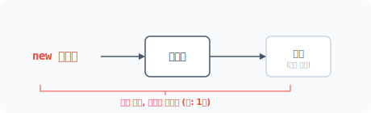
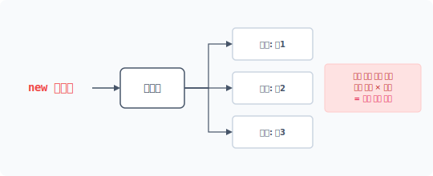
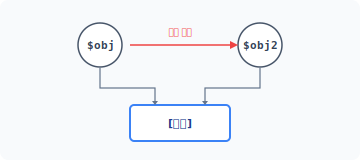
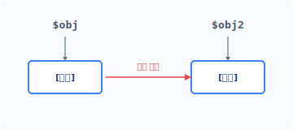
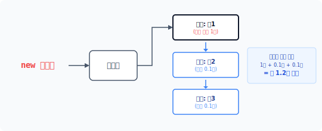


# CHAPTER 6 프로토타입 패턴

객체를 생성하는 유일한 방법은 new 키워드를 사용하는 것이며, 앞에서 살펴본 5개의 생성 패턴도 new 키워드를 이용하여 객체를 생성했습니다. 하지만 객체를 생성할 수 있는 방법이 하나 더 있는데, 바로 기존에 생성된 객체를 복제하여 생성하는 것입니다. 프로토타입 패턴은 new 키워드를 사용하지 않고 객체를 복제해 생성하는 패턴입니다.


## 6.1 생성

시스템은 새로운 객체를 생성할 때 자원을 할당합니다. 프로그래밍 언어에서 새로운 객체를 생성하고 자원을 할당하는 과정을 살펴봅시다.


### 6.1.1 객체 생성

객체를 생성하기 위해서는 먼저 클래스 선언이 필요하며 선언된 클래스를 기반으로 객체를 생성합니다. 객체는 선언한 클래스의 인스턴스화를 통해 생성되고 메모리에 적재됩니다. 다음 예제에서는 인사말을 출력하는 Hello 클래스를 선언합니다.

6장 프로토타입 패턴 149

예제 6-1 Prototype/01/hello.php

```php
<?php
class Hello
{
    private $message;

    public function __construct($msg)
    {
        $this->message = $msg;
    }

    public function setMessage($msg)
    {
        $this->message = $msg;
    }

    public function getMessage()
    {
        return $this->message;
    }
}
```

일반적으로 객체를 만드는 방법은 new 키워드가 유일하며, new 키워드는 인스턴스화 과정을 통해 객체를 생성합니다. 많은 개발 언어에서 객체를 생성하는 키워드로 new를 사용합니다. 다음 예제에서는 new 키워드를 이용하여 선언한 클래스의 객체를 생성합니다.

예제 6-2 Prototype/01/index.php

```php
<?php
include "hello.php";

$obj = new Hello("안녕하세요");
echo $obj->getMessage();
```

```
php index.php
안녕하세요
```

new 키워드 다음에 클래스 이름을 지정합니다. 지정한 클래스의 선언에 따라 객체를 생성하고 메모리에 할당하는 과정을 수행합니다. 이처럼 객체지향에서 객체를 생성한다는 것은 시스템의 자원을 소모한다는 의미입니다.

150 1부 생성 패턴

메모리에 할당하는 과정을 수행합니다. 이처럼 객체지향에서 객체를 생성한다는 것은 시스템의 자원을 소모한다는 의미입니다.

#### 그림 6-1 객체의 생성 자원 소모



생성되는 객체가 많거나 크기가 클수록 시스템이 처리할 부하가 늘어납니다. 빌더 패턴과 같이 복잡한 구조인 객체는 더 많은 자원을 사용합니다.


### 6.1.2 객체의 상태값

캡슐화는 객체지향 개발 방법의 기본 개념으로, 행동과 데이터를 한 곳에 묶어서 관리합니다. 따라서 객체의 경우 행동만 가진 함수와 달리 상태값을 가진 데이터가 존재합니다. 앞의 예제에서 사용한 객체 생성 과정을 다시 한 번 살펴봅시다. hello 클래스 이름 뒤에 '( )'가 붙어 있습니다.

```php
$obj = new Hello("안녕하세요");
```

new 키워드는 객체 생성 시 인자값을 전달합니다. 생성 시 전달된 인자값은 클래스의 생성자 메서드를 통해 전달받습니다. 다음은 클래스의 생성자 매직 메서드의 일부 예제입니다.

```php
private $message;

public function __construct($msg)
{
    $this->message = $msg;
}
```

생성자 메서드는 객체가 new 키워드로 생성될 때 자동 호출됩니다. 생성자 메서드는 생성 시 전달받은 매개변수를 보존하기 위해 내부의 프로퍼티에 저장합니다.

6장 프로토타입 패턴 151

전달받은 매개변수를 보존하기 위해 내부의 프로퍼티에 저장합니다. 객체로 전달된 값을 유지하려면 프로퍼티와 같은 데이터 저장 영역이 필요합니다. 프로퍼티는 대표적으로 객체의 상태값을 저장하는 방법입니다.

일반적인 클래스의 특징은 한 번의 선언으로 다수의 동일 객체를 생성할 수 있다는 것입니다. 다음과 같이 선언된 Hello 클래스를 이용해 2개를 생성할 수 있습니다. new 키워드는 객체를 생성할 때마다 메모리의 자원을 소모합니다. 프로그램에서 다수의 동일한 객체를 만드는 이유는 서로 다른 상태값을 가진 객체가 필요하기 때문입니다.

예제 6-3 Prototype/01/index2.php

```php
<?php
include "hello.php";

$ko = new Hello("안녕하세요");
$en = new Hello("hello world");

echo $ko->getMessage()."\n";
echo $en->getMessage()."\n";
```

```
php index2.php
안녕하세요
hello world
```

이 예제는 하나의 클래스로 동일한 2개의 객체를 생성합니다. $ko 객체와 $en 객체는 동일한 구조입니다. 두 객체의 차이점은 클래스 내부의 $message 프로퍼티값을 다르게 설정한 것입니다. 동일한 구조의 객체라도 사용 목적에 따라 서로 다른 프로퍼티값을 가질 수 있습니다.

#### 그림 6-2 서로 다른 값을 가진 객체 생성



152 1부 생성 패턴

> [!NOTE]
> 객체의 상태값은 생성자를 통해 객체 생성 시 또는 프로그램 실행 중에 상태값을 변경하여 설정할 수 있습니다.


### 6.1.3 자원 소모

우리는 앞에서 5가지의 생성 패턴에 대해 살펴봤습니다. 생성 패턴을 도입하는 이유는 직접 new 키워드를 사용하여 객체를 생성할 때 객체와 객체 사이의 강한 결합도를 제거하기 위해서입니다. 그리고 목적과 용도에 따라 객체의 강력한 결합을 해결하는 패턴을 구분합니다.

앞에서 학습한 모든 생성 패턴은 새로운 객체 생성을 중점적으로 해결합니다. 패턴에 따라 객체를 생성 처리하는 과정만 다를 뿐, new 키워드를 이용하여 새로운 객체를 생성하는 것은 동일합니다.


## 6.2 복사

지금까지 새로운 객체를 생성하기 위해 new 키워드를 사용했습니다. 기본적으로 객체를 생성하는 방법은 new 키워드가 유일합니다. 하지만 기존의 객체를 복사하는 것도 새로운 객체를 생성하는 방법 중 하나입니다. 이번에는 객체 복사에 대해 알아봅시다.


### 6.2.1 복사의 종류

생성된 객체는 변수에 할당하고 객체는 변수를 통해 접근하여 사용합니다. 변수에 담긴 객체는 또 다른 변수로 복제할 수 있습니다. 이때 변수의 복제는 기존 변수를 공유하는 얕은 복사와 새로운 자원을 할당받는 깊은 복사로 크게 구분됩니다.

> [!NOTE]
> PHP 언어는 객체 타입이 정해지지 않으므로 타입 형식에 구속받지 않고 다양한 종류의 값을 저장합니다. 최근 프로그래밍 언어는 변수 선언 시 자체 기능을 사용해 자원을 효율적으로 관리합니다. 예를 들어 PHP는 중복된 변수와 메모리 자원을 관리합니다.

6장 프로토타입 패턴 153

### 6.2.2 객체를 공유하는 얕은 복사

얕은 복사는 객체를 공유 방식으로 복사합니다. 공유 방식은 객체를 복사할 때 새로운 자원을 할당받지 않고 객체를 복사하는 것입니다. 예제 코드를 보면서 얕은 복사에 대해 알아봅시다.

예제 6-4 Prototype/02/copy.php

```php
<?php
include "hello.php";

// 객체를 생성합니다.
$obj = new Hello("안녕하세요");
echo "원본 내용=". $obj->getMessage() ."\n";

// 객체를 복사합니다.
$obj2 = $obj;
$obj2->setMessage("Hello world");

// 원본 객체와 복제 객체의 메시지를 출력합니다
echo "obj2 =". $obj2->getMessage() ."\n";

echo "obj =". $obj->getMessage() ."\n";
```

```
php copy.php
원본 내용=안녕하세요
obj2 =Hello world
obj =Hello world
```

복제 코드와 동작 결과를 같이 살펴봅시다. 먼저 변수 $obj는 new 키워드를 사용하여 생성한 새로운 객체입니다. 새롭게 생성된 객체는 또 다른 메모리 자원을 할당받습니다.

```php
//객체를 생성합니다.
$obj = new Hello("안녕하세요");
echo "원본 내용=". $obj->getMessage() ."\n";
```

```
원본 내용=안녕하세요
```

154 1부 생성 패턴

생성된 객체를 통해 결과 메시지를 출력합니다.

두 번째는 변수 $obj 객체를 복사하여 객체를 생성합니다. 대입 연산자(=)를 통해 변수를 복사하며, 복제된 객체에 새로운 메시지를 설정합니다.

```php
//객체를 복사합니다.
$obj2 = $obj;
$obj2->setMessage("Hello world");

// 원본 객체와 복제 객체의 메시지를 출력합니다
echo "obj2 =". $obj2->getMessage() ."\n";
```

```
obj2 =Hello world
```

복제된 객체를 통해 결과 메시지를 출력합니다. 당연히 새로 설정된 값으로 출력됩니다. 여기 까지는 문제가 없어 보입니다. 그 다음 줄에 앞에서 생성한 원본 객체 $obj를 재출력해봅시다.

```php
echo "obj =". $obj->getMessage() ."\n";
```

```
obj =Hello world
```

처음 생성 시 설정한 '안녕하세요' 값은 없어지고, 복제된 $obj2의 설정값인 'Hello world'가 출력됩니다.

#### 그림 6-3 하나의 객체를 가리키는 얕은 복사



6장 프로토타입 패턴 155

[그림 6-3]은 객체를 복제하는 방식의 차이를 나타낸 것입니다. 두 번째 객체를 복제할 때는 대입 연산자(=)를 사용하는데, 이 연산자는 메모리에 담긴 실제 변수를 복사하지 않습니다. 변수 $obj2는 원본의 변수 $obj 객체를 가리키는 포인터일 뿐입니다. 이런 형태의 복사를 얕은 복사라고 합니다.


### 6.2.3 깊은 복사

얕은 복사는 실제 변수를 복사하지 않습니다. 그렇다면 실제 객체는 어떻게 복사해야 할까요? 실제 변수 영역을 복사하기 위해서는 깊은 복사를 사용해야 합니다. 깊은 복사는 물리적으로 할당된 변수를 다른 물리적 변수로 복사하는 것입니다.

일반적인 연산자(=)로는 깊은 복사를 처리할 수 없으며 좀 더 복잡한 과정이 필요합니다. 이를 쉽게 하기 위해 별도의 명령이나 클래스 등이 제공됩니다. 예를 들어 자바와 같은 언어에서는 실제 객체의 변수를 복사하기 위해 특별한 Cloneable 인터페이스를 제공합니다. PHP도 실제 객체를 복사할 수 있는 clone 키워드를 제공합니다.

[예제 6-5]에서는 clone 키워드를 추가하여 복제합니다. 대입 연산자 대신 clone 키워드를 사용합니다.

예제 6-5 Prototype/02/clone.php

```php
<?php
include "hello.php";

// 객체를 생성합니다.
$obj = new Hello("안녕하세요");
echo "원본 내용=". $obj->getMessage() ."\n";

// 객체를 복제합니다.
$obj2 = clone $obj;
$obj2->setMessage("Hello world");

// 원본 객체와 복제 객체의 메시지를 출력합니다<div class=""></div>
echo "obj2 =". $obj2->getMessage() ."\n";

echo "obj =". $obj->getMessage() ."\n";
```

156 1부 생성 패턴

```
php clone.php
원본 내용=안녕하세요
obj2 =Hello world
obj =안녕하세요
```

실행 결과를 보면 예상대로 출력되었다는 것을 알 수 있습니다.

#### 그림 6-4 실체 객체 복제



생성된 $obj 객체는 clone 키워드를 이용하여 $obj2로 복제하고 Clone 키워드는 새로운 메모리 영역을 할당하여 실제 객체를 복제합니다. 이를 깊은 복사라고 합니다. 깊은 복사를 사용하면 메모리의 자원이 소모됩니다.

> [!NOTE]
> 객체 생성은 new 키워드를 사용하고, 객체 복제는 clone 키워드를 사용합니다.


## 6.3 프로토타입 패턴

프로토타입 패턴은 신규 객체를 생성하지 않고 유사한 기존 객체를 복제합니다. 기존 객체를 복제하면 신규 객체를 생성하는 것보다 자원이 절약됩니다.

6장 프로토타입 패턴 157

### 6.3.1 원형

프로토타입의 사전적 의미는 '원형'입니다. 객체를 복제하려면 먼저 생성된 객체가 있어야 합니다. 복제 대상인 객체가 존재하지 않으면 복제할 수 없으며, 복제 대상이 되는 원본 객체를 원형이라고 합니다. [^1]

[^1]: 프로토타입 패턴을 원형 패턴이라고도 부릅니다.


### 6.3.2 생성자 동작

클래스의 생성자는 객체 생성 시 자동으로 호출되는 메서드입니다. 그리고 객체는 '인스턴스화'라는 과정을 통해 생성됩니다. 인스턴스화는 객체 생성 시 클래스에 선언된 생성자를 자동 호출합니다.

PHP는 \_\_construct() 매직 메서드로 생성자를 선언합니다. \_\_construct() 메서드명은 PHP에서 사용하는 예약어입니다.

[예제 6-6]은 [예제 6-5]를 변경하여 생성자 로직에 출력 메시지를 추가한 것입니다.

예제 6-6 Prototype/03/hello.php

```php
<?php
class Hello
{
    private $message;

    // 생성자
    public function __construct($msg)
    {
        echo __CLASS__."를 생성합니다. = 생성자 로직 동작 \n";
        $this->message = $msg;
    }

    public function setMessage($msg)
    {
        $this->message = $msg;
    }

    public function getMessage()
    {
```

158 1부 생성 패턴

```php
    {
        return $this->message;
    }
}
```

```
php clone.php
Hello를 생성합니다. = 생성자 로직 동작
원본 내용=안녕하세요
obj2 =Hello world
obj =안녕하세요
```

생성자 메서드에 추가한 코드가 이와 같이 실행된다는 것을 확인할 수 있습니다. 코드의 동작 내용을 좀 더 살펴봅시다. new 키워드를 이용해서 객체를 생성하면 생성 시 \_\_construct() 생성자 메서드가 같이 호출됩니다.

```php
//객체를 생성합니다.
$obj = new Hello("안녕하세요");
echo "원본 내용=". $obj->getMessage() ."\n";
```

```
Hello를 생성합니다. = 생성자 로직 동작
원본 내용=안녕하세요
```

앞에서 생성한 객체 $obj를 clone 키워드로 복제합니다.

```php
//객체를 복사합니다.
$obj2 = clone $obj;
$obj2->setMessage("Hello world");

// 원본 객체와 복제 객체의 메시지를 출력합니다<div class=""></div>
echo "obj2 =". $obj2->getMessage() ."\n";
```

```
obj2 =Hello world
```

객체를 복제할 때는 생성자가 호출되지 않습니다. 이처럼 클래스의 객체를 직접 생성할 수도 있지만, 기존의 객체를 복제하여 생성할 수도 있습니다.

6장 프로토타입 패턴 159

### 6.3.3 복제 처리

new 키워드는 새로운 객체를 생성할 때 시스템의 자원을 소모합니다. 자원 소모란 CPU가 객체를 생성하기 위해 인스턴스화 과정의 역할을 수행한다는 것입니다. 객체를 생성하는 유일한 방법은 new를 사용하는 것입니다. 하지만 동일한 클래스 선언으로 여러 개의 유사한 객체가 필요할 때는 어떻게 해야 할까요? 매번 객체가 필요할 때마다 new 키워드로 새로운 객체를 만드는 것은 중복된 자원 소모가 발생하므로 좋은 방법이 아닙니다. 클래스 선언으로 생성된 객체는 변수에 저장됩니다. 변수에 저장된 객체는 다른 변수로 복제할 수 있습니다. 생성되는 객체가 동일한 클래스라면 매번 인스턴스화 과정을 통해 새로운 객체를 생성하지 않고 변수를 복제하여 객체를 생성할 수도 있습니다.

기존의 동일한 객체가 있다면 새롭게 생성하는 것보다 기존 객체를 복제하는 것이 좋은데, 그 이유는 이미 생성된 객체를 복제할 경우 인스턴스화 과정이 생략되기 때문입니다. 객체를 복제하면 생성 로직에 소모되는 처리 시간과 자원을 절약할 수 있습니다.


### 6.3.4 자원 절약

객체 생성에 프로토타입 패턴을 사용하면 자원 소모를 줄일 수 있습니다. 특히 프로토타입 패턴은 복잡한 과정으로 생성된 객체를 복제할 때 더 유용합니다. 복잡한 객체 생성은 일반 객체 생성보다 많은 시간과 자원을 소모하지만, 객체 복제는 적은 자원으로 동일한 객체를 추가 생성할 수 있습니다.

#### 그림 6-5 복제를 통한 자원 절약



160 1부 생성 패턴

객체는 상태값을 가집니다. 상태값은 객체 생성 시 초깃값을 통해 설정되며, 객체를 생성한 후 상태값을 설정할 수도 있습니다. 특히 빌더 패턴과 같은 복합 객체의 상태값을 설정하는 것은 쉽지 않습니다. 빌더 패턴은 객체가 실행되면서 상태값을 설정하는 경우도 있는데, 새로운 객체의 상태값을 설정하기 위해 메서드를 호출하거나 또 다른 객체를 실행해야 하기 때문입니다.

프로토타입 패턴을 적용하면 매번 객체를 만드는 과정과 초기화 작업을 반복하지 않아도 됩니다. 객체 생성 시 많은 자원을 소모하는 경우, 새로운 객체를 생성하는 것보다 기존 객체를 복제하는 것이 더 효율적입니다. 객체가 복제될 때는 생성자 로직이 동작하지 않습니다. 또한 복잡한 객체도 상태값을 설정하기 위해 별도의 객체를 실행하거나 메서드를 호출할 필요가 없습니다. 공통된 상태값은 유지한 채 필요한 값만 변경해서 사용하면 됩니다.


### 6.3.5 주의 사항

복제는 새로운 객체를 생성하지 않습니다. 기존 객체에서 상태값만 다른 또 다른 객체를 만드는 것입니다. 원형을 복제하면 객체 내의 상태값도 같이 복제되고, 객체가 복제된 후에는 객체에 접근하거나 메서드를 통해 새로운 값으로 변경합니다. 프로토타입 패턴은 객체의 상태값을 변경할 수 있도록 접근을 허용하거나 관련 메서드를 미리 만들어야 합니다.

다수의 원형을 만들어 복제에 사용할 때는 별도로 원형 관리자(prototype manager)를 도입하는 것도 좋은 방법입니다.


## 6.4 특징

프로토타입은 적은 리소스로 많은 객체를 생성하는 데 유용합니다.


### 6.4.1 생성 패턴

디자인 패턴은 객체의 생성을 패턴화합니다. 앞에서 배운 팩토리 패턴, 싱글턴 패턴, 빌더 패턴 모두 생성 패턴입니다. 생성 패턴은 객체 생성을 별도의 독립 클래스로 분리하여 처리합니다. 또한 생성 패턴은 과정을 분리하기 위해서 별도의 생성 코드를 필요로 합니다. 패턴을 통해

6장 프로토타입 패턴 161

객체를 생성하면 패턴이 추가된 코드를 같이 실행하므로 객체를 보다 편리하게 생성할 수 있습니다.

프로토타입 패턴은 객체를 직접 생성하지 않고 복제를 통해 생성자의 동작 처리를 배제합니다. 하지만 객체를 생성하는 과정에 생성자만 존재하는 것은 아닙니다. 생성자의 코드와 생성 패턴에서 추가한 코드 실행도 같이 배제할 수 있습니다. 프로토타입은 기존 객체를 복제함으로써 코드의 양과 새로운 객체를 생성하는 처리 로직 수행 과정을 줄입니다.


### 6.4.2 대량 생산

클래스 선언은 객체를 생성하기 위한 설계도이며, 하나의 클래스 선언으로 다수의 객체를 생성할 수 있습니다. 또한 많은 수의 객체를 한 번에 만들어야 하는 경우도 있습니다.

만일 new 키워드를 이용해 모든 객체를 생성한다면 필요한 객체 수만큼 인스턴스화 작업이 필요합니다. 객체를 효율적으로 생성하기 위해서는 중복된 인스턴스화 작업을 하지 않는 것이 좋습니다.

프로토타입 패턴을 응용하면 적은 자원 소모로 많은 객체를 생성할 수 있습니다.


### 6.4.3 유사 객체

프로토타입 패턴을 이용하면 런타임 시 새로운 객체를 복제하고 삭제할 수 있습니다. 사실 원형을 복제하는 것은 클래스 객체를 생성하는 것과 같습니다.

클래스는 복수의 객체 생성과 재사용을 위해 선언됩니다. 다양한 종류의 클래스를 가지고 있는 것보다는 기존에 생성한 클래스를 재사용할 수 있도록 유사하게 설계하는 것이 중요합니다. 유사한 구조의 클래스를 갖고 있으면 새로운 클래스 선언과 객체 생성 없이도 객체 생성을 유연하게 관리할 수 있습니다.

여러 개의 동작 객체가 필요할 경우 프로토타입 패턴으로 객체를 복제하고 상태값만 변경해서 사용하는 것이 더 유용합니다. 프로토타입 패턴을 사용하면 객체 생성을 위한 클래스의 수를 줄일 수 있습니다.

162 1부 생성 패턴

### 6.4.4 객체 생성이 어려운 경우

객체의 동작을 분리하거나 기존 객체를 수정할 때 객체 생성 과정을 모르는 경우도 있습니다. 또 클래스에서 직접 객체를 생성하기 어려울 때도 있습니다.

프로토타입 패턴을 활용하면 기존의 객체 생성 방법을 몰라도 새로운 객체를 생성할 수 있습니다. 객체를 복제해서 사용하면 실제 객체의 구체적인 형식을 몰라도 객체를 생성할 수 있습니다.


## 6.5 관련 패턴

프로토타입 패턴은 여러 패턴과 연관시켜 응용할 수 있습니다.


### 6.5.1 플라이웨이트 패턴

객체를 공유하거나 동일한 상태의 객체를 별도로 생성할 때 프로토타입 패턴을 같이 사용할 수 있습니다(12장).


### 6.5.2 메멘토 패턴

메멘토 패턴은 객체를 저장하는 역할을 수행합니다. 객체 저장 시 프로토타입 패턴을 같이 응용할 수 있습니다(21장).


### 6.5.3 복합체 패턴, 장식자 패턴

객체가 동적으로 생성될 때 프로토타입 패턴을 사용할 수 있습니다.


### 6.5.4 명령 패턴

명령을 복제할 때 프로토타입을 사용할 수 있습니다.

6장 프로토타입 패턴 163

## 6.6 정리

프로토타입 패턴은 최근 인터프리터 방식의 언어에서 자주 응용됩니다. 인터프리터 언어는 컴파일 언어와 달리 실행 단계에서 객체를 생성하고 메모리 자원에 할당합니다. 추상 팩토리 패턴은 프로토타입 패턴의 집합을 저장하는 상태에서, 필요한 경우 기존 객체를 복제해 객체를 반환할 수 있습니다. 프로토타입 패턴을 이용해 유사한 명령을 복제하고 명령 패턴에도 적용할 수 있습니다. 그리고 프로토타입 패턴을 적용해 기존의 객체를 복제하고 새로운 메모리 영역을 할당합니다.

164 1부 생성 패턴

