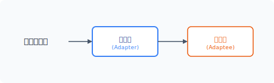
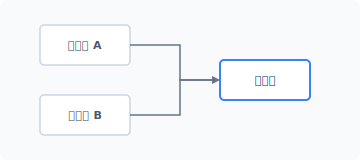
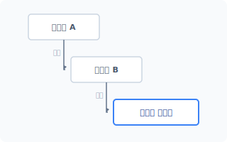
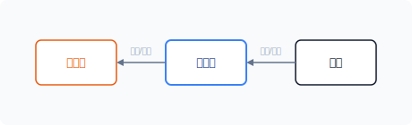


# CHAPTER 7 어댑터 패턴

어댑터 패턴은 코드를 재사용하기 위해 구조를 변경하는 패턴입니다. 구조 패턴 중 제일 간단합니다.


## 7.1 오래된 코드

영국의 물리학자인 아이작 뉴턴(Issac Newton)은 자신의 업적인 '만유인력'을 발표할 때 "거인의 어깨 위에 올라섰다"라는 말을 인용했습니다. 자신이 만유인력을 발견한 것은 선대의 수많은 수학자와 물리학자의 노력이 없었다면 불가능했을 것이라는 의미입니다.


### 7.1.1 거인의 어깨

뉴턴의 이야기와 마찬가지로 대부분의 현대 기술은 이전 세대의 노력으로 만들어집니다. 어느 날 갑자기 새롭게 창조되는 것은 없습니다.

최근 개발되는 대부분의 코드도 어느 순간 새로 생겨난 것이 아닙니다. 컴퓨터 소프트웨어 분야도 짧은 시간이기는 하지만 수많은 연구와 개발자의 기여가 있었습니다. 수많은 개발자가 이바지한 노력의 산물로 현재의 기능과 코드가 존재하는 것입니다.

170 2부 구조 패턴

우리는 알게 모르게 이전 코드를 사용합니다. 컴퓨터의 코드는 세대를 거치면서 서로 다른 언어로 이식되고 새로운 코드와 결합했습니다. 현재의 코드는 처음 컴퓨터가 탄생한 순간부터 누적된 코드라고 할 수 있습니다.

우리는 새로운 기능을 만들기 위해 오래된 코드를 참고하거나 기존의 코드를 재사용합니다. 즉 이전 코드를 재사용하면서 새로운 코드를 재창조하는 것입니다. 자신이 작성한 코드도 타인과 미래 세대에 기여하며 재창조의 근원이 될 것입니다.


### 7.1.2 코드의 변화

컴퓨터의 기능과 코드는 단계별로 발전합니다. 기능이 진화하면서 기존 코드를 재사용하는데, 코드를 재사용하면 기능 구현 시 많은 시간과 노력을 줄일 수 있습니다.

하지만 모든 코드를 재사용할 수는 없습니다. 컴퓨터 기술 발전과 환경 변화로 인해 오래된 코드를 현재의 프로젝트에 바로 사용하기에는 문제가 많습니다. 그 외에도 '코드 스타일 변화', '사회적 변화', '고객 요구 변경' 등 수많은 변화 요인이 있습니다. 이러한 변화는 기존의 코드를 재사용할 수 없도록 방해하는 요인이 됩니다.

개발자는 자신의 코드가 향후 재사용되도록 하기 위해 다양한 변화를 예측합니다. 그리고 그 예측에 맞춰 코드를 설계합니다. 하지만 모든 상황을 완벽히 예측하여 설계할 수는 없습니다. 미세한 동작 변화, 데이터 타입 불일치, 매개변수 인자값 불일치, 반환값 타입 등 다양한 차이가 발생합니다.

이처럼 이전 코드를 재사용하기 위해서는 변환(변형) 작업이 필요합니다.


### 7.1.3 재사용을 위한 코드 변환

현대의 소프트웨어는 수많은 코드를 어떻게 재사용하고 있을까요? 그 방법 중 하나가 변환입니다. 즉 이전 코드를 현재 상황에 맞게 동작할 수 있도록 변환하는 것입니다.

원본 코드가 존재할 경우 코드를 직접 수정하여 처리 방식을 변경하면 되므로 변환이 쉽습니다.

7장 어댑터 패턴 171

코드 변환을 위해서는 기존 코드에 새로운 코드를 추가합니다. 추가 코드는 변경된 작업을 처리하기 위해 이전 코드의 기능 일부를 사용합니다.


### 7.1.4 인터페이스

기존 코드를 재사용하기 위해서는 동작 변환 작업뿐 아니라 외부적인 인터페이스 형식도 일치시켜야 합니다. 인터페이스는 2개의 프로그램이 서로 연동하여 결합되는 데 중요한 요소입니다. 만일 인터페이스에 차이가 있다면 기존 코드를 사용할 수 없습니다.

코드 변환 과정에서 인터페이스가 일치하지 않는 문제는 언제 어디서든 발생할 수 있습니다. 최근 오픈 소스가 활발해지고 여러 개발자가 공동으로 프로젝트를 진행하다 보니 이러한 인터페이스 불일치 현상이 자주 발생합니다.

대부분의 코드 변환 작업은 내부의 기능적 요인보다 외부적인 인터페이스를 변환하는 작업이 많습니다. 어댑터 패턴은 기존의 코드를 재사용하기 위해 내적, 외적 구조를 변환하는 작업을 처리합니다.


## 7.2 잘못된 코드

세상 어디에도 완벽한 코드는 없습니다. 소프트웨어의 코드 또한 사람에 의해 만들어진 것이므로 어딘가에 실수가 있기 마련입니다.


### 7.2.1 오류 코드

개발 당시에는 발견하지 못했던 문제가 나중에 발견되기도 합니다. 또한 그 당시에는 정상적이었던 동작이 환경 변화로 인해 문제가 되는 경우도 많습니다.

이러한 문제점은 재사용된 코드를 포함하고 있는 소프트웨어도 고스란히 내포하고 있습니다. 오류가 발견되면 코드를 찾아서 수정해야 합니다.

오류는 언제나 존재합니다. 소프트웨어는 개발 과정도 중요하지만 안정적인 코드 동작과 유지

172 2부 구조 패턴

보수도 매우 중요합니다.


### 7.2.2 수정 불가

재사용된 기능 중 일부 코드는 수정할 수 없는 것도 있습니다. C언어, 자바와 같이 컴파일이 가능한 언어는 원본 소스 코드를 분실해서 컴파일된 목적 파일만 남은 경우도 있습니다. 특히 잘 알지 못하는 개발자의 이전 코드를 재사용하고자 할 때 자주 발생하며 코드 변경을 요청할 수도 없습니다.

이런 상황이 되면 기능을 유지 보수할 수 없고 이 문제를 직접 해결해야 합니다. 이때는 오류가 포함된 코드를 감싸서 보정 코드를 만들어 사용합니다. 즉 보정 코드를 통해 문제점을 우회합니다.

장식자 패턴도 이러한 보정 코드를 통해 기능을 우회하기도 합니다. 나중에 어댑터 패턴과 장식자 패턴의 차이점을 살펴보겠습니다.


### 7.2.3 보정 코드

보정 코드는 발생한 오류를 수정하고 기능을 변경합니다. 보정 코드를 만드는 방법은 매우 다양합니다. 보정 코드는 조건을 다르게 처리하여 코드를 호출합니다.

보정 동작이 여러 곳에 분포돼 있다면 많은 영역의 코드가 수정돼야 합니다. 소스에서 보정된 코드가 많으면 가독성이 떨어집니다. 이런 경우 별도의 객체를 생성하여 보정을 처리하는 것이 좋습니다. 이처럼 보정만을 위해 설계된 객체를 어댑터 패턴이라고 합니다.

어댑터 패턴은 수정 불가능한 문제를 분리된 객체로 쉽게 해결할 수 있도록 도와줍니다. 어댑터 패턴을 이용해 문제의 코드를 원하는 요구 사항에 맞춰 변경하도록 합니다. 어댑터를 설계할 때는 연관성이 없는 2개의 객체를 묶어 인터페이스를 통일화합니다. 그리고 통일화된 변경 인터페이스로 기존의 코드를 재사용합니다.

7장 어댑터 패턴 173

## 7.3 어댑터

어댑터 패턴은 코드를 재사용하기 위한 인터페이스를 처리하고 인터페이스를 활용해 보정 코드를 작성합니다.


### 7.3.1 코드의 래퍼 처리

어댑터 패턴은 다른 말로 래퍼 패턴(wrapper pattern)이라고 합니다. 래퍼는 '감싸다', '포장하다'는 의미이며 기존의 클래스를 새로운 클래스로 감싸는 기법입니다. 래퍼 처리로 기존의 기능은 유지하면서 변경된 추가 코드를 삽입합니다. 래퍼 처리된 객체를 어댑터라고 합니다.

#### 그림 7-1 어댑터 연결



- 어댑터: 변환을 처리하는 객체
- 어댑티: 변환을 받아 사용하는 객체


### 7.3.2 호환성

문제점을 가진 객체를 래퍼하면 새로운 객체가 됩니다. 기존 객체를 감싼 또 다른 객체인 것입니다. 새로 생성되는 객체는 클라이언트-어댑티 간 호환을 위해 인터페이스를 갖고 있습니다.

하지만 어댑터가 기존 객체^client 의 인터페이스와 호환되지 않을 수도 있는데, 이때는 새로운 환경에 맞게 인터페이스(어댑터)를 재설계해야 합니다.

어댑터 패턴은 구조 패턴 중에서도 매우 단순한 패턴입니다. 사전에서 'Adapter'를 찾아보면 '물건을 다른 것에 맞춰 붙이다, 맞춘다'라고 되어 있습니다. 즉, 어댑터는 어댑티가 클라이언트와 통신할 수 있도록 인터페이스의 구조를 변경합니다.

174 2부 구조 패턴

### 7.3.3 중개 행동 패턴

래퍼 처리된 새로운 객체(어댑터)는 기존의 코드와 새로운 환경(클라이언트) 간의 역할을 중개합니다. 어댑터가 원활한 중개를 하기 위해 인터페이스를 재설계합니다.

어댑터 패턴은 2개의 클래스를 중개한다고 해서 중개 패턴으로도 불립니다. 어댑터는 중개적인 특징을 이용해 코드의 재사용을 높입니다. 중개는 새로운 기능을 제공하는 것이 아니라 단순한 변환과 전달 역할만을 목적으로 합니다.


### 7.3.4 어댑터 종류

어댑터는 다른 객체의 구조를 내가 원하는 인터페이스 방식으로 개선합니다.

구조를 개선하는 방법은 클래스의 상속을 이용하는 방법과 구성을 이용하는 방법 2가지입니다.

- 클래스 어댑터: 상속
- 객체 어댑터: 구성


### 7.3.5 클라이언트

어댑터 패턴을 적용하면 클라이언트 입장에서는 변화된 것이 없는 것처럼 사용할 수 있습니다. 중간 역할의 어댑터가 내부적으로 처리 로직을 변경하여 동작을 수행하기 때문입니다. 클라이언트는 기존 방식과 동일하게 코드를 작성해서 사용하면 됩니다.

> [!NOTE]
> 예를 들어 날짜를 처리하는 코드에 발생할 수 있는 오류를 생각해 봅시다. 날짜를 처리하는 코드는 광범위하게 사용됩니다. Y2K 문제와 같이 날짜의 출력 포맷이 틀린 경우 모든 코드를 직접 수정하여 보정한다면 많은 코드 수정이 필요합니다. 이때는 어댑터 패턴을 사용해 날짜 객체를 보정합니다. 보정된 객체는 기존 코드에서 인터페이스를 유지한 상태로 사용됩니다. 하지만 어댑터는 내부적으로 새로운 처리 로직과 또 다른 인터페이스로 변경해 처리합니다.

7장 어댑터 패턴 175

## 7.4 클래스 어댑터

클래스 어댑터는 클래스의 상속 특성을 이용하며, 클래스 어댑터를 사용하기 위해서는 다중 상속이 필요합니다.


### 7.4.1 다중 상속

다중 상속이란 하나의 클래스가 2개 이상의 클래스에서 상속되는 것을 말합니다. 클래스 어댑터는 2개의 클래스를 상속받아 기존 클래스의 메서드를 다른 메서드로 대체하는 방법입니다.

#### 그림 7-2 다중 상속



최신 프로그래밍 언어는 다중 상속을 지원하지 않습니다. PHP나 자바 또한 단일 상속만 지원합니다. 다중 상속에서는 클래스의 메서드 충돌이 발생하며, 2개 이상의 클래스에서 동일한 메서드명을 사용할 경우 어느 것을 기준으로 해야 하는지 판단할 수 없습니다.

최신 언어에서 다중 상속을 이용한 클래스 어댑터를 표현하는 것은 어렵습니다.


### 7.4.2 장점

클래스 어댑터는 별도의 어댑티를 만들지 않으며, 하나의 클래스로 어댑터 객체를 처리할 수 있습니다.

클래스 어댑터를 사용할 경우 클라이언트는 코드를 수정하지 않습니다. 특별한 변화 작업 없이 기존의 코드를 그대로 사용할 수 있다는 장점이 있습니다.

176 2부 구조 패턴

### 7.4.3 단점

여러 개의 클래스가 필요한 경우 계층적으로 상속을 받습니다. 이처럼 계층적으로 클래스를 상속할 때는 클래스 사이에 강한 결합이 형성됩니다.

#### 그림 7-3 상속 계층



클래스 어댑터를 사용하면 1개의 클래스 만으로도 기능을 보정할 수 있는데, 계층적으로 상속받은 클래스가 상위 클래스의 메서드를 포함하기 때문입니다. 즉 별도로 다시 메서드를 구현하지 않아도 하위 클래스에서 사용할 수 있습니다. 또는 하위 클래스에서 상위 메서드를 다시 재정의할 수 있는데 이를 오버라이딩이라고 합니다.


## 7.5 객체 어댑터

객체 어댑터는 객체의 의존성을 이용해 문제를 해결합니다. 객체 어댑터는 기존 타깃인 객체의 인터페이스에 영향을 받으며, 타깃의 인터페이스가 복잡할수록 많은 작업이 필요합니다.


### 7.5.1 구성

객체 어댑터는 내부적으로 객체를 재구성합니다. 그리고 구성을 위해 기존 객체는 복합 객체로 변환됩니다.

#### 그림 7-4 객체 구성



7장 어댑터 패턴 177

객체 어댑터의 구성은 변환될 객체를 의존성 관계로 연결합니다. 의존성 연결은 어댑터 객체에서 직접 생성할 수 있으며 외부에서 인자로 받아 주입할 수도 있습니다. 구성으로 변경된 객체는 서브 클래스의 동작도 같이 처리합니다.


### 7.5.2 캡슐화

어댑터는 인터페이스를 변경합니다. 하지만 어댑터는 변경된 인터페이스로 캡슐화됐기 때문에, 클라이언트에서 변화를 눈치채지 못한 채 그대로 사용할 수 있습니다. 어댑터 패턴은 객체의 호환성을 개선하기 위한 기능들로 새롭게 합성합니다.

어댑터 패턴은 기능상으로 문제없이 동작하는 코드가 단지 인터페이스 차이 때문에 사용할 수 없는 경우 많이 응용되는 패턴입니다. 또 기존 코드에 오류가 있거나 보정 작업이 필요한 경우에도 매우 유용합니다.

> [!NOTE]
> 다중 어댑터(two way adapter)는 2개 이상의 인터페이스를 섞어서 사용하며 기존의 인터페이스와 새로운 인터페이스를 모두 사용합니다.


### 7.5.3 장점

어댑터는 구조 패턴 중 하나이며 기존의 클래스를 감싼 새로운 클래스를 생성합니다. 그리고 새로운 클래스로 인해 객체의 인터페이스를 재구성합니다.

객체를 구성으로 결합하면 느슨한 연결 방식으로 보다 많은 유연성을 확보할 수 있습니다. 그리고 구성은 프로그램이 실행되는 도중에도 객체를 변경할 수 있습니다.


### 7.5.4 단점

객체를 구성으로 결합하면 어댑터는 클라이언트에서 사용하는 인터페이스 방식으로 메서드를 새로 생성합니다. 어댑터가 새로운 메서드를 재구성할 때 추가 코드가 필요합니다. 어댑터 패턴 적용으로 프로그램의 코드가 증가합니다.

178 2부 구조 패턴

## 7.6 설계

예제를 통해 어댑터 패턴을 알아보겠습니다. 어댑터 패턴은 Adapter와 Adaptee 클래스의 결합을 생성합니다.


### 7.6.1 기존 코드

다음은 곱셈을 계산하는 메서드입니다. 이 메서드는 실수값을 매개변수 인자로 전달 받습니다. 그리고 계산한 값을 반환합니다(이 코드는 문제 없이 잘 돌아갑니다).

예제 7-1 Adapter/01/Math.php
```php
<?php
// 원본소스
class Math
{
    // 입력한 값이 2배 증가합니다.
    // 입력값과 반환값은 float형입니다.
    public function twoTime(float $num):float
    {
        echo "실수 2배 적용합니다.\n";
        return $num*2;
    }

    // 입력한 값이 절반으로 감소합니다.
    // 입력값과 반환값은 float형입니다.
    public function halfTime(float $num):float
    {
        echo "실수 1/2배 적용합니다.\n";
        return $num/2;
    }
}
```


### 7.6.2 시스템 변화와 인터페이스 변경

시스템에서는 수많은 변화가 발생합니다. [예제 7-1]에서 실수값^float 으로 전달하던 인자값을 정수로 변경한 경우를 생각해봅시다. 정수는 입력된 데이터 타입과 맞지 않으므로 Math 클래

7장 어댑터 패턴 179

스의 메서드를 더 이상 사용할 수 없습니다.

어댑터 패턴으로 문제를 해결해봅시다. 우선 중요한 것은 인터페이스입니다. 어댑터 패턴을 설계하기 위해 최종 객체가 가져야 할 인터페이스를 정의합니다. 클라이언트는 새로운 구현 방식이 아닌 인터페이스 변경으로 문제를 해결합니다.

인터페이스의 비호환성으로 인해 코드를 재사용할 수 없을 때는 어떻게 해야 할까요? 이 경우 인터페이스를 맞추기 위해 코드를 상속하는 클래스를 만들거나 새로운 인터페이스를 가진 클래스를 만들어 서로 변환 작업을 진행하면 됩니다. 그런데 원본 개발자가 우리가 원하는 형식으로 소스 코드의 인터페이스를 변경해줄 수 없다면 어떻게 해야 할까요? 이때는 우리가 어댑터 패턴을 적용하여 인터페이스를 직접 맞춰야 합니다.


### 7.6.3 어댑터 제작

인터페이스 문제를 해결하기 위해 어댑터 패턴을 적용합니다. 먼저 Adapter 인터페이스를 생성합니다.

예제 7-2 Adapter/01/Adapter.php
```php
<?php
// 어댑터 인터페이스
interface Adapter
{
    public function twiceOf(int $num):int;
    public function halfOf(int $num):int;
}
```

인터페이스에서 입력한 값을 보정합니다. 정수 타입으로 지정한 후 인터페이스에 맞는 구체 클래스를 만듭니다.

인터페이스 변경을 담당하는 클래스를 플러그블 어댑터^pluggable adapter 라고 합니다. [예제 7-3]은 어댑터 인터페이스를 적용하여 구현 코드를 작성합니다.

180 2부 구조 패턴

예제 7-3 Adapter/01/Object.php
```php
<?php
// 새롭게 구현된 코드
class Objects implements Adapter
{
    private $_adapter;

    function __construct()
    {
        // 기존 클래스의 객체를 생성합니다.
        $this->_adapter = new math;
    }

    public function twiceOf(int $num):int
    {
        echo "정수 2배 적용합니다.\n";
        // 캐스팅을 통해 실수로 변환하여 전달합니다.
        $_num = $this->_adapter->twoTime( (float)$num );
        // 캐스팅을 통해 정수로 변환하여 반환합니다.
        return (int)$_num;
    }

    public function halfOf(int $num):int
    {
        echo "정수 1/2배 적용합니다.\n";

        // 캐스팅을 통해 실수로 변환하여 전달합니다.
        $_num = $this->_adapter->halfTime( (float)$num );

        // 캐스팅을 통해 정수로 변환하여 반환합니다.
        return (int)$_num;
    }
}
```

작성한 어댑터는 기존의 Math 클래스를 상속받지 않습니다. 그 대신 객체의 생성자에서 기존 Math 클래스의 객체를 생성합니다. 어댑터는 생성자에서 새로운 객체를 생성, 포함하므로 복합 객체입니다.

어댑터를 설계할 때는 새로운 인터페이스도 같이 적용합니다. 입력된 정숫값을 실숫값으로 캐스팅하고 기존 Math 클래스의 메서드를 호출합니다. 결곗값도 캐스팅하여 정숫값으로 변경한 후 반환합니다.

7장 어댑터 패턴 181

### 7.6.4 실행

구성한 어댑터 패턴을 실행하고 클라이언트 코드를 작성합니다.

예제 7-4 Adapter/01/index.php
```php
<?php
include "Math.php";
include "Adapter.php";
include "Object.php";

$obj = new Objects;

// 어댑터를 이용하여 두 배 계산합니다.
echo $obj->twiceOf(5);
echo "\n";

// 어댑터를 이용하여 절반을 계산합니다.
echo $obj->halfOf(4);
```

```
$ php index.php
정수 2배 적용합니다.
실수 2배 적용합니다.
10
정수 1/2배 적용합니다.
실수 1/2배 적용합니다.
2
```

이처림 어댑터 패턴을 이용하면 클래스와 메서드를 수정하지 않고 자신이 원하는 형태로 변경할 수 있습니다.

> [!NOTE]
> 어댑터 패턴은 한국에서 사용되는 220V 가전제품을 일본에서 110V에 연결하기 위해 변환 어댑터(돼지코)와 같은 컨버터를 사용하는 것으로 비유할 수 있습니다.

182 2부 구조 패턴

### 7.6.5 결과

어댑터 패턴을 사용하기 전에 어댑터^Adapter 와 어댑티^Adaptee 간의 유사성을 살펴보는 것이 중요합니다. 변경 작업을 많이 할 경우 어댑터 패턴의 의미를 잃어버릴 수도 있습니다.

어댑터 패턴은 한 개의 Adapter 클래스를 이용해 여러 개의 Adaptee 클래스를 연결함으로써 문제를 해결합니다. 어댑터 패턴은 새로운 인터페이스를 재정의하여 기존 행동을 변경합니다.

프로젝트에서 어댑터 패턴을 적용한다고 해서 코드의 성능이 개선되는 것은 아닙니다. 오히려 어댑터를 통해야 하므로 속도가 저하됩니다. 어댑터 패턴은 복잡한 객체 구조를 깔끔하게 정리하는 데 유용합니다.


## 7.7 관련 패턴

어댑터 패턴은 인터페이스를 처리한다는 점에서 파사드 패턴이나 프록시 패턴과 구조적으로 유사한 점이 많습니다. 보정 및 버그를 개선하기 위해 추가되는 기능은 장식자 패턴과도 유사합니다.


### 7.7.1 파사드 패턴

어댑터는 하나의 인터페이스를 다른 인터페이스로 변환합니다. 보통 어댑터 패턴은 구현 시 하나의 인터페이스를 사용합니다. 하지만 상황에 따라 여러 개의 인터페이스가 필요할 때도 있습니다. 여러 개의 인터페이스를 사용할 경우 파사드 패턴과 유사한 특성을 가집니다.


### 7.7.2 브리지 패턴

어댑터 패턴은 단순한 인터페이스 변경으로 서로 다른 클래스 연결 문제를 해결하는데 브리지 패턴이 이와 유사합니다. 브리지는 기능 계층과 구현 계층을 연결하는 패턴입니다.

브리지 패턴은 추상 개념을 이용하여 코드를 분리하는 반면, 어댑터 패턴은 기존의 인터페이스를 변경하는 것을 목적으로 합니다. 연결하는 관점에서 유사한 패턴이 될 수 있습니다.

7장 어댑터 패턴 183

### 7.7.3 장식자 패턴

장식자 패턴은 인터페이스를 변경하지 않고 기능을 추가하는 패턴입니다. 기존의 어댑터는 새로운 기능을 추가하기보다 변경된 인터페이스로 맞춰 전달하는 역할을 담당했습니다. 하지만 장식자 패턴은 기존의 기능에 새로운 기능이 추가된 객체를 전달합니다. 장식자 패턴은 객체의 동적 확장 개념을 사용합니다.


## 7.8 정리

어댑터 패턴은 간단히 구현할 수 있으며 기존의 코드를 변환하여 재정의합니다.

객체를 랩으로 감싸서 만들어 사용하는 것이 마치 래퍼와 유사합니다. 그래서 어댑터 패턴은 래퍼라는 이름으로도 불립니다. 기존 코드를 감싸서 새로운 인터페이스로 재정의하는 것입니다.

코드를 재정의할 때는 추가하거나 변경해야 하는 부분이 발생합니다. 원본의 코드에서 처리하는 것보다 어댑터 패턴에서 재정의한 코드에 추가하는 것이 좋습니다. 그렇게 하면 원본의 코드를 수정하지 않고 프로젝트에 적용할 수 있습니다.

어댑터 패턴은 오래된 레거시 코드나 라이브러리를 재사용할 때 유용한 패턴입니다. 또한 어댑터 패턴은 서로 호환되지 않는 인터페이스를 가진 코드를 결합하여 응용 프로그램에서 동작할 수 있도록 도와줍니다.

184 2부 구조 패턴

