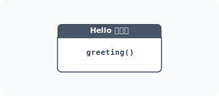
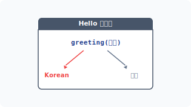
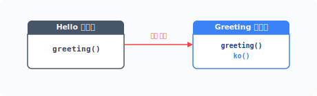
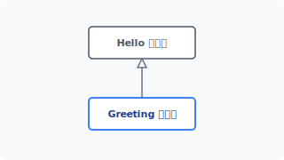
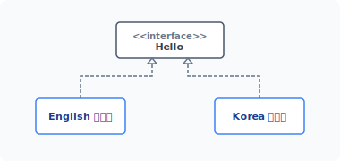
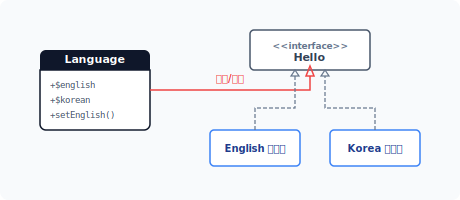
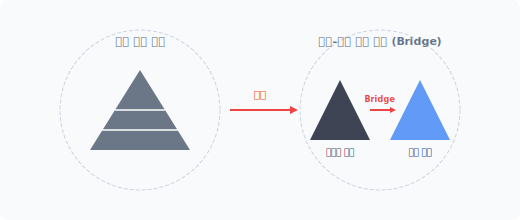


# CHAPTER 8 브리지 패턴

브리지 패턴은 객체의 확장성을 향상하기 위한 패턴으로, 객체에서 동작을 처리하는 구현부^body 와 확장을 위한 추상부를 분리합니다. 다른 용어로는 핸들 패턴^handle pattern 또는 구현부 패턴이라고도 합니다.


## 8.1 복잡한 코드

프로그램을 개발하려면 업무의 도메인 지식이 필요하며 정리된 도메인 지식으로 프로그램의 기능을 설계합니다.


### 8.1.1 유지 보수

세상에 완벽한 프로그램은 없습니다. 완성된 프로그램도 실제 현장에서 사용하다 보면 다양한 문제가 발생합니다. 또 초기 도메인 지식에서 발견하지 못한 기능을 추가하거나 새로운 업무를 추가하는 작업도 필요하며 고객의 성향과 행동은 예측하기 어렵습니다.

추가 요청에 의해 기존에 완성된 코드를 변경 작업하는 것을 유지 보수라고 합니다. 생성한 코드를 지속해서 유지하는 것은 쉽지 않습니다.

8장 브리지 패턴 185

다음은 간단한 인사말을 출력하는 코드입니다.

예제 8-1 Bridge/hello/01/hello.php
```php
<?php
// 최초 설계 인사말
class Hello
{
    public function greeting()
    {
        return "Hello";
    }
}
```

다음은 선언한 Hello 클래스를 통해 인사말 객체를 생성/호출합니다.

예제 8-2 Bridge/hello/01/index.php
```php
<?php
require "hello.php";

// 인사말 출력
$obj = new Hello;
echo $obj->greeting();
```

이 예제 동작을 그림으로 표현하면 다음과 같습니다.

#### 그림 8-1 인사말



다음은 콘솔에서 실행한 결과입니다.

186 2부 구조 패턴

$ php index.php
Hello

이 코드는 영어로 간단한 인사말을 출력합니다. 하지만 미국과 같은 다민족 국가의 경우 영어만 사용하는 것이 아닙니다. 다른 언어로도 인사말을 제공할 필요가 생겼다고 가정해봅시다. 즉 새로운 고객의 요청이 발생했습니다.


### 8.1.2 코드의 변질

새로운 변경 사항이 발생하면 기존 코드를 수정해야 합니다. 원본 코드는 처음부터 다국어를 처리하기 위해 설계된 모형이 아닙니다.

고객의 요구 사항인 한국어 인사말을 추가한다고 가정해봅시다.

예제 8-3 Bridge/hello/02/hello.php
```php
<?php
// 최초 설계 인사말
class Hello
{
    public function greeting($lang)
    {
        if ($lang == "Korean") {
            return "안녕하세요";
        } else {
            return "Hello";
        }
    }
}
```

예상치 않았던 작업을 원본 코드에 추가하여 기존에 없던 매개변수 인자값이 추가됐습니다. 외부로부터 전달받은 매개변수값으로 처리 로직을 분기합니다.

원본 객체는 매개변수 추가로 인해 인터페이스와 동작 코드가 변경됐습니다. 설계 변경으로 인터페이스가 변경되면, 이를 호출 실행하는 다른 코드도 같이 변경돼야 합니다. 다음은 변경된 호출 코드입니다.

8장 브리지 패턴 187

예제 8-4 Bridge/hello/02/index.php
```php
<?php
require "hello.php";

// 인사말 출력
$obj = new Hello;
echo $obj->greeting("Korean");
```

이처럼 하나의 코드를 수정하면 영향을 미치는 다른 코드도 수정해야 합니다. 조건으로 분기된 객체를 그림으로 설명하면 다음과 같습니다.

#### 그림 8-2 조건 분기



콘솔에서 실행한 결과는 다음과 같습니다.

```
$ php index.php
안녕하세요
```

새로운 코드를 추가하는 것은 기존의 설계 모델을 변형하는 것입니다. 처음에 깔끔했던 코드가 잦은 요구 사항으로 인해 지저분하게 변질됩니다. 코드는 점점 가독성이 떨어지고 유지 보수를 위한 코드 분석 시간이 늘어납니다.


## 8.2 상속

객체지향은 요구되는 행위를 객체화하여 처리합니다. 다양한 행위를 위해 클래스는 다른 클래스를 포함하고 상속을 통해 기능을 확장합니다.

188 2부 구조 패턴

### 8.2.1 상속 확장

객체지향에서 상속은 부모와 자식 형태의 관계로 설명합니다. 이렇게 유전적인 형태로는 정확한 상속의 의미를 알기 어렵습니다.

유전적인 형태로 상속을 설명하면 상위 클래스의 속성(기능)을 포함하는 서브 객체로 이해할 수 있습니다. 하지만 상속은 기존의 모든 기능을 갖고 있으며 새로운 기능을 추가하는 확장 개념으로 생각하는 것이 더 좋습니다.

다국어 인사말의 요청 사항을 상속 확장 형태로 다시 만들어봅시다.

예제 8-5 Bridge/hello/03/hello.php
```php
<?php
// 최초 설계 인사말
class Hello
{
    public function greeting()
    {
        return "hello";
    }
}
```

Hello 클래스는 수정하지 않습니다. Hello 클래스를 상속하는 새로운 Greeting 클래스를 생성합니다.

예제 8-6 Bridge/hello/03/Greeting.php
```php
<?php
// 최초 인사말을 상속 받습니다.
// 새로운 인사말 기능을 추가합니다.
class Greeting extends Hello
{
    public function ko()
    {
        return "안녕하세요";
    }
}
```

8장 브리지 패턴 189

Hello 클래스를 상속하면서 추가 메서드를 하나 더 만듭니다. Greeting 클래스는 Hello 클래스의 메서드와 추가로 작성한 메서드를 모두 갖고 있습니다. 상속은 기존 클래스의 행위를 확장합니다.

#### 그림 8-3 상속을 통한 확장



상속 클래스를 이용해 인사말을 출력합니다.

예제 8-7 Bridge/hello/03/index.php
```php
<?php
// 계층 클래스 로딩
require "hello.php";
require "Greeting.php";

$obj = new Greeting;

echo $obj->ko()."\n";
echo $obj->greeting()."\n";
```

```
$ php index.php
안녕하세요
Hello
```

하위 클래스가 상위 클래스를 상속받으면 하위 클래스는 상위 클래스의 모든 메서드와 프로퍼티를 사용할 수 있습니다.

원본 클래스를 수정하지 않고도 새로운 추가 기능을 상속으로 구현할 수 있습니다. 이처럼 상속을 이용하면 적은 코드로 다양한 요구 사항을 유지 보수할 수 있습니다.

190 2부 구조 패턴

### 8.2.2 계층

우리는 변경된 기능을 구현하기 위해 클래스를 상속했습니다. 상속은 클래스를 통한 객체의 확장입니다. 클래스가 또 다른 클래스를 상속받는다는 의미는 클래스 간 계층을 만든다는 것입니다.

#### 그림 8-4 상속 계층



상속 받은 클래스에 추가 메서드를 하나 추가 선언합니다. 상속된 클래스 계층은 기존 클래스의 모든 기능을 포함하여 새로운 객체를 생성합니다. 상속은 계층적 특성과 함께 기존 클래스의 책임을 포함하는 상하 관계를 갖게 됩니다.

상속을 옆에서 보면 위아래 계층으로 볼 수 있는데, 위에서 보면 클래스가 깊은 구조로 확장되는 것처럼 보입니다.


### 8.2.3 상속의 문제점

상속은 객체지향에서 중요한 개념이며 코드를 재사용하고 확장하기에 매우 유용합니다. 하지만 상속에는 한 가지 문제점이 있습니다.

클래스를 상속하면 구현과 추상 개념이 영구적으로 결합됩니다. 이 경우 향후 상속된 클래스를 수정하거나 확장하기 어렵습니다. 물론 상위 클래스의 메서드를 오버라이드하여 재정의할 수는 있지만, 오버라이드돼도 상위 객체의 메서드를 모두 포함합니다.

즉, 기능을 상속으로 확장하면 최종 클래스가 무거워집니다.

8장 브리지 패턴 191

## 8.3 패턴 설계 1

상속은 클래스의 계층을 분리하고 기능을 확장하지만 강력한 결합 관계와 불필요한 메서드도 상속에 같이 포함된다는 단점을 갖고 있습니다.

이러한 상속의 문제점은 브리지 패턴을 응용하여 해결합니다. 브리지 패턴을 적용하려면 4개의 구성 요소가 필요합니다.

* Implementor
* ConcreateImplementor
* Abstract
* refinedAbstract

앞에서 살펴본 예에서 Implementor에 해당하는 Hello 클래스와 ConcreateImplemetor 부분에 해당하는 Greeting 클래스를 만들었습니다. 패턴 설계 2(8.4절)에서는 Abstract와 refinedAbstract를 만들어보겠습니다.


### 8.3.1 종속

상속을 이용해 확장할 경우 상위 클래스와 하위 클래스 사이에 강력한 결합 관계가 발생합니다. 강력한 결합 구조는 종속화되며, 강력한 결합 구조로 인해 종속된 코드는 다른 시스템으로 이식하기 어렵습니다.

작성한 코드를 다양하게 사용하기 위해서는 독립적인 확장이 가능하도록 설계해야 합니다. 먼저 강력한 결합 관계를 줄이고 느슨한 결합 관계로 변경합니다.

느슨한 결합 관계로 변경하는 방법 중 대표적인 것이 위임^delegate 입니다. 위임을 통해 객체의 구성을 복합 객체 구조로 리팩터링합니다.


### 8.3.2 계층 분리

유지 보수가 많아진 코드는 객체 내에 구현과 추상이 복잡하게 섞여 있습니다. 따라서 여러 군데에 흩어진 기능과 구현을 정리해야 합니다.

192 2부 구조 패턴

클래스의 계층을 설계할 때는 새로운 기능을 생성하기 위한 것인지, 역할 분담을 위한 것인지 판단해야 합니다. 잘 설계된 계층은 클래스의 동작을 쉽게 이해하고 동작 수행을 예측하는 데 수월합니다.

다음에는 상속으로 나뉜 인사말 기능을 분리합니다. 기존 Hello 클래스를 인터페이스로 변경합니다.

예제 8-8 Bridge/hello/04/hello.php
```php
<?php
// 공통 인터페이스
interface Hello
{
    public function greeting();
}
```

인터페이스를 이용하여 계층화된 클래스를 분리합니다. 분리된 객체가 동일한 호출 명령을 할 수 있도록 인터페이스를 각각의 클래스에 적용합니다.

#### 그림 8-5 인터페이스 적용



다음은 브리지 패턴의 설계 요소 중 구현(Implementor) 부분입니다. 인터페이스를 적용해 하위 클래스(ConcreateImplementor)를 설계합니다.

예제 8-9 Bridge/hello/04/English.php
```php
<?php
// 영어 인사말
class English implements Hello
{

{
    public function greeting()
    {
        return "hello.";
    }
}
```

영어 인사말 클래스를 설계하고 인터페이스를 이용해 한글 인사말 클래스를 설계합니다.

예제 8-10 Bridge/hello/04/Korean.php
```php
<?php
// 한글 인사말
class Korean implements Hello
{
    public function greeting()
    {
        return "안녕하세요.";
    }
}
```

재설계한 인사말을 출력하고 각각의 객체를 생성합니다.

예제 8-11 Bridge/hello/04/index.php
```php
<?php
require "hello.php";
require "Korean.php";
require "English.php";

$obj1 = new Korean;
echo $obj1->greeting()."\n";

$obj2 = new English;
echo $obj2->greeting()."\n";
```

```
$ php index.php
안녕하세요.
hello.
```

194 2부 구조 패턴

인터페이스를 적용하여 구현 부분을 각각의 클래스로 분리했습니다.


### 8.3.3 복합 구조

앞에서 실습한 구조를 좀 더 개선해보겠습니다. 복합 객체를 통해 분리된 2개의 구현 클래스를 연결합니다. 연결은 위임을 사용합니다.

예제 8-12 Bridge/hello/04/Language.php
```php
class Language
{
    public $english;
    public $korean;
    public function setEnglish($obj)
    {
        $this->english = $obj;
    }
    public function setKorean($obj)
    {
        $this->korean = $obj;
    }
}
```

#### 그림 8-6 패턴1 구성 변경



복합 객체인 Language는 구현 클래스의 객체를 프로퍼티^변수 에 담고 있으며 프로퍼티를 설정할 수 있는 setter 메서드도 갖고 있습니다.

다음에는 구성을 통해 동일한 인사말을 출력합니다.

8장 브리지 패턴 195

예제 8-13 Bridge/hello/04/index2.php
```php
<?php
require "hello.php";
require "Korean.php";
require "English.php";

require "Language.php";

$obj = new Language;

$obj->setEnglish(new English);
echo $obj->english->greeting()."\n";

$obj->setKorean(new Korean);
echo $obj->korean->greeting()."\n";
```

```
$ php index2.php
hello.
안녕하세요.
```


## 8.4 패턴 설계 2

패턴 설계 1(8.3절)에서는 결합된 클래스를 상속으로 분리하며 분리된 2개의 클래스를 구성 방식으로 결합하는 단계를 학습했습니다. 이번에는 패턴 설계 1을 기반으로 실제적인 브리지 패턴을 설계합니다.


### 8.4.1 추상 계층

패턴 설계 1(8.3절)에서 구현부는 하나의 계층으로 설계했습니다. 하나의 계층만으로 설계된 복합 객체는 브리지 패턴이라고 하지 않습니다.

브리지 패턴은 복합 객체를 다시 재정의하여 추상 계층화된 구조입니다. 구성 클래스의 연결 부분을 추상 계층으로 변경합니다. 추상화 변경을 실행하는 이유는 각각의 계층이 독립적으로

196 2부 구조 패턴

확장/변경 가능하도록 하기 위해서입니다.

#### 그림 8-7 추상 계층



브리지 패턴은 기능을 처리하는 클래스와 구현을 담당하는 추상 클래스로 구별합니다. 구현뿐 아니라 추상화도 독립적 변경이 필요할 때 브리지 패턴을 사용합니다.


### 8.4.2 계층 연결

브리지(bridge)는 구현 계층과 추상 계층 두 곳을 연결하는 다리라는 의미입니다. 브리지 패턴을 적용하기 위해서는 계층을 잘 분리하는 것이 중요합니다. 그리고 분리된 추상적 개념과 구현 계층을 연결합니다.

클래스를 확장하는 방법은 상속에 의한 방식과 구현에 의한 방식이 있습니다. 브리지는 상속 대신 구현을 이용해 분리된 객체를 연결합니다. 연결은 구성을 위한 위임입니다. 구현을 통해 객체를 연결하면 객체 간 종속 관계를 제거할 수 있습니다.

이처럼 브리지 패턴에서 기능과 구현을 분리하는 목적은 확장을 보다 쉽게 하기 위해서입니다. 분리된 계층은 독립적으로 확장 가능합니다.


### 8.4.3 추상 재설계

브리지 패턴은 추상된 부분도 변경 확장이 가능합니다. 예제 코드를 통해 브리지 패턴의 동작을 이해해봅시다. 구현 부분의 코드는 동일합니다.

예제 8-14 Bridge/hello/05/hello.php
```php
<?php
interface Hello
```

8장 브리지 패턴 197

```php
{
    public function greeting();
}
```

예제 8-15 Bridge/hello/05/English.php
```php
<?php
class English implements Hello
{
    public function greeting()
    {
        return "hello.";
    }
}
```

예제 8-16 Bridge/hello/05/Korean.php
```php
<?php
class Korean implements Hello
{
    public function greeting()
    {
        return "안녕하세요.";
    }
}
```

추상 계층을 재설계합니다. Language 클래스를 추상화하는데, 추상 클래스는 구성을 연결할 수 있는 프로퍼티와 인터페이스의 추상 메서드만 선언되어 있습니다.

다음은 브리지 패턴의 설계 요소 중 abstract 부분입니다.

예제 8-17 Bridge/hello/05/Language.php
```php
<?php
abstract class Language
{
    public $language;

    abstract public function greeting(); // 추상 메서드
}
```

198 2부 구조 패턴

변경된 추상 클래스를 상속합니다. 추상 클래스는 인터페이스만 선언하고, 실제 메서드는 하위 구현 클래스에서 만듭니다. 하위 클래스는 브리지 패턴의 설계 요소 중 refinedAbstract 부분입니다.

예제 8-18 Bridge/hello/05/Message.php
```php
<?php
class Message extends Language
{
    public function __construct($lang)
    {
        $this->language = $lang;
    }

    public function greeting()
    {
        // 브리지 구현
        return $this->language->greeting(); // 분리된 역할 분담
    }
}
```

추상 클래스는 상위 클래스와 하위 클래스 사이에서 역할을 분담합니다. 이렇게 추상화를 통해 역할을 분담할 때도 계층이 구별됩니다.

역할을 분담하는 추상 클래스의 계층은 새로운 기능을 생성하는 것이 아니라 기존의 기능을 분리하여 계층화합니다.

다음 예제에서는 분리된 계층을 연결하여 인사말을 출력합니다. 실제 인사말의 객체는 의존성 주입하며 주입된 객체는 생성자를 통해 설정됩니다.

예제 8-19 Bridge/hello/05/index.php
```php
<?php
// 계층
require "hello.php";
require "Korean.php";
require "English.php";

// 계층
require "Language.php";
```

8장 브리지 패턴 199

```php
require "Message.php";

if(isset($language) && $language == "Korean") {
    $obj = new Message( new Korean );
} else {
    $obj = new Message( new English );
}

echo $obj->greeting();
```

```
$ php index.php
hello.
```

선택한 언어에 따라서 인사말이 변경됩니다.


### 8.4.4 브리지 의미

상속은 새로운 기능이 추가될 때마다 메서드를 추가하고 호출하는 인터페이스도 계속 변경됩니다. 코드의 규모가 커질수록 특정 기능의 인터페이스 변경으로 인해 많은 관련 코드가 수정돼야 합니다. 디자인 패턴의 고전인 'GoF(Gang of Four)'는 브리지 패턴을 다음과 같이 정의합니다.

'2개의 객체는 추상화를 구현에서 분리하여 매우 독립적으로 사용할 수 있어야 한다.'

이 정의와 같이 브리지 패턴은 동작하고자 하는 기능을 구현부와 추상화 형태로 분리하며, 새로운 기능을 확장으로 처리하지 않고 위임(delegate)으로 처리합니다. 그리고 이렇게 분리된 기능과 구현을 브리지화 형태로 결합해 동작하는 패턴이라고 설명합니다. 브리지 패턴은 추상 레벨 간의 연결을 처리합니다.


## 8.5 장점과 단점

브리지 패턴은 기존 시스템에 부수적인 새로운 기능들을 지속적으로 추가할 때 사용하면 유용

200 2부 구조 패턴

한 패턴입니다. 브리지 패턴은 새로운 인터페이스를 정의하여 기존 프로그램의 변경 없이 기능을 확장할 수 있습니다.


### 8.5.1 장점

클래스 계층을 분리할 때는 완전한 인터페이스로 결합하지 않습니다. 이런 점을 이용해 클래스에서 구현과 추상 부분을 2개의 계층으로 분리할 수 있으며, 분리된 2개의 추상 계층과 구현 계층은 독립적인 확장이 가능합니다.

브리지 패턴을 사용하는 클라이언트 코드에서는 추상 계층과 연결된 구현 클래스를 변경해도 영향 없이 사용할 수 있습니다. 브리지 패턴은 다중 플랫폼을 지원하는 코드를 개발할 때 매우 유용합니다.


### 8.5.2 단점

브리지 패턴은 하나의 클래스가 추상 계층과 구현 계층으로 분리됩니다. 추상화를 통해 코드를 분리할 경우 코드 디자인 설계가 복잡해진다는 단점이 있습니다.


## 8.6 관련 패턴

브리지 패턴은 다음 패턴과도 연관시켜 응용할 수 있습니다.


### 8.6.1 템플릿 메서드 패턴

템플릿 메서드 패턴은 추상화를 통해 구현 계층을 분리하여 사용합니다. 상위 추상 클래스에서는 선언 작업을 하며, 상속받은 하위 클래스에서는 실제 구현 작업을 합니다. 분리된 추상 계층은 템플릿 메서드 패턴과 유사합니다.

8장 브리지 패턴 201

### 8.6.2 추상 팩토리 패턴

브리지 패턴을 생성하고 복합화될 때 추상 팩토리 패턴이 같이 적용됩니다.


### 8.6.3 어댑터 패턴

어댑터 패턴과 브리지 패턴이 유사해 보이기도 합니다. 어댑터 패턴이 완성된 코드를 통합하고 결합할 때 사용되는 패턴이라면, 브리지 패턴은 처음 설계 단계에서 추상화 및 구현을 위해 확장을 고려한 패턴이라고 할 수 있습니다.


## 8.7 정리

브리지 패턴은 적용 사례가 많지 않기 때문에 대부분의 책에서 각각 다른 방식으로 설명하고 있어 혼동되는 부분이 많습니다.

하지만 브리지 패턴의 원리를 곰곰이 생각해보면 더 다양한 곳에 적용할 수 있습니다. 예제에서는 간단하게 다국어 인사말을 응용하여 처리하는 코드를 살펴보았습니다. 이와 유사하게 다양한 구현 계층과 연결 처리 계층을 분리하여 응용할 수 있는 사례를 찾아 적용해볼 수도 있습니다.

브리지 패턴은 구현부와 추상부를 계층화하여 독립적으로 확장할 수 있도록 하는 패턴입니다. 자신의 코드가 유지 보수로 인해 많이 변경된다면 미리 예측해서 계층을 분리하는 것도 좋은 방안입니다.

브리지 패턴을 사용하면 런타임 실행 시점에 어떠한 방식으로 기능을 구현할지 선택할 수 있습니다. 또한 기능을 독립적으로 확장할 수 있다면 상세한 기능을 외부로부터 숨길 수 있는 은닉 효과도 얻을 수 있습니다.

202 2부 구조 패턴

