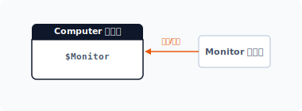
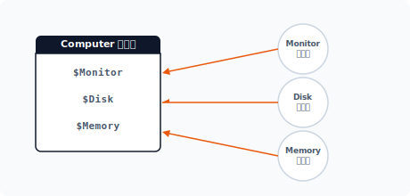
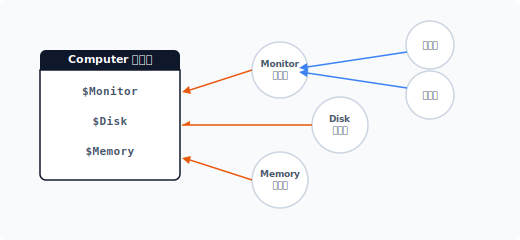
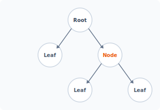


com·pos·ite
[ kəm'pɑ:zət ] 🔉

CHAPTER 9
복합체 패턴

복합체 패턴은 객체 간의 계층적 구조화를 통해 객체를 확장하는 패턴입니다. 복합체는 재귀적으로 결합된 계층화된 트리 구조의 객체입니다.


## 9.1 객체를 포함하는 객체

복합 객체는 객체가 또 다른 객체를 포함하는 것을 말합니다. 복합적인 객체 관계를 복합화(composition) 또는 집단화(Aggregation)라고 합니다.


### 9.1.1 복합 객체로 구조 확장하기

객체의 복합화는 객체를 더 큰 구조의 객체로 확장하는 방법입니다. 복합 객체는 강력한 결합 구조를 가진 상속과 달리 느슨한 결합을 갖고 있으며, 이러한 복합 객체의 결합은 의존체 주입 방식을 사용합니다.

[예제 9-1]을 보면서 복합 구조에 대해 알아봅시다. 다음은 컴퓨터의 구조를 나타내는 클래스입니다.

9장 복합체 패턴 203

예제 9-1 Composite/01/computer.php
```php
<?php
class Computer
{
    public $Monitor;
    public $name = "구성";

    public function setMonitor($monitor)
    {
        $this->Monitor = $monitor;
    }
}
```

Computer 클래스는 다른 객체의 정보를 설정할 수 있는 setter 메서드를 갖고 있습니다. 모니터 클래스를 다음과 같이 선언합니다.

예제 9-2 Composite/01/monitor.php
```php
<?php
class Monitor
{
    public $name = "모니터";
}
```

다음에는 앞의 두 객체를 복합 객체로 결합합니다. 2개의 객체를 생성한 후 setter 메서드를 이용하여 의존성을 주입합니다.

예제 9-3 Composite/01/index.php
```php
<?php
require "computer.php";
require "monitor.php";

// Client
$obj = new Computer;
$obj->setMonitor(new Monitor);

echo $obj->name."\n";
echo $obj->Monitor->name."\n";
```

204 2부 구조 패턴

```
$ php index.php
구성
모니터
```

Computer 클래스(객체)가 의존 관계인 Monitor 클래스를 가지고 있습니다. 그림으로 표현하면 [그림 9-1]과 같습니다.

#### 그림 9-1 복합 객체



이처럼 복합 객체는 하나의 객체가 다른 객체를 포함하는 구조입니다.


### 9.1.2 수평으로 객체 확장하기

복합 객체의 특징은 다른 객체 정보를 포함하면서 수평적으로 확장된다는 것입니다. 객체는 여러 개의 객체 정보를 동시에 가질 수 있습니다.

Computer 클래스를 좀 더 확장해보겠습니다. Disk와 Memory 객체를 추가로 생성합니다.

예제 9-4 Composite/02/Disk.php
```php
<?php
class Disk
{
    public $name = "디스크";
}
```

9장 복합체 패턴 205

예제 9-5 Composite/02/Memory.php
```php
<?php
class Memory
{
    public $name = "메모리";
}
```

예제 9-6 Composite/02/Computer.php
```php
<?php
class Computer
{
    public $Monitor;
    public $Disk;
    public $Memory;

    public $name = "구성";

    public function setMonitor($monitor)
    {
        $this->Monitor = $monitor;
    }

    public function setDisk($disk)
    {
        $this->Disk = $disk;
    }

    public function setMemory($momory)
    {
        $this->Memory = $momory;
    }
}
```

객체를 합성하여 하나의 큰 객체를 생성하는 것은 매우 복잡합니다. 의존하는 객체가 많을수록 설정을 위해 여러 개의 setter 메서드가 필요합니다.

206 2부 구조 패턴

#### 그림 9-2 객체 확장



이처럼 집단화된 객체는 부분-전체 계층(part-whole hierarchy) 구조가 됩니다. 또한 객체들은 트리 구조 형태의 계층화 구조를 가집니다.

예제 9-7 Composite/02/index.php
```php
<?php
require "computer.php";
require "monitor.php";
require "disk.php";
require "memory.php";

// Client
$obj = new Computer;
$obj->setMonitor(new Monitor);
$obj->setDisk(new Disk);
$obj->setMemory(new Memory);

echo $obj->name."\n";
echo $obj->Monitor->name."\n";
echo $obj->Disk->name."\n";
echo $obj->Memory->name."\n";
```

Computer 클래스에 준비된 객체를 의존성 주입합니다. 콘솔에서 실행한 결과는 다음과 같습니다.

```
$ php index.php
구성
```

9장 복합체 패턴 207

모니터
디스크
메모리

복합체 패턴은 전형적인 복합 객체의 형태를 갖습니다.


### 9.1.3 수직으로 객체 확장하기

수평으로 확장하는 것은 하나의 객체가 여러 객체를 포함하는 것을 말합니다. 즉 자식이 하나씩만 존재합니다. 자식 객체로는 일반 객체뿐만 아니라 복합 객체도 확장 가능합니다.

복합 객체를 자식 객체로 사용할 때는 수직적 확장 구조를 갖습니다. 복합 객체는 수직적 확장을 통해 계층적이고 복잡한 트리 구조를 갖게 됩니다.

예제를 통해 살펴봅시다. 이전 Monitor 클래스는 일반 객체였습니다. 하지만 컴퓨터는 여러 대의 모니터를 가질 수 있기 때문에 Monitor 클래스를 복합 객체로 변경합니다.

예제 9-8 Composite/03/Monitor.php
```php
<?php
class Monitor
{
    public $screen = [];
    public $name = "모니터";

    public function addMonitor($monitor)
    {
        array_push($this->screen, $monitor);
    }

    public function show()
    {
        foreach ($this->screen as $part) {
            echo ">>". $part->name ."\n";
        }
    }
}
```

208 2부 구조 패턴

그리고 Monitor 복합 객체에 연결할 Monitor32 클래스도 같이 생성합니다.

예제 9-9 Composite/03/Monitor32
```php
<?php
class Monitor32
{
    public $name = "32인치";
}
```

복합체 패턴은 관련된 객체들을 하나로 묶은 그룹과 같습니다. 하나의 객체가 유사한 다른 객체를 포함하고 이를 하나로 묶음으로써 더 큰 규모의 객체로 확장합니다.

수정된 Monitor 클래스를 메인 코드에 적용합니다.

예제 9-10 Composite/03/index.php
```php
<?php
require "computer.php";
require "monitor.php";
require "disk.php";
require "memory.php";

require "monitor32.php";

// Client
$obj = new Computer;
$obj->setMonitor(new Monitor);
$obj->Monitor->addMonitor(new Monitor32); // 모니터 추가1
$obj->Monitor->addMonitor(new Monitor32); // 모니터 추가2

$obj->setDisk(new Disk);
$obj->setMemory(new Memory);

echo $obj->name."\n";
echo $obj->Monitor->name."\n";
$obj->Monitor->show();

echo $obj->Disk->name."\n";
echo $obj->Memory->name."\n";
```

9장 복합체 패턴 209

```
$ php index.php
구성
모니터
>>32인치
>>32인치
디스크
메모리
```

복합 객체는 일반 객체와 복합 객체를 구분하지 않고 포함합니다. 이러한 계층적 구조는 마치 트리 구조와 비슷한 모습입니다. 트리 구조는 하나의 서브 객체가 또 다른 객체의 그룹을 포함하는 것과 같습니다.

#### 그림 9-3 수직 확장



계층 구조는 다양한 곳에서 사용되는 개념이므로 다른 패턴보다 쉽게 이해하고 응용할 수 있을 것입니다.


## 9.2 복합체의 구조적 특징

복합 객체는 하나의 객체 가 다른 객체를 포함합니다. 또한 복합체 패턴은 복합 객체의 특성을 이용한 구조적 패턴입니다.

210 2부 구조 패턴

### 9.2.1 재귀적 결합

재귀적인 데이터의 구조를 표현할 때 트리 구조를 자주 사용합니다. 재귀적 결합을 통해 하나의 객체가 다수의 연결 객체를 가질 수 있으며 복합체가 객체를 포함할 때는 단일 객체, 복합 객체를 가리지 않습니다.

복합 객체는 객체들을 서브 하위 객체로 그룹화하는 특징이 있습니다. 객체 그룹화를 통해 더 큰 집단의 객체로 확장하는데 이를 집단화(aggregation)라고 합니다.

이러한 집단화의 특징은 객체 결합 모양이 트리 형태로 확장된다는 것입니다. 트리 모양에서 제일 마지막을 잎(leaf)이라고 하며, 중간에서 다시 확장하는 객체를 노드(node)라고 합니다.

#### 그림 9-4 집단화된 트리 구조



복합체는 객체를 재귀적으로 결합할 때 마지막 노드(Leaf)인지 또는 다른 객체를 포함하는 복합 객체(Node)인지 판단하는데, 이를 판단하기 위해서는 복잡한 조건 처리(예: if문)가 필요합니다.


### 9.2.2 구성 요소

대표적으로 복합체 패턴을 적용한 예로는 파일 탐색기, 조직도 등이 있습니다. 복합체는 하나의 구조 안에 또 다른 구조를 가진 모델을 설계할 때 많이 사용됩니다.

9장 복합체 패턴 211

복합체 패턴은 크게 4개의 구성 요소로 이루어집니다.

* Component
* Composite
* Leaf
* Client


## 9.3 투명성을 활용한 동일한 설계

복합체는 일반 객체, 복합 객체 구분 없이 재귀적 결합이 가능합니다. 모두 동일한 객체로 처리하여 트리 구조를 쉽게 활용합니다.


### 9.3.1 투명성

복합체의 구성 요소인 Composite와 leaf는 엄밀히 다른 객체입니다. 하지만 복합체는 2개의 객체를 모두 관리하기 위해 동일한 component 인터페이스를 적용하며, 인터페이스에는 두 객체의 공통된 기능이 모두 포함됩니다.

복합체 패턴은 Component 인터페이스를 이용하여 component 객체와 leaf 객체를 서로 구별하지 않고 동일한 동작으로 처리합니다. 이를 투명성이라고 합니다. 투명성은 복합체 패턴의 특징입니다.


### 9.3.2 동일한 방법

복합체 패턴은 투명성을 적용해 단일 클래스와 복합 클래스를 구분하지 않으며 두 객체 모두 동일한 형태로 접근하여 사용할 수 있습니다.

복합체에서 서로 다른 Composite와 leaf를 동일한 형태로 투명하게 사용하기 위해 클래스의 일반화 작업을 실행합니다. 클래스를 일반화하려면 추상 클래스를 상속받거나 인터페이스를 적용합니다.

212 2부 구조 패턴

일반화된 클래스에서 동일한 메서드의 호출을 보장하기 위해서는 똑같은 인터페이스를 사용해야 합니다. 서로 다른 인터페이스를 사용하려면 각각의 객체에 따라 개별 인터페이스를 설계하고 조건에 따라 처리해야 합니다. 즉 인터페이스가 다르면 투명성이 결여됩니다.

투명성이 보장된 클래스는 단일 클래스와 복합 클래스를 구별하지 않고도 사용자 측면에서 동일한 방법으로 객체에 접근할 수 있습니다.


### 9.3.3 불필요한 기능

복합체 패턴은 서로 다른 객체를 동일하게 사용할 수 있도록 투명성을 부여했습니다. 하지만 클래스의 일반화와 투명성은 객체 설계 시 불필요한 기능이 추가된다는 단점이 있습니다.

서로 다른 객체의 투명성으로 인해 하나의 객체에 2개 이상의 책임이 부여되기 때문입니다. 이는 객체지향 설계 원칙 중 단일 책임과도 충돌합니다.

클래스를 일반화할 때 동일한 방법으로 투명한 접근을 허용하는 것이 유용한지, 불필요한 기능을 제공하지 않고 안정적인 형태를 유지하는 것이 유용한지 판단하여 적용해야 합니다.


### 9.3.4 단일 책임 원칙

Component는 Composite 객체와 leaf 객체 모두 투명하게 처리하기 위한 공통 인터페이스입니다. 복합체의 인터페이스는 기능을 두 가지 이상 탑재합니다.

인터페이스에는 두 객체의 모든 기능이 탑재되어 있고, 이는 객체의 단일 역할 원칙과 충돌됩니다. 그리고 여러 기능이 하나의 클래스 안에 탑재되는 것은 객체의 안정성을 떨어뜨립니다. 복합체 패턴은 객체지향의 단일 역할 원칙을 위반하는 패턴 중 하나입니다.

단일 책임 원칙을 위반하여 설계하는 것은 복합체 패턴의 특징인 투명성(transparency)을 보장하기 위해서입니다. 이처럼 원칙과 특징이 충돌한다는 점에서, 복합체 패턴을 적용하기 위해 어떤 기준으로 패턴을 사용할지 미리 결정해야 합니다.

9장 복합체 패턴 213

### 9.3.5 안전한 복합체

복합체 패턴의 특징인 투명성을 적용하지 않고 서로 다른 인터페이스를 적용하여 설계할 수도 있습니다. 다른 인터페이스를 적용하면 불필요한 메서드가 추가되는 것을 방지할 수 있고 단일 책임 원칙도 준수할 수 있습니다.

다만 여러 개의 인터페이스를 사용할 경우 instanceof와 같은 키워드로 인터페이스를 검사해야 합니다.


## 9.4 추상화를 통한 일반화 작업

복합 객체를 복합체 패턴으로 재정의하는 목적은 재귀적으로 결합된 노드에 동일한 형태로 접근하기 위해서입니다. 복합체를 통해 객체의 종류를 판별하지 않아도 됩니다.


### 9.4.1 추상 클래스

서로 다른 객체에서 동일한 방법으로 객체의 동작에 접근하기 위해서는 클래스의 일반화 작업이 필요합니다. 일반화 작업은 크게 인터페이스를 이용하는 방법과 추상화를 이용하는 방법이 있습니다.

복합체 패턴은 일반화를 위한 방법으로 추상 클래스를 사용합니다. 추상 클래스로 일반화된 객체는 계층적 확장이 되어도 Composite와 Leaf를 구별하지 않고 동일한 방법으로 접근이 가능합니다.

추상화를 통해 복합체를 설계할 때 중요한 점은 클래스가 담고 있는 컨테이너를 하나의 추상화로 정의한다는 것입니다. 하나의 추상 클래스를 컴포넌트(component)라고 하며, 추상 클래스로 제작되는 컴포넌트는 인터페이스 역할도 함께 수행합니다.


### 9.4.2 컴포넌트

컴포넌트 역할을 수행하는 추상 클래스는 노드인 Composite와 마지막 노드인 Leaf에 공통으로 적용됩니다. Composite와 Leaf는 동일한 처리를 위해 추상 클래스를 상속받습니다.

214 2부 구조 패턴

로 적용됩니다. Composite와 Leaf는 동일한 처리를 위해 추상 클래스를 상속받습니다.

다음에는 복합체 패턴을 위한 컴포넌트를 설계합니다.

예제 9-11 Composite/05/component.php
```php
<?php
abstract class Compoment
{
    // 이름을 저장합니다.
    private $name;

    // 이름에 대한 getter 입니다.
    public function getName()
    {
        return $this->name;
    }

    // 이름에 대한 setter 입니다.
    public function setName($name)
    {
        $this->name = $name;
    }
}
```


## 9.5 Leaf

복합체는 계층적 트리 구조로 되어 있습니다. 노드의 제일 마지막 객체를 리프(Leaf)라고 합니다.


### 9.5.1 마지막 노드

계층적 노드의 끝을 리프라고 하는데, 리프는 트리 구조에서 제일 마지막에 존재하며 다른 객체를 포함할 수 없습니다.

하지만 마지막 객체는 리프 객체 말고 복합체 패턴으로도 사용될 수 있으며, 마지막 노드가 복합체 패턴일 경우 객체를 추가로 더 확장할 수 있습니다.

9장 복합체 패턴 215

### 9.5.2 컴포넌트 상속

복합체는 상하 관계를 가진 계층적 구조입니다. 즉 상속 관계인 is-a 관계(relationship) 처리가 필요합니다. 또한 리프 객체도 공통된 인터페이스인 추상 클래스를 상속받아 동일한 접속과 처리를 진행합니다.

예제 9-12 Composite/05/leaf.php
```php
<?php
// 컴포넌트 추상화를 적용
class Leaf extends Component
{
    private $price;

    public function __construct($name)
    {
        $this->setName($name);
    }

    public function getPrice()
    {
        return $this->price;
    }

    public function setPrice($price)
    {
        $this->price = $price;
    }
}
```

현재 객체가 마지막 리프일 경우 직접 행동을 수행하고, 객체가 복합체 패턴일 경우 자식 객체로 위임을 요청합니다. 위임할 때는 미리 정해둔 다른 사전 동작을 먼저 수행할 수도 있습니다.


## 9.6 Composite

복합체 패턴은 마지막인 리프와 달리 중간 계층의 노드입니다. 복합체 패턴은 다른 복합체 패턴 객체를 포함할 수 있으며 마지막 노드가 될 수도 있습니다.

216 2부 구조 패턴

### 9.6.1 객체 저장

중간 노드인 복합체 패턴 클래스는 복합 객체입니다. 여러 개의 리프 객체를 가질 수 있으며 다른 중간 노드의 복합체 패턴을 포함할 수도 있습니다.

복합체 패턴 객체도 동일한 접속과 처리를 위해 공통된 인터페이스인 추상 클래스를 상속받습니다.

예제 9-13 Composite/05/composite.php
```php
<?php
class Composite extends Component
{
    // 리스트를 담고 있는 배열
    public $children = [];

    public function __construct($name)
    {
        // echo __CLASS__."가 생성되었습니다.<br>";
        $this->setName($name);
    }

    // 요소를 추가합니다.
    public function addNode(component $folder)
    {
        $name = $folder->getName();
        $this->children[$name] = $folder;
    }

    // 요소를 제거합니다.
    public function removeNode($component)
    {
        $name = $component->getName();
        unset($this->children[$name]);
    }

    // 노드 확인
    public function isNode($component)
    {
        return $this->children;
    }
}
```

9장 복합체 패턴 217

중간 노드 복합체 패턴은 하부 객체의 연결을 갖고 있으며, 연결은 다른 객체를 포함하는 복합 객체를 의미합니다.


### 9.6.2 합성

하나의 객체만으로는 동작하지 못하고 다른 객체와 같이 이용해야 할 경우 다른 객체들을 합성(composition)이라고 표현합니다. 복합 객체는 또 다른 객체를 하나의 부품처럼 추가합니다. 이는 객체가 확장되는 것이며 하나의 구조를 더 큰 구조로 발전시킵니다.

기존의 객체를 확장할 수 있는 복합 객체로 설계하려면 객체를 저장할 수 있는 공간이 필요합니다. 서로 다른 객체를 저장하는 방법은 다양합니다. 여러 개의 프로퍼티를 이용할 수도 있고 배열을 사용할 수도 있습니다. 저장 방식에 따라 관리 방법도 다릅니다.

확장을 위해 각 부품에 해당하는 객체 하나 하나를 프로퍼티 형태로 지정합니다. 확장되는 객체를 개별 프로퍼티로 연결하면 새로운 객체를 추가 확장할 때마다 메인 코드도 수정해야 하므로 매우 불편합니다.

또한 새로운 객체가 추가될 때마다 메인 코드를 수정하는 것은 OCP(Open-Closed Principle) 원칙에도 위배됩니다. 확장할 때는 기존의 코드를 수정하지 말아야 합니다.

복합체 패턴은 복합 객체 형태로 집합 관계를 정의합니다. 복합체 패턴은 부분-전체에 대한 계통 또는 합성을 통해 결합 객체에 따라 다르게 처리하지 않고 동일하게 취급할 때 매우 유용합니다.


### 9.6.3 부모 포인터

노드인 복합체 패턴은 연결되는 하위 객체의 정보만 갖고 있습니다. 하지만 부모 객체의 포인터는 함께 저장할 수 있으며, 부모의 객체 포인터를 갖고 있으면 자식 객체에서 상위 객체를 쉽게 참조할 수 있습니다.

트리 구조에서 객체가 복합적으로 중첩될 경우, 하나의 자식 노드가 또 다른 복합체 패턴 객체의 부모가 될 수 있습니다. 부모를 참조하는 상위 포인터를 같이 저장하면 트리 구조를 단순화하고 상위 노드를 쉽게 조작할 수 있습니다.

218 2부 구조 패턴

이처럼 상위/하위 포인터를 모두 갖고 있을 경우 좀 더 세밀한 구조 관리가 필요합니다. 만약 하위 객체를 삭제한다면 부모 포인터를 통해 상위 객체에서 참조하는 자식 포인터도 같이 제거해야 합니다.


### 9.6.4 순서

복합체 패턴 중간 노드에는 여러 개의 리프와 또 다른 복합체 패턴이 포함될 수 있습니다. 그리고 여러 객체를 하위 객체로 포함할 경우 복합적인 구조가 특별한 순서로 관리될 수도 있습니다.

저장되는 하위 객체의 순서를 관리하려면 별도의 추가 로직이 필요합니다.


### 9.6.5 캐시

복합체 패턴에서 관리되는 객체와 리프 구조의 크기는 예상할 수 없으며 언제든지 기하급수적으로 커질 수 있습니다.

관리되는 복합 객체의 크기가 너무 커지면 구조를 분석하고 처리하는 데 많은 자원이 할당되므로, 이를 빠르게 처리하기 위해 별도의 캐시 처리 동작을 만들어둘 수 있습니다.


## 9.7 패턴 결합

복합체 패턴의 구조를 형성하고 기능을 처리하기 위해 몇 가지 다른 패턴을 결합하여 사용합니다.


### 9.7.1 템플릿 메서드

복합체의 컴포넌트는 추상 클래스로 설계했습니다. 추상 클래스로 컴포넌트를 제작할 때는 템플릿 메서드 패턴을 함께 응용할 수 있습니다.

9장 복합체 패턴 219

추상 클래스에 정의된 인터페이스 선언에는 아직 구체적인 행동이 정의되어 있지 않습니다. 구체적인 메서드는 추상 클래스를 상속받는 하위 클래스(leaf와 Composite)에서 구현합니다.

추상 클래스는 아직 구체적인 구현이 정의되지 않은 추상 메서드를 추상 클래스 내의 다른 메서드에서 미리 호출해 사용할 수 있습니다. 이러한 동작의 결합을 템플릿 메서드 패턴이라고 합니다.


### 9.7.2 반복자

복합체는 여러 객체를 담고 있습니다. 객체가 다수의 객체를 통해 확장될 때 배열과 같은 저장 공간을 사용하면 편리합니다.

배열 저장공간을 통해 객체를 확장 및 관리하면 포함된 객체를 쉽게 순회하여 접근할 수 있습니다. 모든 객체를 순회해서 접근할 때 반복자 패턴을 같이 사용할 수 있습니다.

하지만 복합체에서 확장 객체를 관리하는 기능과 순회 접근하는 반복자 패턴을 함께 사용하면, 객체의 역할이 복합체 패턴 기능과 반복자 기능 2가지로 됩니다. 복합 객체로 확장된 객체를 관리하기 위해 클래스의 역할이 변합니다.

디자인 패턴을 적용하여 개발하는 것은 역할을 나눠 처리하기 위해서입니다. OCP를 위반하지 않고 복합체를 구성하려면 각 파트를 일반화된 클래스로 변경해야 합니다.


## 9.8 적용 사례 1

복합체 패턴을 많이 사용하는 예로 컴퓨터 파일 시스템이 있습니다. 파일 시스템은 여러 개의 중첩된 폴더와 파일을 관리합니다. 그중 어떤 폴더는 다른 파일 또는 폴더를 담고 있는 특수한 파일 형태로 취급합니다. 폴더는 파일 목록을 담고 있는 리스트 구조입니다.

먼저 인터페이스로 컴포넌트를 정의합니다. 컴포넌트는 추상화 클래스로 생성하는데, 그 이유는 컴포넌트가 값을 갖고 있어야 하기 때문입니다.

220 2부 구조 패턴

예제 9-14 Composite/01/Component.php
```php
<?php
// 추상화로 생성합니다.
abstract class Component
{
    // 이름을 저장합니다.
    private $name;

    // 이름에 대한 getter 입니다.
    public function getName()
    {
        return $this->name;
    }

    // 이름에 대한 setter 입니다.
    public function setName($name)
    {
        $this->name = $name;
    }
}
```

컴포넌트에는 이름 외에 다양한 필요 값을 추가로 넣을 수도 있습니다.

두 번째 구성 요소인 leaf를 생성합니다. leaf는 파일 시스템에서 파일과 같은 역할을 하며 앞에서 미리 생성한 추상 클래스인 컴포넌트를 상속받습니다.

예제 9-15 Composite/01/Leaf.php
```php
<?php
// 컴포넌트 추상화를 적용
class Leaf extends Component
{
    private $data;

    public function __construct($name)
    {
        // echo __CLASS__."가 생성되었습니다.<br>";
        $this->setName($name);
    }

    public function getData()
```

9장 복합체 패턴 221

```php
    {
        return $this->data;
    }

    public function setData($data)
    {
        $this->data = $data;
    }
}
```

세 번째 구성 요소인 복합체 패턴을 생성합니다. 복합체 패턴은 파일 시스템에서 폴더와 같은 의미입니다.

예제 9-16 Composite/01/composite.php
```php
<?php
class Composite extends Component
{
    // 리스트를 담고 있는 배열
    public $children = [];

    public function __construct($name)
    {
        // echo __CLASS__."가 생성되었습니다.<br>";
        $this->setName($name);
    }

    // 요소를 추가합니다.
    public function addNode(component $folder)
    {
        $name = $folder->getName();
        $this->children[$name] = $folder;
    }

    // 요소를 제거합니다.
    public function removeNode($component)
    {
        $name = $component->getName();
        unset($this->children[$name]);
    }

    // 노드 확인
    public function isNode($component)
```

222 2부 구조 패턴

```php
    {
        return $this->children;
    }
}
```

개별 객체(leaf)와 복합 객체(Composite)는 동일한 component를 상속받습니다. 객체의 트리 구조를 구성할 때 개별 객체와 복합 객체를 생성하고, 노드에서는 이 두 객체를 동일하게 사용합니다. 복합체 패턴은 다른 객체를 갖고 있기 때문에 객체 간에 has-a 관계를 가집니다.

트리 구조 생성 시 leaf 노드와 branch 노드를 구별하는 것은 복잡합니다. 또한 구분해서 처리하면 다양한 오류 코드가 발생할 확률이 높습니다. 복합체 패턴에서는 두 객체를 구별하지 않고 동일하게 처리함으로써 향후 발생할 수 있는 문제를 해결할 수 있습니다.

복합체 패턴의 3가지 요소를 가진 클래스를 생성했습니다. 이렇게 생성된 구성 요소로 트리 구조를 생성해보겠습니다.

예제 9-17 Composite/01/index.php
```php
<?php
include "Component.php";
include "Composite.php";
include "Leaf.php";

echo "Composite Pattern \n";

// 폴더
$root = new Composite("root");
$home = new Composite("home");
$hojin = new Composite("hojin");
$jiny = new Composite("jiny");
$users = new Composite("user");
$temp = new Composite("temp");

// 파일
$img1 = new Leaf("img1");
$img2 = new Leaf("img2");
$img3 = new Leaf("img3");
$img4 = new Leaf("img4");

//
```

9장 복합체 패턴 223

```php
// 상단에 서브 컴포넌트(폴더)를 추가합니다.
$root->addNode($home);
$root->addNode($users);
    // 서브폴더 추가
    $users->addNode($hojin);
    // 파일(leaf)추가
    $hojin->addNode($img1);
    $hojin->addNode($img2);
    $hojin->addNode($img3);
    $hojin->addNode($img4);
    $users->addNode($jiny);
$root->addNode($temp);

function tree($component) {

    $arr = $component->children;
    foreach ($arr as $key => $value) {

        if ($value instanceof Composite) {
            echo "Folder = ". $key;
            if($value->isNode($value)) {
                echo "\n";
                // 재귀호출 탐색
                tree($value);

            } else {
                echo " ...노드 없음";
                echo "\n";
            }
        } else if ($value instanceof Leaf) {
            echo "File = ". $key. " \n";

        } else {
            echo "?? \n";
        }

    }


}

// 복합체 패턴 노드 트리를 출력합니다.
tree($root);
```

224 2부 구조 패턴

먼저 필요한 Composite와 Leaf 클래스를 생성하고 이를 통해 복합체 트리를 생성합니다. 재귀 함수를 사용해 생성한 복합체 트리를 출력하면 다음과 같이 복합체 트리가 만들어진 것을 확인할 수 있습니다.

```
$ php index.php
Composite Pattern 
Folder = home ...노드 없음
Folder = user
Folder = hojin
File = img1 
File = img2 
File = img3 
File = img4 
Folder = jiny ...노드 없음
Folder = temp ...노드 없음
```

복합체 패턴을 응용하면 중간 노드를 선택하여 삭제할 수도 있습니다. [예제 9-17]을 다음과 같이 수정합니다.

```php
// 노드를 하나 제거해봅니다.
echo "\n remove node \n";
$users->removeNode($hojin);
tree($root);
```

코드를 수정하고 실행하면 $hojin 노드가 제거된 트리 출력을 볼 수 있습니다.

```
$ php index.php
Composite Pattern 

remove node 
Folder = home ...노드 없음
Folder = user
Folder = jiny ...노드 없음
Folder = temp ...노드 없음
```

9장 복합체 패턴 225

## 9.9 적용 사례 2

복합체 패턴은 트리 구조를 만드는 디자인 패턴입니다. 대표적으로 파일 시스템을 예를 들어 설명하지만, 실제 프로젝트 내에는 사이트 메뉴 구조, 쇼핑몰 카테고리, 게시판, 회원 구조 등 트리 모양을 가진 구성 요소가 많습니다.

많은 응용프로그램 중 복합체 패턴을 적용하는 분야는 쇼핑몰입니다. 쇼핑몰은 여러 개의 상품을 저장/관리합니다. 또한 각각의 상품을 그룹화하여 카테고리로 관리합니다.

쇼핑몰 상품 중에는 단일 상품도 있지만 세트 상품도 있습니다. 또한 세트 상품은 다른 세트 상품의 일부가 될 수도 있습니다. 이처럼 복합적인 계층을 가진 주문인 경우 복합체 패턴을 응용해서 처리할 수 있습니다.

회원 관리, 이메일 전송 등에서도 복합체 패턴을 응용할 수 있습니다. 여러 그룹으로 묶인 회원을 대상으로 메일을 보낸다고 생각했을 때, 이는 하나의 그룹이 또 하나의 그룹으로 묶인 트리 구조와 비슷하다고 할 수 있습니다.

따라서 다양한 트리 구조에 복합체 패턴을 적용해볼 수 있을 것 같습니다.


## 9.10 적용 사례 3

복합체 패턴은 그래픽을 처리하는 작업에서도 많이 사용합니다. 그래픽 일러스트 등에서 사용하는 도형 그룹을 생각하면 이해하기 쉽습니다.

이전에는 컴퓨터 그래픽을 처리할 때 비트맵을 이용해 메모리에 직접 복사한 후 도형을 생성했습니다. 하지만 요즘에는 해상도와 성능이 향상되어 비트맵 대신 벡터를 이용해 도형을 생성하며, 하나의 도형은 다른 도형을 포함할 수 있습니다. 이러한 도형의 정보를 트리화하여 객체를 처리합니다.

그룹으로 묶인 도형의 크기를 수정한다고 생각해봅시다. 그러면 모든 도형은 상위 명령에 따라 각각의 작업을 다시 수행해야 합니다. 상위 메서드를 호출하는 해당 메서드는 자신의 자식 메서드를 재호출함으로써 처리 동작을 위임할 수 있습니다.

일부 그래픽에서는 동일한 노드 안에 여러 도형의 상하 관계를 표시하는 경우도 있습니다. 복합체 패턴은 이러한 관계 또한 매우 유용하게 활용할 수 있습니다.

226 2부 구조 패턴

## 9.11 장단점 및 결과

복합체 패턴은 클래스의 일관된 계통을 정의할 수 있습니다. 또한 코드가 매우 단순해지며 새로운 구성 요소를 추가하거나 삭제하는 것도 편리해집니다.


### 9.11.1 장점

복합체 패턴으로 트리 구조를 구현하면 트리를 추가하거나 이동, 삭제하여 전체적인 구조를 유지하는 데 매우 유용합니다. 복합체 패턴에서 트리 구조의 재귀적인 특징을 잘 응용하는 것이라고 볼 수 있습니다.

복합체 패턴은 투명성을 이용해 클라이언트의 사용을 단순화할 수 있습니다. 투명성은 if문을 사용하지 않고도 Composite와 leaf를 판단할 수 있습니다.


### 9.11.2 단점

복합체 패턴은 설계의 범용성이 뛰어납니다. 예를 들어 복합체 패턴은 수평적, 수직적 모든 방향으로 객체를 확장할 수 있습니다. 하지만 수평적 방향으로만 확장이 가능하도록 Leaf를 제한하는 Composite를 만들기는 어렵습니다.


## 9.12 관련 패턴

복합체 패턴은 다른 패턴에서 함께 사용되는 경우가 많습니다.


### 9.12.1 체인 패턴

복합체와 유사한 패턴으로 체인 패턴<sup>chain pattern</sup>이 있습니다. 체인 패턴은 다음 객체를 호출하기 위해 부모 자식 관계를 갖고 있습니다.

9장 복합체 패턴 227

### 9.12.2 명령 패턴

명령 패턴에서 객체를 실행할 때 복합체 패턴을 응용합니다.


### 9.12.3 방문자 패턴

방문자 패턴에서는 복합체 패턴을 응용하여 방문자 객체를 생성합니다. 방문자 패턴은 복합체로 생성된 객체를 순회하면서 하위 객체를 처리합니다.


### 9.12.4 장식자 패턴

복합체 패턴은 장식자 패턴과 같이 응용합니다. 장식자 패턴도 새로운 기능을 확장하는 과정에서 재귀적인 결합이 이루어지는데 이는 복합체의 재귀적 모습과 비슷합니다.

차이점은 객체의 확장 유형이 약간 다르다는 것입니다. 장식자는 상하 구조로 확장되지만 복합체는 상하, 좌우 형태로 확장됩니다.


### 9.12.5 반복자 패턴

복합 객체를 순회하여 출력할 때는 반복자 패턴<sup>iterator pattern</sup>을 활용할 수 있습니다.


## 9.13 정리

복합체 패턴은 분할 디자인 패턴<sup>partitioning design pattern</sup>의 하나입니다. 복합체 패턴을 이용하면 객체의 상위·하위 체계를 파악할 수 있고 일대일, 다대일을 처리하는 데도 매우 유용합니다. 하나의 객체를 호출하면 서브로 갖고 있는 자식의 객체 메서드를 호출할 수 있습니다.

228 2부 구조 패턴

