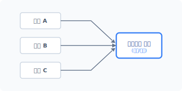
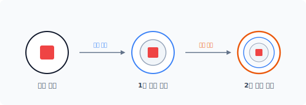
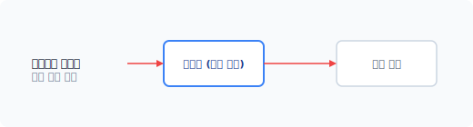


# CHAPTER 10 장식자 패턴 (decorator)

장식자 패턴은 객체에 동적 기능을 추가하기 위해 구조를 개선하는 패턴입니다. 다양한 확장을 위해 객체를 조합합니다.


## 10.1 기능 추가

새로운 기능을 추가하기 위해 클래스를 확장하는 방법은 상속과 구성 두 가지입니다.


### 10.1.1 상속

프로그램이 실행되면서 기존 객체를 확장해 새로운 기능을 추가해야 하는 경우가 있습니다. 객체지향에서는 새로운 기능을 추가하기 위해 상속을 사용합니다.

상속은 클래스를 확장하는 대표적인 구현 기법입니다. 하지만 상속의 단점은 상위 클래스와 하위 클래스 간에 강력한 결합 관계가 생성된다는 것입니다.

클래스 간 강력한 결합은 객체의 유연한 확장을 어렵게 합니다. 또한 기존 객체에 새로운 기능을 추가할 때마다 메서드를 오버라이드하여 변경해야 합니다.

상속은 정적 방식으로 기능을 확장하기 때문에, 객체를 상황에 맞게 동적으로 확장해야 할 경우 상속으로 구현하는 것이 쉽지 않습니다.

10장 장식자 패턴 229

### 10.1.2 오버라이드

오버라이드<sup>override</sup>는 상위 클래스의 메서드를 재정의하는 기능입니다.

오버라이드했다고 해서 상위 클래스의 메서드가 없어지는 것은 아닙니다. 상위 메서드가 하위 메서드로 대체될 뿐입니다. 오버라이드하면 상위 클래스의 메서드와 하위 클래스의 메서드 2개가 존재합니다. 상속에서 오버라이드하면 불필요한 상위 메서드가 남게 됩니다.

> [!NOTE] 상속 문제점
> 상속으로 클래스를 확장할 경우 확장된 클래스에 불필요한 메서드까지 포함되므로 클래스의 크기가 방대해집니다.


### 10.1.3 상속 조합

상속을 이용해 객체를 유연하게 확장하는 것은 쉽지 않습니다. 어떤 행위는 필요하고 어떤 행위는 불필요할 때 객체의 조합을 다양하게 처리하는 일이 복잡해집니다.

[표 10-1]과 같이 각각의 클래스에 여러 옵션 중 선택된 행위만 구현하려는 경우를 예로 들어보겠습니다.

표 10-1
| 기능 | 옵션 1 | 옵션 2 | 옵션 3 | 옵션 4 |
| :--- | :---: | :---: | :---: | :---: |
| Basic | V | | | |
| Standard | V | V | | |
| Professional | | V | V | |
| Primary | | V | V | V |

원하는 기능만 상속해서 조합된 클래스를 생성해야 합니다. 상속으로만 조건을 조합해 특정 행위만으로 구성된 객체를 생성하는 것은 매우 복잡합니다. 기능별로 조합하고 하위 클래스도 개별적으로 생성해야 합니다.

230 2부 구조 패턴

## 10.2 조건 추가

하나의 단일 행위만 처리하는 것과 달리 여러 행위를 처리해야 하는 경우가 있습니다. 이때 여러 행위를 구분하기 위해 조건을 추가합니다. 여기서 조건이란 다른 행위를 하기 위해 기존의 행위를 확장하는 것과 유사합니다.


### 10.2.1 옵션

우리가 쇼핑몰에서 상품을 주문할 때 기본 상품과 옵션을 선택합니다. 옵션은 하나의 상품을 기준으로 고객에게 더 많은 선택 사항을 부여합니다. 또한 옵션별로 가격 차이가 발생할 수도 있습니다.

이처럼 하나의 동작에 부수적인 기능을 추가하는 경우가 있으며, 추가 기능을 처리하려면 객체의 행위를 확장해야 합니다. 하지만 몇 개의 부수적 행위가 추가되는지는 정확하게 알 수 없습니다. 따라서 상황별로 다른 행위의 동작 클래스를 설계하는 것은 쉽지 않습니다.


### 10.2.2 동적 확장을 위한 구성

구성은 위임을 활용해 객체를 확장하는 방법입니다. 최근 모던 객체지향 코드는 고전적인 상속보다 구성을 이용해 객체를 확장하는데, 이 경우 객체를 실행하는 도중에도 동적으로 다른 객체를 결합해 확장 가능하다는 장점이 있습니다.

장식자 패턴은 동적으로 객체를 결합하기 위해서 객체지향의 구성을 통해 확장합니다.


### 10.2.3 확장을 통한 객체 변경

완성된 코드에 새로운 기능을 추가하려면 객체를 확장해야 하며 이를 위해 기존 코드를 수정해야 합니다. 코드를 수정하는 도중에는 코드 상태가 일시적으로 불안정해집니다. 수정이 완료되지 않은 채 변화 상태에 있는 코드는 다른 코드의 동작에 영향을 주고 잘못된 결과를 발생시킬 수 있습니다.

코드 수정이 완료되면 안정성 테스트 과정이 필요합니다. 수정 중에 어떤 실수나 버그가 발생했을 수 있기 때문입니다. 이와 같이 수정으로 인해 발생하는 불안정한 코드 상태와 테스트는 유지 보수를 어렵게 만드는 요인입니다.

10장 장식자 패턴 231

새로운 기능을 추가할 때는 변경이 아닌 확장을 통해 처리하는 것이 좋습니다. 확장하면 기존의 안정적인 코드 상태를 유지하면서 새로운 기능을 추가할 수 있기 때문입니다. 이러한 이유로 장식자 패턴은 코드를 변경하지 않고 확장하기 위해 객체를 구성 방식으로 처리합니다.


### 10.2.4 OCP

객체를 확장할 때는 개방-폐쇄 원칙<sup>Open-Closed Principle</sup>(이하 OCP)을 기반으로 합니다. OCP는 새로운 기능을 추가할 경우 확장을 허용하지만 기존 내용은 변경하지 못하게 합니다. 객체지향에서는 OCP 원칙을 유지하기 위해 구성을 사용합니다. 객체 구성을 이용해 기능을 확장하면 기존의 코드를 변경하지 않아도 객체에 새로운 기능을 추가할 수 있습니다.

하지만 객체지향 코드를 개발하면서 OCP 원칙을 유지하는 것은 많은 시간과 노력이 필요하므로 쉽지 않습니다. 따라서 가장 확실하게 변경이 예측되는 부분 위주로 OCP 원칙을 적용한다면 보다 수월하게 진행할 수 있을 것입니다.


## 10.3 확장

장식자 패턴은 객체에 새로운 부가 기능을 동적으로 추가합니다. 여기서 동적은 실시간으로 변하는 객체에 새로운 행위를 추가하는 것을 의미합니다.


### 10.3.1 처리 분담

책임이 향후에 어떤 형태로 변경될지 모르니 하나의 클래스에 많은 기능을 집중하는 것은 좋지 않으며 객체의 책임을 여러 클래스에 분산해 설계하는 것이 좋습니다. 그리고 보다 작은 객체가 재사용하기 용이하므로 필요한 기능만 선택적으로 결합합니다.

분산된 각각의 클래스는 작은 객체로 생성되며 더 큰 객체로 결합해 사용할 수 있고, 필요할 때마다 분산된 작은 객체를 결합해 새로운 객체로 생성할 수 있습니다. 또한 객체 결합을 통해 생성된 객체의 자원을 효율적으로 관리할 수 있습니다.

232 2부 구조 패턴

장식자 패턴은 객체에 새로운 기능을 결합할 때 유용하며, 객체의 동적 조합이 많은 경우에도 편리합니다.


### 10.3.2 융통성

상속은 강한 결합 구조를 가지며 기능을 확장하기 위해 복잡한 조건을 추가해야 합니다. 장식자 패턴은 상속에서 처리하기 힘든 설계 변경을 해결합니다.

장식자 패턴은 객체를 복합 객체로 구성하고 내부적으로는 위임을 통해 유연한 확장이 가능하도록 합니다. 위임은 느슨한 구조의 결합도를 유지하면서, 보다 큰 구조의 객체로 확장 가능합니다.


### 10.3.3 동적 추가

위임을 통해 객체를 확장하면 여러 가지 이로운 점이 있습니다. 그중 가장 대표적인 것이 동적 객체 확장이며 이는 런타임으로 객체에 새로운 책임을 추가할 수 있는 방법입니다.

초기 클래스는 선언에 의해 객체의 내부 구조가 정의됩니다. 한번 클래스로 생성된 객체의 구조를 변경하는 것은 어렵습니다. 하지만 객체를 복합 객체로 구성하면 위임을 통해 객체를 생성한 후에도 동적으로 구조를 변경할 수 있습니다.

객체가 다양한 책임을 가질 수 있도록 추가 확장이 필요할 때는 동적 확장이 유용합니다. 또한 객체가 확장될 때 사전에 책임이 확정되지 않았어도 적용할 수 있습니다. 장식자 패턴은 추가하려는 미정의 객체 조합이 많을 때 유용한 패턴입니다.


### 10.3.4 단일화

장식자는 기존의 객체에 새로운 부가 행위를 추가하며 추가하는 행위는 단위별로 분리됩니다.

장식자 패턴은 많은 종류의 작은 객체를 단일화해서 결합합니다. 분리된 객체를 조합해 새로운 파생 클래스를 생성하고 객체를 확장합니다. 단일화 결합은 객체를 실행하는 중에도 동적으로 적용할 수 있습니다.

10장 장식자 패턴 233

#### 그림 10-1 객체의 단일화



단위 객체를 어떻게 조합하느냐에 따라 생성되는 파생 클래스 수에 차이가 있습니다. 장식자는 수많은 파생 클래스를 생성하고 결합합니다.


### 10.3.5 축소

장식자는 새로운 기능을 추가하는 것 외에 어떤 기능을 제거하기 위해서도 사용할 수 있습니다. 이는 객체의 내부를 변경하는 것과 유사하며 내부를 변경하는 유사 패턴으로 전략 패턴이 있습니다. 전략 패턴은 알고리즘을 삽입해 동작 구조를 변경합니다. 자세한 내용은 24장에서 알아보겠습니다.


## 10.4 객체에 추가 장식하기

장식자 패턴은 기존 객체를 확장하기 위해 무언가를 추가 장식<sup>decorate</sup>합니다. 장식자는 기본 베이스의 객체를 시작점으로 장식을 추가해 객체를 확장합니다.

234 2부 구조 패턴

### 10.4.1 객체를 감싸는 래퍼

장식자는 기본이 되는 객체를 감싸서 새로운 객체로 확장합니다. 마치 랩으로 감싸는 것과 같다고 해서 래퍼 객체라고도 합니다.

객체를 감쌀 때는 행위를 추가하여 확장합니다. 장식을 위해 기존 객체를 감싸서 처리합니다. 행위가 추가될 때 객체를 또 다른 행위로 꾸미는 형태를 보이므로 장식<sup>decorate</sup>이라는 말로 불립니다.

부수적인 행위를 추가한 객체는 기존 객체와 다른 또 다른 객체로 변하며, 이 객체는 기존 원본 객체와 다른 객체로 파생됩니다. 새로운 부가 기능이 추가된 파생 객체는 별개의 또 다른 객체처럼 독립적으로 행동할 수 있습니다.

#### 그림 10-2 객체 래핑



장식자 패턴은 기존의 객체를 감싸서 새로운 기능을 추가하는 객체를 생성할 때 매우 유용한 패턴입니다.


### 10.4.2 객체의 투명성

장식자는 객체를 감싸면서 또 다른 객체로 파생합니다. 장식자 패턴으로 확장된 파생 객체는 요청된 행위를 중간에서 가로채 확장된 행위로 대신 처리합니다.

확장된 객체는 동일한 인터페이스를 적용합니다. 클라이언트는 요청된 객체가 원본 객체인지 파생된 객체인지 모릅니다. 이처럼 동일한 인터페이스를 사용해 객체에 투명성<sup>transparent</sup>을 부여합니다.

10장 장식자 패턴 235

#### 그림 10-3 투명성을 이용한 객체 통과



투명성은 원본 객체에 영향을 주지 않고 새로운 책임을 추가할 수 있습니다. 투과적인 인터페이스를 재귀적으로 호출하는 것은 복합체 패턴과 유사합니다. 장식자 패턴에서도 투명성을 부여해 객체를 확장하는데, 장식자 패턴은 투명성을 응용해 계속 객체를 감싸면서 기능을 확장합니다. 하지만 장식자는 복합체와 구조 모양만 유사할 뿐 목적이 다릅니다.


## 10.5 기본 실습

실습을 통해 장식자의 동작을 이해해보겠습니다. 장식자 패턴으로 객체를 확장하려면 약간의 리팩터링이 필요합니다.


### 10.5.1 구성 요소

장식자 패턴은 4개의 구성 요소로 이루어져 있습니다.

- Component: 인터페이스를 정의합니다.
- ConcreateComponent: 인터페이스에 정의 실제를 구현합니다.
- Decorator: 컴포넌트를 참조하며 인터페이스를 일치화합니다.
- ConcreateDecorator: 확장 및 추가되는 기능을 작성합니다.


### 10.5.2 인터페이스

장식자 패턴에서 먼저 설계할 것은 컴포넌트<sup>component</sup>입니다. 컴포넌트는 공통 기능을 정의하는

236 2부 구조 패턴

인터페이스입니다.

예제 10-1 Decorator/shop/Component.php
```php
<?php
// 인터페이스
interface Component
{
    // 상품 정보
    public function product();
    // 가격 정보
    public function price();
}
```

> **NOTE** 추상화를 통해 인터페이스 역할의 클래스를 설계할 수 있습니다. 추상화는 인터페이스 역할의 추상 메서드뿐만 아니라 공통된 메서드나 프로퍼티도 선언 가능합니다. 하지만 [예제 10-1]에서는 컴포넌트를 좀 더 가볍게 설계하기 위해 인터페이스로 작성했습니다. 다만 인터페이스로 설계하면 프로퍼티나 공통된 메서드를 포함할 수 없습니다.


### 10.5.3 컴포넌트

인터페이스가 적용된 실제 컴포넌트 클래스를 선언합니다. 예제에서 Product1과 Product2 두 개의 제품 클래스를 선언합니다.

예제 10-2 Decorator/shop/Product1.php
```php
<?php
class Product1 implements component
{
    // 상품 정보
    public function product()
    {
        return "원피스";
    }

    public function price()
    {
```

10장 장식자 패턴 237

// 가격을 반환합니다.
    return 20000;
    }
}
```

예제 10-3 Decorator/shop/Product2.php
```php
<?php
class Product2 implements component
{
    // 상품 정보
    public function product()
    {
        return "블라우스";
    }

    public function price()
    {
        // 가격을 반환합니다.
        return 25000;
    }
}
```

컴포넌트 클래스는 인터페이스에 선언된 메서드를 구현하여 구체화합니다.

위 예제에서는 2개의 상품만 컴포넌트 클래스를 선언했습니다. 판매되는 상품이 많을수록 생성되는 컴포넌트의 클래스 파일 수가 증가합니다.


### 10.5.4 장식자

인터페이스와 실제 컴포넌트를 준비했으므로 이제 장식자 패턴을 적용하여 객체를 확장해봅시다.

장식자 패턴을 적용하기 위해 컴포넌트와 동일한 인터페이스를 유지해야 합니다. 장식자 추상 클래스를 선언할 때 컴포넌트 인터페이스를 같이 적용합니다.

238 2부 구조 패턴

예제 10-4 Decorator/shop/Decorate.php
```php
<?php
abstract class Decorate implements component
{
    // 상품 정보
    abstract public function product();

    // 가격 정보
    abstract public function price();
}
```

장식자는 객체를 확장할 때 구성을 사용합니다. 인터페이스를 적용하는 이유는 단지 객체의 통일화된 사용을 위해서이며, 장식자는 실제 장식을 구현하기 위한 껍데기일 뿐입니다.


### 10.5.5 구체적 장식

인터페이스를 적용해 장식자 추상 클래스를 선언했습니다. 이제 생성한 장식자를 적용해 구체적인 객체를 확장해봅시다.

장식자는 객체를 구성 방식으로 확장하기 위해 객체 정보를 갖고 있습니다. 객체의 정보는 내부 참조자를 통해 저장합니다.

예제 10-5 Decorator/shop/i7.php
```php
<?php
// ConcreateDecorator
class i7 extends Decorate
{
    public $base; // 내부 참조자
    public function __construct($concrete)
    {
        echo __CLASS__."가 생성되었습니다.\n";
        $this->base = $concrete;
    }
    // 상품 정보
    public function product()
    {
        return $this->base->product().",i7";
    }
```

10장 장식자 패턴 239

}

    // 가격 정보
    public function price()
    {
        return $this->base->price() + 475000;
    }
}
```

예제 10-6 Decorator/shop/ssd256.php
```php
<?php
// ConcreateDecorator
class ssd256 extends Decorate
{
    public $base; // 내부 참조자
    public function __construct($concrete)
    {
        echo __CLASS__."가 생성되었습니다.\n";
        $this->base = $concrete;
    }

    // 상품 정보
    public function product()
    {
        return $this->base->product().",ssd256";
    }

    // 가격 정보
    public function price()
    {
        return $this->base->price() + 110000;
    }
}
```

장식자로 확장된 객체의 메서드는 요청된 동작을 가로채 변경된 동작으로 대신 처리합니다. 장식자의 메서드를 호출하면 체인으로 연결된 메서드가 순차적으로 처리됩니다.

객체의 구성으로 확장된 장식자 객체가 연결된 객체를 체인으로 호출하기 위해 내부 참조자를 사용합니다. 내부 참조자는 원본의 객체를 위임 형태로 갖고 있으며, 원본 객체의 위임은 생성

240 2부 구조 패턴

자에서 이용 객체를 지정합니다. 또는 별도의 setter 함수를 추가하여 사용할 수도 있습니다.
장식자 패턴은 구성으로 객체를 연결하므로 다양한 동작을 추가할 수 있습니다.


### 10.5.6 실행

작성한 인터페이스와 컴포넌트, 장식자와 확장된 객체를 사용해 실제 코드를 작성해봅시다.

예제 10-7 Decorator/shop/index.php
```php
<?php
require "Component.php";
require "product1.php";

require "Decorate.php";
require "i7.php";
require "ssd256.php";

$p = new product1;

$spec = new i7($p);
$spec = new ssd256($spec);

echo "스펙=".$spec->product()."\n";
echo "가격=".$spec->price()."\n";
```

```
$ php index.php
i7가 생성되었습니다.
ssd256가 생성되었습니다.
스펙=원피스,i7,ssd256
가격=605000
```

장식자 패턴을 적용할 때 연결되는 객체의 수는 제한이 없습니다. 확장이 필요한 만큼 장식되는 객체를 추가할 수 있습니다.

10장 장식자 패턴 241

## 10.6 장단점 및 결과

장식자 패턴은 기존의 객체에 영향을 주지 않고 새로운 기능을 동적으로 추가합니다.


### 10.6.1 장점

장식자 패턴을 사용하면 상속 형태의 확장보다 더 융통성 있게 설계할 수 있습니다. 장식자 패턴은 객체 실행 중에도 동적으로 기능을 추가할 수 있기 때문에 새로운 부가 기능을 추가하는 가장 효과적인 방법입니다. 또한 미리 클래스 등의 자원을 생성해 낭비하는 것이 아니라, 동적으로 처리되는 시점에 자원을 할당 받아 사용할 수 있습니다.


### 10.6.2 단점

장식자 패턴은 작은 단위의 객체가 많이 생성됩니다. 많아지는 객체의 수는 단점이지만, 그렇다고 무조건 단점이라고는 할 수 없습니다. 작은 코드로 이루어진 객체는 보다 이해하기 쉬우며 상호 작용을 통해 다른 객체를 생성할 수 있는 원소 객체입니다.

유사한 성질의 작은 클래스가 증가합니다. 많은 클래스는 코드를 이해하기 어렵게 만들지만 작은 객체는 완전히 다른 클래스가 아니며 상호 작용하는 방법에만 차이가 있습니다.

장식자 패턴은 기존 객체를 감싸는 과정이 있어야 하므로 구성 요소를 초기화하는 작업이 필요합니다.


## 10.7 관련 패턴

장식자 패턴을 다른 패턴과 비교해보면 해결하고자 하는 목적과 특징을 구별할 수 있습니다.


### 10.7.1 복합체 패턴

장식자 패턴을 복합체 패턴과 연관시켜 학습하는 것이 좋습니다. 장식자 패턴이 한 개의 구성

242 2부 구조 패턴

을 가진 복합 객체라고 생각하면 복합체 패턴과도 유사함 점이 있습니다. 차이는 객체를 합성하는 것이 아닌 새로운 객체의 행동을 추가하는 것이라고 할 수 있습니다.

복합체 패턴의 경우 트리 구조로 인해 좌우 폭, 상하 관계 등 다양한 형태의 크기로 확장될 수 있습니다. 이와 달리 장식자 패턴은 상하 계층으로만 확장된다는 특징이 있습니다.


### 10.7.2 어댑터 패턴

언뜻 보면 기본 객체에 변화를 추가해 새로운 객체를 생성하는 것이 어댑터 패턴과 유사하다고 생각할 수 있습니다. 장식자 패턴은 동적으로 기능이 추가되므로 새로운 객체를 생성한다는 의미보다는 어댑터 패턴처럼 새로운 기능을 추가하면서 커지는 구조라고 볼 수 있습니다.

어댑터 패턴은 인터페이스를 변경하지만 장식자 패턴은 기능, 행동을 변경합니다. 추가하는 기능이 범용적이라면 독립적으로 객체를 구성해 처리하는 것은 차이점이라고 할 수 있습니다.


### 10.7.3 전략 패턴

장식자 패턴이 커지거나 무거워질 때는 전략 패턴을 같이 응용하는 것도 좋습니다. 장식자 패턴은 겉모양을 변경하는 반면, 전략 패턴은 내부의 변화를 가져옵니다. 또한 전략 패턴은 자신만의 인터페이스에 따라 처리되는 반면, 장식자 패턴은 컴포넌트에서 정의된 인터페이스를 따라 동작합니다.


## 10.8 정리

장식자 패턴은 디자인 패턴에서 빠지지 않고 설명되는 중요 패턴 중 하나입니다. 장식자의 경우 실행되고 있는 객체가 동적으로 자신의 객체를 확장할 수 있습니다. 실시간 동작으로 자신의 객체를 확장하면서, 필요로 하는 다양한 책임을 수행하고 문제를 해결해 나갑니다.

장식자의 기본 배경이 되는 개념은 복합 객체와 위임입니다. 상속을 배제하고 구성을 통해 객체를 동적으로 확장합니다.

10장 장식자 패턴 243

