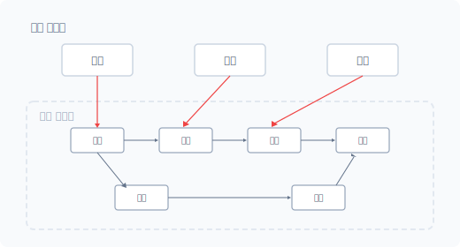
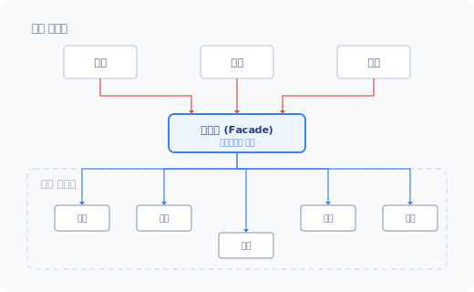
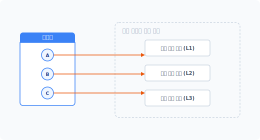


# fa-cade
[ fə'sa:d ] 🔊

CHAPTER 11
파사드 패턴

파사드 패턴은 프로그래밍 언어에서 관심사를 분리하는 패턴입니다. 객체지향은 추상적인 개념을 도입해 객체를 캡슐화합니다. 하지만 캡슐화를 적용했다고 해서 객체 내 서브 시스템으로 접근할 수 없는 것은 아닙니다. 이런 점에서 정보 은닉성은 떨어지는 편이라고 볼 수 있습니다.

파사드<sup>facade</sup>의 어원은 프랑스어(façade)로 건물의 정면이라는 뜻을 갖고 있습니다. 건물의 외관, 겉모습을 말하며 사전적으로는 '표면, 허울'로도 해석됩니다.


## 11.1 협업을 위한 분리 작업

파사드는 요즘과 같이 협업과 대형 시스템을 개발하고 배포하는 데 자주 응용되는 패턴입니다. 파사드는 시스템 결합과 사용이 용이하도록 관심사를 분리합니다.


### 11.1.1 복잡한 구조의 개발 작업

최근 개발되는 코드의 구조는 방대하고 복잡합니다. 또한 많은 기능을 혼자 개발할 경우 오랜 시간이 소요됩니다. 대형 시스템을 효율적으로 개발하려면 기능을 모듈별로 분리하고 분리된 모듈을 공동으로 개발하는 것이 좋습니다. 최근의 모든 개발 과정은 이러한 협업 형태로 이루어집니다.

244 2부 구조 패턴

빠르게 변하는 IT 환경에 적응하는 데는 개발 기간 단축과 기능 유지가 중요합니다. 오픈 소스나 공개된 API 서비스를 이용하는 것도 좋은 방안입니다.


### 11.1.2 분리된 모듈의 결합

하나의 서비스를 여러 개발자와 공동으로 만드는 과정은 쉽지 않습니다. 또한 분리된 기능별 모듈을 하나로 합치는 과정에서도 수많은 난관에 봉착합니다.

객체지향 개발 방식에서는 하나의 모듈을 작게 분리하고 클래스로 캡슐화하며, 작게 분리된 모듈은 다른 기능 구현에도 재사용됩니다. 이 과정에서 수많은 클래스 객체가 생성되고 객체는 복잡한 구조의 관계를 가집니다.

모듈은 또 다른 모듈을 참조합니다. 다른 개발자가 작성한 코드를 자신의 모듈에 탑재하거나 결합을 시도할 때 크고 작은 문제가 발생합니다. 모듈을 결합하기 위해서는 타인의 개발 코드를 이해해야 하는데, 각 클래스의 실행 순서와 조작 방법이 다를 수도 있습니다.

메인 시스템
#### 그림 11-1 복잡한 객체 연결 구조



코드를 결합한 후에도 리팩터링이나 변화가 있을 때를 대비하여 지속적으로 코드를 유지 보수해야 합니다.

11장 파사드 패턴 245

### 11.1.3 느슨한 결합

협업 과정에서 발생하는 코드의 결합은 공동 개발 작업에서 다양한 문제를 발생시킵니다. 코드는 분할된 모듈을 결합할 때 강력한 의존 관계를 갖습니다. 파사드 패턴은 강력한 결합 구조를 해결하기 위해 코드의 의존성을 줄이고 느슨한 결합으로 구조를 변경합니다.

파사드 패턴은 메인 시스템과 서브 시스템 중간에 위치하는데, 새로운 인터페이스 계층을 추가하여 시스템 간 의존성을 해결합니다. 인터페이스 계층은 메인 시스템과 서브 시스템의 연결 관계를 대신 처리합니다.

메인 시스템
#### 그림 11-2 인터페이스 계층



파사드로 인해 새로운 계층이 하나 더 추가되면 관리할 클래스가 하나 더 생성된다는 단점이 있지만, 강력한 객체의 결합도를 낮추고 유연한 구조를 가질 수 있다는 장점도 있어 매력적인 패턴 중 하나입니다.

246 2부 구조 패턴

### 11.1.4 간접 접근

파사드는 각각의 모듈 객체에 직접 접근해서 호출하지 않고 파사드의 인터페이스 계층을 통해 간접적으로 접근합니다. 파사드의 인터페이스 계층은 '겉모습', '건물의 정면'과 같이 접근할 수 있는 하나의 통로 역할만 담당합니다.

파사드를 이용하면 객체(서브 시스템)의 내부 구조를 상세히 알 필요가 없습니다. 파사드는 시스템의 연결성과 종속성을 최소화하는 것을 목적으로 합니다.

사실 우리는 이전부터 파사드 패턴을 알고 사용해왔습니다. 라이브러리를 시스템에 탑재할 때 라이브러리의 내부 기능을 직접 제어하면서 코드를 작성하지 않으며 복잡한 라이브러리 코드를 실행하는 몇 가지 함수를 이용해 코드를 결합합니다. 이때 사용하는 몇 가지 함수가 파사드 역할을 수행하는 것입니다.

파사드 패턴은 규모가 있는 작업을 팀 단위로 분리하여 작업할 때 유용하게 적용할 수 있습니다.


## 11.2 파사드 패턴을 응용한 API

파사드 패턴은 클라우드, 서비스 API를 구축할 때 응용되는 패턴입니다. API를 사용해본 사람이라면 무의식적으로 파사드 패턴을 활용하고 있는 것입니다. 단지 파사드라는 용어가 낯설 뿐입니다.


### 11.2.1 구조

파사드는 GoF에서 설명하는 구조 패턴 중 하나며 파사드 패턴은 싱글턴 추상 팩토리<sup>singleton abstract factory</sup>라고 불리기도 합니다. 파사드 패턴은 어떤 기능에 접근할 수 있는 단일화된 추상 클래스를 만듭니다.

예를 들어 은행에 가면 상담 창구가 있습니다. 은행 상담원에게 원하는 업무를 요청하면 은행원은 내부의 전산 작업을 이용하여 요청을 처리합니다. 우리는 은행 내부 시스템을 몰라도 은행 업무를 처리할 수 있으며, 은행원은 고객과 은행 전산 시스템을 이어주는 인터페이스 역할을 합니다.

11장 파사드 패턴 247

을 합니다. 이처럼 파사드는 단순한 창구 역할의 은행원과 같습니다. 즉 파사드는 시스템에 접근할 수 있는 통로입니다.


### 11.2.2 인터페이스

앞에서 파사드는 기능을 처리할 수 있는 창구와 같다고 설명했습니다. 이러한 창구를 전문 용어로 인터페이스라고 합니다. 기능을 처리할 수 있는 서로 규약된 방법이라는 의미입니다.

파사드는 서브 시스템을 호출, 결합할 수 있는 인터페이스를 제공합니다. 인터페이스는 한 개일 수도 있고 여러 개일 수도 있습니다. 또 이를 함수 형태로 제공하기도 합니다.

파사드를 이용하면 코드를 사용하는 클라이언트 측에서 세부적인 기능을 일일이 알 필요가 없습니다. 파사드로 제공되는 클래스, 함수를 이용하기만 하면 됩니다. 이처럼 간단한 사용법을 제공하는 것이 바로 파사드 패턴입니다.


### 11.2.3 최상의 인터페이스

파사드는 통합 인터페이스입니다. 복잡하게 얽힌 서브 시스템의 로직을 쉽게 사용할 수 있도록 상위 레벨 인터페이스로 재정의합니다. 상위 레벨의 인터페이스는 캡슐화하여 하위 시스템에 접근합니다.

파사드의 인터페이스는 서브 시스템에 쉽게 접근해 사용할 수 있도록 하는 부가적인 기능입니다. 최상의 인터페이스를 이용하지 않더라도 필요한 경우 직접 서브 시스템에 접근해 작업할 수도 있습니다. 파사드는 서브 시스템을 보다 쉽게 쓸 수 있도록 높은 수준의 인터페이스를 정의하는 작업입니다.


## 11.3 파사드를 이용한 단순화

파사드 패턴은 연관된 서브 시스템의 메서드 결합이라고 할 수 있습니다. 복잡한 서브 시스템의 동작을 하나로 묶어서 이를 실행할 수 있도록 제공하는 계층입니다.

248 2부 구조 패턴

### 11.3.1 단순화

파사드 패턴은 서브 기능을 쉽게 사용할 수 있도록 단순화합니다. 미로처럼 얽혀 있는 클래스의 관계를 일일이 작업하지 않아도 제공된 인터페이스를 사용해 실행할 수 있습니다. 또한 모듈의 내부 동작을 이해한 후 사용할 필요도 없습니다.

파사드로 제공되는 인터페이스만 알고 있으면 사용할 수 있습니다. 향후 서브 시스템이 리팩터링 등으로 구조가 변경돼도 신경 쓸 필요 없습니다. 파사드를 이용하면 서브 시스템 구조에 일일이 대응하지 않고도 쉽게 메인 시스템과 코드를 결합할 수 있습니다.


### 11.3.2 캡슐화 배제

파사드 패턴을 구현하기 위해 서브 시스템의 캡슐화 작업을 별도로 진행하지 않습니다. 파사드는 단순한 인터페이스입니다.

파사드는 내부의 복잡한 기능은 숨긴 채 간단히 서브 시스템을 사용할 수 있는 외부 인터페이스만 제공하는 것입니다.


### 11.3.3 복잡성 해결

파사드는 서브 시스템을 구조화하여 복잡성을 해결하는 데 도움을 줍니다. 복잡성을 해결하기 위해 더 상위의 인터페이스를 제공합니다.

파사드는 인터페이스를 이용하여 실제 구현부를 분리하므로 서브 시스템을 계층화하여 처리할 때 매우 유용합니다.


### 11.3.4 의존성 감소

서브 시스템의 객체가 다른 객체에 의존성을 요구하는 경우가 있습니다. 특정한 서브 시스템의 계층에 접근하기 위해 의존하는 객체를 미리 생성하는 과정이 필요합니다.

파사드 패턴을 응용할 경우 이러한 객체의 의존 관계를 사전에 해결할 수 있습니다. 즉 실제 객체에 접근하기 전에 필요한 작업을 먼저 실행할 수 있도록 도와줍니다. 파사드를 활용하면 시

11장 파사드 패턴 249

스템 개발 시 보다 유연한 형식의 코드를 작성할 수 있습니다.


## 11.4 최소 지식 원칙

파사드 패턴은 객체지향의 최소 지식 원칙<sup>Principle of Least Knowledge</sup>이 적용되는 좋은 예입니다. 최소 지식 원칙은 다른 말로 데메테르의 법칙<sup>Law of Demeter</sup>이라고도 합니다.


### 11.4.1 최소 지식

복잡하게 얽혀 있는 서브 시스템의 어떤 부분을 수정할 경우 관련된 다른 부분도 같이 수정해야 하는 경우가 있습니다. 그러려면 하나를 수정할 때 많은 연관 정보를 알고 있어야 합니다. 이처럼 어떤 작업을 할 때 많은 지식이 있어야 한다면 코드를 쉽게 수정하기 어렵습니다.

지식으로 진입 장벽을 만들지 않아야 합니다. 최소 지식만 적용해 객체의 상호 작용을 설정하면 유지 보수가 용이해집니다.


### 11.4.2 잘못된 예

객체의 메서드를 호출할 때는 단순화해서 접근하거나 호출하는 것이 좋습니다. 불필요한 객체의 생성 루틴과 재호출을 코드에 삽입해 코드의 가독성과 복잡성을 증가시키지 않도록 합니다.

다음 [예제 11-1]에는 온도를 측정하는 Thermometer 객체가 있습니다.

예제 11-1 Facade/01/Thermometer.php
```php
<?php
// 서브 시스템
class Thermometer
{
    public $temp;

    public function getTemperature():float
    {
```

250 2부 구조 패턴

return $this->temp;
    }
}
```

그리고 Temperature 객체는 Thermometer 객체의 메서드를 호출합니다.

예제 11-2 Facade/01/Temperature.php
```php
<?php
// 파사드
class Temperature
{
    public $station;

    public function __construct($station)
    {
        $this->station = $station;
    }

    public function getTemp(): float
    {
        // 인스턴스를 저장합니다.
        $thermometer = $this->getThermometer();

        // 인스턴스를 통하여 메서드를 실행합니다.
        return $thermometer->getTemperature();
    }

    // 불필요한 객체 호출(생성)
    private function getThermometer()
    {
        return $this->station;
    }
}
```

$thermometer는 새로운 객체를 반환 받고 반환된 객체의 메서드를 실행한 후 실행된 결과값을 반환합니다. [예제 11-2]에서는 $thermometer 변수에 Temperature 객체 정보를 다시 저장해 사용할 필요가 없습니다. 메모리만 증가할 뿐입니다.

Temperature 객체를 수정할 때 개발자는 $thermometer 변수에 담긴 객체 정보를 이해해야

11장 파사드 패턴 251

하므로 코드 복잡성이 증가합니다. 이런 경우 가까운 객체 간 상호 작용이 가능하도록 연결을 단순화합니다.

```php
    public function getTemp(): float
    {
        // 객체의 연결을 단순화합니다.
        return $this->station->getTemperature();
    }
```

이처럼 가장 가까운 객체를 직접 호출하여 사용하는 것이 좋습니다.


### 11.4.3 최소 지식 객체

최소 지식의 원칙을 적용하여 코드를 작성하는 것이 오히려 더 복잡해 보일 수 있습니다. 하지만 다음과 같이 4가지 규칙만 따르면 최소 지식의 원칙을 쉽게 적용할 수 있습니다.

- 자기 자신만의 객체 사용
- 메서드에 전달된 매개변수 사용
- 메서드에서 생성된 객체 사용
- 객체에 속하는 메서드 사용

예제 11-3 Facade/02/car.php
```php
<?php
class Car {
    // ① 클래스의 구성 요소.
    // 구성 요소의 메서드는 호출해도 된다.
    private $engine;

    public function __construct($eng)
    {
        $this->engine = $eng;
    }

    public function start($key)
    {
```

252 2부 구조 패턴

// ③ 새로운 객체 생성.
        // 내부에서 생성된 객체의 메서드는 호출해도 된다.
        $doors = new Doors();

        // ② 매개변수로 전달된 객체의 메서드는 호출해도 된다.
        $authorized = $key->turns();

        if ( $authorized ) {

            // ① 객체의 구성 요소의 메서드는 호출해도 된다.
            $this->engine->start();

            // ④ 객체 내에 있는 메서드는 호출해도 된다.
            $this->updateDashboardDisplay();

            // ③ 직접 생성하거나 인스턴스를 만든 객체의 메서드는 호출해도 된다.
            $doors->lock();

        }

    }

    public function updateDashboardDisplay()
    {
        // 생략
    }

}
```

파사드 패턴을 적용할 때는 최소 단위의 원칙을 적용하여 클래스를 설계하는 것이 중요합니다.


## 11.5 기본 실습

지금부터는 코드와 사례를 통해 파사드 패턴을 좀 더 자세히 알아보겠습니다. 파사드 패턴은 다른 디자인 패턴과 달리 특정한 구조를 갖지 않으며, 파사드 패턴을 생성하는 방법은 매우 다양합니다.

11장 파사드 패턴 253

### 11.5.1 서브 시스템

파사드는 복잡한 구조의 서브 시스템을 간단하게 호출할 수 있도록 하는 인터페이스 모음입니다.

여기서는 가상의 복잡한 기능을 가진 서브 클래스를 선언하고, 3개의 기능(클래스)을 각각 package1, package2, package3으로 생성합니다. 이 객체는 사실 어떤 라이브러리의 집단이거나 서비스를 위한 API일 것입니다.

예제 11-4 Facade/03/package1.php
```php
<?php
// 기능1 클래스를 선언합니다.
class Package1
{
    public function __construct()
    {
        echo __CLASS__." 객체가 생성 되었습니다.<br>";
    }

    public function process()
    {
        echo "패키지1 작업을 진행합니다.<br>";
    }
}
```

예제 11-5 Facade/03/package2.php
```php
<?php
// 기능2 클래스를 선언합니다.
class Package2
{
    public function __construct()
    {
        echo __CLASS__." 객체가 생성 되었습니다.<br>";
    }

    public function process()
    {
        echo "패키지2 작업을 진행합니다.<br>";
    }
}
```

254 2부 구조 패턴

예제 11-6 Facade/03/package3.php
```php
<?php
// 기능3 클래스를 선언합니다.
class Package3
{
    public function __construct()
    {
        echo __CLASS__." 객체가 생성 되었습니다.<br>";
    }

    public function process()
    {
        echo "패키지3 작업을 진행합니다.<br>";
    }
}
```

파사드의 서브 시스템은 한 개의 클래스 만으로도 구성이 가능하며 여러 개의 클래스도 가능합니다. 파사드가 제공하는 서브 시스템은 복잡한 구조를 갖고 있다고 상상하면 됩니다.


### 11.5.2 직접 접근

우리는 복잡한 서브 시스템을 갖고 있으며, 이 복잡한 서브 시스템에는 각각의 클래스를 직접 생성해 접근할 수 있습니다.

예제 11-7 Facade/03/index.php
```php
<?php
require "package1.php";
require "package2.php";
require "package3.php";

require "facade.php";
// 기존 패키지에 직접 접근하여 사용

$obj1 = new Package1;
$obj1->process();

$obj2 = new Package2;
$obj2->process();
```

11장 파사드 패턴 255

```php
$obj3 = new Package3;
$obj3->process();
```

```
$ php index.php
Package1 객체가 생성 되었습니다.
패키지1 작업을 진행합니다.

Package2 객체가 생성 되었습니다.
패키지2 작업을 진행합니다.

Package3 객체가 생성 되었습니다.
패키지3 작업을 진행합니다.
```

복잡한 서브 시스템을 사용하려면 서브 시스템의 내부 구조를 모두 알아야 하지만 서브 시스템을 개발, 유지 보수하는 개발자가 아니라면 상세 기능을 파악하기 힘들습니다.


### 11.5.3 파사드 생성

우리는 서브 시스템의 기능만 사용하면 되며 복잡한 내부 구조는 알 필요가 없습니다. 따라서 서브 시스템 개발자는 복잡한 구조의 서브 시스템을 사용할 수 있도록 인터페이스를 제공합니다.

사용자는 서브 시스템의 클래스를 직접 호출하지 않고도 제공되는 파사드를 통해 서브 시스템을 사용할 수 있습니다.

예제 11-8 Facade/04/facade.php
```php
<?php
// 패키지에 대한 파사드 패턴
class Facade
{
    private $_package1;
    private $_package2;
    private $_package3;

    // 인스턴스를 생성합니다.
```

256 2부 구조 패턴

public function __construct()
    {
        $this->_package1 = new Package1;
        $this->_package2 = new Package2;
        $this->_package3 = new Package3;
    }

    // 패키지 동작 1,2,3 을 한번에 수행해야 되는
    // 복잡한 동작을 파사드 메서드로 생성합니다.
    public function processAll()
    {
        $this->_package1->process();
        $this->_package2->process();
        $this->_package3->process();
    }

}
```

파사드 패턴은 복잡한 동작이나 패키지를 쉽게 처리할 수 있도록 외부 메서드를 제공합니다. 이렇게 외부로 제공되는 메서드를 호출함으로써 복잡한 기능을 한번에 처리할 수 있습니다.

파사드 패턴을 이용하여 동작을 출력해보겠습니다.

예제 11-9 Facade/04/index.php
```php
<?php
require "package1.php";
require "package2.php";
require "package3.php";

require "facade.php";

// 파사드
$obj = new Facade;
$obj->processAll();
```

각각의 패키지 객체를 직접 실행하는 것이 아니라 파사드 패턴의 메서드를 통해 한번에 실행합니다. 실행 결과는 다음과 같습니다.

11장 파사드 패턴 257

Package1 객체가 생성 되었습니다.
Package2 객체가 생성 되었습니다.
Package3 객체가 생성 되었습니다.
패키지1 작업을 진행합니다.
패키지2 작업을 진행합니다.
패키지3 작업을 진행합니다.
```


## 11.6 파사드 패턴의 효과

파사드를 통해 서브 시스템을 구조화하면 복잡성을 해결하는 데 도움이 됩니다.


### 11.6.1 서브 시스템 보호

파사드 패턴을 활용하면 서브 시스템의 구성 요소를 보호할 수 있는데, 서브 시스템의 구성 요소를 직접 호출하지 않으므로 잘못된 사용을 방지할 수 있습니다.

파사드는 내부 구조와 외부 사용을 구분합니다. 이를 응용하면 추후 서브 시스템을 업그레이드하는 경우에도 자유롭습니다.


### 11.6.2 확장성

시스템은 살아 있는 생물과 같습니다. 서비스를 유지하는 동안 새로운 요청과 생각하지 못했던 오류가 발견되곤 하므로, 안정적인 서비스를 유지하기 위해서는 지속적인 코드 변경이 필요합니다.

시스템은 새로운 기능을 구현하기 위해 확장되며, 최적화 및 재사용을 위해 기존의 클래스가 단순해지기를 바랍니다. 이러한 과정은 계속 반복됩니다.

하지만 서비스 중인 코드를 변경하는 것은 쉽지 않습니다. 또한 코드를 변경하면서 안정적인 상태를 유지하는 것도 어렵습니다. 매번 코드를 변경할 때마다 변경된 사용법에 따라 관련 코드도 변경해야 하기 때문입니다.

258 2부 구조 패턴

이처럼 변화되는 코드를 파사드 형태로 제공하면 보다 쉽게 변경 및 확장할 수 있습니다. 상위 시스템에는 파사드를 이용하므로 서브 시스템이 변경돼도 큰 변화를 느낄 수 없습니다. 파사드는 확장성을 고려하면서 서브 시스템의 기능을 유지할 수 있도록 완충하는 역할을 수행합니다.


### 11.6.3 결합도 감소

서브 시스템은 복잡합니다. 많은 클래스를 사용하고 있으며 각각의 클래스에는 종속적 결합도 발생합니다. 복잡한 서브 시스템의 단계를 직접 따라가면서 객체를 결합하는 것은 불편합니다. 이러한 결합 과정을 유지하면서 코드를 변경하는 것도 쉽지 않습니다.

서브 시스템이 복잡하고 종속성이 강할 때는 파사드 패턴을 이용합니다. 파사드 패턴을 활용하면 서브 시스템과의 결합도를 낮출 수 있습니다. 직접적으로 서브 시스템의 객체에 접근하지 않고 인터페이스와 유사한 역할을 하는 파사드를 이용하여 서브 시스템에 접근할 수 있습니다. 파사드는 복잡한 종속적 결합도를 낮춰주고 독립적인 코드를 유지할 수 있도록 도와줍니다.


### 11.6.4 계층화

복잡한 서브 시스템은 계층화 구조로 되어 있는 경우가 많습니다. 복합 객체 또는 복합체와 같은 패턴을 활용하면 객체는 계층화되면서 복잡한 구조를 갖게 됩니다.

파사드는 서브 시스템에 간접적으로 접근합니다. 서브 시스템이 계층화된 구조를 갖더라도 파사드는 계층 단계별로 접근하여 행위를 호출할 수 있습니다.

#### 그림 11-3 파사드를 이용하여 계층적 단계에 직접 접근



11장 파사드 패턴 259

파사드를 이용해 계층적 구조의 접근 포인트를 생성하고 단순화할 수 있으므로 서브 시스템이 좀 더 독립적이고 자유로워집니다.

파사드는 개수 제한 없이 생성할 수 있습니다. 필요에 따라 여러 개의 파사드를 만들어 사용할 수도 있습니다.


### 11.6.5 이식성

파사드 패턴은 코드의 결합도를 약하게 하는 효과를 발생시킵니다. 코드 결합도가 약해지면 다른 응용프로그램에서도 코드를 쉽게 재사용할 수 있습니다. 파사드는 다양한 응용프로그램에서 서브 시스템을 공통적으로 사용할 수 있도록 이식성을 향상시킵니다.

파사드는 여러 작업을 하나의 묶음으로 처리하며 복잡한 클래스를 단순화합니다.


### 11.6.6 공개 인터페이스

파사드 패턴을 반드시 사용해야 하는 것은 아니며 직접 서브 시스템에 접근해 필요한 행위를 요청할 수도 있습니다. 하지만 파사드를 사용하면 필요한 행위만 노출하고 그 외의 코드를 비공개로 숨길 수 있습니다.

파사드를 이용하면 외부에 공개되는 기능과 공개되지 않는 기능을 구분할 수 있습니다. 파사드는 인터페이스를 제공함과 동시에 서브 시스템의 기능을 캡슐화합니다. 인터페이스를 활용한 캡슐화를 통해 공개할 부분과 공개하지 않을 부분을 결정합니다.

파사드는 공개되는 기능만 인터페이스로 제공하는데, 이 경우 일시적으로 특정 기능을 감추는 효과를 얻을 수 있습니다.


## 11.7 관련 패턴

파사드 패턴은 다음 패턴과도 연관시켜 응용할 수 있습니다.

260 2부 구조 패턴

### 11.7.1 추상 팩토리 패턴

추상 팩토리는 서브 시스템을 독립적으로 처리하기 위해 인터페이스를 제공합니다. 이때 인터페이스를 파사드 패턴과 같이 적용하여 설계할 수도 있습니다. 추상 팩토리도 종속적인 서브 클래스를 감추는 효과를 가집니다.


### 11.7.2 어댑터 패턴

패턴은 서로 유사한 동작과 구조를 가진 경우가 많습니다. 파사드 패턴은 서브 시스템에 접근하는 인터페이스를 제공하는데, 이처럼 인터페이스를 제공하는 측면에서는 어댑터 패턴과 파사드 패턴이 유사하다고 볼 수 있습니다.

하지만 파사드와 어댑터의 차이는 인터페이스를 사용하는 용도가 다르다는 것입니다. 어댑터가 단순히 차이점을 해결하기 위한 인터페이스라면, 파사드는 쉬운 접근과 동작을 위한 인터페이스를 제공한다고 할 수 있습니다.


### 11.7.3 중재자

파사드는 복잡한 접근과 동작을 통제한다는 측면에서 중재자 패턴과 유사한 부분이 있습니다. 파사드는 가시적이고 직접적으로 접근하는 반면에 중재자는 은밀하고 비강제적으로 접근합니다.

중재자 패턴은 클래스 접근을 중계하는 기능을 수행하며 양방향성이라는 특징을 갖고 있습니다. 하지만 파사드는 단방향이며 서브 시스템의 접근만 허용합니다.


### 11.7.4 싱글턴

파사드 패턴에서 서브 시스템의 접근을 단일화하기 위해 싱글턴 패턴을 응용합니다. 싱글턴을 통해 파사드 객체를 생성하는 방식을 적용하는 경우도 많습니다.

11장 파사드 패턴 261

## 11.8 정리

파사드 패턴은 간단하며 일상적으로 많이 사용되는 패턴입니다. 사실 수많은 API 서비스와 라이브러리, 패키지를 사용하면서도 이들이 파사드 패턴을 응용하고 있다는 것을 모르는 경우가 많습니다.

최근 IT 업계의 화두는 클라우드, API와 같은 서비스입니다. 특히 API 서비스는 복잡한 업무와 각종 처리 작업을 외부에 의존하고 통신할 수 있는 규약만 제공합니다.

그 예로 HTTP와 같은 통신 규약 처리 등 파사드 패턴을 적용하여 구현하는 사례가 많습니다. 또한 파사드 패턴은 라라벨과 같은 프레임워크에서 빈번하게 사용되는 디자인 패턴입니다.

262 2부 구조 패턴

