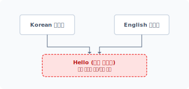
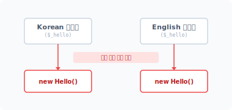
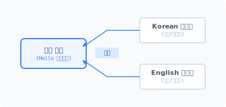
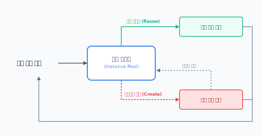


fly·weight
[ 'flaiweit ]

CHAPTER 12

플라이웨이트 패턴


플라이웨이트 패턴은 객체를 공유하기 위해 구조를 변경하는 패턴입니다. 객체를 공유하면 객체를 재사용할 수 있어 시스템 자원이 절약됩니다.


## 12.1 메모리 자원

객체는 클래스 선언을 통해 생성되고, 생성된 객체는 시스템의 자원을 할당 받습니다. 여기서 자원은 시스템의 메모리를 의미합니다.


### 12.1.1 자원 할당

선언된 클래스를 하나의 객체로 생성하기 위해서는 인스턴스화 작업이 필요합니다. 인스턴스화는 클래스 안에 선언한 내역에 따라 메모리 자원을 할당 받고, 즉각 호출할 수 있는 객체를 배치합니다. 선언된 클래스는 다음과 같이 new 키워드를 이용해 객체를 생성합니다.

$obj = new 클래스명;

PHP 언어에서는 new 키워드를 통해 객체를 생성합니다. PHP 언어 외에 다른 프로그래밍 언어에서도 객체를 생성하기 위해 new 키워드를 사용합니다.

12장 플라이웨이트 패턴 263

간단한 예를 들어 하나의 클래스와 객체를 생성해봅시다.

예제 12-1 Flyweight/01/index1.php
```php
<?php
class Hello
{
    public $msg;

    public function greeting()
    {
        return $this->msg;
    }
}

$obj = new Hello; // 객체 인스턴스화, 자원할당
$obj->msg = "hello world";
echo $obj->greeting();
```

```
$ php index1.php
hello world
```

Hello 객체는 동작을 수행하는 메서드와 데이터를 포함하는 프로퍼티로 구성돼 있습니다. 이렇게 new 키워드로 인스턴스화하면 객체를 생성하고 메모리에 자원을 참조할 수 있는 값을 반환합니다. 생성된 객체의 자원을 $obj 변수에 저장하고, 참조 변수인 $obj를 통해 객체 내부에 접근합니다.


### 12.1.2 작은 단위

클래스를 설계할 때는 객체가 하나의 책임만 갖도록 합니다. 이를 단일 책임 원칙<sup>Single Responsibility Principle</sup>(SRP)이라고 합니다. 하나의 객체가 다양한 기능과 책임을 가지면 관리가 어려워집니다. 하나의 책임은 다시 여러 동작으로 구분되는데, 동작을 상세히 구분하는 것은 유지 보수와 가독성을 좋게 하기 위해서입니다.

[예제 12-2]의 경우 2개의 클래스 안에 유사한 동작을 처리하는 코드가 있습니다.

264 2부 구조 패턴

예제 12-2 Flyweight/01/index2.php
```php
<?php
class Korean
{
    public function hello()
    {
        return "안녕하세요 \n";
    }
}

class English
{
    public function hello()
    {
        return "hello \n";
    }
}

$ko = new Korean;
echo $ko->hello();

$en = new English;
echo $en->hello();
```

Korean 객체와 English 객체는 hello() 메서드를 갖고 있습니다. hello() 메서드는 문자열을 출력장치로 전달하는 역할입니다. 선언된 클래스의 객체를 생성하고 메서드를 각각 호출합니다.

```
$ php index2.php
안녕하세요
hello
```

정상적으로 인사말이 출력됐습니다. hello() 메서드는 문자열 출력 후 '\n'을 추가하고 다음 줄로 출력 위치를 이동합니다. 콘솔이 아닌 웹에서 실행할 경우에는 '<br>' 태그를 사용해야 합니다.

코드를 좀 더 개선해보겠습니다. 객체 간에 유사하고 중복된 코드는 리팩터링을 통해 분리할 수 있습니다. 앞의 [예제 12-2]처럼 행동이 세분화된 코드는 리팩터링하기 용이합니다. 앞의

12장 플라이웨이트 패턴 265

예제를 좀 더 리팩터링하여 분리합시다. 재사용할 수 있는 유사한 동작들은 별개의 클래스로 분리하여 상속으로 결합합니다.

예제 12-3 Flyweight/02/index3.php
```php
<?php
// 유사 기능 분리
class Hello
{
    public function console($msg)
    {
        return $msg."\n"; // 콘솔 출력 시
    }

    public function browser($msg)
    {
        return $msg."<br/>"; // 브라우저 출력 시
    }
}

// 상속으로 재사용
class Korean extends Hello
{
    public function hello()
    {
        return $this->console("안녕하세요");
    }
}

// 상속으로 재사용
class English extends Hello
{
    public function hello()
    {
        return $this->console("hello");
    }
}

$ko = new Korean;
echo $ko->hello();
$en = new English;
echo $en->hello();
```

266 2부 구조 패턴

```
$ php index3.php
안녕하세요
hello
```

객체를 세분화 및 분리하면 유지 보수와 확장이 용이합니다. 하지만 잘게 분리된 객체가 많을 경우 관리하기가 쉽지 않으며, 객체 재사용 시 중복이 발생할 수도 있습니다.

클래스를 리팩터링하여 인사말 출력을 Hello 객체로 분리하고 Hello 객체는 기존의 Korean과 English 객체의 상속으로 결합합니다. 상속 결합한 코드는 독립적인 객체로 생성합니다.

#### 그림 12-1 상속을 이용한 중복된 코드의 자원 할당



실제 사용 시에는 자원의 이중 할당으로 인해 중복 사용될 수도 있습니다. 예를 들어 $ko와 $en 객체에는 상속된 Hello 코드가 동일하게 중복 적용돼 있습니다. 작은 코드에서는 차이가 없을 수도 있지만, 큰 규모의 코드를 작성하다 보면 중복 적용된 자원이 해결해야 할 문제로 남습니다.


### 12.1.3 중복된 코드의 자원

자원을 효율적으로 사용하기 위해서는 최대한 중복을 방지해야 합니다. 이번 장에서 학습할 플라이웨이트 패턴은 중복을 제거하고 공유를 통해 자원을 효율적으로 사용합니다.

플라이웨이트는 가볍다<sup>fly</sup>와 무게<sup>weight</sup>의 합성어입니다. 즉 객체지향에서 가벼운 객체란 메모리를 적게 사용하는 객체를 말합니다. 플라이웨이트 패턴은 중복되는 코드의 객체를 공유함으로써 객체의 메모리 할당을 작게 처리합니다. 중복된 객체를 개별적으로 상속하거나 생성하지 않고 자원을 재사용함으로써 효율을 개선합니다.

12장 플라이웨이트 패턴 267

## 12.2 자원 공유

플라이웨이트 패턴은 객체를 공유하기 위한 패턴입니다. 중복되는 객체를 매번 생성하는 것이 아니라 생성된 객체를 공유하여 재사용하는 방법을 제시합니다.


### 12.2.1 객체 재사용

객체를 생성하는 것은 시스템의 새로운 자원을 할당 받는 것입니다. 개발을 하다 보면 무분별하게 객체를 생성하고 자원을 할당 받는 코드를 작성하는 경우가 있습니다. 또는 기존 객체를 중복으로 생성해 자원을 낭비하는 실수도 자주 합니다.

앞에서 상속으로 분리한 [예제 12-3]을 [예제 12-4]와 같이 수정해봅시다. 객체를 상속이 아닌 의존성 주입으로 변경합니다.

예제 12-4 Flyweight/02/index4.php
```php
<?php
class Hello
{
    public function console($msg)
    {
        return $msg."\n";
    }

    public function browser($msg)
    {
        return $msg."<br/>";
    }
}

class Korean
{
    private $hello;
    public function __construct($hello)
    {
        // 의존성 주입
        $this->hello = $hello;
    }
```

268 2부 구조 패턴

public function hello()
    {
        return $this->hello->browser("안녕하세요");
    }
}

class English
{
    private $hello;
    public function __construct($hello)
    {
        // 의존성 주입
        $this->hello = $hello;
    }

    public function hello()
    {
        return $this->hello->browser("hello");
    }
}

// Hello 객체 중복 생성
$ko = new Korean(new Hello);
echo $ko->hello();

$en = new English(new Hello);
echo $en->hello();

echo "\n메모리 사용량=".memory_get_usage();
```

```
$ php index4.php
안녕하세요<br/>hello<br/>
메모리 사용량=357736
```

[예제 12-4]에서는 중복 코드와 메모리 할당을 줄이기 위해 객체의 의존성을 주입했습니다. Korean과 English 객체를 생성하면서 의존되는 객체를 new 키워드를 통해 주입한 것입니다.

12장 플라이웨이트 패턴 269

#### 그림 12-2 의존 객체의 중복 자원 할당



하지만 실제로 Korean과 English 객체의 내부 $hello 프로퍼티는 서로 다른 Hello 객체를 할당합니다. 직접 객체를 생성하여 의존성을 주입하지 않고, 공유 형태로 의존성을 주입하는 방법으로 변경해봅시다. 먼저 공유되는 객체를 먼저 생성합니다.

생성된 공유 객체를 의존성으로 주입합니다. 공통된 객체를 하나씩 만들어 사용하는 것이 아니라 비슷한 객체 하나를 만들어서 공유하는 것입니다.

예제 12-5 Flyweight/02/index5.php
```php
<?php
class Hello
{
    public function console($msg)
    {
        return $msg."\n";
    }

    public function browser($msg)
    {
        return $msg."<br/>";
    }
}

class Korean
{
    private $hello;
    public function __construct($hello)
    {
        // 의존성 주입
        $this->hello = $hello;
    }
```

270 2부 구조 패턴

}

    public function hello()
    {
        return $this->hello->browser("안녕하세요");
    }
}

class English
{
    private $hello;
    public function __construct($hello)
    {
        // 의존성 주입
        $this->hello = $hello;
    }

    public function hello()
    {
        return $this->hello->browser("hello");
    }
}

// 객체 할당1, <= 공유 객체
$hello = new Hello;

// 객체 할당2
$ko = new Korean($hello);
echo $ko->hello();

// 객체 할당3
$en = new English($hello);
echo $en->hello();

echo "\n메모리 사용량=".memory_get_usage();
```

```
$ php index5.php
안녕하세요<br/>hello<br/>
메모리 사용량=357624
```

실행 결과는 동일하지만 메모리 할당량에 차이가 있습니다. 메모리가 약 112byte 적게 할당됐습니다.

12장 플라이웨이트 패턴 271

#### 그림 12-3 의존 객체 공유



중복된 객체를 재사용하면 메모리를 절약할 수 있습니다. 재사용은 달리 말하면 공유를 의미합니다.


### 12.2.2 자원 관리

우리는 객체가 필요할 때 언제든지 생성할 수 있습니다. 무수히 많은 객체와의 중복을 방지하려면 관리가 필요합니다.

new 키워드는 클래스의 인스턴스화 과정을 통해 객체 생성과 자원을 할당합니다. 하지만 직접 new 키워드를 이용하여 객체를 생성하는 것은 별로 좋은 방법이 아닙니다. 이전 팩토리 패턴에서 학습한 것처럼 직접 객체를 생성하면 효율적으로 관리할 수 없습니다.

따라서 객체 생성을 대신 처리하는 Factory 클래스를 만들어 사용하는 것이 좋습니다. 팩토리 패턴을 이용해 객체 생성을 위임하면 자원을 보다 효율적으로 관리할 수 있습니다.

예제 12-6 Flyweight/02/factory1.php
```php
<?php
class Hello
{
    public function console($msg)
    {
        return $msg."\n";
    }

    public function browser($msg)
    {
        return $msg."<br/>";
    }
}
```

272 2부 구조 패턴

public function browser($msg)
    {
        return $msg."<br/>";
    }
}

class Factory
{
    public function make()
    {
        // 객체의 생성을 처리
        echo "팩토리 생성 요청.\n";
        return new Hello;
    }
}

// 팩토리 객체1
$hello1 = (new Factory())->make();

// 팩토리 객체1
$hello2 = (new Factory())->make();

if ($hello1 === $hello2) {
    echo "동일한 객체입니다.\n";
} else {
    echo "서로 다른 객체입니다.\n";
}
```

```
$ php factory.php
팩토리 객체를 생성합니다.
팩토리 객체를 생성합니다.
서로 다른 객체입니다.
```

팩토리 패턴을 이용해 기존 Hello 클래스의 객체 생성을 Factory 클래스에 위임했습니다. 하지만 팩토리의 make() 메서드를 중복으로 사용하여 호출 실행할 경우 매번 다른 형태의 객체가 생성됩니다.


### 12.2.3 동일 객체

객체를 공유하려면 동일한 객체를 생성해야 합니다. 이를 위해 싱글턴 패턴을 같이 응용하면

12장 플라이웨이트 패턴 273

좋습니다.

싱글턴은 하나의 객체만 생성하도록 보증합니다. 싱글턴 패턴은 객체를 생성하는 개수를 제한해 여러 객체가 중복 생성되는 것을 방지합니다.

예제 12-7 Flyweight/02/factory2.php
```php
<?php
class Hello
{
    private static $Instance;
    public static function instance()
    {
        // 객체 생성을 처리
        if (isset(self::$Instance)) {
            echo "기존 객체를 반환합니다.\n";
            return self::$Instance;
        } else {
            echo "공유 객체를 생성합니다.\n";
            self::$Instance = new self();
            return self::$Instance;
        }
    }

    public function console($msg)
    {
        return $msg."\n";
    }

    public function browser($msg)
    {
        return $msg."<br/>";
    }
}

class Factory
{
    public function make()
    {
        // 객체의 생성을 처리
        echo "팩토리 생성 요청=";
        return Hello::instance();
    }
}
```

274 2부 구조 패턴

}

// 팩토리 객체1
$hello1 = (new Factory())->make();

// 팩토리 객체1
$hello2 = (new Factory())->make();

if ($hello1 === $hello2) {
    echo "동일한 객체입니다.\n";
} else {
    echo "서로 다른 객체입니다.\n";
}
```

```
$ php factory2.php
팩토리 생성 요청=공유 객체를 생성합니다.
팩토리 생성 요청=기존 객체를 반환합니다.
동일한 객체입니다.
```

팩토리 패턴과 싱글턴 패턴을 같이 결합하여 공유 객체를 생성합니다.


### 12.2.4 공유 저장소

객체를 공유한다는 것은 동일한 객체를 생성하고 이를 다시 재사용하는 것을 말합니다. 싱글턴 패턴은 단일 인스턴스의 생성을 보장하므로 객체를 공유하는 것이 유용합니다.

싱글턴은 정적 메서드를 이용하여 자체 객체를 생성합니다. 하지만 객체를 생성하는 정적 메서드를 재호출하면 또 다른 객체를 생성할 수 밖에 없습니다. 싱글턴 패턴은 유일한 객체를 생성하기 위해서 플라이웨이트 패턴과 결합해 설계돼야 합니다.

플라이웨이트 패턴은 보다 효율적인 공유 객체를 관리하기 위해 별도의 저장소를 갖고 있는데 이를 공유 저장소라고 합니다. 객체 각각의 생성 로직은 싱글턴으로 동작하지만 이를 호출하는 곳은 팩토리 클래스입니다.

플라이웨이트 패턴은 팩토리 클래스에 공유 저장소를 추가하여 객체의 중복 생성 동작을 제한합니다.

12장 플라이웨이트 패턴 275

예제 12-8 Flyweight/02/factory3.php
```php
<?php
class Hello
{
    private static $Instance;
    public static function instance()
    {
        // 객체의 생성을 처리
        if (isset(self::$Instance)) {
            echo "기존 객체를 반환합니다.\n";
            return self::$Instance;
        } else {
            echo "공유 객체를 생성합니다.\n";
            self::$Instance = new self();
            return self::$Instance;
        }
    }

    public function console($msg)
    {
        return $msg."\n";
    }

    public function browser($msg)
    {
        return $msg."<br/>";
    }
}

class Factory
{
    private $pool = [];

    public function make($name)
    {
        if(!isset($this->pool[$name]) ) {
            echo "팩토리 생성 요청=";
            $this->pool[$name] = $name::instance();
            return $this->pool[$name];
        }

        echo "저장된 pool 객체 반환\n";
        return $this->pool[$name];
    }
```

276 2부 구조 패턴

}
}

// 팩토리 객체1
$factory = new Factory();
$hello1 = $factory->make("Hello");

// 팩토리 객체1
$hello2 = $factory->make("Hello");

if ($hello1 === $hello2) {
    echo "동일한 객체입니다.\n";
} else {
    echo "서로 다른 객체입니다.\n";
}
```

```
$ php factory3.php
팩토리 생성 요청=공유 객체를 생성합니다.
저장된 pool 객체 반환
동일한 객체입니다.
```

팩토리는 싱글턴으로 생성된 객체를 내부 $pool 공유 공간에 저장합니다.

기존과 동일한 방법으로 생성된 객체는 싱글턴으로 생성 요청하지 않고 내부의 저장된 객체를 먼저 사용합니다.


### 12.2.5 공유 객체의 참조

공유란 동일한 객체를 참조하는 것입니다. 팩토리 패턴에서는 객체 생성을 분리하고 싱글턴 패턴에서는 중복 생성을 방지했습니다.

중복된 자원을 효율적으로 사용하는 방법은 기존의 객체를 재사용하거나 공유하는 것입니다. 기존의 객체를 사용한 후 삭제하지 않고 재사용 또는 공유할 경우 메모리 자원을 절약하는 것과 동시에 객체를 생성하는 자원과 시간도 같이 절약할 수 있습니다.

팩토리에 보관된 $pool 저장소는 참조할 수 있는 객체를 관리합니다. 이전에 생성한 객체가 $pool 저장소에 있을 경우 동일 객체를 반환합니다. $pool 저장소에 없다면 새로운 인스턴스화를 통해 객체를 생성합니다.

12장 플라이웨이트 패턴 277

#### 그림 12-4 공유 객체의 생성 관리



플라이웨이트 패턴은 무분별하게 객체를 생성하지 않고 기존 객체를 참조함으로써 중복을 방지합니다. 이러한 공유 객체를 저장하는 방식을 인스턴스풀, 레지스트리 패턴이라고도 부릅니다.


## 12.3 상태 구분

플라이웨이트 패턴은 객체를 공유합니다. 객체 공유는 본질적<sup>intrinsic</sup> 공유와 부가적<sup>extrinsic</sup> 공유로 구분합니다. 플라이웨이트 패턴의 개념을 더 잘 이해하려면 상태를 구분할 줄 알아야 합니다.


### 12.3.1 본질적 상태

객체는 행동을 처리하는 메서드와 값을 저장하는 프로퍼티로 구성돼 있습니다. 공유 및 참조하는 객체가 메서드만으로 구성돼 있다면 상관없지만, 데이터를 포함한 객체라면 공유 시 문제가

278 2부 구조 패턴

발생합니다.

공유는 동일한 메모리에 생성된 객체를 여러 객체에서 참조하는 것을 말합니다. 공유되는 객체의 데이터가 변경되면 참조되는 모든 다른 객체에도 영향을 미치는데 이를 사이드 이펙트<sup>side effect</sup>라고 합니다.

따라서 사이드 이펙트 현상 없이 안정적으로 객체를 공유하려면 어떤 변경도 없이 객체를 있는 그대로 참조해서 사용해야 합니다. 이러한 상태를 본질적 상태라고 합니다.

본질적 상태 공유는 객체의 상태값에 따라 달라지지 않고 동일하게 적용되는 것을 말합니다.

> **NOTE** 본질적 상태의 공유 객체를 shared라고 합니다.


### 12.3.2 부가적 상태

본질적 상태와 반대되는 의미로 부가적 상태가 있는데, 객체를 공유할 때 상태값에 따라 달라지는 것을 말합니다. 즉 객체의 값에 따라 종속적 상태가 됩니다. 부가적 상태로 객체를 사용하는 경우는 객체의 특정 데이터값을 변경해 참조하는 다른 객체에 영향을 주기 위해서입니다. 일례로 글자나 이미지를 출력할 때 위치나 크기를 변경하는 것을 들 수 있습니다.

공유 객체가 상태값에 종속적인 상태면 플라이웨이트 패턴으로 공유할 수 없습니다. 객체 상태가 변경됨으로써 참조하는 다른 객체에 사이드 이펙트 효과가 발생하기 때문입니다.

> **NOTE** 부가적 상태의 객체를 unshared라고 합니다.


### 12.3.3 사이드 이펙트

나비 효과라고도 부르는 사이드 이펙트는 소프트웨어 개발 시 매우 주의해야 하는 문제입니다.

하나의 동작이나 값이 다른 동작과 값에 영향을 줄 경우, 이들은 서로 종속적이며 강력하게 결합돼 있다고 표현합니다. 종속적 결합 관계를 주의해서 작성하지 않으면 예상치 못한 오동작이 발생할 수 있습니다.

12장 플라이웨이트 패턴 279

특히 플라이웨이트 패턴으로 공유되는 객체는 사이드 이펙트 문제에 노출될 확률이 매우 높습니다. 공유 객체는 새로 생성된 객체가 아니라 기존의 객체를 참조하는 객체이기 때문입니다.

하나의 객체를 참조 형태로 공유하면 상호 영향이 발생할 수 있습니다. 한쪽 기능에서 공유 객체에 특별한 값을 설정할 경우, 참조하는 다른 객체에서 변경된 값과 기능이 적용되기 때문입니다.

따라서 공유 객체를 여러 곳에서 참조할 때는 신중하게 판단한 후 적용해야 합니다.


### 12.3.4 독립 객체

공유 객체와 반대되는 의미로 독립 객체가 있습니다. 독립 객체는 공유되지 않고 각각의 상황에 맞게 생성된 객체입니다. 즉 독립적인 동작을 수행합니다.

공유된 객체는 사이드 이펙트 문제에 주의해야 합니다. 이를 해결하기 위해 부가적 상태로 처리되는 종속 객체는 독립 객체로 처리하는 것이 좋습니다.

소프트웨어를 개발할 때는 공유 객체와 독립 객체를 구분해서 사용해야 하며, 이를 명확히 구분하는 것이 플라이웨이트 패턴을 유용하게 적용할 수 있는 방법입니다. 하지만 실제 개발 과정에서는 이를 구분하기 어렵습니다. 플라이웨이트 패턴을 실제 현장에서 사용하기 어려운 이유는 개발 과정에서 공유 객체와 독립 객체를 쉽게 구별할 수 없기 때문입니다.


## 12.4 패턴 실습

플라이웨이트 패턴 설계에서 중요한 부분은 객체를 공유하는 것입니다. 패턴을 확인할 수 있는 실습 코드를 하나 만들어봅시다. 모스 부호를 출력하는 공유 객체를 만들어 메시지를 출력합니다.


### 12.4.1 Flyweight 인터페이스

우리는 여러 개의 공유 객체를 생성할 것입니다. 생성된 공유 객체들을 동일한 방법으로 호출

280 2부 구조 패턴

처리하기 위해 하나의 인터페이스를 생성합니다.

예제 12-9 Flyweight/03/flyweight.php
```php
<?php
// 공유 객체의 인터페이스
interface flyweight
{
    public function code();
}
```

공유 객체에 인터페이스를 적용하면 호출 방식을 단일화할 수 있습니다.


### 12.4.2 ConcreateFlyweight 인터페이스

인터페이스를 적용하여 공유되는 객체의 클래스를 선언합니다.

생성되는 공유 객체는 크게 본질적 상태와 부가적 상태로 구분할 수 있습니다. 모스 부호는 상태값이 없기 때문에 본질적 상태의 공유 객체를 정의하기 좋습니다. 공유되는 객체를 개별로 작성합니다.

예제 12-10 Flyweight/03/MorseG.php
```php
<?php
class MorseG implements flyweight
{
    public function __construct()
    {
        echo __CLASS__."을(를) 생성하였습니다.\n";
    }

    public function code()
    {
        echo "*";
        echo "*";
        echo "-";
        echo "*";

        echo " ";
    }
}
```

12장 플라이웨이트 패턴 281

}
}
```

예제 12-11 Flyweight/03/MorseO.php
```php
<?php
class MorseO implements flyweight
{
    public function __construct()
    {
        echo __CLASS__."을(를) 생성하였습니다.\n";
    }

    public function code()
    {
        echo "-";
        echo "-";
        echo "-";

        echo " ";
    }
}
```

예제 12-12 Flyweight/03/MorseL.php
```php
<?php
class MorseL implements flyweight
{
    public function __construct()
    {
        echo __CLASS__."을(를) 생성하였습니다.\n";
    }

    public function code()
    {
        echo "*";
        echo "-";
        echo "*";
        echo "*";

        echo " ";
    }
}
```

282 2부 구조 패턴

}
}
```

예제 12-13 Flyweight/03/MorseE.php
```php
<?php
class MorseE implements flyweight
{
    public function __construct()
    {
        echo __CLASS__."을(를) 생성하였습니다.\n";
    }

    public function code()
    {
        echo "*";

        echo " ";
    }
}
```

우리는 본질적 상태의 공유 객체 4개를 선언했습니다. 클래스 내부에는 본질적 공유 상태를 유지하기 위해 변수가 존재하지 않습니다. 따라서 객체의 상태값 변경에 따라 영향을 받는 사이드 이펙트가 발생하지 않습니다.

각각의 공유 객체는 해당 알파벳의 모스 부호를 출력합니다.


### 12.4.3 FlyweightFactory 인터페이스

플라이웨이트 패턴에서는 공유되는 객체의 인스턴스를 직접 생성하지 않습니다. 플라이웨이트 패턴은 객체 공유를 위해 new 키워드를 통한 객체 생성을 금지합니다. 그 대신 공유 객체를 생성할 수 있는 팩토리에게 위임합니다. 플라이웨이트 패턴은 실질적으로 하나의 인스턴스만 가지며 필요한 객체를 팩토리에서 담당하고 객체의 중복 생성을 방지합니다. 팩토리는 생성된 공유 객체의 관리 역할도 함께 수행합니다.

플라이웨이트 패턴에서는 실체 객체를 갖지 않으며 필요한 객체를 참조해 사용할 수 있도록 합니다.

12장 플라이웨이트 패턴 283

니다. 이러한 참조 객체를 가상의 인스턴스라고 합니다. 플라이웨이트 패턴은 가상 인스턴스를 통해 메모리 공간을 절약하고, 보다 빠르게 많은 양의 동일 객체를 처리할 수 있습니다.

예제 12-14 Flyweight/03/Factory.php
```php
<?php
class Factory
{
    private $pool = [];

    public function getCode($char)
    {
        if(!isset($this->pool[$char])) {
            $className = "Morse".strtoupper($char);
            $this->pool[$char] = new $className;
        }

        return $this->pool[$char];
    }
}
```

플라이웨이트 패턴은 공유하는 객체를 모두 똑같은 방식으로 제어할 때 유용합니다. 특정 객체만 다른 형식으로 구현해서 처리하는 것은 어려우며 플라이웨이트 특성상 모두 동일하게 처리합니다.


### 12.4.4 Client

플라이웨이트 패턴으로 생성한 공유 객체를 참조하여 모스 부호를 출력해봅시다.

예제 12-15 03/index.php
```php
<?php
require "flyweight.php";
require "MorseE.php";
require "MorseG.php";
require "MorseL.php";
require "MorseO.php";

require "Factory.php";
```

284 2부 구조 패턴

$share = new Factory;

$name = "goooogllleee";
echo "원본 이름 = ".$name."\n";

for ($i=0; $i<strlen($name); $i++) {
    echo $name[$i]."=> ";
    echo $share->getCode($name[$i])->code();
    echo "\n";
}
```

```
$ php index.php
원본 이름 = goooogllleee
g=> MorseG을(를) 생성하였습니다.
**-*
o=> MorseO을(를) 생성하였습니다.
---
o=> ---
o=> ---
o=> ---
g=> **-*
l=> MorseL을(를) 생성하였습니다.
*-**
l=> *-**
l=> *-**
e=> MorseE을(를) 생성하였습니다.
*
e=> *
e=> *
```

$name에 저장된 'goooogllleee' 글자를 출력합니다. 해당 문자열 글자에는 중복된 알파벳이 존재합니다. 플라이웨이트 패턴에서는 중복된 글자의 모스 부호 객체를 참조하여 출력합니다.


## 12.5 관련 패턴

플라이웨이트 패턴을 학습하면서 다른 패턴과 같이 사용한다는 것을 확인할 수 있었습니다. 플

12장 플라이웨이트 패턴 285

라이웨이트 패턴이 다른 패턴을 포함하기도 하고, 다른 패턴에서 플라이웨이트 패턴을 응용하기도 합니다.


### 12.5.1 프록시 패턴

플라이웨이트 패턴은 중복 객체를 판별하기 위해 조건을 사용하는데, 조건을 사용해 객체를 검사하는 역할은 프록시 패턴에도 적용됩니다.


### 12.5.2 복합체 패턴

플라이웨이트 패턴에는 팩토리 패턴이 같이 사용됩니다. 팩토리 패턴은 생성된 객체가 담긴 저장소를 갖고 있습니다.

$pool 저장소는 생성된 객체를 저장하며 중복 객체를 관리합니다. 하나의 객체가 다수의 다른 객체를 포함하고 있는 구조로 생각해보면, 복합체 패턴을 응용한다는 사실을 알 수 있습니다.


### 12.5.3 싱글턴 패턴

플라이웨이트 패턴에서는 중복 객체 생성을 방지하기 위해 싱글턴 패턴을 응용하며, 싱글턴 패턴을 적용해 공유되는 객체의 중복 생성을 방지합니다.


### 12.5.4 전략 패턴, 상태 패턴

전략 패턴과 상태 패턴을 구현할 때 플라이웨이트 패턴이 활용됩니다.


## 12.6 정리

우리는 객체에 접근하기 위해 동일한 인스턴스를 중복 생성하는 실수를 합니다. 서비스 응용프로그램처럼 한 명이라도 더 많은 사람에게 자원을 분배하기 위해서는 자원을 최대한 절약하는

286 2부 구조 패턴

설계가 필요합니다. 무분별하게 자원을 소모하는 코드는 올바른 작성법이 아닙니다.

플라이웨이트는 객체의 할당을 적게 하기 위한 패턴이며, 한 번 할당한 자원을 재사용함으로써 메모리를 관리합니다. 그리고 플라이웨이트 패턴은 자원을 공유함으로써 낭비를 사전에 막을 수 있습니다. 객체를 생성, 호출하기 전에 중복 검사로 객체를 관리하는 패턴입니다.

대량의 객체를 생성 및 관리할 경우 플라이웨이트 패턴은 매우 유용한 대안이 될 수 있습니다. 또한 관리하는 객체의 수가 많아서 처리하기 힘든 경우에도 효과적이라고 할 수 있습니다.

12장 플라이웨이트 패턴 287

