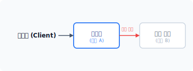
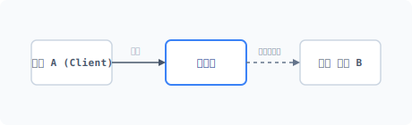
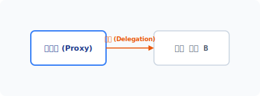
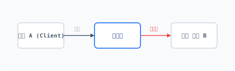


```
proxy
[ 'pra:ksi ]
```
# CHAPTER 13 프록시 패턴

프록시 패턴은 객체 접근을 제어하기 위해 중간 단계에 대리자<sup>Surrogate</sup>를 위치시키는 패턴입니다.


## 13.1 객체를 대행하는 프록시

프록시는 무슨 일을 직접 처리하지 않고 대리자를 내세워 처리를 위임합니다.


### 13.1.1 프록시의 특징

프록시의 특징은 하나의 객체를 두 개로 나눠 재구성한다는 것입니다. 분리하는 이유는 직접적인 접근을 막고 대리할 객체를 구현하기 위해서입니다.

프록시에서 분리된 두 개의 객체는 서로 다른 객체가 아닙니다. 두 객체는 동일한 인터페이스 규격을 갖고 있으며, 프록시는 단지 객체의 접근과 동작을 제어하기 위한 중간 제어 구조가 추가된 객체일 뿐입니다.


### 13.1.2 다양한 프록시

프록시 패턴이 응용되는 범위가 매우 넓기 때문에 하나의 예로 설명하기 어렵습니다. 또한 응

288 2부 구조 패턴

용 범위에 따라 다르게 불리는 파생 프록시들도 많습니다.

대표적인 파생 프록시 패턴은 다음과 같습니다.

* 원격 프록시
* 가상 프록시
* 보호 프록시
* 스마트 프록시

이 외에도 방화벽 프록시, 레퍼런스 프록시, 동기화 프록시 등 다양한 프록시 적용 사례가 있습니다.


## 13.2 객체 가로채기

프록시는 실체 객체를 호출하면 행위를 중간에 가로채서 다른 동작을 수행하는 객체로 변경합니다.


### 13.2.1 실체 객체

프록시 패턴을 실습하려면 먼저 실제로 동작하는 객체가 필요하므로 객체를 하나 설계합니다.

예제 13-1 Proxy/01/RealSubject.php
```php
<?php
// 실체 객체
class RealSubject
{
    public function __construct()
    {
        echo __CLASS__." 객체가 생성되었습니다.\n";
    }

    public function action1()
    {
```

13장 프록시 패턴 289

echo __METHOD__."을(를) 호출합니다.\n";
        echo "실제 action1 작업을 처리합니다.\n\n";
    }

    public function action2()
    {
        echo __METHOD__."을(를) 호출합니다.\n";
        echo "실제 action2 작업을 처리합니다.\n\n";
    }
}
```


### 13.2.2 객체 호출

[예제 13-2]는 [예제 13-1]에서 생성한 실제 클래스의 객체를 호출하는 코드입니다.

예제 13-2 Proxy/01/index.php
```php
<?php
require "RealSubject.php";

$obj = new RealSubject;
$obj->action1();
$obj->action2();
```

```
$ php index.php
RealSubject 객체가 생성되었습니다.
RealSubject::action1을(를) 호출합니다.
실제 action1 작업을 처리합니다.

RealSubject::action2을(를) 호출합니다.
실제 action2 작업을 처리합니다.
```

실체 객체를 생성하고 action1()과 action2() 행위 메서드를 호출했습니다. 이처럼 선언된 클래스의 객체를 생성하고 메서드를 호출하는 동작이 일반적입니다. 다음에는 이 일반적인 동작을 프록시로 분리 처리하는 방법에 대해 알아보겠습니다.

290 2부 구조 패턴

## 13.3 객체 분리

객체를 정교하게 제어해야 하거나 객체 참조가 필요한 경우 프록시 패턴을 사용합니다.


### 13.3.1 대리자

프록시<sup>Proxy</sup>는 대리인을 의미하며, 실제 객체에 직접 접근하지 않고 똑같이 동작하는 대리자<sup>Surrogate</sup>를 생성합니다. 프록시는 대리자 객체를 통해 실제 객체를 가로챈 후 대리자 객체로 우회한 접근을 허용합니다.

#### 그림 13-1 대리자



실제 동작하는 객체는 B입니다. 하지만 객체 B를 직접 호출하지 않고 대리자인 객체 A를 호출합니다. 객체 A는 요청한 동작을 수행하지 않고 객체 B로 처리 요청을 전달합니다.

이처럼 프록시는 우회 접근을 통해 실제 객체를 실행합니다. 우회 접근으로 객체의 정교한 제어 작업이 필요할 때 객체 A를 통해 사전 작업을 수행할 수 있습니다.


### 13.3.2 인터페이스

프록시는 동일한 역할을 수행하는 대리자를 생성하고, 대리자는 원본 객체와 동일한 인터페이스를 적용해 투명성을 갖도록 설계됩니다. 두 객체는 인터페이스를 통해 동일한 규약을 가지며 객체 호출 시 중간에서 행위를 가로챌 수 있습니다.

프록시는 투명성의 특징을 이용해 객체 분리 작업을 실행하고, 프록시를 위한 인터페이스를 설계합니다.

13장 프록시 패턴 291

예제 13-3 Proxy/02/Subject.php
```php
<?php
// 프록시 생성을 위한 인터페이스를 정의합니다.
interface Subject
{
    // 작업1
    public function action1();

    // 작업2
    public function action2();
}
```

Subject 인터페이스는 실제 객체와 동일한 설계 규칙을 정의합니다.


### 13.3.3 인터페이스 적용

투명성으로 정의된 인터페이스를 실제 객체에 적용합니다. 인터페이스는 실제 객체와 동일하게 선언했습니다.

예제 13-4 Proxy/02/RealSubject.php
```php
<?php
// 실체 객체
class RealSubject implements Subject
{
    public function __construct()
    {
        echo __CLASS__." 객체가 생성되었습니다.\n";
    }

    public function action1()
    {
        echo __METHOD__."을(를) 호출합니다.\n";
        echo "실제 action1 작업을 처리합니다.\n\n";
    }

    public function action2()
    {
```

292 2부 구조 패턴

{
        echo __METHOD__."을(를) 호출합니다.\n";
        echo "실제 action2 작업을 처리합니다.\n\n";
    }
}
```

인터페이스를 적용했다고 해서 특정한 변화가 생기는 것은 아닙니다. 인터페이스를 생성한 이유는 실제 객체에 프록시 간의 규약을 전달하기 위해서일 뿐입니다.


## 13.4 프록시 생성

인터페이스를 이용해 프록시 객체를 생성합니다. 프록시 객체를 생성할 때 기존의 실제 객체 정보도 같이 필요합니다.


### 13.4.1 기능 분리

프록시는 실제 객체의 역할을 대신 수행합니다. 실제 객체와 프록시는 전혀 다른 객체가 아니라 동일한 객체처럼 보이며 그렇게 동작합니다. 그러기 위해 인터페이스를 프록시 객체에도 적용합니다.

프록시는 실제 객체를 대신해 행위를 처리하므로 실제 객체의 정보가 필요합니다. 프록시에 별도로 저장된 실제 객체의 정보를 사용하여 행위를 위임합니다.


### 13.4.2 프록시 객체

프록시 객체를 생성합니다. 프록시는 실제 객체에서 선언한 동일 인터페이스를 적용합니다. 인터페이스를 이용해 프록시의 객체를 구현하면 실제 객체와 동일한 메서드를 갖게 됩니다.

예제 13-5 Proxy/02/Proxy.php
```php
<?php
// 프록시 객체
```

13장 프록시 패턴 293

class Proxy implements Subject
{
    public function action1()
    {
        echo __METHOD__."을(를) 호출합니다.\n";
        echo "프록시 action1 작업을 처리합니다.\n";
    }

    public function action2()
    {
        echo __METHOD__."을(를) 호출합니다.\n";
        echo "프록시 action2 작업을 처리합니다.\n";
    }
}
```

인터페이스에 정의된 규약에 맞게 프록시를 설계합니다. 정의한 인터페이스 규약에 맞지 않는 메서드를 설계할 경우 오류가 발생합니다.

#### 그림 13-2 프록시 생성



인터페이스에 맞게 프록시를 생성했습니다. 하지만 프록시는 실제 객체와 분리된 별개의 객체입니다.

또 객체 간 연결도 없습니다. 프록시 객체는 외부와 고립된 객체로 되어 있습니다. 프록시와 실체 객체를 연결하려면 위임이라는 연결 고리가 필요합니다.


### 13.4.3 실체 객체 위임

프록시에서 위임은 프록시 객체와 실제 객체를 연결하는 고리입니다. 다음과 같이 의존성 주입

294 2부 구조 패턴

을 통해 실제 객체와 프록시 객체를 연결합니다.

다음은 프록시 객체를 보완한 코드입니다. 분리된 2개의 객체는 동일한 인터페이스를 가집니다.

예제 13-6 Proxy/03/Proxy.php
```php
<?php
class Proxy implements Subject
{
    private $_object;

    public function __construct($real)
    {
        echo __CLASS__." 객체가 생성이 되었습니다.\n\n";
        $this->_object = $real;
    }

    public function action1()
    {
        echo __METHOD__."을(를) 호출합니다.\n";
        // 행위를 가로챕니다. 실제 객체로 위임합니다.
        $this->_object->action1();
    }

    public function action2()
    {
        echo __METHOD__."을(를) 호출합니다.\n";
        // 행위를 가로챕니다. 실제 객체로 위임합니다.
        $this->_object->action2();
    }
}
```

프록시 객체의 생성자를 통해 원본 객체 정보를 전달 받은 후, 이 객체 정보를 내부 프로퍼티에 저장합니다.

#### 그림 13-3 행위 위임



13장 프록시 패턴 295

프록시 객체가 실체 객체로 행위를 위임하는 것을 봤을 때 프록시 객체는 복합 객체가 됩니다.


### 13.4.4 프록시 출력

이제 생성한 프록시를 통해 실제 객체를 다시 호출해봅시다.

먼저 실제 객체를 생성합니다. 생성된 실제 객체가 프록시 객체로 의존성 주입합니다. 의존성 주입은 프록시 객체의 생성자 인수로 전달합니다.

예제 13-7 Proxy/03/index.php
```php
<?php
require "Subject.php";
require "Proxy.php";
require "RealSubject.php";

$real = new RealSubject;
$proxy = new Proxy($real);
$proxy->action1();
$proxy->action2();
```

프록시 객체로 이전 실습과 동일한 메서드를 호출합니다. 프록시는 전달받은 메서드의 동작을 중간에 가로채고, 위임된 실제 객체로 행위 처리를 다시 요청합니다.

```
$ php index.php
RealSubject 객체가 생성되었습니다.
Proxy 객체가 생성이 되었습니다.

Proxy::action1을(를) 호출합니다.
RealSubject::action1을(를) 호출합니다.
실제 action1 작업을 처리합니다.

Proxy::action2을(를) 호출합니다.
RealSubject::action2을(를) 호출합니다.
실제 action2 작업을 처리합니다.
```

출력 결과는 [예제 13-2]의 출력 결과와 동일합니다. 클라이언트 코드는 실제 객체에 직접 접

296 2부 구조 패턴

근하지 않고 프록시 객체로 대신 실행한다는 것이 차이점입니다.


### 13.4.5 투과적 특성

프록시의 객체는 실제 객체와 동일한 동작을 수행합니다. 프록시는 요청된 동작을 실제 객체로 위임함으로써 동일한 결과를 반환하게 됩니다.

프록시와 실제 객체는 투명성을 보장하기 위해 동일한 인터페이스를 적용받습니다. 실제 객체와 동일한 동작을 그대로 대신하는 것을 투과적 특성이라고 합니다.

#### 그림 13-4 투과성



프록시는 실제적으로 동작을 수행하지 않고 투과적 특성만 갖습니다. 즉 실제 동작을 다시 호출하는 역할만 수행합니다.


## 13.5 행위를 처리하는 핸들러

핸들러는 투과적 특성을 이용하여 요청된 행위를 처리하는 프록시 동작을 말합니다.


### 13.5.1 간접 통로

프록시는 간접화된 객체의 접근 통로를 제공합니다. 간접 통로는 프록시의 투과적 특성을 이용하여 실제 객체의 행위를 위임하고 처리를 요청합니다.

네트워크같은 공간에서는 프록시의 투과적 특성을 이용해 원래 객체의 존재를 숨기기도 합니다. 그렇다고 해도 실제 객체와 프록시는 동일 객체입니다.

13장 프록시 패턴 297

### 13.5.2 핸들러 설계

개발 중에는 실제 객체를 수정하는 경우도 발생합니다. 프록시에서 실제 객체가 변경되면 인터페이스도 같이 바뀝니다. 인터페이스가 변경되면 프록시 객체에도 다시 변경된 인터페이스를 적용해야 합니다.

두 객체의 동일성을 유지하기 위해 같은 인터페이스를 유지하는 것이 중요합니다. 인터페이스에 맞게 프록시 객체에도 변경된 메서드를 생성해야 합니다. 이처럼 프록시 객체의 내부 설계를 동일하게 유지하는 작업은 매우 번거롭습니다.

이를 쉽게 처리하기 위해 핸들러를 프록시 안에 추가합니다. 다음은 핸들러를 추가한 프록시 코드입니다.

예제 13-8 Proxy/04/Proxy.php
```php
<?php
class Proxy implements Subject
{
    private $_object;

    public function __construct($real)
    {
        echo __CLASS__." 객체가 생성이 되었습니다.\n\n";
        $this->_object = $real;
    }

    public function action1()
    {
        echo __METHOD__."을(를) 호출합니다.\n";
        $this->_object->action1();
    }

    public function action2()
    {
        echo __METHOD__."을(를) 호출합니다.\n";
        $this->_object->action2();
    }

    public function __call($method, $args)
    {
        if(method_exists($this->_object, $method)) {
```

288 2부 구조 패턴

$this->_object->$method($args);
        } else {
            print $method."는 실제 존재하는 메서드가 아닙니다.\n";
            var_dump($args);
        }
    }
}
```

핸들러 설계를 위해 매직 메서드 `__call()`을 사용합니다. `__call()` 메서드는 객체 내부에 존재하지 않는 메서드가 호출될 때 자동 실행되는 매직 메서드입니다.

클라이언트 사용자가 프록시에 없는 메서드를 호출할 경우 `__call()` 메서드가 대신 실행되고, `__call()` 메서드는 요청된 메서드가 있는 실제 객체를 탐색합니다. 실제 객체에 요청된 메서드가 있으면 위임 처리합니다.

`__call()` 매직 메서드는 2개의 인자값을 전달 받는데, 바로 호출되는 메서드명과 전달된 인수값의 배열입니다.


### 13.5.3 실체 객체 변경

핸들러 동작을 실습하기 위해 실제 객체를 변경해봅시다. 실제 객체에 action3() 메서드를 추가합니다.

예제 13-9 Proxy/04/RealSubject.php
```php
<?php
// 실제 객체
class RealSubject implements Subject
{
    public function __construct()
    {
        echo __CLASS__." 객체가 생성되었습니다.\n";
    }

    public function action1()
    {
```

13장 프록시 패턴 299

echo __METHOD__."을(를) 호출합니다.\n";
        echo "실제 action1 작업을 처리합니다.\n\n";
    }

    public function action2()
    {
        echo __METHOD__."을(를) 호출합니다.\n";
        echo "실제 action2 작업을 처리합니다.\n\n";
    }

    public function action3()
    {
        echo __METHOD__."을(를) 호출합니다.\n";
        echo "실제 action3 작업을 처리합니다.\n\n";
    }
}
```

프록시 객체에는 아직 실제 객체에 추가한 action3() 메서드가 선언되지 않았습니다.


### 13.5.4 핸들러 실습

설계한 핸들러를 실습해보겠습니다. 실제 객체에 있는 메서드와 실제 객체에 없는 메서드를 각각 호출합니다.

예제 13-10 Proxy/04/index.php
```php
<?php
require "Subject.php";
require "Proxy.php";
require "RealSubject.php";

$real = new RealSubject;
$proxy = new Proxy($real);
$proxy->action1();
$proxy->action2();

$proxy->action3();
$proxy->action4();
```

300 2부 구조 패턴

action3() 메서드의 경우 실제 객체에는 존재하지만 프록시와 인터페이스에는 존재하지 않습니다. 프록시는 정의되지 않은 메서드 호출에 대해 `__call()` 매직 메서드로 핸들러를 처리합니다. `__call()` 메서드는 실제 객체에 요청한 메서드가 있는지 검사하여 호출을 위임 처리합니다.

```
$ php index.php
RealSubject 객체가 생성되었습니다.
Proxy 객체가 생성이 되었습니다.

Proxy::action1을(를) 호출합니다.
RealSubject::action1을(를) 호출합니다.
실제 action1 작업을 처리합니다.

Proxy::action2을(를) 호출합니다.
RealSubject::action2을(를) 호출합니다.
실제 action2 작업을 처리합니다.

RealSubject::action3을(를) 호출합니다.
실제 action3 작업을 처리합니다.

action4는 실제 존재하는 메서드가 아닙니다.
array(0) {
}
```

action4() 메서드는 프록시와 실제 객체에 모두 존재하지 않는 메서드입니다. 프록시의 핸들러는 존재하지 않는 메서드 호출을 중단합니다. 이처럼 핸들러를 이용하면 프록시의 호출을 동적으로 처리할 수 있습니다.


## 13.6 동적 프록시

프록시에는 실제 객체를 숨기는 효과가 있습니다. 객체를 호출하는 쪽에서는 실행되는 객체가 실제 객체인지 프록시인지 몰라야 합니다.

13장 프록시 패턴 301

### 13.6.1 동적 클래스

우리는 앞에서 프록시의 객체를 생성했습니다. 클라이언트 코드에서는 행동을 처리하기 위해 프록시와 실제 객체를 구별하지 않습니다. 즉 프록시 객체를 생성할지 실제 객체를 생성할지 판단하지 않고 객체를 생성해서 사용할 수 있어야 합니다.

그러면 어떻게 프록시와 실제 객체를 구별하지 않고 접근하는 객체의 인스턴스를 만들 수 있을까요? 이를 해결하는 방법은 팩토리 패턴을 같이 사용해 객체를 동적으로 생성하는 것입니다.

이처럼 패턴은 하나만 사용하지 않으며 다른 패턴과 결합해 문제를 보다 유연하게 해결합니다.


### 13.6.2 팩토리 패턴

팩토리 패턴을 적용하여 프록시 객체를 생성해봅시다. 팩토리 패턴으로 객체의 생성을 대신 처리하도록 요청하겠습니다.

예제 13-11 Proxy/05/ProxyFactory.php
```php
<?php
// 프록시 팩토리
class ProxyFactory
{
    public function getObject()
    {
        $real = new RealSubject;
        return new Proxy($real);
    }
}
```

클라이언트는 팩토리에 객체 생성만 요청할 뿐이며 반환되는 객체가 프록시인지 실제 객체인지 알 수 없습니다. 또한 실시간으로 프록시 객체를 동적 생성할 수도 있습니다.

동적 생성되는 프록시 객체를 적용해보겠습니다.

예제 13-12 Proxy/05/index.php
```php
<?php
require "Subject.php";
```

302 2부 구조 패턴

```php
require "Proxy.php";
require "RealSubject.php";

require "ProxyFactory.php";

$factory = new ProxyFactory;
$proxy = $factory->getObject(); // 프록시 동적 생성
$proxy->action1();
$proxy->action2();

$proxy->action3();
$proxy->action4();
```

출력 결과는 이전과 동일합니다.

```
$ php index.php
RealSubject 객체가 생성되었습니다.
Proxy 객체가 생성이 되었습니다.

Proxy::action1을(를) 호출합니다.
RealSubject::action1을(를) 호출합니다.
실제 action1 작업을 처리합니다.

Proxy::action2을(를) 호출합니다.
RealSubject::action2을(를) 호출합니다.
실제 action2 작업을 처리합니다.

RealSubject::action3을(를) 호출합니다.
실제 action3 작업을 처리합니다.

action4는 실제 존재하는 메서드가 아닙니다.
array(0) {
}
```


### 13.6.3 프록시 확인

팩토리 패턴을 같이 사용할 경우 클라이언트에서는 실제 객체를 사용하는지 팩토리 객체를 사용하는지 구별할 수 없습니다.

13장 프록시 패턴 303

필요에 따라 이를 확인할 수 있도록 프록시 클래스에 전용 메서드를 하나 더 추가합니다.

```php
public function isProxy()
{
    return true;
}
```

이처럼 팩토리 클래스에 추가 메서드를 넣어두면 객체를 구별할 수 있습니다.


## 13.7 원격 프록시

원격 프록시<sup>Remote Proxy</sup>는 프록시 패턴을 가장 많이 응용하는 적용 사례이며 주로 데이터 전달을 목적으로 사용합니다.


### 13.7.1 프록시 vs. 어댑터

두 개의 객체를 이어준다는 역할적인 측면에서 두 패턴은 서로 유사합니다. 어댑터 패턴은 서로 다른 인터페이스를 맞춰주는 반면, 프록시는 투과적 특성으로 동일한 인터페이스를 유지합니다.

프록시 패턴은 객체를 분리하는 역할을 하고, 원격 프록시는 분리된 객체에 투과적 특성을 결합해 객체의 연결을 제어합니다.

[예제 13-13]을 보면서 학습해봅시다. 앞에서 작성한 [예제 13-9]를 수정해보겠습니다.

예제 13-13 Proxy/06/RealSubject.php
```php
<?php
// 실체 객체
class RealSubject implements Subject
{
    public function __construct()
    {
```

304 2부 구조 패턴

echo __CLASS__." 객체가 생성되었습니다.\n";
    }

    public function action1()
    {
        echo __METHOD__."을(를) 호출합니다.\n";
        return "실제 action1 작업을 처리합니다.\n\n";
    }

    public function action2()
    {
        echo __METHOD__."을(를) 호출합니다.\n";
        return "실제 action2 작업을 처리합니다.\n\n";
    }

    public function action3()
    {
        echo __METHOD__."을(를) 호출합니다.\n";
        return "실제 action3 작업을 처리합니다.\n\n";
    }
}
```

변경된 실제 객체는 메시지를 직접 출력하지 않고 출력 문자열을 반환합니다.


### 13.7.2 캐싱 처리

웹 HTTP에서 프록시라는 단어를 많이 들어봤을 것입니다. 프록시는 HTTP에서 웹페이지를 캐시 처리함으로써 속도를 개선하고 우회 접속을 시도합니다.

우리도 이와 유사한 방법으로 프록시 코드를 변경해봅시다.

예제 13-14 Proxy/06/proxy.php
```php
<?php
class Proxy implements Subject
{
    private $_object;

    public function __construct($real)
    {
```

13장 프록시 패턴 305

echo __CLASS__." 객체가 생성되었습니다.\n\n";
        $this->_object = $real;
    }

    public function action1()
    {
        echo __METHOD__."을(를) 호출합니다.\n";
        return "action1은 기능이 대체되었습니다.\n";
    }

    public function action2()
    {
        echo __METHOD__."을(를) 호출합니다.\n";
        if($msg = $this->_object->action2()) {
            return $msg;
        } else {
            return "실체 객체에서 문자열을 반환 받지 못하였습니다.";
        }
    }

    public function __call($method, $args)
    {
        if(method_exists($this->_object, $method)) {
            if($msg = $this->_object->$method($args)) {
                return $msg;
            } else {
                return "실체 객체에서 문자열을 반환 받지 못하였습니다.";
            }

        } else {
            print $method."는 실제 존재하는 메서드가 아닙니다.\n";
            var_dump($args);
        }
    }
}
```

action2()는 실제 객체에서 출력 문자열을 반환 받으며, 반환값이 없는 경우 대체 오류 문자열을 반환 받습니다.

306 2부 구조 패턴

### 13.7.3 원격 프록시 실습

원격 프록시 패턴을 적용하여 동작을 출력해보겠습니다.

예제 13-15 Proxy/06/index.php
```php
<?php
require "Subject.php";
require "Proxy.php";
require "RealSubject.php";

require "ProxyFactory.php";

$factory = new ProxyFactory;
$proxy = $factory->getObject();

echo $proxy->action1();
echo $proxy->action2();

echo $proxy->action3();
echo $proxy->action4();
```

원격 프록시는 투과적인 특징을 활용해 원격 객체의 접근과 결과값을 반환합니다.


### 13.7.4 대체 처리

프록시 패턴을 적용할 때는 실제 객체와 프록시 객체로 분리됩니다. 객체 분리가 가능한 이유는 동일한 인터페이스를 모두 적용했기 때문입니다.

실체 객체와 프록시 객체는 서로 다르지만 유사한 객체입니다. 이러한 유사점을 이용하여 특정한 기능은 다르게 행동하도록 처리할 수도 있습니다. 다른 행동으로 처리가 변경된 것은 프록시 객체에서 대체하고, 원래의 행동은 실제 객체로 위임하여 처리합니다. 다음은 [예제 13-15]의 출력 결과입니다.

```
$ php index.php
RealSubject 객체가 생성되었습니다.
Proxy 객체가 생성이 되었습니다.
```

13장 프록시 패턴 307

```
Proxy::action1을(를) 호출합니다.
action1은 기능이 대체되었습니다.
Proxy::action2을(를) 호출합니다.
RealSubject::action2을(를) 호출합니다.
실제 action2 작업을 처리합니다.

RealSubject::action3을(를) 호출합니다.
실제 action3 작업을 처리합니다.

action4는 실제 존재하는 메서드가 아닙니다.
array(0) {
}
```

출력 결과를 보면 action1 프록시는 대체된 메시지로 확인되는데, 그 이유는 프록시 내부에서 동작을 변경했기 때문입니다.

action2 프록시 호출 동작은 프록시에서 처리하지 않고 실제 객체로 위임하며 결과값을 받아 화면에 출력합니다.


### 13.7.5 객체의 대리

이처럼 프록시는 어떠한 일을 대신해서 처리합니다. 객체의 동작을 위임할 수도 있고 변경된 행위를 대신할 수도 있습니다. 하지만 프록시가 행위를 대리하는 데는 한계가 있습니다. 모든 것을 대신해서 처리할 수는 없습니다.

대리로 처리할 수 없는 동작은 본래의 객체로 접근해서 처리해야 합니다. 이는 프록시의 투과성을 의미합니다.


## 13.8 가상 프록시

가상 프록시<sup>Virtual Proxy</sup>는 프로그램의 실행 속도를 개선하기 위한 패턴입니다. 프록시 패턴을 이용하여 무거운 객체 생성을 잠시 유보합니다.

308 2부 구조 패턴

### 13.8.1 초기화 로딩

프로그램은 수많은 객체를 생성하고, 생성된 객체에 접근하기도 합니다. 일부 프로그램은 내부에서 필요한 객체를 미리 생성하는 작업을 하기도 합니다. 이를 부트스트랩핑 과정이라고 합니다.

초기화 작업은 프로그램이 시작될 때 관련성 있는 객체 생성들을 처리해야 하므로 실행 지연이 발생합니다. 사실 기동 시 모든 객체를 생성하는 것보다 필요할 때마다 객체를 생성해 사용하는 것이 더 효과적입니다.

가상 프록시 패턴은 실제로 동작하는 객체를 생성하지 않고, 필요 시점에서 객체를 동적으로 생성하도록 프록시 객체로 대신 연결합니다. 가상 프록시는 게으른 초기화<sup>lazy initialization</sup>와 유사합니다.


### 13.8.2 게으른 초기화

프로그램 실행 시 객체를 초기화하는 작업은 많은 시간을 소모합니다. 객체 생성 수가 많을수록 기동시간이 느려집니다. 하지만, 프로그램 초기화에서 생성된 모든 객체를 즉시 사용하지는 않습니다.

사용빈도가 낮은 객체 생성까지 초기화 과정에서 실행됨으로써 불필요한 지연시간이 발생하기도 합니다. 게으른 초기화는 이러한 단점을 보완하기 위해 가상 프록시를 사용합니다. 실제 객체를 생성하지 않고 가상의 프록시만 생성 반환합니다. 가상의 프록시는 실제 객체 생성보다 더 빨리 객체를 생성, 반환할 수 있습니다.

가상 프록시는 프로그램에 껍데기만 있는 객체를 전달합니다. 가상 프록시를 통해 실제 객체의 접근이 필요할 때 원본 객체를 동적으로 생성하여 프록시와 연결합니다. 이러한 동적 객체 연결 방식은 초기화 작업에서 오래 걸리는 객체를 처리할 때 유용합니다. 객체의 초기화 작업으로 지연되는 시간 없이 빠르게 코드 작업을 수행할 수 있습니다.


### 13.8.3 속도 개선

다수의 초기화 작업은 프로그램이 처음 실행될 때 속도에 영향을 주는데, 가상화된 프록시를

13장 프록시 패턴 309

통해 객체 생성을 임시 처리함으로써 시스템 성능을 최적화할 수 있습니다.

인스턴스화는 객체를 생성하고 메모리 자원을 할당 받기 위해 컴퓨터 내부 연산을 필요로 합니다.

객체를 생성하는 연산량에 따라서 약간의 지연 시간이 발생하는데, 가상 프록시를 사용하면 즉시 실행이 필요한 객체를 제외하고는 객체의 실행 시간을 줄일 수 있습니다.


### 13.8.4 실습

[예제 13-16]에서는 이전에 실습한 [예제 13-15]를 가상 프록시 패턴으로 변경해보겠습니다.

예제 13-16 Proxy/07/index.php
```php
<?php
require "Subject.php";
require "Proxy.php";
require "RealSubject.php";

$proxy = new Proxy();
$proxy->action1();
$proxy->action2();
```

프록시 객체는 실제 객체를 인자값으로 넘겨받아 의존성 결합을 실행합니다. 하지만 가상 프록시에서는 프록시 객체만 생성하고 원본의 실제 객체는 프록시 안에서 관리합니다.


### 13.8.5 플라이웨이트 패턴 결합

가상 프록시를 구현하기 위해 프록시의 내부 구조를 약간 변경하겠습니다.

프록시 객체 외부에서 주입되는 의존 객체의 설정을 삭제합니다. 가상 프록시는 내부적으로 의존된 객체를 생성하도록 설계합니다.

예제 13-17 Proxy/07/Proxy.php
```php
<?php
```

310 2부 구조 패턴

class Proxy implements Subject
{
    private $_object;

    public function __construct()
    {
        echo __CLASS__." 객체가 생성되었습니다.\n";
    }

    public function action1()
    {
        echo __METHOD__."을(를) 호출합니다.\n";
        echo "action1 작업을 처리합니다.\n\n";
    }

    public function action2()
    {
        echo __METHOD__."을(를) 호출합니다.\n";
        // 게으른 객체 생성
        if(!$this->_object) $this->real();
        $this->_object->action2();
    }

    private function real()
    {
        echo "실체 객체를 생성합니다.\n";
        $this->_object = new RealSubject;
    }
}
```

가상 프록시는 내부적으로 실제 객체의 정보를 직접 생성 관리합니다. 이때 같이 사용되는 패턴으로 플라이웨이트가 있습니다.

action2()는 실제 객체와 연결돼 있습니다. 만일 실제 객체가 없다면 가상 프록시 내부에서 실제 객체를 생성합니다. 조건문을 이용하여 객체의 존재 유무를 판단 처리합니다.

```php
// 게으른 객체 생성
if(!$this->_object) $this->real();
```

가상 프록시의 action2()가 처음 실행될 경우 실제 객체의 정보가 없으므로 real() 메서드를 호출하여 객체를 생성합니다. 실제 객체는 공유를 위한 프로퍼티에 저장합니다.

13장 프록시 패턴 311

두 번째 action2()가 호출될 때는 실제 객체를 다시 생성하지 않고 내부에 저장된 프로퍼티를 참조하여 실제 객체를 사용합니다. 처음으로 action2()가 실행될 때는 다소 지연시간이 발생할 수 있습니다. 하지만 두 번째 호출부터는 실제 객체를 생성하지 않으므로 빠르게 동작합니다.

객체 생성을 real() 메서드 형태로 분리했습니다. real()은 간단 팩토리 패턴을 응용한 것입니다.


### 13.8.6 결과 확인

원격 프록시와 가상 프록시의 결과는 동일합니다. 다만 RealSubject의 객체 생성 단계에 차이가 있을 뿐입니다.

```
$ php index.php
Proxy 객체가 생성되었습니다.
Proxy::action1을(를) 호출합니다.
action1 작업을 처리합니다.

Proxy::action2을(를) 호출합니다.
실체 객체를 생성합니다.
RealSubject 객체가 생성되었습니다.
RealSubject::action2을(를) 호출합니다.
실제 action2 작업을 처리합니다.
```


### 13.8.7 프레임워크 응용

최신 프레임워크는 실행 시 필요한 클래스의 인스턴스를 미리 생성하여 사용하는 경우가 많습니다. 이를 컨테이너라는 배열로 저장해 객체를 관리합니다.

하지만 이렇게 생성된 모든 객체를 코드에서 전부 사용하는 것은 아닙니다. 필요한 객체와 불필요한 객체가 동시에 생성되며, 불필요한 객체는 코드의 기동 시간만 늦추게 됩니다.

객체의 배열을 초기화할 때 가상 프록시 패턴을 이용하면 보다 효율적으로 자원을 관리할 수 있습니다.

312 2부 구조 패턴

## 13.9 보호용 프록시

프록시 패턴의 또 다른 적용 사례로 통제 제어 목적이 있습니다. 객체 접근을 제어하기 위해 객체의 대리자<sup>surrogate</sup> 또는 표시자<sup>placeholder</sup>를 제공합니다.


### 13.9.1 통제

객체를 사용하기 위해서는 생성 과정과 자원 할당이 필요합니다. 하지만 객체에 접근 권한이 없는 사람이 프로그램을 사용하고자 할 때 제한된 객체 생성까지 할 필요는 없습니다. 권한이 없는 객체를 생성 과정에서 배제하면 자원 낭비를 줄일 수 있습니다.

프록시를 통해 먼저 제어권을 확인한 후 실제적인 객체를 생성하는 것이 더 좋습니다. 이 경우 보호용 프록시 패턴을 적용합니다.


### 13.9.2 권한 추가

프록시는 실제 객체로 접근을 시도할 때 접근을 관리하는 책임을 같이 부여하며 권한 정보는 프록시 인자로 전달합니다.

예제 13-18 Proxy/08/index.php
```php
<?php
require "Subject.php";
require "Proxy.php";
require "RealSubject.php";

const ACT1 = 0x01;
const ACT2 = 0x02;
$permit = ACT1;

$proxy = new Proxy($permit);
$proxy->action1();
$proxy->action2();
```

프록시는 전달받은 권한에 따라서 내부를 설정합니다. 프록시는 실제 객체와 동일한 메서드를

13장 프록시 패턴 313

갖고 있으며, 프록시의 동일한 메서드를 호출할 때 권한 정보를 같이 검사하여 객체를 생성합니다. 권한이 없으면 실제 연결 객체도 생성하지 않습니다.

예제 13-19 Proxy/08/Proxy.php
```php
<?php
class Proxy implements Subject
{
    private $_object;
    private $_permit;

    public function __construct($permit)
    {
        echo __CLASS__." 객체가 생성되었습니다.\n";
        $this->_permit = $permit;
    }

    public function action1()
    {
        echo __METHOD__."을(를) 호출합니다.\n";
        echo "action1 작업을 처리합니다.\n\n";
    }

    public function action2()
    {
        echo __METHOD__."을(를) 호출합니다.\n";

        if($this->_permit & 0x02) {
            // 게으른 객체 생성
            if(!$this->_object) $this->real();
            $this->_object->action2();
        } else {
            echo "action2 실행 권한이 없습니다.";
        }
    }

    private function real()
    {
        echo "실체 객체를 생성합니다.\n";
        $this->_object = new RealSubject;
    }
}
```

314 2부 구조 패턴

보호용 프록시 패턴을 응용하면 자원을 효율적으로 관리할 수 있습니다.

```
$ php index.php
Proxy 객체가 생성되었습니다.
Proxy::action1을(를) 호출합니다.
action1 작업을 처리합니다.

Proxy::action2을(를) 호출합니다.
action2 실행 권한이 없습니다.
```


### 13.9.3 보호용 프록시 vs. 장식자

2개의 패턴은 객체를 동적으로 확장하여 실행할 수 있다는 점에서 유사합니다. 장식자 패턴의 목적이 새로운 기능을 추가하는 것이라면, 보호용 프록시는 접근을 제어하기 위해 코드를 추가하는 것입니다. 접근을 통제한 후 실제 객체로 접속을 중개합니다.


## 13.10 스마트 참조자

프록시는 실제 객체에 접근할 때 추가 행위를 부여하여 호출할 수 있습니다. 스마트 참조자<sup>smart reference</sup>는 장식자 패턴과 유사하게 객체를 동적으로 확장 응용하는 기법입니다.


### 13.10.1 확장

프록시 패턴은 구조를 응용하여 객체를 확장할 수 있습니다. 실제 객체를 호출하여 행동을 수행하기 전에 프록시 내부에 어떤 작업을 같이 추가해서 실행하는 경우입니다. 이를 스마트 참조자 프록시라고 합니다.


### 13.10.2 응용

기존에 동작을 처리하던 실제 객체가 있습니다. 이 객체가 동작을 수행하기 전 또는 후에 추가

13장 프록시 패턴 315

동작을 삽입합니다.

예제 13-20 Proxy/09/Proxy.php
```php
<?php
class Proxy implements Subject
{
    private $_object;
    private $_permit;

    public $_action1;

    public function __construct($permit)
    {
        echo __CLASS__." 객체가 생성이 되었습니다.\n";
        $this->_permit = $permit;
    }

    public function action1()
    {
        echo __METHOD__."을(를) 호출합니다.\n";
        $this->_action1++; // 추가 동작
        echo "action1 작업을 처리합니다.\n\n";
    }

    public function action2()
    {
        echo __METHOD__."을(를) 호출합니다.\n";

        if($this->_permit & 0x02) {
            // 게으른 객체 생성
            if(!$this->_object) $this->real();
            $this->_object->action2();
        } else {
            echo "action2 실행 권한이 없습니다.";
        }
    }

    private function real()
    {
        echo "실체 객체를 생성합니다.\n";
        $this->_object = new RealSubject;
    }
}
```

316 2부 구조 패턴

실체 객체를 직접 수정하는 것보다 프록시 패턴을 통해 추가 행동을 대신 처리하도록 하는 것이 좋습니다.

프록시의 action1() 메서드 호출 횟수를 카운트하는 기능을 추가했습니다.

예제 13-21 Proxy/09/index.php
```php
<?php
require "Subject.php";
require "Proxy.php";
require "RealSubject.php";

const ACT1 = 0x01;
const ACT2 = 0x02;
$permit = ACT1;

$proxy = new Proxy($permit);
$proxy->action1();
$proxy->action1();

echo "Action1 실행횟수=".$proxy->_action1."\n";
```

프록시를 통해 action1() 메서드를 여러 번 호출한 후 호출 횟수를 읽어옵니다. 이처럼 프록시 패턴을 이용하면 실제 코드를 변경하지 않고도 추가 작업을 부여할 수 있습니다.

```
$ php index.php
Proxy 객체가 생성이 되었습니다.
Proxy::action1을(를) 호출합니다.
action1 작업을 처리합니다.

Proxy::action1을(를) 호출합니다.
action1 작업을 처리합니다.

Action1 실행횟수=2
```

13장 프록시 패턴 317

## 13.11 정리

프록시 패턴의 적용 사례는 매우 다양합니다. 또한 다른 패턴과 결합하여 프록시 패턴이 사용되는 경우도 많습니다.

프록시 패턴의 특징은 투명성을 이용해 객체를 분리하여 재위임한다는 것입니다. 분리된 객체를 위임함으로써 대리 작업을 중간 단계에 삽입할 수 있으며, 분리된 객체를 동적으로 연결함으로써 객체의 실행 시점을 관리할 수도 있습니다. 프록시 패턴은 세밀한 객체의 접근이 필요할 때도 매우 유용합니다.

318 2부 구조 패턴

