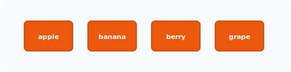
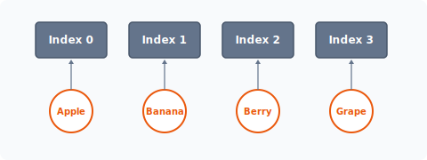
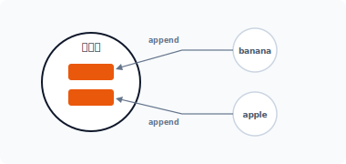
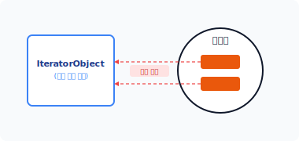


# CHAPTER 14 반복자 패턴

it·er·a·tor  
[ ítərèitər ]  

반복자 패턴<sup>1</sup>은 내부 구조를 노출하지 않고 집합체를 통해 원소 객체에 순차적으로 접근할 수 있는 방법을 제공합니다.


## 14.1 객체의 집합

집합은 어떤 조건에 의해 모인 요소의 묶음입니다. 객체의 데이터 또는 기능을 집합으로 묶어 처리할 수 있습니다.


### 14.1.1 배열로 데이터 묶기

변수는 하나의 데이터를 가집니다. 이와 달리 배열은 유사한 조건의 데이터를 하나의 집합으로 묶어서 처리합니다.

다음은 과일 이름을 배열로 저장합니다.

```php
$fruit = ['apple', 'banana', 'berry', 'grape'];
```

---
1 영문 표현으로는 이터레이터 패턴이라고 합니다.

326 3부 행동 패턴

배열의 특징은 하나의 변수명을 사용해 여러 데이터를 저장한다는 것입니다. PHP와 같은 동적 데이터를 저장하는 언어에서는 배열에 문자열뿐만 아니라 다양한 종류의 데이터 타입을 저장할 수 있습니다.

하나의 배열은 복수의 데이터를 가집니다. 즉, 데이터를 그룹화합니다. 배열 각각의 요소는 색인을 이용해 접근하며 각 색인은 숫자 또는 키<sup>key</sup>값을 이용해 접근합니다.


### 14.1.2 반복문

반복문은 코드의 일부분을 반복 실행합니다. 반복문 중에서는 for문과 while문을 가장 많이 사용합니다.

for문은 변수를 초기화해 지정된 횟수만큼 일정 영역의 코드를 반복합니다. 이때 for문은 변수를 1씩 늘릴 수 있으며 이 변수를 배열의 색인값으로 사용할 수 있습니다.

예제 14-1 Iterator/01/index.php
```php
<?php
$fruit = ['apple', 'banana', 'berry', 'grape'];
for ($i=0; $i<count($fruit); $i++) {
    echo $fruit[$i]."\n";
}
```

#### 그림 14-1 배열값



```
$ php index.php
apple
banana
berry
grape
```

14장 반복자 패턴 327

예제에서 `$i` 변수는 0으로 초기화되고 증가 연산자(++)를 이용해 변수를 +1씩 늘립니다. `$i`는 `$fruit` 배열의 색인값으로 사용되며 배열의 각 요소에 접근합니다.

배열과 반복문(for문, while문)의 동작은 향후 반복자 패턴으로 확장됩니다.


## 14.2 배열

배열은 집합 개념을 이해하는 데 도움이 되는 학습 예제입니다. 배열과 집합에 대해 좀 더 알아보겠습니다.


### 14.2.1 요소 객체

집합은 여러 개의 데이터를 하나로 묶습니다. 묶인 데이터 하나를 요소라고 하며, 반복자 패턴에서는 객체를 하나의 데이터 요소로 처리합니다. 또한 반복자 패턴에서는 객체로 묶인 요소들을 관리하고 실행합니다.

선언된 클래스는 인스턴스화를 통해 객체로 생성되고, 생성된 여러 객체들은 배열로 묶어 관리합니다. 다음 예제는 과일 정보를 담는 클래스를 선언합니다.

예제 14-2 Iterator/02/Fruit.php
```php
<?php
class Fruit
{
    public $name;

    public function __construct($name)
    {
        $this->name = $name;
    }

    public function getName()
    {
        return $this->name;
    }
}
```

328 3부 행동 패턴

### 14.2.2 순서

먼저 요소로 묶일 객체의 클래스를 선언했습니다. 선언한 Fruit 클래스를 이용해 객체들을 생성합니다. 생성된 객체는 다시 배열로 묶어 저장합니다.

다음은 배열을 이용해 복수의 객체를 묶은 코드의 일부입니다.

```php
$fruit = [
    new Fruit("Apple"),
    new Fruit("Banana"),
    new Fruit("Berry"),
    new Fruit("Grape")
];
```

`$fruit` 배열 안에서는 인스턴스화를 통해 객체를 생성함과 동시에 객체를 배열로 묶습니다. 묶인 배열은 순차적으로 저장됩니다.

#### 그림 14-2 인덱스 객체 배열



요소를 하나의 집합으로 묶으면 각각의 요소는 순서를 가집니다. 이 순서는 색인 또는 키를 통해 묶을 수 있습니다. 순차적<sup>indexed</sup>으로 묶인 배열은 인덱스 번호를 통해 접근합니다.


### 14.2.3 순환

순환은 모든 요소에 하나씩 접근하여 실행하는 것을 말합니다. 배열이 여러 개의 객체를 가진

14장 반복자 패턴 329

경우 각각의 객체에 접근해서 사용합니다.

배열의 객체 요소를 순환할 때는 for문과 같은 반복문을 사용합니다. 다음 예제는 생성한 객체 배열을 하나씩 순환하여 객체에 접근하는 것입니다.

예제 14-3 Iterator/02/index.php
```php
<?php
require_once "Fruit.php";

$fruit = [
    new Fruit("Apple"),
    new Fruit("Banana"),
    new Fruit("Berry"),
    new Fruit("Grape")
];

for ($i=0; $i<count($fruit); $i++) {
    echo $fruit[$i]->getName()."\n";
}
```

```
$ php index.php
Apple
Banana
Berry
Grape
```

반복자는 객체에 순차적으로 접근하여 처리를 수행하는 동작과 유사합니다.


## 14.3 집합체

반복자는 객체의 효율적인 집합 관리를 위해 별도의 집합체<sup>Aggregate</sup>를 갖고 있습니다. Aggregate는 사전적으로 '집합', '모으다'라는 의미가 있습니다.

330 3부 행동 패턴

### 14.3.1 집합 객체

집합체는 단순 배열과 달리 복수의 객체를 가진 복합 객체입니다. 집합체를 다른 말로 컬렉션<sup>collection</sup>이라고 합니다.

반복자 패턴은 배열을 사용하지 않고 별도의 컬렉션 객체를 생성합니다. 컬렉션 객체로 설계하는 이유는 패턴으로서 효율적으로 객체를 관리하기 위해서입니다. 컬렉션의 메서드를 통해서는 새로운 객체를 추가하거나 삭제하는 행위를 쉽게 처리할 수 있습니다.

일부 프로그래밍 언어는 배열의 크기를 제한하는 경우가 있습니다. 이때, 컬렉션을 응용하면 보다 유연하게 확장할 수 있습니다.


### 14.3.2 인터페이스

집합체를 위한 인터페이스를 설계합니다. 인터페이스는 컬렉션에서 처리하는 메서드 규약을 정의합니다.

예제 14-4 Iterator/03/Aggregate.php
```php
<?php
interface Aggregate
{
    public function iterator();
}
```

집합체는 객체의 순환 반복을 처리하기 위해 한 개의 iterator() 메서드를 인터페이스로 선언합니다.


### 14.3.3 컬렉션

컬렉션은 객체의 모음입니다.<sup>2</sup> 다음 예제에서는 Aggregate 인터페이스를 적용하여 집합체 객체를 생성합니다.

---
2 다른 용어로 '객체의 컨테이너'라고도 합니다.

14장 반복자 패턴 331

예제 14-5 Iterator/03/Collection.php
```php
<?php
// 컬렉션
class Collection implements Aggregate
{
    // 외부의 직접 수정을 방지합니다.
    private $objs = [];
    private $last = 0;

    // 집합에서 하나의 객체를 반환합니다.
    public function getObj($id)
    {
        return $this->objs[$id];
    }

    // 전체 객체의 개수를 반환합니다.
    public function getLast()
    {
        return $this->last;
    }

    // 새로운 객체를 추가합니다.
    public function append($obj)
    {
        array_push($this->objs, $obj);
        $this->last++;
    }

    // 인터페이스 구현
    public function iterator()
    {
        // 이터레이터 객체를 생성합니다.
        return new IteratorObject($this);
    }
}
```

컬렉션으로 묶은 각각의 객체는 요소<sup>element</sup>입니다. 컬렉션은 append() 메서드가 전달한 객체를 내부의 `$objs` 배열에 저장합니다.

객체를 추가하는 경우 객체의 `$last`값을 1씩 증가시킵니다.

332 3부 행동 패턴

#### 그림 14-3 컬렉션 객체



컬렉션은 순환하는 객체를 가진 단순한 묶음의 객체입니다.


### 14.3.4 제어권

컬렉션은 복수의 객체를 가진 집합체로, 내부 객체의 반복 순환을 처리하기 위해 동작을 분리합니다. 분리된 제어부는 필요에 따라 내부 또는 외부에 위치할 수 있습니다. 외부 반복자는 사용자가 반복 제어를 직접 결정하고, 내부 반복자는 내부 제어를 반복자가 처리합니다.

복합체는 주로 외부 반복자를 사용하며 [예제 14-4]에서는 외부 반복자를 사용하기 위해 iterator() 메서드를 제공합니다. iterator() 메서드는 외부의 반복자 객체를 생성합니다.


## 14.4 반복자

반복자는 묶여 있는 객체들에 순차적으로 접근하여 처리할 수 있는 로직들을 제공합니다. 또한, 컬렉션 안에 있는 객체를 순환 반복하기 위해 외부 반복자를 분리하여 설계합니다.


### 14.4.1 인터페이스

반복자 패턴이 객체를 순환 처리하기 위해서는 몇 가지 메서드가 필요합니다. 설계 시 메서드

14장 반복자 패턴 333

의 생성 의무를 부여하는 인터페이스를 선언합니다.

PHP, 자바와 같은 언어들은 반복자 패턴을 응용하기 위해 내장된 인터페이스를 자체적으로 제공하기도 합니다.

다음은 PHP 내부적으로 제공되는 SPL 인터페이스입니다.

```php
interface Iterator extends Traversable {
    /* Methods */
    abstract public current ( void ) : mixed
    abstract public key ( void ) : scalar
    abstract public next ( void ) : void
    abstract public rewind ( void ) : void
    abstract public valid ( void ) : bool
}
```

반복자를 설계할 때는 반복 개념을 일반화하여 다형성을 추가하는 것이 중요합니다.

실습을 위해 인터페이스를 추가로 설계하겠습니다.

예제 14-6 Iterator/03/PloyIterator.php
```php
<?php
interface PloyIterator
{
    public function isNext();
    public function next();
}
```

반복자의 인터페이스는 요소를 선택하는 메서드를 포함합니다. 필요한 경우 더 다양한 메서드를 추가할 수 있습니다.


### 14.4.2 반복 객체

선언한 PloyIterator 인터페이스를 적용하여 반복 객체를 선언합니다. 반복 객체는 몇 가지 제어 메서드를 필요로 하므로 함께 구현합니다.

334 3부 행동 패턴

예제 14-7 Iterator/03/IteratorObject.php
```php
<?php
// 집합체: 이터레이터
class IteratorObject implements PloyIterator
{
    private $Aggregate;
    private $index = 0;

    public function __construct($agg)
    {
        $this->Aggregate = $agg;
    }

    public function isNext()
    {
        if ($this->index >= $this->Aggregate->getLast()) {
            return false;
        } else {
            return true;
        }
    }

    public function next()
    {
        $obj = $this->Aggregate->getObj($this->index);
        $this->index++;
        return $obj;
    }
}
```

isNext() 메서드는 다음 객체의 존재를 확인하고 next() 메서드는 다음 객체를 반환합니다.

반복 객체는 컬렉션에 저장된 객체를 순환하도록 객체를 반환하는 역할을 합니다.

14장 반복자 패턴 335

#### 그림 14-4 반복자



### 14.4.3 결합 관계

반복자의 객체 생성은 집합 객체에 의해 이루어집니다. 따라서 반복자는 집합 객체와 의존 관계를 가집니다.

```php
public function __construct($agg)
{
    $this->Aggregate = $agg;
}
```

반복자 객체는 집합 객체를 의존성으로 주입 받습니다. 반복자 객체 생성 시 자신의 인스턴스인 `$this`를 매개변수로 전달하는데, `$this`로 전달 받는 객체는 컬렉션 객체입니다.

```php
public function iterator()
{
    // 반복자 객체를 생성합니다.
    return new IteratorObject($this);
}
```

반복자 객체는 컬렉션이 가진 객체를 순환하는 제어부입니다. 외부로 분리된 제어부는 객체를 하나씩 읽어 처리합니다.

집합체는 의존 관계를 통해 객체를 확장한 것과 같습니다. 집합체와 반복자는 양방향성의 강력한 결합 관계를 가집니다.

336 3부 행동 패턴

### 14.4.4 객체 추적

반복자는 순환을 위해 다음에 접근할 객체의 정보를 알아야 하므로 다음에 접근할 객체의 위치를 계속 추적합니다. 이를 위해 내부적으로 객체의 위치 정보를 참조할 수 있는 프로퍼티를 갖고 있습니다.

```php
private $index = 0;
```

반복을 시작하는 초깃값은 0으로 설정합니다. 반복자의 next() 메서드를 호출하면 현재 객체를 반환하고, 다음 객체를 가리키기 위해 위치값을 1씩 증가시킵니다. 이처럼 위치 정보를 가리키는 것을 커서라고 합니다. 커서는 Iterator 객체의 상태값을 갖고 있습니다.

```php
public function next()
{
    $obj = $this->Aggregate->getObj($this->index);
    $this->index++;
    return $obj;
}
```

다음 객체의 정보를 요구하는 메서드를 호출할 때 커서 정보를 변경합니다.


## 14.5 작업 분할

반복자는 분할되어 여러 객체의 작업을 집합으로 가집니다. 분할된 객체에 실행 알고리즘 로직을 적용할 수 있도록 캡슐화 작업을 합니다.


### 14.5.1 캡슐화

반복자는 객체를 순환하는 제어부를 캡슐화합니다. 객체지향에서는 반복되는 객체의 행위를 외부 객체로 분리하기 위해 반복자 패턴을 사용합니다. 외부로 분리된 반복자<sup>iterator</sup>를 통해 순환 처리를 위임합니다.

반복자는 객체의 항목을 추출하기 위해 next()와 같은 메서드를 구현합니다.

14장 반복자 패턴 337

반복자의 순환 제어문을 외부로 분리하여 적용하면, 기존의 코드를 수정하지 않고도 반복되는 작업들을 외부 객체로 해결할 수 있습니다. 이를 위해 각각의 순환문에 동일한 인터페이스를 적용하거나 인터페이스를 통합할 필요가 있습니다.


### 14.5.2 순환 알고리즘

반복자는 분리된 집합체를 별도의 제어 객체로 관리합니다. 외부 반복자로 집합체를 순환시켜 처리합니다.

집합체와 반복자를 분리하는 이유는 다양한 순환 알고리즘을 적용할 수 있기 때문입니다. 또한 서로 다른 객체의 순환을 처리할 수도 있습니다.

반복자는 여러 개의 서로 다른 객체를 포함할 수도 있습니다. 하지만 서로 다른 객체에 접근할 경우 약간의 문제가 발생합니다. 외부 반복자를 이용하면 서로 다른 집합 객체가 있을 때도 동일한 방법으로 순환합니다.

> [!NOTE] 주의점
> 객체를 순환할 때 집합 객체를 수정하는 것은 위험합니다. 집합 객체를 순환하는 도중에 객체가 수정되면 오동작이 발생할 수 있습니다. 만약 집합 객체와 별도로 안전하게 객체를 순환하고 싶다면 객체 목록을 복사해서 처리합니다. 그러나 이 작업은 많은 리소스를 소모합니다.


### 14.5.3 실습 실행

집합체와 반복자를 이용하여 설계한 반복자 패턴을 동작시켜봅시다.

예제 14-8 Iterator/03/index.php
```php
<?php
require_once "Aggregate.php";
require_once "Collection.php";

require_once "PloyIterator.php";
require_once "IteratorObject.php";
```

338 3부 행동 패턴

```php
require_once "Fruit.php";

// 집합 생성 및 요소 추가
$menu = new Collection;
$menu->append( new Fruit("Apple") );
$menu->append( new Fruit("Banana") );
$menu->append( new Fruit("Berry") );
$menu->append( new Fruit("Grape") );

// 반복자 객체 호출
$loop = $menu->iterator();
// 반복자를 이용하여 순환
while ($loop->isNext())
{
    $item = $loop->next();
    echo $item->getName()."\n";
}
```

```
$ php index.php
Apple
Banana
Berry
Grape
```

직접 배열로 객체를 저장하는 방법 대신 집합체를 이용하여 컬렉션을 생성합니다. 컬렉션을 통해 외부 반복자를 생성하고, 이 외부 반복자로 컬렉션에 저장된 객체들에 순차적으로 접근하여 순환합니다.


### 14.5.4 마지막 객체

컬렉션의 객체를 순환할 때는 마지막 객체 여부를 확인합니다. 컬렉션의 isNext() 메서드는 마지막 객체의 존재 여부를 반환합니다.

```php
while ($loop->isNext())
{
    $item = $loop->next();
```

14장 반복자 패턴 339

```php
    echo $item->getName()."\n";
}
```

순환하기 위해서는 매번 마지막 객체 여부를 확인해야 하지만 이 작업은 번거로울 수 있습니다.

이를 대체하기 위해 마지막 객체의 값으로 null을 넣어두는 방법이 있습니다. 마지막으로 호출되는 객체의 값이 null일 때 순환 루프를 종료하도록 설계할 수 있습니다.


## 14.6 관련 패턴

반복자 패턴은 매우 인기 있는 디자인 패턴으로 다음과 같은 패턴과 같이 활용되며 유사한 특징을 보입니다.


### 14.6.1 방문자 패턴

반복자 패턴은 집합체 요소의 개수를 파악하고, 요소의 개수에 접근하여 함께 처리합니다.


### 14.6.2 팩토리 메서드

반복자 객체 생성 시 팩토리 메서드 패턴을 응용할 수 있습니다.


### 14.6.3 복합체 패턴

하나의 객체가 다수의 여러 객체를 가질 수 있으며 이러한 구조는 복합체 패턴과 유사합니다. 재귀적 합성 구조를 가진 복합체는 외부 반복자로 처리하기 어려운데, 그 이유는 재귀적 합성 구조가 중첩된 위치 관계를 갖고 있기 때문입니다.

340 3부 행동 패턴

## 14.7 정리

반복 로직을 처리하는 for문보다 반복자 패턴을 더 많이 응용하는 것은 반복되는 처리를 분리하여 구현하기 위해서입니다. 반복자 패턴은 순환 알고리즘이 실제 구현된 객체에 의존하지 않고, 독립적인 동작을 유지하기 위해 객체의 내부 메서드에 직접 접근하지 않습니다. 그 대신 반복자의 메서드를 호출하여 처리합니다.

반복자 패턴은 객체지향 개발 환경에서 자주 사용되는 패턴입니다. 또한 언어에서 제공되는 반복 기능을 무의식적으로 사용하기도 합니다.

14장 반복자 패턴 341

