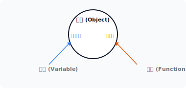
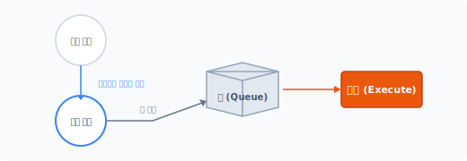
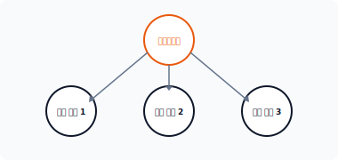
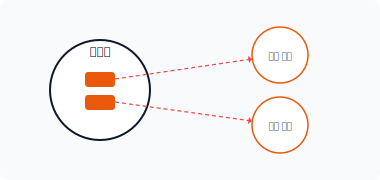


# CHAPTER 15 명령 패턴

com·mand  
[ kəmǽnd ]  

명령 패턴은 행동의 호출을 객체로 캡슐화하여 실행하는 패턴입니다.


## 15.1 명령 처리

작업 결과물이 아닌 작업하는 동작 자체를 다른 객체에 전달하는 경우가 있습니다. 처리해야 하는 동작 코드를 어떻게 다른 객체에 전송할 수 있을까요? 명령 패턴은 행동을 객체로 캡슐화하여 전달합니다.


### 15.1.1 명령 클래스

객체지향 프로그래밍에서는 데이터와 행위를 하나의 객체로 묶어 캡슐화합니다. 객체는 '동작의 행위'와 '행위를 실행하는 호출 메서드'를 함께 만드는데, 이렇게 구현하는 방법을 작업의 객체화라고 합니다.

342 3부 행동 패턴

#### 그림 15-1 객체의 구성



기존에는 동작 명령을 함수나 메서드로 구현했습니다. 하지만 명령 패턴에서는 동작 명령을 하나의 클래스 형태로 표현하며 수행하는 동작을 메서드 형태가 아닌 객체 형태로 별도 생성합니다. 명령 패턴은 내부 동작을 위한 모든 정보를 하나의 객체로 캡슐화하고 분리된 객체를 실제 수행으로 전환합니다.

명령 패턴은 유사한 동작을 하나의 객체로 묶어 실행하는 행위 패턴입니다.<sup>1</sup>


### 15.1.2 객체 전달

명령 패턴은 동작을 하나의 객체로 캡슐화하여 행위를 실행합니다. 명령 패턴은 실제 작업을 수행하는 객체와 이를 실행하는 객체로 분리하여 설계합니다.

객체의 동작 행위와 이를 실행하는 호출 부분을 분리하면 다양한 명령 처리 요청에 따라서 실제 동작의 행위를 제어할 수 있습니다. 분리된 작업 객체와 실행 객체는 의존성 주입을 통해 명령 객체에 위임을 요청합니다. 명령 객체는 실행 메서드에서 위임된 객체를 실행함으로써 실제 동작을 처리합니다.


## 15.2 명령 패턴의 구성과 특징

명령 패턴을 구현하기 위한 객체의 구성과 특징을 알아보겠습니다.

---
1 명령 패턴은 작동(행동) 패턴(action pattern) 또는 트랜잭션 패턴(transaction pattern)이라고도 불립니다.

15장 명령 패턴 343

### 15.2.1 구성 요소

명령 패턴은 복수의 명령을 처리하기 위해 객체 간 관계를 정의합니다. 명령 패턴은 4가지의 구성 요소를 갖고 있으며 이 구성 요소는 명령 객체의 인스턴스를 저장하고 호출을 관리합니다.

* 인터페이스 (15.3)
* 명령 (15.4)
* 리시버 (15.5)
* 인보커 (15.6)

각각의 구성 요소에 대해서는 예제를 보면서 설명하겠습니다.


### 15.2.2 매개변수

명령 패턴은 동작을 객체화하여 매개변수 형태로 전달합니다. 전달 받은 객체를 바로 실행하는 것이 아니라 명령 객체로 프로퍼티에 저장한 후 임의의 시점에서 일괄 실행하는 형태입니다.

명령 패턴은 객체의 실행 동작 시점을 분리하여 지연시키는데, 이는 절차지향적 개발에서 콜백<sup>callback</sup> 함수를 처리하는 것과 같습니다. 또한 명령 패턴은 객체지향적인 콜백 처리와 같습니다.


### 15.2.3 시점 제어

명령 패턴은 작업의 요청과 처리를 분리하고 요청하는 작업들을 객체로 캡슐화합니다. 이처럼 객체의 실제 동작과 호출 실행 부분을 분리하면 동작의 실행 시점을 제어할 수 있습니다. 동작 객체를 위임 받아 이를 미리 저장해놓고, 필요한 시점에 따라 별도로 실행함으로써 처리합니다. 명령 패턴은 코드의 동작을 순차적으로 실행하지 않고 큐에 쌓아놓았다가 특정 시점에 호출합니다.

344 3부 행동 패턴

#### 그림 15-2 명령 저장



명령 패턴은 객체의 동작 처리 시간을 구별할 수 있습니다. 위임 받은 객체를 순차적으로 실행하는 것이 아니라, 실행 시점을 미리 설정한 후 실행하는 것입니다. 명령 패턴은 객체의 원래 처리 요청 시점과 다른 생명주기<sup>lifetime</sup>를 가지며, 명령 패턴을 이용하면 동작 실행의 예약 처리 같은 작업도 가능합니다.


### 15.2.4 복구

프로그램에는 일반적으로 undo 기능이 있으며 undo 명령을 실행<sup>execute</sup>할 때 동작 행위를 저장합니다. 동작 행위와 반대되는 행위의 명령을 취소<sup>unexecute</sup>하는 처리도 추가할 수 있습니다. 또는 큐와 같은 저장소 리스트를 역으로 탐지해 기존의 동작을 취소할 수도 있습니다.


### 15.2.5 저장

명령을 실행하는 중에 갑자기 오류가 발생하는 등 명령 실행 과정이 정상적으로 이뤄지지 않는 경우가 있습니다. execute 명령을 실행하면서 load() 또는 store()와 같은 기능을 확장할 수도 있습니다. 명령의 동작을 임시로 저장하면 향후 실행에서 문제가 발생할 경우 재실행도 가능합니다.

15장 명령 패턴 345

## 15.3 인터페이스

명령 패턴은 동일한 명령 구조와 호출을 위해 인터페이스를 정의합니다. 인터페이스는 명령 패턴의 핵심이며, 통일화된 실행 동작을 유지하는 데 중요한 구성 요소입니다.


### 15.3.1 일관된 동작

실체 객체의 동작을 실행하는 방법이 클래스마다 다르다면 코드 재사용이 어려울 것입니다. 코드 재사용을 위해서는 클래스를 수정할 필요가 있으며, 동일하게 명령을 실행할 수 있는 호출 함수도 필요합니다. 또한 객체를 실행할 때는 통일화된 동작도 필요합니다.

명령 패턴은 일관적인 코드 실행과 재사용을 위해 실행 메서드 호출을 하나로 통일하는데, 인터페이스를 적용해 실행 메서드의 통일화를 강제적으로 적용합니다. 인터페이스는 선언된 메서드를 클래스에서 반드시 구현해야 하는 의무를 갖습니다. 명령 패턴은 인터페이스를 통해 코드의 재사용과 일관된 코드 실행을 유지합니다.


### 15.3.2 인터페이스 설계

명령 패턴에서 사용할 인터페이스를 선언합니다. 인터페이스 선언은 매우 간단한데 [예제 15-1]에서는 execute() 메서드를 정의합니다.

예제 15-1 Command/01/Command.php
```php
<?php
// 명령 패턴: 인터페이스
interface Command
{
    // 실행 메서드
    public function execute();
}
```

실행되는 모든 객체는 인터페이스의 적용을 받고, 실행 객체는 execute() 메서드를 반드시 구현해야 합니다. 인터페이스는 의무적 설계 구현을 강제화하는 데 유용합니다.

346 3부 행동 패턴

## 15.4 명령

명령으로 실행되는 실체 객체를 구현합니다. 명령 객체는 일급 객체<sup>First class citizens</sup>로 분류합니다.


### 15.4.1 실행 메서드

실행되는 모든 객체는 Command 인터페이스를 적용 받습니다. 인터페이스에는 통일화된 실행 메서드가 선언돼 있는데, 그 이유는 명령 패턴이 미리 약속한 객체의 실행 메서드를 호출하기 때문입니다.

객체를 생성할 때는 인터페이스에서 정의된 실행 메서드를 반드시 같이 구현하여 작성합니다. 이는 명령 패턴이 객체를 실행하는 유일한 메서드입니다.


### 15.4.2 명령 객체

명령으로 실행되는 객체를 생성합니다. 객체는 명령에 따라 별개의 독립된 객체로 작성합니다.

또한 명령 객체는 실행을 호출하는 메서드를 통일하기 위해 Command 인터페이스를 적용 받습니다. 다음과 같이 execute() 메서드를 구현합니다.

예제 15-2 Command/01/exec1.php
```php
<?php
// 명령 객체
class Exec1 implements Command {

    public function __construct()
    {
        echo __CLASS__." 객체를 생성합니다.\n";
    }

    // 인터페이스 적용
    // 실행 메서드 구현
    public function execute()
    {
        echo "명령1을 실행합니다.\n";
        // 추가 코드 작성
    }
}
```

15장 명령 패턴 347

```php
}
```

명령 객체는 Command 인터페이스를 이용해 동일한 서브 클래스로 공유하는 것과 같습니다.

#### 그림 15-3 인터페이스 적용



인터페이스를 적용하여 다수의 명령 객체를 통일합니다.


### 15.4.3 실행 메서드

모든 실행 객체는 인터페이스에서 정의된 실행 메서드를 갖고 있습니다. 즉 캡슐화된 실행 객체의 execute() 메서드만 호출하면 객체를 실행할 수 있습니다. 이는 명령 패턴의 장점으로, 통일화된 명령 호출과 실행으로 코드를 재사용할 수 있습니다.

예제 15-3 Command/01/index.php
```php
<?php
require "Command.php";
require "exec1.php";

// 명령 객체를 생성합니다.
$cmd = new Exec1;

// 객체를 실행합니다.
$cmd->execute();
```

348 3부 행동 패턴

```
$ php index.php
Exec1 객체를 생성합니다.
명령1을 실행합니다.
```


### 15.4.4 동작 정의

명령 객체별로 내용을 구성할 수 있습니다. 명령 객체는 execute() 메서드에서 필요한 동작만 정의하며, 명령 객체의 execute() 메서드는 객체 실행을 호출하는 방아쇠와 같다고 볼 수 있습니다.

[예제 15-3]은 간단한 메시지를 출력하지만, 기능을 추가하여 복잡한 명령 동작의 코드를 작성할 수 있습니다.


## 15.5 리시버

명령 패턴은 처리해야 하는 명령을 하나의 객체로 캡슐화합니다. 명령의 실행 동작을 내부적으로 구현하는 것과 달리 외부로부터 객체를 위임 받아 대신 호출합니다.


### 15.5.1 실제 동작

분리된 실제 동작은 명령 객체에서 처리됩니다. 다음 Concrete 클래스는 실제 동작을 처리하는 객체입니다.

예제 15-4 Command/02/Concrete.php
```php
<?php
// 실제 명령
class Concrete
{
    public function action1()
    {
```

15장 명령 패턴 349

```php
        echo "동작1: 안녕하세요.\n";
    }

    public function action2()
    {
        echo "동작2: 즐거운 시간 되세요.\n";
    }
}
```

실체 객체는 클라이언트<sup>client</sup>에서 미리 생성되고 명령 객체의 인자로 전달됩니다.


### 15.5.2 객체 인자

명령 객체를 생성할 때는 실행 동작을 직접 구현하지 않고 외부로부터 동작을 위임 받아 처리합니다. 명령 객체를 생성할 때 실제 동작과 관련된 객체를 인자로 전달 받습니다. 명령 객체는 의존성 주입으로 전달 받은 객체를 통해 실체 객체에 접근하는 명령을 실행합니다.

예제 15-5 Command/02/exec2.php
```php
<?php
// 명령 객체
class exec2 implements Command {

    private $Receiver;

    public function __construct($receiver)
    {
        echo __CLASS__." 객체를 생성합니다.";
        // 실체 객체 의존성 주입
        $this->Receiver = $receiver;
    }

    // 인터페이스 적용
    // 실행 메서드 구현
    public function execute()
    {
        echo "명령2를 실행합니다.\n";

        // 여러 개의 리시버 동작을 처리할 수 있습니다.
```

350 3부 행동 패턴

```php
        // 실체 객체의 명령을 수행합니다.
        $this->Receiver->action1();
        $this->Receiver->action2();

        // 추가 코드 작성
    }
}
```

다양하고 복잡한 명령을 처리하기 위해 실체 객체와 명령 객체를 분리합니다.

#### 그림 15-4 실체 객체와 명령 객체 연결


사실 우리는 간단한 명령 하나를 실행한 것이지만, 그 안에서는 상당수의 복잡한 기능이 처리될 수도 있습니다. 앞에 나온 명령 객체처럼 동작 객체를 위임 받아 함께 실행합니다.


### 15.5.3 리시버 연결

리시버<sup>Receiver</sup>는 클라이언트로부터 생성된 Concrete 객체를 보관합니다. 명령 패턴을 응용하면 명령을 동적으로 변경할 수 있습니다.

예제 15-6 Command/02/index.php
```php
<?php
require "Command.php";
```

15장 명령 패턴 351

```php
require "exec2.php";

// concrete
require "concrete.php";

$receiver = new Concrete;

// 명령 객체를 생성합니다.
$cmd = new Exec2($receiver);

// 객체를 실행합니다.
$cmd->execute();
```

리시버를 명령의 매개변수로 전달합니다. 리시버는 실제 작업 처리를 수행합니다.

```
$ php index.php
exec2 객체를 생성합니다. 명령2를 실행합니다.
동작1: 안녕하세요.
동작2: 즐거운 시간 되세요.
```

명령 객체는 실체 객체를 리시버로 연결해 하나의 객체로 캡슐화합니다. 또한 하나의 execute() 메서드만 이용하여 실행합니다.

리시버 동작의 경우 수신자<sup>receiver</sup> - 동작<sup>action</sup>이 한 쌍으로 처리됩니다. 이 동작은 명령 객체의 execute() 메서드를 호출할 때 코드를 작성하며 명령 패턴은 객체로 동작을 분리합니다.


## 15.6 인보커

명령 패턴은 다수의 명령 객체를 관리합니다. 인보커<sup>Invoker</sup>는 생성된 명령 객체를 저장하고 관리하는 역할을 합니다.


### 15.6.1 요구 저장

인보커는 작업을 저장하는 객체입니다. 명령 객체를 생성하여 인보커에 등록하면 저장된 명령

352 3부 행동 패턴

객체를 관리할 수 있습니다.

인보커는 내부적으로 명령 객체를 담고 있는 배열입니다. 또한 배열에 새로운 명령 객체를 추가합니다. setCommand() 메서드는 새로운 명령 객체를 인보커에 할당하는 동작을 수행합니다.

예제 15-7 Command/03/Invoker.php
```php
<?php
// 명령 패턴
class Invoker
{
    public $cmd = [];

    // 명령 객체를 저장합니다.
    public function setCommand($key, $command)
    {
        $this->cmd[$key] = $command;
    }

    // 명령 객체를 삭제합니다.
    public function remove($key)
    {
        unset($this->cmd[$key]);
    }

    // 명령 객체를 실행합니다.
    public function execute($key)
    {
        if (isset($this->cmd[$key])) {
            $this->cmd[$key]->execute();
        }
    }
}
```

등록한 명령 객체를 remove() 메서드로 삭제할 수도 있습니다.


### 15.6.2 명령 목록

명령의 동작을 다른 말로 이벤트<sup>event</sup>라고 합니다. 이러한 이벤트 명령은 이벤트 목록에 저장되고 명령을 순차적으로 처리합니다.

15장 명령 패턴 353

#### 그림 15-5 명령 목록



인보커에는 실제 동작의 리시버 객체를 저장합니다.<sup>2</sup>


### 15.6.3 요청 실행

인보커는 저장된 명령 객체의 요청을 실행하고 명령 객체의 execute() 메서드를 대신 호출하여 실행합니다.

예제 15-8 Command/03/index.php
```php
<?php
require "Command.php";
require "exec1.php";
// 명령 객체를 생성합니다.
$Exec1 = new Exec1();

require "exec2.php";
// concrete
require "concrete.php";
$Receiver = new Concrete;
// 명령 객체를 생성합니다.
$Exec2 = new Exec2($Receiver);
```

---
2 `$this` 변수와 같이 자기 자신을 가리키는 참조를 넣으면 명령 패턴이 무한 루프로 빠질 수 있습니다.

354 3부 행동 패턴

```php
// 인보커
require "Invoker.php";
$Invoker = new Invoker;
$Invoker->setCommand("cmd1",$Exec1);
$Invoker->setCommand("cmd2",$Exec2);

// 객체를 실행합니다.
$Invoker->execute("cmd1");
$Invoker->execute("cmd2");
```

```
$ php index.php
Exec1 객체를 생성합니다.
exec2 객체를 생성합니다. 명령1을 실행합니다.
명령2를 실행합니다.
동작1: 안녕하세요.
동작2: 즐거운 시간 되세요.
```

인보커에 등록된 특정 명령 객체를 선택할 수 있으며 이를 실행할 수도 있습니다.


### 15.6.4 매크로 처리

인보커는 다수의 명령 객체를 갖고 있습니다. 다음 예제는 인보커에 등록된 모든 명령 객체를 한번에 수행할 수 있는 매크로입니다.

```php
// 객체를 실행합니다.
foreach ($Invoker->cmd as $cmd) {
    $cmd->execute();
}
```

인보커에 등록된 배열을 순차적으로 실행합니다. 이때 반복자 패턴을 결합하여 사용합니다. 이처럼 인보커를 이용해 명령 객체를 관리하면 복수의 명령 객체를 동시에 실행할 수 있습니다.

15장 명령 패턴 355

## 15.7 클라이언트

클라이언트는 명령 패턴에서 새로운 명령 객체를 생성하고 생성된 명령 객체를 다시 리시버에 전달하며 인보커에 저장된 명령 객체 실행을 요청합니다.


### 15.7.1 클라이언트

우리는 이미 클라이언트 실습을 진행했습니다. 단락마다 실행한 index.php 파일이 클라이언트에 해당합니다.

클라이언트는 명령 객체를 생성하고 리시버 객체에 명령 인자값으로 명령 객체를 전달하는 역할을 합니다. 또한 생성된 명령 객체를 인보커에 저장하며 실행과 관리를 대신 처리합니다.


### 15.7.2 익명 클래스

앞의 실습에서는 명령 객체를 생성한 후 인보커에 의존성을 주입했습니다. 동일한 객체가 클라이언트와 인보커에 동시에 저장되는 형태입니다.

익명 클래스를 이용해 직접 명령 객체를 생성하고 인보커에 저장할 수도 있습니다.

예제 15-9 Command/04/index.php
```php
<?php
require "Command.php";

// 인보커
require "Invoker.php";
$Invoker = new Invoker;

// Command 인터페이스를 적용한 익명함수를 저장합니다.
$Invoker->setCommand("cmd1",
    new class implements Command {
        public function execute()
        {
            echo "명령1을 실행합니다.\n";
        }
    }
);
```

356 3부 행동 패턴

```php
$Invoker->setCommand("cmd2",
    new class implements Command {
        public function execute()
        {
            echo "명령2를 실행합니다.\n";
        }
    }
);

// 객체를 실행합니다.
foreach ($Invoker->cmd as $cmd) {
    $cmd->execute();
}
```

익명 클래스에 인터페이스를 적용하여 명령 객체를 직접 인보커에 전달합니다. 인보커 배열에 저장된 명령 객체는 호출할 수 있는 execute() 메서드를 갖고 있습니다.

익명함수로 구현된 인보커의 모든 명령 객체는 반복자 패턴을 응용하여 매크로로 호출해봅니다.

```
$ php index.php
명령1을 실행합니다.
명령2를 실행합니다.
```

Client는 Concrete 객체를 생성하고 리시버에 저장하며 명령의 execute를 직접 실행할 수 있습니다. 하지만 직접 명령을 실행하면 리시버와 인보커를 분할하기가 어렵습니다.


## 15.8 undo

명령 패턴은 각각의 명령 동작을 캡슐화하여 실행합니다. 명령을 실행할 수 있다는 것은 반대로 취소도 가능하다는 의미입니다.

15장 명령 패턴 357

### 15.8.1 취소 동작

윈도우와 같은 응용 프로그램을 보면 메뉴에 실행 명령과 이를 취소할 수 있는 undo 기능이 같이 있는 것을 확인할 수 있습니다.

명령 객체에 꼭 1개의 실행 메서드만 만들어서 사용할 필요는 없습니다. 다수의 메서드를 인터페이스 형태로 선언해 다양한 실행 동작을 지정할 수 있습니다.

이러한 실행 및 취소 기능은 대부분 명령 패턴을 응용하여 사용된 사례입니다.


### 15.8.2 undo 추가

Undo 기능을 추가하기 위해 Command 인터페이스에 새로운 메서드를 하나 추가합니다.

예제 15-10 Command/05/command.php
```php
<?php
// 명령 패턴: 인터페이스
interface Command
{
    // 실행 메서드
    public function execute();

    // 취소 명령
    public function undo();
}
```

새로운 메서드가 인터페이스에 추가됐습니다.


### 15.8.3 undo 기능 구현

인터페이스가 변경되면 이를 적용한 모든 명령 객체는 undo() 메서드를 구현해야 합니다.

예제 15-11 Command/05/exec1.php
```php
<?php
// 명령 객체
```

358 3부 행동 패턴

```php
class Exec1 implements Command {

    public function __construct()
    {
        echo __CLASS__." 객체를 생성합니다.\n";
    }

    // 인터페이스 적용
    // 실행 메서드 구현
    public function execute()
    {
        echo "명령1을 실행합니다.\n";
        // 추가 코드 작성
    }

    // 취소 기능 추가
    public function undo()
    {
        echo "명령1 실행을 취소합니다.\n";
    }
}
```


### 15.8.4 undo 실행

클라이언트에서 execute() 메서드와 undo() 메서드를 같이 실행해봅시다.

예제 15-12 Command/05/index.php
```php
<?php
require "Command.php";
require "exec1.php";

// 명령 객체를 생성합니다.
$cmd = new Exec1;

// 객체를 실행합니다.
$cmd->execute();
$cmd->undo();
```

15장 명령 패턴 359

```
$ php index.php
Exec1 객체를 생성합니다.
명령1을 실행합니다.
명령1 실행을 취소합니다.
```


### 15.8.5 undo 상태 저장

명령 객체의 undo() 메서드는 작업한 객체 실행을 취소하는 동작입니다. 만일 여러 개의 명령 객체가 순차적으로 실행됐다면 취소 동작도 역순으로 순차 실행돼야 합니다.

복수의 명령 객체를 취소할 때는 인보커를 통해 마지막으로 실행한 명령 상태를 저장하는 방법을 사용합니다.


## 15.9 장단점

명령 패턴은 요청과 실행이 서로 의존하지 않는 구조를 만들 때 매우 유용합니다.


### 15.9.1 확장성

기존의 코드 수정 없이 명령 객체를 추가해 실행 동작을 확장할 수 있습니다. 또한 여러 개의 명령을 하나의 리스트로 묶어 실행합니다.


### 15.9.2 클래스 개수

명령 패턴은 다수의 명령이 존재할 때 클래스의 개수가 증가합니다. 클라이언트는 명령 클래스의 인스턴스를 생성하며 명령 실행은 인보커가 처리합니다.

360 3부 행동 패턴

## 15.10 관련 패턴

명령 패턴 응용은 다음 패턴과도 연관됩니다.


### 15.10.1 복합체 패턴

여러 개의 명령 객체를 관리하기 위해 복합체<sup>composite</sup> 패턴을 사용합니다. 복합체 패턴은 복합 구조의 객체를 응용하여 여러 개의 노드를 갖습니다. 명령 객체의 인보커가 여러 개의 명령 객체를 갖고 있는 것이 복합체 패턴과 유사합니다.


### 15.10.2 메멘토

실행되는 명령의 이력을 저장할 때 메멘토 패턴을 함께 응용합니다. 메멘토는 상태를 관리하는 패턴입니다. 메멘토를 이용해 객체의 상태를 저장하고, 저장된 상태값을 이용해 undo 기능을 구현할 수 있습니다.


### 15.10.3 프로토타입

명령 객체 상태를 저장할 때 객체를 복사합니다. 프로토타입 패턴은 객체를 생성하지 않고 생성된 객체를 복제하여 저장합니다.


## 15.11 정리

명령 패턴은 다양한 곳에서 활용할 수 있습니다.


### 15.11.1 메뉴 처리

오래 전부터 명령 패턴이 가장 많이 활용된 부분은 컴퓨터 응용프로그램<sup>application</sup>입니다. 응용 프로그램에는 동작을 구분하기 위한 메뉴가 다수 존재합니다.

15장 명령 패턴 361

이러한 메뉴는 대부분 하나의 객체로 캡슐화되며 클릭 시 동작을 처리합니다. 그리고 각각의 메뉴는 명령 객체로 생성되며 이를 인보커 목록에 저장합니다.


### 15.11.2 CLI

요즘 CLI<sup>command line interface</sup> 도구를 개발할 때도 명령 패턴을 응용하는데, 옵션 동작을 하나의 명령 객체로 캡슐화하여 처리합니다. 즉, 터미널에서 명령을 입력하면 명령에 대한 객체를 찾아 호출하는 방법으로 처리합니다.

362 3부 행동 패턴

