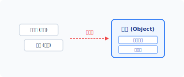
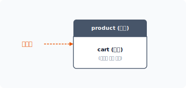
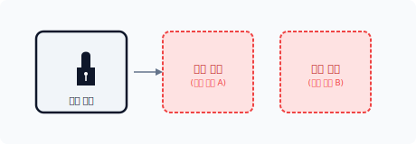
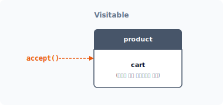
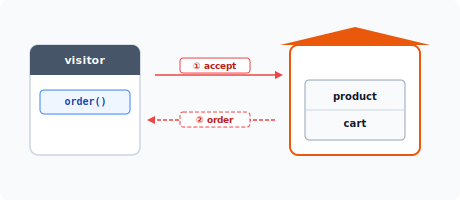
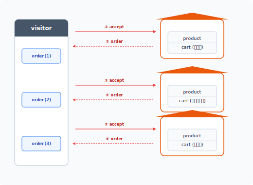


# CHAPTER 16 방문자 패턴

방문자<sup>visitor</sup> 패턴은 공통된 객체의 데이터 구조와 처리를 분리하는 패턴입니다.


## 16.1 데이터 처리

객체는 데이터와 행위가 있으며 객체의 행위는 데이터를 처리합니다.


### 16.1.1 캡슐화

객체는 데이터와 함수를 하나의 그룹으로 묶어 처리하는데, 이러한 객체의 특성을 캡슐화라고 하며 다른 말로 번들링<sup>Bundling</sup>이라고도 합니다.

#### 그림 16-1 데이터 캡슐화



초창기의 캡슐화는 C 언어에서 구조체<sup>struct</sup>나 공용체<sup>union</sup>로 데이터만 묶어 처리했습니다. 그러

16장 방문자 패턴 363

나 데이터만 포함된 구조체와 달리 객체는 함수도 포함합니다.

예제 16-1 Visitor/01/IceCream.php
```php
<?php
class IceCream
{
    private $name;
    private $price;
    private $tax;
    private $num;
}
```

최근의 캡슐화는 데이터와 행위를 위한 메서드 함수를 하나의 객체로 묶어 처리합니다. 이와 같이 캡슐화는 데이터와 행위를 하나의 객체로 만들어 재사용을 늘립니다. 또한 캡슐화는 추상화로 인해 모듈화 프로그램을 개발하는 데 유용하게 활용됩니다.


### 16.1.2 정보 은닉

객체를 이용하여 데이터를 캡슐화하는 이유는 정보를 은닉할 수 있기 때문입니다. Private, Protected와 같은 접근 속성을 이용하면 객체 내에 있는 데이터를 외부로부터 숨기는 효과가 있습니다.

외부로부터 은닉화된 데이터에 접근하려면 세터<sup>setter</sup>, 게터<sup>getter</sup>와 같은 데이터 접근 메서드를 함께 구현해야 합니다. 이러한 메서드는 데이터 캡슐화 처리 시 같이 설계합니다.

다음 예제는 상품 주문을 처리하는 객체 구조입니다.

예제 16-2 Visitor/01/product.php
```php
<?php
class Product
{
    protected $name;
    protected $price;
    protected $num;
```

364 3부 행동 패턴

// Setter: 상품명 설정
    public function setName($name)
    {
        $this->name = $name;
    }

    // Getter: 상품명 확인
    public function getName()
    {
        return $this->name;
    }

    // Setter: 가격 설정
    public function setPrice($price)
    {
        $this->price = $price;
    }

    // Getter: 가격 확인
    public function getPrice()
    {
        return $this->price;
    }

    // Setter: 수량 설정
    public function setNum($num)
    {
        $this->num = $num;
    }

    // Getter: 수량 확인
    public function getNum()
    {
        return $this->num;
    }

    // 행위 추가 동작
    public function getTax($tax=10)
    {
        return ( $this->price * $this->num ) * $tax/100;
    }
}
```

16장 방문자 패턴 365

캡슐화된 객체의 메서드는 단순히 데이터에만 접근할 수 있는 것이 아니라 필요 시 데이터 가공도 같이 처리합니다. 대부분의 객체는 데이터를 처리하는 행위 동작까지 같이 갖고 있는 경우도 많습니다.


### 16.1.3 행위 추가

캡슐화된 객체에 데이터를 처리하기 위한 동작을 추가하고 싶은 경우도 있을 것입니다. 일반적으로 객체는 데이터를 처리하기 위한 다수의 행위들을 갖고 있습니다.

그렇다면 데이터를 연산하는 코드는 어디에 삽입하는 것이 좋을까요? 일반적으로는 데이터를 갖고 있는 클래스에 행위 메서드를 삽입합니다.

예를 들어 객체가 가격 데이터 정보를 갖고 있고, 이를 이용하여 가격의 부가가치세를 같이 계산해야 하는 코드가 필요하다면 동일한 객체 내에 구현합니다.

```php
public function getTax($tax=10)
{
    return ( $this->price * $this->num ) * $tax/100;
}
```

이처럼 데이터를 처리하는 행위가 객체에 추가되면 클래스 선언을 수정해야 합니다. 데이터를 처리해야 하는 작업이 늘어날수록 코드 수정이 잦아집니다.


### 16.1.4 데이터 접근

객체의 행위는 대부분 객체 내 데이터를 중심으로 동작을 처리합니다. 하지만 객체의 행위가 다른 객체의 정보를 참조하는 경우도 있습니다. 객체의 동작을 수행하기 위해 외부 객체에 접근할 때는 미리 관계를 설정해야 합니다.

객체지향에서 객체는 하나의 책임을 가집니다. 객체는 책임 관계를 형성하면서 다양한 객체들과 동작을 같이 수행합니다. 따라서 여러 객체에 데이터가 분산된 경우 객체 간 관계가 복잡합니다.

366 3부 행동 패턴

데이터가 여러 객체로 분산된 경우, 객체의 데이터에 접근할 수 있는 구조의 큰 객체가 필요합니다. 큰 객체는 데이터가 포함된 객체를 갖고 있는 복합 객체입니다.

복합 객체 생성은 시스템 자원을 소모하며 복잡한 결합 단계가 필요합니다. 하지만 방문자 패턴은 분산된 객체의 데이터와 행위를 순차적으로 접근하여 데이터를 처리할 수 있도록 합니다.


## 16.2 분리

방문자 패턴은 분산된 객체에서 공통된 처리 로직만 분리합니다. 그리고 공통된 로직 구조를 별도의 객체로 분리합니다.


### 16.2.1 공통된 로직

객체는 데이터와 이를 처리하기 위한 행위를 포함하고 있습니다. 여기서는 객체에서 데이터를 처리하는 행위만 분리합니다.

예제 16-3 Visitor/02/cart.php
```php
<?php
class Cart extends Product
{
    public function __construct($name, $price, $num=1)
    {
        $this->name = $name;
        $this->price = $price;
        $this->num = $num;
    }

    public function getTax($tax=10)
    {
        return ( $this->price * $this->num ) * $tax/100;
    }

    public function list()
    {
```

16장 방문자 패턴 367

```php
        $order = $this->name;
        $order .= ", 수량=".$this->num;
        $order .= ", 가격=".$this->price * $this->num." 입니다.\n";
        return $order;
    }
}
```

분리된 객체는 상속을 통해 확장합니다.

#### 그림 16-2 상속을 통한 객체 확장



데이터를 포함한 객체에서 행위만 별도의 객체로 분리하면 데이터를 갖고 있는 객체는 크게 수정하지 않고도 행위를 쉽게 변경할 수 있습니다. 객체의 데이터와 행위를 분리함으로써 보다 나은 확장성을 갖게 됩니다.


### 16.2.2 처리 객체

앞절에서 객체의 데이터와 행위 로직을 별도의 객체로 분리했습니다. 변경된 객체를 통해 주문을 처리하는 시스템을 다시 실행해봅시다.

예제 16-4 Visitor/02/index.php
```php
<?php
include "product.php";
include "cart.php";

$cart = new Cart("컵라면", 900, 2);
echo $cart->list();
```

368 3부 행동 패턴

```
php index.php
컵라면, 수량=2, 가격=1800입니다.
```


### 16.2.3 개방-폐쇄 원칙

개방-폐쇄 원칙<sup>open-closed principle</sup> (OCP)은 객체지향 설계 원칙으로, 소프트웨어 객체 확장은 열려 있어야 하고 수정은 닫혀 있어야 한다는 프로그래밍 원칙입니다.

#### 그림 16-3 확장만 가능한 OCP



즉 OCP 원칙은 클래스를 설계할 때 확장만 허용한다는 것이며 확장을 위해 기존 코드를 수정해서는 안 된다는 뜻입니다. 방문자는 객체지향의 OCP 원칙을 반영한 패턴이고, 방문자 패턴은 데이터 처리 행위를 위해 객체를 분리합니다.


## 16.3 원소 객체

객체의 데이터와 행위가 다수의 객체로 분산된 경우 방문자 패턴을 활용합니다. 방문자 패턴을 통해 분산된 데이터를 처리하고, 공통된 로직을 분리하여 변경을 쉽게 처리합니다. 방문자 패턴으로 분리된 객체는 데이터와 연산을 쉽게 처리합니다.

16장 방문자 패턴 369

### 16.3.1 원소

방문자 패턴에서 원소<sup>element</sup> 객체는 데이터를 보관하는 구조 클래스입니다.<sup>1</sup>

객체는 일반적으로 능동적인 데이터 접근 방식을 사용하지만, 방문자 패턴의 원소 객체는 외부로부터 자신의 데이터에 접근할 수 있는 수동적 방식을 사용합니다.

외부로부터 자신의 객체에 접근하는 것을 허용하기 위해서는 관계를 설정해야 합니다. 데이터를 갖고 있는 원소 객체는 관계를 설정하기 위해 accept() 메서드를 추가로 갖고 있습니다.

추가 메서드는 모든 원소 클래스에서 동일하게 갖고 있어야 합니다. 이를 위해 Visitable 인터페이스를 사용하여 메서드 구현을 강제화합니다.

예제 16-5 Visitor/03/Visitable.php
```php
<?php
// 방문을 받아들이는 인터페이스
interface Visitable
{
    public function accept($visitor);
}
```

원소 객체의 accept()는 객체의 관계 설정을 위해 방문자 객체를 위임 요청합니다.


### 16.3.2 구현

모든 원소에 구현해야 하는 메서드를 인터페이스로 적용했습니다. 인터페이스를 적용하여 실제 객체<sup>concrete element</sup>를 선언합니다.

예제 16-6 Visitor/03/cart.php
```php
<?php
class Cart extends Product implements Visitable
{
    public function __construct($name, $price, $num=1)
    {
```

---
1 다른 말로 데이터 객체라고 합니다.

370 3부 행동 패턴

$this->name = $name;
        $this->price = $price;
        $this->num = $num;
    }

    // 인터페이스 구현
    public function accept($visitor)
    {
        // 방문자의 주문을 호출합니다.
        // 인자로 원소 객체 자신을 전달합니다.
        return $visitor->order($this);
    }

    public function getTax($tax=10)
    {
        return ( $this->price * $this->num ) * $tax/100;
    }

    public function list()
    {
        $order = $this->name;
        $order .= ", 수량=".$this->num;
        $order .= ", 가격=".$this->price * $this->num." 입니다.\n";
        return $order;
    }
}
```

선언된 클래스에는 인터페이스인 accept() 메서드를 같이 구현해야 합니다.

#### 그림 16-4 Visitable



16장 방문자 패턴 371

### 16.3.3 로직 분리

방문자 패턴은 실제 처리 로직을 다른 객체로 분리하여 위임합니다.

모든 원소 객체는 위임을 위해 인터페이스에 선언된 accept() 메서드를 구현하며, accept() 메서드는 매개변수를 통해 위임되는 객체를 전달 받습니다.

```php
// 인터페이스 구현
public function accept($visitor)
{
    // 방문자의 주문을 호출합니다.
    // 인자로 원소 객체 자신을 전달합니다.
    return $visitor->order($this);
}
```

앞의 예제에서 장바구니 객체는 데이터와 처리를 위한 연산 list() 메서드를 갖고 있지만, 패턴에서는 실제 처리 동작을 방문자 객체에 위임합니다.

#### 그림 16-5 visitor 객체 위임



accept() 메서드는 매개변수를 통해 visitor 객체를 전달 받습니다. accept()는 public 속성의 공개된 메서드이며, 위임된 visitor 객체를 받아 대신 호출하여 처리합니다. 그리고 위임된 visitor 객체의 order() 메서드를 호출합니다.

방문자 패턴을 이용하면 객체 내에서 처리해야 하는 것을 Visitor 객체로 분리합니다. 즉 원소 객체에서 정의하지 못한 메서드를 외부의 Visitor 객체로 분리하여 처리하는 것입니다.

방문자 패턴은 다수의 행동을 Visitor 객체로 분리할 수 있습니다. 각각의 구성 요소가 다른 경우 각 행위를 수정하지 않고도 위임을 통해 처리합니다.

372 3부 행동 패턴

방문자 패턴은 새로운 행위가 추가돼도 기존 객체를 변경하지 않고 추가 행위를 구현할 수 있습니다. 왜냐하면 구체적인 작업을 방문자 객체가 처리하도록 위임하기 때문입니다. 그리고 데이터 객체는 방문자의 접근을 허용해 처리를 호출합니다.


### 16.3.4 캡슐화 실패

객체는 캡슐화를 통해 데이터와 행위를 은닉할 수 있습니다. 하지만 방문자 패턴은 방문하는 외부 객체에 자신의 모든 데이터와 행위의 접근을 허용합니다.

패턴은 객체지향의 장점인 캡슐화와 데이터 은닉을 사용할 수 없게 방해하는 요인입니다. 또한 각 객체의 모든 연산은 공개된 인터페이스로, 연산 작업이 외부에 노출됩니다.


## 16.4 방문자

Visitor는 방문자를 의미합니다. 원소 객체의 accept는 외부의 Visitor를 전달 받도록 설계되어 있습니다.


### 16.4.1 방문자 호출

방문자 패턴을 활용해 분리된 주문 처리 동작을 설계합니다.

원소 객체의 accept()는 외부로부터 Visitor 객체를 전달 받고, 매개변수로 전달 받은 Visitor 객체의 order() 메서드를 실행합니다.

예제 16-7 Visitor/03/cart.php
```php
... 생략

public function accept($visitor)
{
    // 방문자의 주문을 호출합니다.
    // 인자로 원소 객체 자신을 전달합니다.
```

16장 방문자 패턴 373

```php
    return $visitor->order($this);
}

... 생략
```

원소 객체는 분리된 동작을 Visitor 객체로 위임합니다.

Visitor 객체의 order() 메서드를 호출할 때 자신의 객체 정보 $this를 매개변수로 전달합니다. 방문자와 원소 객체는 상호 객체의 정보를 주고받음으로써 양방향으로 접근할 수 있는 관계를 설정합니다.


### 16.4.2 인터페이스

방문자의 동작은 원소 객체의 accept() 메서드 호출을 통해 실행됩니다. 원소 객체의 accept() 메서드는 다시 의존성 관계인 Visitor 객체의 order() 메서드를 호출합니다.

따라서 의존되는 모든 Visitor 객체는 order() 메서드를 필수로 포함하고 있어야 합니다. 호출한 메서드가 존재하지 않으면 프로그램 실행 중에 오류가 발생합니다. 이를 코드로 강제화하기 위해 인터페이스나 추상화를 적용합니다. 인터페이스로 선언한 후 적용받는 방문자 클래스에서 order() 메서드를 구현하지 않으면 코드 오류가 발생합니다.

그러면 이제 Visitor 인터페이스를 생성해봅시다.

예제 16-8 Visitor/03/Visitor.php
```php
<?php
// 방문자
interface Visitor
{
    public function order($visitable);
}
```

order() 메서드는 하나의 매개변수를 전달 받습니다. order()는 원소 객체의 $this를 전달 받음으로써 양방향 관계를 설정합니다.

374 3부 행동 패턴

### 16.4.3 구체적 Visitor 객체 생성 – concreteVisitor

Visitor 인터페이스를 적용하여 하위 클래스를 생성하고 Visitant에 order() 메서드를 추가합니다.

예제 16-9 Visitor/03/Visitant.php
```php
<?php
// 방문 조사
class Visitant implements Visitor
{
    // 상태값
    private $total;
    private $num;

    public function __construct()
    {
        echo "주문을 처리합니다.\n";
        $this->total = 0;
        $this->num = 0;
    }

    // 원소 객체를 전달 받습니다.
    public function order($visitable)
    {
        echo "==상품 내역==\n";

        // 방문자를 확인합니다.
        if ($visitable instanceof Cart) {
            $msg = "상품명:".$visitable->getName();

            $msg .= ", 수량:".$visitable->getNum();

            $total = $visitable->getPrice() * $visitable->getNum();
            $msg .= ", 가격:".$total." 입니다.\n";

            $this->total += $total;
            $msg .= "합계:".$this->total;

            // 주문건수 증가
            $this->num++;
            return $msg;
        }
    }
}
```

16장 방문자 패턴 375

}

    public function getTotal()
    {
        return $this->total;
    }

    public function getNum()
    {
        return $this->num;
    }
}
```


### 16.4.4 방문자 동작

원소 객체의 accept() 메서드는 방문자의 order() 메서드를 호출하여 위임을 요청합니다. 원소 객체는 방문자 객체와의 양방향 관계 설정을 위해 자신의 $this를 전달합니다.

예제 16-10 Visitor/03/Visitant.php
```php
... 생략

// 원소 객체를 전달 받습니다.
public function order($visitable)
{
    echo "==상품 내역==\n";

    // 방문자를 확인합니다.
    if ($visitable instanceof Cart) {
        $msg = "상품명:".$visitable->getName();

        $msg .= ", 수량:".$visitable->getNum();

        $total = $visitable->getPrice() * $visitable->getNum();
        $msg .= ", 가격:".$total." 입니다.\n";

        $this->total += $total;
        $msg .= "합계:".$this->total;

        // 주문건수 증가
```

376 3부 행동 패턴

$this->num++;

        return $msg;
    }
}

... 생략
```

방문자의 order() 메서드는 원소 객체의 $this를 매개변수 $visitable로 의존성을 전달 받습니다. 방문자는 $visitable 변수를 통해 원소 객체의 데이터와 메서드에 접근합니다.

분리된 행동을 가진 방문자의 order() 메서드는 원소 객체에 직접 접근하여 동작을 수행하며, 동작 과정에서 결과물을 저장하거나 상태를 읽어올 수 있습니다.


### 16.4.5 패턴 실행

다음 예제에서는 구조와 행위를 분리한 방문자 패턴을 실행합니다.

예제 16-11 Visitor/01/index.php
```php
<?php
include "visitable.php";

include "product.php";
include "cart.php";

include "visitor.php";
include "visitant.php";

$cart = new Cart("컵라면", 900, 2);
// echo $cart->list();
echo $cart->accept(new Visitant);
```

```
php index.php
주문을 처리합니다.
==상품 내역==
상품명:컵라면, 수량=2, 가격=1800 입니다.
합계:1800
```

16장 방문자 패턴 377

### 16.4.6 재귀적 호출

방문자 패턴은 서로의 메서드가 재귀적으로 호출되는 등 복잡한 호출 관계를 갖고 있어 처리 흐름을 이해하기가 쉽지 않습니다.

원소 객체의 accept() 메서드는 방문자의 order() 메서드를 호출합니다. 방문자는 다시 원소 객체의 데이터와 메서드를 호출합니다. 이때 원소 객체에 역방향으로 접근하는 것을 방문이라고 합니다.

이중 분리<sup>double dispatch</sup>는 서로 반대의 관계를 갖고 있습니다.

```php
echo $cart->accept(new Visitant);
```

방문자 패턴은 방문자와 원소 객체 간의 양방향 의존 관계를 갖고 있습니다.

```php
return $visitor->order($this);
```

방문자 패턴은 두 개의 클래스 간 계통을 정의합니다. 하나는 원소에 대한 클래스 계통이고, 다른 하나는 처리 연산을 위한 클래스 계통입니다.

방문자 패턴이 단순한 반복문을 사용하지 않고 복잡한 흐름을 가진 이유는 데이터 객체와 작업 객체를 분리하기 때문입니다. 이처럼 분리하면 데이터의 독립성을 유지할 수 있습니다.

복잡한 호출 관계는 방문자 패턴을 학습하는 데 있어서 어려운 부분 중 하나입니다.


## 16.5 반복자

방문해서 처리하는 원소 객체가 여러 개일 경우 반복자 패턴을 결합해 사용합니다.


### 16.5.1 다수의 원소 객체

방문자 패턴은 데이터와 처리 행위를 분리하는데, 공통된 로직을 별도의 객체로 분리함으로써 행위를 보다 쉽게 추가할 수 있습니다. 공통된 로직을 분리하는 또 다른 이유는 다수의 원소 객체를 처리하기 위해서입니다.

378 3부 행동 패턴

체를 처리하기 위해서입니다.

방문자 패턴은 다수의 원소 객체를 처리하기 위해 반복자 패턴과 결합해서 동작합니다. 여러 개의 원소 객체와 하나의 방문자 객체로 데이터를 처리합니다.


### 16.5.2 반복자 패턴

다음 예제는 반복자 패턴을 활용하여 다수의 원소 객체 방문을 처리합니다.

예제 16-12 Visitor/04/index.php
```php
<?php
include "visitable.php";

include "product.php";
include "cart.php";

include "visitor.php";
include "visitant.php";

echo "쇼핑몰 상품 주문 처리\n";
echo "-----\n";

// 공통된 방문자 객체
$visitant = new Visitant;

// 방문객이 방문지를 하나씩
$list = [
    new Cart("컵라면", 900, 3),
    new Cart("아이스크림", 1500, 1),
    new Cart("음료수", 2800, 1)
];
foreach ($list as $obj) echo $obj->accept($visitant);

echo "\n-----\n";
echo "감사합니다. 주문건수:".$visitant->getNum()."\n";
echo "주문 합계: ".$visitant->getTotal()." 입니다.";
```

먼저 공통된 방문자 객체를 하나 생성합니다. 방문자 객체는 원소 객체의 매개변수로 전달됩니다.

16장 방문자 패턴 379

#### 그림 16-6 다수의 원소 객체 방문



다수의 원소 객체를 배열로 저장합니다. foreach 문을 통해 원소 객체의 accept() 메서드를 하나씩 실행합니다.

```
php index.php
쇼핑몰 상품 주문 처리
-----
주문을 처리합니다.
==상품 내역==
상품명:컵라면, 수량=3, 가격=2700 입니다.
합계:2700
==상품 내역==
상품명:아이스크림, 수량=1, 가격=1500 입니다.
합계:4200
==상품 내역==
상품명:음료수, 수량=1, 가격=2800 입니다.
```

380 3부 행동 패턴

합계:7000
-----
감사합니다. 주문건수:3
주문 합계:7000 입니다.

accept() 메서드를 통해 방문할 객체에 $visitant 인스턴스를 주입합니다. accept() 메서드는 전달 받은 방문자 인스턴스를 확인하고, 방문자 인스턴스의 order() 메서드를 역으로 호출합니다. 이때 방문한 객체 자신의 인스턴스($this)를 같이 전달합니다.

즉 방문자 $visitant 인스턴스는 원소 객체에 접근해 데이터와 행위를 가져올 수 있습니다. $visitant 인스턴스는 원소 객체의 인스턴스 접근을 통해 주문 내역을 조회하고 금액을 합산합니다.

방문자 패턴으로 하나의 객체가 여러 객체의 인스턴스를 하나씩 얻어낼 수 있습니다.


### 16.5.3 반복 메서드

실제 연산을 처리하는 방문자를 각각의 데이터 객체에 전달합니다. 그리고 과정을 순환하여 결과를 얻습니다. 데이터를 순환시키려면 객체는 방문자를 받아들일 수 있도록 허용해야 하는데 이를 수락이라고 합니다.

모든 원소 객체는 accept() 메서드를 갖고 있습니다. 방문자 패턴은 다수의 원소 객체로 이뤄진 리스트 형태의 집합입니다. 배열로 저장된 원소 객체는 순차적으로 accept()를 실행합니다. accept() 메서드는 반복자 처리를 위한 메서드입니다. 원소 객체의 accept()가 호출되면 전달 받은 방문자 객체의 order() 메서드도 순차적으로 실행합니다. 또한 방문자 패턴은 2개의 인터페이스와 2개의 구현체를 만듭니다.


## 16.6 관련 패턴

방문자 패턴의 경우 다음과 같은 패턴들도 함께 활용할 수 있으며 유사한 특징을 갖고 있습니다.

16장 방문자 패턴 381

### 16.6.1 반복자 패턴

데이터 구조는 다수의 객체로 되어 있습니다. 방문자 패턴은 데이터 구조에 방문하여 처리를 위임하는데, 이를 위해 반복자 패턴을 응용하여 사용합니다.


### 16.6.2 복합체 패턴

방문자 패턴의 데이터 구조는 복합 구조이고 내부 구조가 복합체<sup>composite</sup> 패턴과 유사합니다.


### 16.6.3 인터프리터 패턴(해석 패턴)

방문자 패턴은 인터프리터 패턴과도 함께 활용합니다. 구문을 분석하기 위해 트리를 탐색할 때 해당 구문의 처리를 방문자 패턴으로 실행하는 경우가 발생합니다.


## 16.7 정리

방문자 패턴을 이해하기 위해서는 먼저 객체의 관계와 메시지 처리에 대해 이해해야 합니다. 메시지는 객체 간 행위를 호출하는 객체의 역할을 의미합니다. 방문자 패턴의 동작은 간단하지만 클래스가 서로 복잡하게 연결되어 있어 이해하기 어렵습니다.

하지만 방문자 패턴은 기존 객체에서 행위 동작을 분리하고 새로운 행위를 추가할 수 있는 유용한 패턴입니다. 또한 기존 객체를 직접 수정하기 어려울 경우 방문자 패턴을 통해 행동을 대신 처리할 수 있다는 장점도 있습니다. 그뿐 아니라 많은 연산으로 클래스를 더럽히고 싶지 않을 때도 유용합니다.

방문자 패턴의 구조는 계층 구조를 가진 복합체 패턴과 유사합니다. 계층화된 모든 원소를 파악하고 누적하여 객체의 상태를 가질 수 있습니다.

방문자 패턴의 적용 여부가 고민될 때는 객체 구조의 알고리즘이 많이 변하는지, 구성에 대한 클래스 변화가 많이 발생하는지를 고려해서 적용하는 것이 좋습니다.

382 3부 행동 패턴

