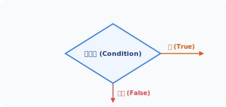
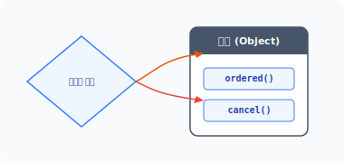
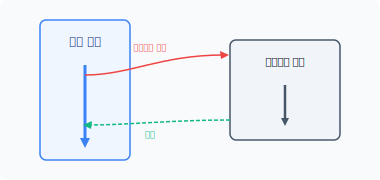
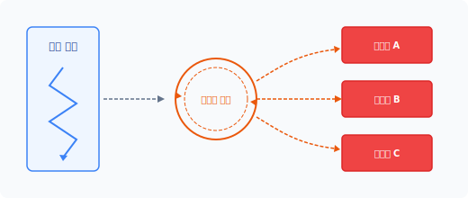
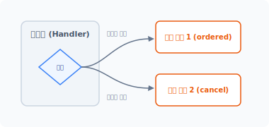
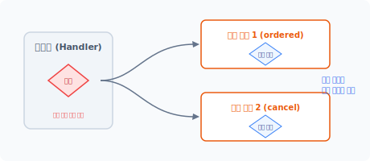
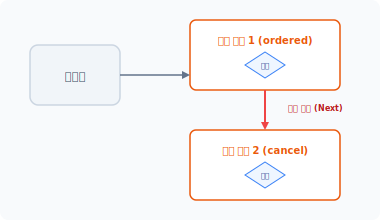
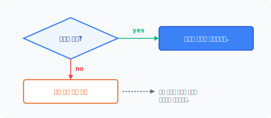


# CHAPTER 17 체인 패턴 (chain)

체인 패턴은 객체 메시지의 송신과 수신을 분리해서 처리합니다. 17장에서는 다음 세 가지 내용을 중심으로 살펴보겠습니다.

* 상태값과 처리 방식에 대해 알아봅니다.
* 상태값과 복수의 행동 객체를 연결하는 방법에 대해 알아봅니다.
* 객체를 연결하는 방법에 대해 알아봅니다.


## 17.1 제어문

프로그램은 순차적 절차에 따라 코드를 실행합니다. 그중 제어문은 상태값을 비교하여 코드의 실행 흐름을 변경합니다.


### 17.1.1 조건 처리

개발 언어는 코드의 동작을 제어할 수 있는 조건문을 지원합니다. 대표적으로 if문과 switch문이 있습니다.

다음 예제는 상태값에 따라 실행하는 함수를 다르게 호출합니다.

17장 체인 패턴 383

예제 17-1 Chain/01/index.php
```php
<?php
$conf = true;

if ($conf) {
    // 조건이 참인 경우 코드 분기
    ordered();
} else {
    // 조건이 거짓인 경우 코드 분기
    cancel();
}

function ordered()
{
    echo "주문이 성공적으로 접수되었습니다.";
}

function cancel()
{
    echo "주문을 취소합니다.";
}
```

```
$ php index.php
주문이 성공적으로 접수되었습니다.
```

if문은 상태값을 비교합니다. 소괄호 안의 상태값이 참<sup>true</sup>인 경우 다음 중괄호 블록의 코드를 실행합니다. 만일 상태값이 거짓<sup>false</sup>이라면 else 이후의 중괄호 블록 코드를 실행합니다.

#### 그림 17-1 조건에 따른 동작 분기



384 3부 행동 패턴

조건문은 순차적으로 실행되는 코드를 상태값에 의해 선택적으로 제어합니다. 선택적으로 실행을 제어한다는 의미는 상태에 따라 동작을 분리한다는 것과 같습니다.


### 17.1.2 메시지 전송

객체지향 개발에서는 메시지에 대해 이해하는 것이 중요합니다. 절차적 프로그래밍에서는 코드 순서와 함수 호출을 통해 동작을 분리하지만, 객체지향에서는 함수 호출 대신 메시지를 객체에 전송하여 메서드를 호출합니다.

객체의 메시지 전송은 다른 객체에 접근하여 메서드를 호출하는 동작을 말합니다. 또한 객체 간 정보도 주고받습니다.

다음 예제는 메시지 전송을 통해 객체의 메서드 호출을 분리합니다.

예제 17-2 Chain/02/index.php
```php
<?php
class Cart
{
    public function ordered()
    {
        echo "장바구니 상품을 성공적으로 주문 접수했습니다.";
    }

    public function cancel()
    {
        echo "장바구니 상품 주문을 취소합니다.";
    }
}

$Cart = new Cart;

$conf = false;

if ($conf) {
    // 조건이 참인 경우
    // 메시지를 전송합니다.
    $Cart->ordered();
} else {
```

17장 체인 패턴 385

// 조건이 거짓인 경우
    // 메시지를 전송합니다.
    $Cart->cancel();
}
```

```
$ php index.php
장바구니 상품 주문을 취소합니다.
```

[예제 17-2]는 조건의 상태값에 따라 함수를 다르게 호출했습니다. 변경된 예제는 상태값에 따라 객체의 메시지 전송을 다르게 처리합니다.

#### 그림 17-2 객체의 메서드로 메시지를 전송하여 호출



즉 객체지향에서는 함수 호출 대신 객체의 메시지를 전송하여 동작을 분리합니다.


## 17.2 동작 조건

제어문은 상태값에 따라 동작을 분리하며, 상태값은 동작을 분리하는 조건의 기준값입니다. 다음에는 시스템에서 조건의 상태값을 처리하는 다양한 방법에 대해 알아보겠습니다.


### 17.2.1 조건값

순차적으로 실행되는 코드의 동작을 분기하기 위해 조건문과 상태값을 사용합니다. 조건문을

386 3부 행동 패턴

처리하려면 상태값이 반드시 필요한데 상태값은 대부분 내부 동작에 의해 발생하는 경우가 많으며 외부로부터 조건의 상태값을 전달 받기도 합니다.

조건의 상태값이 발생하는 방법에 따라 처리 동작이 두 가지로 나뉩니다.

* 외부 하드웨어로부터 발생한 조건을 처리하는 인터럽트
* 내부의 상태값을 처리하는 이벤트


### 17.2.2 인터럽트

인터럽트<sup>interrupt</sup>는 외부적인 하드웨어 신호를 입력 받아 상태를 처리합니다.

프로그램은 조건문을 처리한 후 다음 줄의 코드를 실행합니다. 인터럽트가 발생하면 중앙 처리 장치(CPU)는 프로그램 실행을 잠시 중단하고 실행 제어권을 지정한 코드의 위치로 이동시킵니다. 인터럽트 동작이 완료되면 다시 이전의 실행 위치로 제어권을 되돌리고 다음 코드줄을 실행합니다. 인터럽트는 함수와 같은 호출의 성격을 갖고 있습니다.

#### 그림 17-3 인터럽트 동작



인터럽트의 특징은 하드웨어적으로 프로그램 실행을 방해하여 외부로부터 입력 받은 조건 동작을 최우선적으로 처리합니다. 따라서 인터럽트는 하드웨어적으로 구성되어 있으며 개수와 동작 방식은 제한적입니다.

17장 체인 패턴 387

### 17.2.3 이벤트

이벤트<sup>Event</sup>는 하드웨어적인 인터럽트와 달리 프로그램에 의해 동작을 분리하여 실행합니다. 그리고 이벤트는 내부의 상태값을 지속적으로 감시하고, 특정 상태값이 됐을 때 지정한 동작을 실행합니다.

프로그램은 이벤트를 감지하기 위해 일정 시간마다 상태값을 체크합니다. 펌웨어오나 운영체제는 시스템의 타이머 인터럽트를 이용하여 상태값을 지속적으로 확인합니다.

#### 그림 17-4 이벤트 감시



이벤트는 사전에 정의된 상태값에 따라서 분리된 동작을 실행하며 상태값은 상수로 지정하여 사용합니다.

상태값에 의한 이벤트 처리 동작은 별도의 처리 로직으로 분리할 수 있습니다. 이렇게 분리된 로직을 디스패치라고 하며, 이벤트의 처리를 핸들러라고 하기도 합니다.


### 17.2.4 핸들러

핸들러는 분리된 이벤트를 처리하는 로직입니다. 핸들러는 이벤트의 상태값을 지속적으로 감시하기 위해 반복 루프 구조로 되어 있는 경우가 많습니다.

핸들러는 다중 처리를 위한 작업을 선택적으로 실행하며, 실행 대기열에 있는 프로세스를 선택

388 3부 행동 패턴

하여 작업 처리를 지시합니다.

핸들러는 크게 정적<sup>static</sup>과 동적<sup>dynamic</sup> 동작으로 구분합니다. 정적 핸들러는 코드에서 미리 결정된 동작을 실행하며, 동적 핸들러는 실행 중에 결정되는 동작을 실행합니다.

다음은 핸들러 예제 코드입니다.

예제 17-3 Chain/02/Handler.php
```php
<?php
// 클래스 선언
class Handler
{
    public function event($message)
    {
        if($message == "action01") {
            return "버튼 동작 01입니다."; // 책임 동작1
        } else
        if ($message == "action02") {
            return "버튼 동작 02입니다."; // 책임 동작2
        } else
        if ($message == "action03") {
            return "버튼 동작 03입니다."; // 책임 동작3
        }

        return "동작이 없습니다.";
    }
}

// 객체 생성
$obj = new Handler;

// 이벤트를 실행
echo $obj->event("action02");
```

```
$ php Handler.php
버튼 동작 02입니다.
```

코드에서 Handler 클래스는 Event 메서드를 갖고 있으며, 입력된 상태값에 따라 다른 동작을 수행합니다.

17장 체인 패턴 389

이벤트를 기반으로 동작을 분리하는 방식을 이벤트 주도<sup>Event Driven</sup> 개발이라고 합니다. 이벤트는 멀티태스킹, 대화형 프로그램 개발 시 많이 사용되는 방식입니다.


## 17.3 행동 분리

핸들러는 이벤트의 처리 로직을 분리합니다. 이벤트 처리 로직을 분리하면 행동을 독립적으로 관리할 수 있습니다. 이벤트의 행동은 단일 책임을 적용하여 독립 객체로 설계합니다.


### 17.3.1 단일 책임

단일 책임은 객체지향 설계 원칙 중 하나입니다. 객체는 하나의 책임과 동작을 가지며, 잘못된 설계 객체는 하나의 객체에 여러 가지 행동과 책임이 포함됩니다.

핸들러는 분리된 이벤트의 처리 로직으로서 다양한 동작을 선택적으로 처리합니다. 이러한 점에서 핸들러 객체는 객체지향의 단일 책임 원칙이 위반(핸들러가 여러 책임을 가짐)되고, 체인 패턴은 단일 책임의 원칙을 위반한 핸들러 객체를 보완합니다.


### 17.3.2 행동 분리

단일 책임 원칙을 위반한 핸들러를 보완하기 위해 이벤트 처리 로직과 실제 동작을 분리합니다.

[예제 17-4]의 핸들러는 요청된 이벤트를 처리하며 결과에 따라 직접 메시지를 출력합니다. 이는 이벤트 핸들러 객체가 처리 로직과 출력 동작을 모두 갖고 있기 때문입니다. 이벤트 핸들러의 출력 메시지를 독립된 객체로 분리합니다. 다음은 메시지를 출력하는 객체입니다.

예제 17-4 Chain/03/Order.php
```php
<?php
class Order
{
    public function execute()
```

390 3부 행동 패턴

```php
    {
        return "주문을 처리합니다.";
    }
}
```

예제 17-5 Chain/03/Cancel.php
```php
<?php
class Cancel
{
    public function execute()
    {
        return "주문을 취소합니다.";
    }
}
```

분리된 실제 동작 객체를 핸들러 객체와 결합합니다. 핸들러는 전송 받은 상태값에 따라 객체를 생성하고 메시지를 출력합니다. 다음은 수정된 핸들러입니다.

예제 17-6 Chain/03/Handler.php
```php
<?php
require_once "Order.php";
require_once "Cancel.php";

class Handler
{
    public function event($message)
    {
        if($message == "order") {
            return (new Order)->execute();
        } else
        if ($message == "cancel") {
            return (new Cancel)->execute();
        }

        return "동작이 없습니다.";
    }
}
```

// 객체 생성
17장 체인 패턴 391

```php
$obj = new Handler;

// 이벤트를 실행
echo $obj->event("order");
```

```
$ php Handler.php
주문을 처리합니다.
```

#### 그림 17-5 핸들러 객체와 실제 객체




## 17.4 사슬 연결

이벤트 핸들러의 처리 동작을 단일 사슬 형태로 변경합니다. 사슬 연결을 통해 하나의 상태값에 따라 복수의 행동을 실행할 수 있습니다.


### 17.4.1 조건 검사 흐름

핸들러는 발생된 이벤트에 대해 조건을 검사합니다. 이벤트 조건은 작성한 코드 순서대로 검사가 이뤄집니다.

```php
public function event($message)
{
```

392 3부 행동 패턴

```php
    if($message == "order") {
        return (new Order)->execute();
    } else
    if ($message == "cancel") {
        return (new Cancel)->execute();
    }

    return "동작이 없습니다.";
}
```

제일 먼저 "order" 상태를 검사하고 조건이 맞지 않으면 "cancel" 상태를 처리합니다. 조건문을 검사하는 순서는 코드 작성 방법에 따라 다르므로, 조건 상태마다 객체가 생성되고 실행되는 시점이 서로 다릅니다.

상태값에 따른 핸들러의 실제 동작을 독립된 객체로 분리하여 개선했습니다. 하지만 핸들러 안에는 여전히 조건을 판단하는 로직이 존재합니다. 다음에는 핸들러의 조건을 판단하는 수신부를 분리하여 개선하겠습니다.


### 17.4.2 송수신 분리

체인 패턴의 아이디어는 핸들러에서 순차적으로 이벤트를 검사하는 조건들을 분리하는 것입니다.

핸들러 객체에서 검사하던 조건 처리 로직이 분리된 실제 동작 객체로 이동시킵니다. 핸들러 객체 안에 있는 조건 처리 로직을 분리하면, 핸들러는 단일 책임 원칙을 유지할 수 있습니다. 또한 실제 객체로 분리된 처리 로직은 보다 구체적이고 세분화하여 동작할 수 있다는 장점을 가집니다.

다음은 예제를 변경해봅시다. 핸들러에서 검사하던 if문의 조건을 이동시킵니다.

예제 17-7 Chain/04/Order.php
```php
<?php
class Order
{
    public function execute($event)
    {
```

17장 체인 패턴 393

```php
        if ($event == "order") {
            return "주문을 처리합니다.";
        }
    }
}
```

예제 17-8 Chain/04/Cancel.php
```php
<?php
class Cancel
{
    public function execute($event)
    {
        if ($event == "cancel") {
            return "취소 처리합니다.";
        }
    }
}
```

핸들러의 처리 로직도 변경합니다. 상태값을 판별하는 코드 대신 객체를 생성하고 메시지를 전송합니다. 전송된 메시지의 결과가 있으면 이벤트 동작을 수행합니다.

예제 17-9 Chain/04/Dispatch.php
```php
<?php
require_once "Order.php";
require_once "Cancel.php";

class Handler
{
    public function event($event)
    {
        if ( $message = (new Order)->execute($event) ) {
            return $message;
        }

        if ( $message = (new Cancel)->execute($event) ) {
            return $message;
        }

        return "동작이 없습니다.";
    }
}
```

394 3부 행동 패턴

```php
// 객체 생성
$obj = new Handler;

// 이벤트를 실행
echo $obj->event("cancel");
```

```
$ php Handler.php
취소 처리합니다.
```

#### 그림 17-6 조건 처리를 실제 객체로 이동



[예제 17-9]에서 핸들러는 별로 개선되지 않았습니다. 여전히 조건을 처리한 문장이 남아 있습니다. 또한 이벤트 동작을 검출하기 위해서는 모든 객체를 순차적으로 실행해야 됩니다.


### 17.4.3 인터페이스

체인 패턴은 행동의 요청과 처리를 분리하며 핸들러에서 분리된 동작 객체에 독립성을 부여합니다.

핸들러로부터 독립된 객체는 자신만의 동작을 갖습니다. 독립된 객체의 실제 처리는 핸들러에서 분리되고 외부에 노출되지 않으므로 독립적인 개발 진행이 가능합니다.

일반적으로 이벤트 핸들러는 하나의 상태값에 하나의 동작 객체를 지정하는데, 하나의 상태값

17장 체인 패턴 395

에 복수의 동작 객체를 지정할 경우 처리 로직이 복잡해집니다. 체인 패턴은 하나의 상태값에 복수의 동작 객체를 처리할 수 있도록 객체를 하나의 사슬 형태로 묶어서 처리합니다.

객체를 하나의 사슬 형태로 연결하기 위해 객체 정보와 연결을 위한 몇 개의 메서드가 필요합니다. 추상 클래스를 이용하여 객체를 연결할 수 있는 골격을 설계합니다.

예제 17-10 Chain/05/Chain.php
```php
<?php
abstract class Chain
{
    protected $Next;
    public function setNext($obj)
    {
        $this->Next = $obj;
    }

    abstract function execute($event);
}
```

추상 클래스는 객체 연결을 위한 프로퍼티와 설정 메서드를 갖고 있으며, 실제 객체에서 실행되는 추상 메서드도 같이 선언합니다. 추상 메서드의 역할은 하위 클래스에 적용되는 인터페이스입니다.

체인 패턴은 다음 처리를 위한 객체 정보를 갖고 있습니다. `setNext()` 메서드를 이용하여 위임되는 객체의 정보를 사슬 형태로 설정합니다.

### 17.4.4 사슬 형성
핸들러는 이벤트 행동 조건을 검사하지 않습니다. 이벤트 조건은 실제 동작하는 객체가 판단하며, 만약 자신이 처리해야 하는 조건이 아니라면 다음 객체로 행동을 위임합니다.

체인 패턴으로 동작 객체를 변경해봅시다. 추상 클래스를 상속함으로써 동작 객체가 복합 객체로 변경됩니다.

---
**396** 3부 행동 패턴

예제 17-11 Chain/05/Order.php
```php
<?php
class Order extends Chain
{
    public function execute($event)
    {
        if ($event == "order") {
            return "주문을 처리합니다.";
        }

        return $this->Next->execute($event);
    }
}
```

추상 메서드인 `execute()`를 구현합니다. 추상 메서드는 반드시 구현해야 하는 인터페이스와 같은 역할을 합니다.

예제 17-12 Chain/05/Cancel.php
```php
<?php
class Cancel extends Chain
{
    public function execute($event)
    {
        if ($event == "cancel") {
            return "취소 처리합니다.";
        }

        return $this->Next->execute($event);
    }
}
```

구현된 추상 메서드 내에는 다음 사슬로 연결되는 객체를 실행합니다. 객체가 순차적으로 연결되어 있고, 조건이 만족할 때까지 재귀적으로 실행됩니다.

`Handler` 클래스의 코드는 다음과 같이 변경합니다.

---
17장 체인 패턴 **397**

예제 17-13 Chain/05/Handler.php
```php
<?php
require_once "Chain.php";
require_once "Order.php";
require_once "Cancel.php";

class Handler
{
    public function event($event)
    {
        // 체인 설정
        $First = new Order;
        $First->setNext(new Cancel);

        return $First->execute($event);
    }
}

// 객체 생성
$obj = new Handler;

// 이벤트를 실행
echo $obj->event("cancel");
```

```bash
$ php Handler.php
취소 처리합니다.
```

핸들러에 포함됐던 기존 조건문이 제거됐습니다. 사슬로 연결된 객체의 첫 번째 객체만 실행합니다.

#### 그림 17-7 체인으로 연결된 실체 객체



---
**398** 3부 행동 패턴

체인 패턴으로 연결된 객체는 상태값을 스스로 판별하여 자신의 행동을 실행합니다. 실행이 완료되면 다음 객체를 재귀적으로 실행합니다. 조건이 만족스러운 상태로 될 때까지 실행을 계속합니다.

## 17.5 체인 패턴

체인 패턴은 조건을 판별하는 코드를 포함하지 않습니다. 메시지를 전달 받으면 상태값이 만족할 때까지 복수의 이벤트를 처리합니다. 체인 패턴의 특징을 다시 한번 살펴봅시다.

### 17.5.1 순차적 행동
체인 패턴은 하나의 상태값에 여러 객체를 묶어 실행하는 방법입니다. 묶은 모양이 마치 체인의 연결 고리 같다고 해서 체인 패턴이라고 부릅니다.

체인 패턴은 이벤트의 조건에 맞는 행동을 찾을 필요가 없습니다. 처음 객체부터 순차적으로 자신에게 맞는 행동을 판단하고 실행을 계속합니다. 자신의 객체가 처리할 수 있는 상태값이면 동작을 실행하고, 자신의 객체와 맞지 않는 상태값이면 다음 객체로 행동을 위임합니다.

#### 그림 17-8 객체의 사슬 호출



이러한 객체의 순차적 행동은 요청된 이벤트를 특정하여 지정할 수 없을 때 유용하게 활용할 수 있는 방법입니다.

---
17장 체인 패턴 **399**

### 17.5.2 행동 위임
체인 패턴은 처리 로직을 요청하는 송신부와 처리를 검사하는 수신부를 분리하는 효과가 있습니다. 패턴으로 분리된 객체의 송신부는 이벤트 상태값의 판단 조건 로직을 수신부의 객체로 위임합니다. 그리고 핸들러로부터 송신된 요청을 분리하여 결합도를 제거합니다.

체인 패턴은 객체들의 상호 작용을 단순하게 만들고 책임을 여러 객체에 분산함으로써 보다 유연한 이벤트 동작을 처리합니다.

체인 패턴은 여러 객체에 요청된 이벤트를 처리할 수 있도록 균등한 기회를 제공합니다. 또한 새로운 이벤트 동작이 추가돼도 기존의 처리 로직을 변경하지 않고 새로운 사슬만 추가하면 됩니다.

### 17.5.3 재귀적 호출
체인 패턴은 이벤트에 대한 모든 객체를 사슬로 엮어 작업하며, 핸들러는 제일 처음 사슬만 시작합니다.

```php
// 체인 설정
$First = new Order;
$First->setNext(new Cancel);

return $First->execute($event);
```

사슬로 연결된 객체는 순차적으로 실행됩니다. 첫 번째 사슬 동작을 실행한 후 두 번째 사슬 동작을 실행합니다.

```php
public function execute($event)
{
    if ($event == "order") {
        return "주문을 처리합니다.";
    }

    return $this->Next->execute($event);
}
```

---
**400** 3부 행동 패턴

자신이 처리하지 못한 경우 다음 객체의 실행 메서드를 호출합니다. 메서드가 다음으로 동일한 메서드를 계속 호출하는 구조입니다.

실제 요청이 처리되는 객체를 만날 때까지 복합 객체로 연결된 `$Next`를 따라 재귀적으로 처리합니다. 체인 패턴은 모든 연결된 객체의 실행이 완료됐을 때 결과를 반환합니다.

체인 패턴으로 연결되는 메서드의 이름은 동일한데, 그 이유는 추상 클래스를 적용해 동일한 인터페이스 형태로 메서드를 구현했기 때문입니다. 하지만 실제 객체의 메서드 구현 내용은 다릅니다.

체인 패턴의 특징은 자신이 요청한 이벤트의 상태를 어떤 객체가 처리할지 모른다는 것입니다.

### 17.5.4 복수 행동
체인 패턴은 좀 더 확장된 구조이며 하나의 상태값에 따라 복수의 객체 실행을 요청할 수 있습니다.

하나 이상의 객체에 요청을 전송하는 경우, 우선순위 설정이 필요할 수 있습니다. 우선순위는 체인 패턴의 메서드를 통해 확정할 수 있습니다. 체인 패턴은 하나의 요청을 세부적으로 분리하거나 복수의 동작을 처리할 때 유용합니다.

## 17.6 미들웨어
체인 패턴은 미들웨어 기능을 구현할 때 많이 응용됩니다. 미들웨어는 객체의 행동을 수행하기 전에 미리 실행되어야 하는 기능을 말합니다. 체인 패턴을 이용해 객체의 행동을 연결합니다.

### 17.6.1 사전 동작
프레임워크의 코어와 비즈니스 사이에 일정한 동작이 반복해서 추가되는 경우가 있습니다. 이를 해결하기 위해 프레임워크는 복잡한 구현을 사전에 미리 정의해둡니다. 코어를 감싸는 계층을 한 단계 더 만들어 반복되는 동작을 수행하도록 사전에 제공합니다.

---
17장 체인 패턴 **401**

코어와 비즈니스 사이의 중간 단계에서 동작하는 코드를 미들웨어라고 합니다. 이러한 사전 동작들은 비즈니스 로직 구현에 더 집중해서 개발할 수 있도록 도와줍니다.

### 17.6.2 미들웨어
미들웨어는 여러 개의 동작을 묶어 순차적으로 처리합니다. 프레임워크는 사전에 특정 동작들을 파이프라인 형태로 처리한 후 실제 동작을 호출합니다. 미들웨어는 비즈니스 동작이 실행되기 이전과 이후로 구분하여 정의합니다.

미들웨어는 처리의 흐름이 통과될 때 중간에 걸쳐서 동작하는 계층을 말하며, 체인 패턴으로 많이 사용됩니다. [^1] 또한 객체를 변경하지 않고 확장해서 새로운 기능을 쉽게 추가합니다.

## 17.7 관련 패턴
체인 패턴은 다음 패턴과 유사한 특징을 가지고 있습니다.

### 17.7.1 복합체 패턴
체인 패턴의 구조는 복합적인 사슬 구조로 엮여 있고 내부 구조는 복합체 패턴과 유사합니다.

### 17.7.2 명령 패턴
핸들러를 통해 위임된 객체의 메서드를 호출할 때 명령 패턴이 같이 사용됩니다.

---
[^1]: 체인 패턴을 다른 말로 미들웨어 패턴이라고도 합니다.

**402** 3부 행동 패턴

## 17.8 정리

체인 패턴에서는 실제로 동작하는 객체를 선택하여 호출하지 않고, 사슬의 첫 고리를 호출한 후 따라가면서 해당 객체를 만납니다.

체인 패턴은 객체의 의존성 주입을 통해 위임을 설정합니다. 상태값에 따른 실행 유무는 위임된 객체에서 판단하므로 프로그램 실행 중에도 언제든지 객체의 사슬을 추가하거나 변경할 수 있습니다. 실제 동작을 체인 속에 숨기는 기능도 있습니다.

체인 패턴은 사슬로 묶인 객체를 순차적으로 탐색하면서 요청된 객체를 수행합니다. 순차적으로 모든 객체를 처리하기 때문에 다소 지연 시간이 발생합니다. 이는 체인 패턴의 단점입니다.

체인 패턴의 특징은 하나의 객체를 처리할 때 클래스 객체 한 개의 메서드에서 책임을 지는 것이 아니라 여러 객체의 메서드에서 동시에 책임을 처리합니다.

---
17장 체인 패턴 **403**

