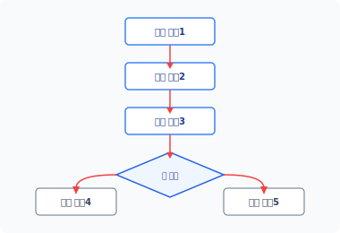
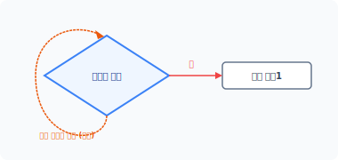
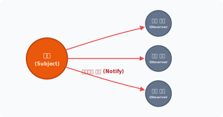
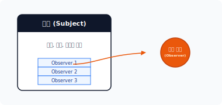
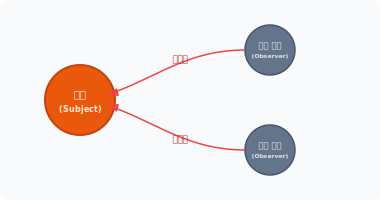
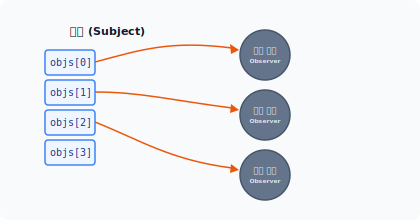


# CHAPTER 18 감시자 패턴
## ob·ser·ver
`[ əb|zɜːrvə(r) ]` 🔊


감시자 패턴은 모든 언어에서 많이 응용되는 대표적인 패턴입니다. 몇몇 프로그래밍 언어는 자체적으로 감시자 패턴의 기본 구현체를 만들어 제공하기도 합니다.

## 18.1 감시자
감시자를 이해하기 위해 프로그램에서 말하는 감시가 무엇인지부터 살펴봅시다.

### 18.1.1 관찰
프로그램 동작은 하나의 로직을 실행한 후 다음 로직을 실행하는 것처럼 순차적으로 이뤄집니다. 로직을 단계별로 연결하면 프로그램이 동작합니다.

코드의 로직은 독립적이고 자체적인 동작입니다. 또는 외부의 값에 따라 실행되는 동작을 다르게 할 수도 있습니다. 코드의 로직이 다른 값(상태)에 의존해서 동작하는 경우, 코드는 값을 확인하는 과정이 필요합니다.

---
**404** 3부 행동 패턴

#### 그림 18-1 코드의 동작 처리



코드는 순차적으로 실행됩니다. 동일 값을 확인하여 지속적으로 동작을 분기하는 작업이 자주 발생한다면 반복문을 이용할 수 있습니다. 반복문은 코드의 일정 영역을 반복적으로 수행하면서 코드의 값을 지속적으로 확인할 수 있습니다.

다음은 반복문과 조건문을 이용한 감시 코드입니다.

예제 18-1 Observer/01/monitor.php
```php
<?php
// 상태값
$status = false;

while (1) {
    // 상태값 모니터
    if ($status) {
        hello();
        // 상태값이 '참'인 경우 탈출
        break;
    }
}

function hello()
{
    echo "안녕하세요.";
}
```

---
18장 감시자 패턴 **405**

외부의 값을 반복문으로 지속해서 확인합니다. 조건값이 맞을 경우 반복문을 탈출합니다.

#### 그림 18-2 값을 지속적으로 감시하는 무한 루프



[예제 18-1]에서는 상태값을 지속적으로 모니터링하기 위해 무한 루프를 사용했습니다. 무한 루프는 지속적인 상태값을 모니터링할 수 있지만, 관찰하는 도중에 다른 동작을 처리할 수는 없습니다. 마치 프로그램이 어떤 상태를 대기하고 있는 것과 같습니다.

이처럼 상태값에 따라 동작을 처리하기 위해 지속적으로 관찰하는 것은 비효율적입니다.

### 18.1.2 상태 변화
컴퓨터는 짧은 시간 안에 수많은 일을 처리합니다. 상태값을 하나하나 관찰하면서 동작하는 것은 비효율적이며, 이러한 프로그램 처리는 성능을 저하시키는 요인입니다.

프로그램 코드가 직접 상태값을 관찰하는 것이 아니라 값에 변화가 있을 때 이를 알리고 처리를 수행하면 상태를 기다리는 동안 다른 일을 처리할 수 있어 더욱 효율적입니다. 이처럼 직접 상태값을 관찰하는 것이 아니라 수동적으로 상태값을 전달 받아 처리하는 패턴을 감시자[^1] 패턴이라고 합니다.

### 18.1.3 통보
직접 상태값을 관찰하지 않고 수동적으로 상태값을 전달 받으려면 어떻게 해야 할까요? 바로 상태가 변경됐을 때 통보해주면 됩니다.

감시자 패턴에는 주체[^2]라는 구성 요소가 있는데, 주체 클래스는 상태를 갖고 있습니다. 그

---
[^1]: 감시자 패턴은 어떤 상태값을 관찰하고 있다는 점에서 '관찰자 패턴'이라고도 부르며, 영어적 표현으로는 옵저버 패턴이라고도 합니다.
[^2]: Subject

**406** 3부 행동 패턴

리고 이러한 상태에 변경이 발생했을 경우 실제 동작하는 객체(Observer)에 통보하거나 갱신 작업을 통보합니다.

#### 그림 18-3 통보



실제 동작하는 객체는 주체의 상태값을 직접 관찰하지 않고도 상태 변화를 알 수 있습니다. 감시자 패턴은 상태를 감시하는 행동과 실제 동작을 처리하는 행동을 분리해서 구현합니다.

### 18.1.4 할리우드 원칙
객체지향의 설계 원칙 중 할리우드 원칙[^1]이라는 것이 있습니다. 이는 영화 산업으로 유명한 할리우드에서 배우를 캐스팅하는 과정을 객체에 비유한 데서 만들어진 원칙입니다.

예를 들면 배우는 영화에 출연하기 위해 자신의 프로필을 영화사에 전달합니다. 그리고 자신의 캐스팅 상태를 지속적으로 물어봅니다. 하지만 영화사 입장에서는 매일 연락하는 배우들에게 캐스팅 상태를 통보해주기가 어렵습니다.

그래서 영화사는 모든 배우에게 “앞으로 연락하지 말고 캐스팅되면 저희가 연락 드리겠습니다.”라고 공지하고, 배우는 캐스팅 상태를 영화사에 물어보지 않은 채 통보를 기다리는 것입니다. 다른 비유로는 입사시험을 치른 후 합격통지를 기다리는 취업 준비생을 들 수 있습니다.

이처럼 영화 산업에서 이뤄지는 관련 경험을 객체지향 설계에 도입한 것이 할리우드 원칙이며, 감시자 패턴은 할리우드 원칙을 적용한 패턴 구현입니다.

---
[^1]: Hollywood Principle

18장 감시자 패턴 **407**

## 18.2 구성

본격적으로 감시자 패턴을 학습하기 위해 구성 요소를 살펴보겠습니다.

### 18.2.1 관련 클래스
감시자 패턴은 크게 4개의 클래스로 구성됩니다.

* 주체(subject)
* 실제 주체(concreteSubject)
* 감시자(observer)
* 실제 객체(concreteObserver)

4개의 클래스는 다시 2개의 그룹으로 구분할 수 있습니다.

* 통보를 위한 주체-실제 주체 클래스
* 처리를 위한 감시자-실제 객체 클래스

### 18.2.2 주체-실제 주체
주체-실제 주체는 감시자 패턴에서 객체의 등록, 삭제, 통보를 담당하는 클래스입니다. 주체 클래스는 실제 처리하는 객체를 관리하고 관리를 담당하는 주체(Subject)는 1개 이상의 감시자 객체를 갖고 있습니다.

#### 그림 18-4 감시자 객체 관리



---
**408** 3부 행동 패턴

### 18.2.3 감시자-실제 객체
감시자-실제 객체는 통보를 수신 받아 처리하는 객체입니다. 통보를 받으려면 주체 클래스에 수신 받는 객체를 등록해야 합니다.

보통은 주체로부터 수동적으로 통보를 받지만, 필요 시 능동적으로 서브 객체 상태를 주체로 전달하기도 합니다.

### 18.2.4 이벤트
감시자 패턴은 이벤트를 처리하는 패턴과 유사하며 주체 클래스는 이벤트를 중재하는 객체와 같습니다. 상태값이 이벤트라면 주체는 이벤트를 받아 감시자 객체에 전달하는 역할을 합니다. 감시자 패턴은 분산 이벤트 핸들링 처리를 수행합니다.

## 18.3 관계

감시자 패턴은 구성 클래스 간에 관계를 형성하는데, 이는 주체와 감시자들 간의 관계를 말합니다. 관계적 관점에서 감시자 패턴의 여러 특징들을 살펴보봅시다.

### 18.3.1 감시자 객체의 의존성
객체가 관계를 가진다는 것은 의존성을 의미합니다. 메인 객체가 서브 객체를 필요로 하고, 서브 객체에 동작 메시지를 전달합니다.

메인 구성 요소인 주체는 처리해야 하는 복수의 서브 객체(Observer)를 갖고 있습니다. 주체-감시자가 하나의 커다란 객체 덩어리이고, 이러한 객체 덩어리를 복합 구조[^1] 객체라고 합니다.

---
[^1]: Composite

18장 감시자 패턴 **409**

#### 그림 18-5 감시자 객체의 의존성



감시자 패턴은 주체와 감시자 간 의존 관계를 갖고 있습니다. 이러한 관계 형태의 패턴을 다른 말로 종속자[^1] 패턴이라고도 합니다.

### 18.3.2 등록
실제 동작하는 모든 객체(Observer)는 주체에 등록돼야 합니다. 주체는 몇 개의 필수 메서드를 갖고 있으며, 필수 메서드를 통해 관계를 설정하기 위한 등록을 요청합니다. 주체에 등록된 감시자는 언제든지 등록과 제거가 가능합니다.

이러한 필수 메서드는 인터페이스로 적용하여 구현을 일반화하고, 일반화된 인터페이스는 상태 변화 시 주체에 등록된 감시자로 통보를 전달합니다.

### 18.3.3 느슨한 결합
이벤트 통보를 받는 실제(Observer) 객체를 주체에 등록합니다. 하나의 객체를 또 다른 객체에 등록할 경우 두 객체 사이에 의존 관계가 발생합니다. 의존성은 객체 간 결합이지만 직접적인 결합은 객체의 유연성을 저해합니다.

감시자 패턴은 객체의 결합을 보완하기 위해 관계를 동적으로 형성합니다. 객체를 동적으로 결합하면 강력한 결합 구조가 아닌 느슨한 결합 구조로 구성되는데, 이는 감시자 패턴의 경우 하나의 커다란 복합 구조 객체로 설계하기 때문입니다.

---
[^1]: Dependent

**410** 3부 행동 패턴

> [!NOTE]
> 하나의 주체가 등록된 모든 감시자 객체를 관리한다는 점에서 객체 간 상호 의존성을 갖습니다. 주체와 감시자는 느슨한 결합 관계로 객체 간에 상호 작용합니다.

### 18.3.4 독립적
주체와 감시자는 느슨한 형태의 결합 구조와 의존성을 갖고 있습니다. 결합과 의존성을 가진다고 해서 결합된 모든 감시자 객체의 세부 내용까지 알 필요는 없습니다.

주체는 상태 변화 시 감시자에 변경된 상태만 전달하면 됩니다. 모든 감시자 객체는 주체에 의존하는 관계지만, 때로는 독립적 실행이 가능한 개별 객체입니다.

객체가 서로 협력하면서 행위를 처리할 때, 다른 객체에서 객체의 변화를 참조하는 경우가 있습니다. 독립적인 실행은 다른 객체의 클래스에 의존하지 않고도 메시지를 전달할 수 있는 것을 말합니다. 독립적인 특성은 감시자 패턴의 장점입니다.

### 18.3.5 일대다 관계(1:N)
하나의 주체는 다수의 감시자 객체를 가집니다. 이러한 관계 구조는 객체의 일대다 관계를 말합니다. 일대다 관계 구조는 복합 구조 객체가 됩니다.

감시자 패턴은 상태가 변경될 경우 다른 객체에 상태 변화를 통보합니다. 이때 통보되는 감시자는 여러 개가 될 수 있습니다.

상태 변화가 발생하면 주체는 등록된 모든 감시자 객체에 변경을 통보합니다. 여러 개의 등록된 감시자에게 통보하기 위해 반복문을 사용하기도 합니다. 이를 푸시[^1]형 통보라고 합니다.

주체와 객체 간에는 상호 작용이 발생하며, 모든 감시자는 주체에 의해 갱신되기를 기다리고 있습니다.

### 18.3.6 구독 관계
일대다 구조의 감시자 패턴에서는 주체가 변화 상태를 모든 객체에 통보합니다. 여기서 통보는

---
[^1]: push

18장 감시자 패턴 **411**

일방적인 단방향성으로 이뤄집니다.

단방향성을 가진 감시자 패턴을 다른 말로 게시-구독[^1] 패턴이라고 합니다. 어떤 UI 프레임워크에서는 감시자 패턴을 리스너 패턴[^2]이라고 부르기도 합니다. 이처럼 감시자 패턴은 적용되는 방식에 따라 다른 이름으로 불리기도 합니다.

### 18.3.7 복합 관계
하나의 주체는 여러 개의 감시자 객체를 갖고 있습니다. 감시자 패턴은 커다란 복합 구조의 객체 덩어리입니다.

감시자 패턴은 일대다 의존 관계를 가지며, 상태가 변화될 때 자동으로 갱신될 수 있도록 처리합니다. 시스템을 하나의 공통된 클래스 집합으로 처리할 때 객체 간 일관성이 유지돼야 하지만, 일관성 때문에 객체 간 결합도가 높아져서는 안 됩니다. 결합도가 높아지면 재사용성이 떨어지기 때문입니다. 따라서 느슨한 결합의 복합 구조를 형성합니다.

감시자 패턴은 복합 구조를 관리하는 패턴 중 하나입니다.

## 18.4 주체

먼저 감시자 패턴을 구현하기 위해 주체를 설계해야 합니다. 주체는 인터페이스[^3]와 실제 주체[^4]로 이뤄집니다.

### 18.4.1 주체 인터페이스
[예제 18-2]는 주체를 설계하기 위한 공통 인터페이스입니다. 인터페이스를 적용하면 복수의 주체를 생성할 수 있습니다.

예제 18-2 Observer/02/subject.php
```php
<?php
// 주체의 인터페이스를 선언합니다.
```

---
[^1]: publish-subscribe
[^2]: Listener pattern
[^3]: subject
[^4]: ConceteSubject

**412** 3부 행동 패턴

```php
interface Subject
{
    public function addObserver(Observer $o);
    public function delelteObserver(Observer $o);
    public function notiObserver();
}
```

인터페이스에는 주체가 감시자를 관리하기 위한 메서드를 선언합니다. 필요에 따라 인터페이스 대신 추상화 객체를 사용하기도 합니다.

### 18.4.2 실제 주체
실제 주체는 인터페이스(subject)를 적용한 하위 클래스입니다. 즉 실제 주체는 인터페이스에서 선언된 메서드의 작업을 구체화합니다.

예제 18-3 Observer/02/Members.php
```php
<?php
// 실제적 주체 구현
class Members implements Subject
{
    // 감시자 보관
    private $Objs = [];

    public function __construct()
    {
        echo __CLASS__." 실제 주체(concreteSubject)를 생성합니다.\n";
    }

    // 감시자를 등록합니다.
    public function addObserver(Observer $o)
    {
        echo "감시자 객체를 추가합니다.\n";
        array_push($this->Objs, $o);
    }

    // 감시자를 제거합니다.
    public function delelteObserver(Observer $o)
    {
        for ($i=0; $i<count($this->Objs); $i++) {
```

---
18장 감시자 패턴 **413**

```php
            if ($this->Objs[$i]->name == $o->name) {
                unset($this->Objs[$i]);
            }
        }
    }

    // 모든 감시자에게 통보합니다.
    public function notiObserver()
    {
        foreach ($this->Objs as $obj) {
            echo "감시자=> ";
            $obj->update();
        }
    }
}
```

### 18.4.3 감시자 보관
실제 주체는 1:N 관계의 복합 객체 구조이며, 여러 개의 감시자 객체를 관리하기 위해 내부적으로 배열 저장소를 갖고 있습니다. 또한 실제 주체는 다수의 감시자 객체와 의존 관계를 가집니다.

```php
    // 감시자 보관
    private $Objs = [];
```

배열은 객체를 보관할 수 있습니다. 실제 주체는 배열 저장소에 감시자 객체를 보관하고, 필요 시 객체의 정보를 참조합니다.

#### 그림 18-6 객체 저장



---
**414** 3부 행동 패턴

저장되는 배열은 private 접근자 속성을 갖습니다. 따라서 감시자 객체를 저장하려면 setter 메서드를 같이 생성해야 합니다.

### 18.4.4 관리 메서드
실제 주체는 인터페이스(subject)의 구현을 적용 받습니다. 인터페이스에는 감시자 객체를 관리하는 메서드를 정의합니다.

주체 인터페이스를 이용하여 정의된 메서드의 구현체를 생성합니다. 이 메서드는 주체의 배열 공간에 감시자를 저장할 수 있는 setter 역할의 메서드입니다. 관리 메서드는 감시자를 실제 주체에 등록 또는 제거할 수 있습니다.

### 18.4.5 호출
실제 주체는 감시자의 등록을 관리하고 외부로부터 상태 변화나 이벤트를 수신합니다. 그리고 수신된 상태를 등록된 모든 감시자 객체에 통보합니다.

등록된 감시자는 모두 주체와 느슨한 결합 관계로 되어 있습니다. 변화가 한 개라도 발생하면 주체는 모든 감시자 객체들에게 상태를 통보합니다. 모든 감시자 객체는 각각 변경 상태를 수신하고 처리합니다.

## 18.5 감시자

앞에서는 감시자 패턴의 주체를 설계했습니다. 이제는 실제 동작을 처리하는 감시자 객체를 생성하겠습니다.

### 18.5.1 감시자 인터페이스
감시자는 주체로부터 통보되는 상태를 수신 받아 동작합니다. 각각의 감시자 객체는 주체와 상호 작용할 수 있는 공통된 메서드가 필요하며 이를 위해 인터페이스를 적용합니다.

---
18장 감시자 패턴 **415**

개별 감시자를 생성하기 위한 인터페이스를 설계합니다.

예제 18-4 Observer/02/Observer.php
```php
<?php
abstract class Observer
{
    // 감시자 이름
    private $name;

    // 상태 업데이트
    abstract public function update();
}
```

인터페이스는 추상화 클래스로 설계할 수 있습니다. 추상화는 공용 메서드나 프로퍼티를 각각의 옵저버와 공유할 수 있습니다. 그 외 상태 처리 메서드는 상속받은 하위 클래스에서 개별적으로 구현합니다.

### 18.5.2 감시자 객체
감시자 객체[^1]는 감시자 인터페이스를 상속하고 이를 구체화합니다. 감시자 객체는 요청 받는 실행 객체입니다.

각각의 감시자 객체는 추상 클래스(감시자 인터페이스)에서 선언된 update() 메서드를 구현해야 합니다. update 메서드는 주체와 통신하는 연결 창구입니다.

예제 18-5 Observer/02/UserA.php
```php
<?php
// 구현체
class UserA extends Observer
{
    public function __construct($name)
    {
        echo __CLASS__." 객체를 생성합니다.\n";
        $this->name = $name;
    }
```

---
[^1]: ConcreteObserver

**416** 3부 행동 패턴

```php
    public function update()
    {
        echo $this->name." 갱신합니다.\n";
    }
}
```

생성된 모든 감시자 객체는 공통된 인터페이스 및 추상화를 통해 일관성을 유지하고, 동일한 상태값을 저장합니다.

예제 18-6 Observer/02/UserB.php
```php
<?php
// 구현체
class UserB extends Observer
{
    public function __construct($name)
    {
        echo __CLASS__." 객체를 생성합니다.\n";
        $this->name = $name;
    }

    public function update()
    {
        echo $this->name." 갱신합니다.\n";
    }
}
```

### 18.5.3 통보 시스템
통보는 크게 수동적 통보와 능동적 통보로 구분됩니다. 감시자 패턴은 수동적 통보 방식으로 감시자에 전달하며, 감시자는 객체로부터 상태 변화 메시지를 수동적으로 기다립니다.

상태 변화가 감지되면 주체는 등록된 감시자에 변경을 통보합니다. 이때 주체는 각 감시자가 가진 공통된 update 메서드를 호출합니다.

18장 감시자 패턴 **417**

### 18.5.4 브로드캐스팅
감시자 객체는 감시자 패턴에서 수동적인 상태 변화 메시지를 수신합니다. 메시지를 수동적으로 수신한다는 측면에서 브로드캐스팅 통보와도 유사합니다.

브로드캐스팅 방식의 단점은 불필요한 객체에도 메시지를 전달한다는 것입니다. 등록된 모든 객체로 전달하다 보면 예측하지 못한 잘못된 동작이 발생할 수 있습니다.

### 18.5.5 능동적 통보
감시자 패턴은 주체를 통해 상태 변화를 모든 감시자 객체에 통보합니다.

감시자 객체가 메시지 수신만 받는 것은 아니며, 때로는 자신의 변화를 주체에게 능동적으로 통보합니다. 주체는 하위 감시자 객체가 통보한 상태를 다른 감시자 객체에 통보할 수 있습니다.

이처럼 주체는 감시자와 결합 관계를 가지고 상호 간 정보를 교류할 수 있습니다. 이는 주체와 감시자 간의 의존 관계를 어떻게 구성하느냐에 따라 다릅니다. 다만 상호 통보 기능을 구현할 때는 객체 간 호출 순환 고리에 빠지지 않도록 설계해야 합니다.

### 18.5.6 상태 저장
감시자 패턴은 수동적, 능동적 통보가 모두 가능하도록 설계할 수 있는데, 그러기 위해서는 주체와 감시자 사이에 더욱 긴밀한 관계를 설정해야 합니다.

상태가 변화할 때마다 감시자에 매번 통보하는 것이 아니라 특정한 상태의 조건이 발생했을 경우에만 통보를 전달합니다. 그리고 상태를 판별하기 위해 상태 플래그를 추가로 사용합니다.

## 18.6 동작 실습

앞에서 생성한 주체와 감시자를 이용해 감시자 패턴을 실행해보겠습니다.

**418** 3부 행동 패턴

### 18.6.1 메인 동작
[예제 18-7]은 감시자 패턴을 실습하기 위한 메인 코드입니다.

예제 18-7 Observer/02/index.php
```php
<?php
// 주체(subject)
require "Subject.php";
require "Members.php";

// 감시자 객체
require "Observer.php";
require "UserA.php";
require "UserB.php";

echo "감시자 패턴을 실행합니다\n";

$subject = new Members;

// 감시자에 등록합니다.
$a = new UserA("Jiny");
$subject->addObserver($a);

$b = new UserB("Eric");
$subject->addObserver($b);

// 모든 감시자에게 통지를 전송합니다.
$subject->notiObserver();
```

### 18.6.2 주체 생성
감시자를 관리하는 주체를 생성합니다. 주체는 필요에 따라 다수의 주체를 생성할 수 있고, 주체가 다른 주체의 감시자 객체로 될 수도 있습니다. 주체를 계층적으로 응용하면 더 큰 형태의 감시자 패턴을 구현할 수 있습니다.

18장 감시자 패턴 **419**

### 18.6.3 감시자 생성과 등록
다음에는 감시자 객체를 생성하고 생성한 감시자 객체는 주체에 등록합니다. 주체에 등록된 감시자 객체만 통보를 받을 수 있으며, 감시자 객체를 등록할 때는 주체에서 제공하는 메서드를 호출하여 등록합니다.

등록된 감시자는 필요에 따라 삭제할 수 있는데 등록이 해제된 객체는 더 이상 통보를 받을 수 없습니다.

등록된 감시자는 주체로부터 요청을 기다립니다.

### 18.6.4 상태 변경과 통보
주체는 등록된 모든 감시자 객체에 변경된 상태를 통보합니다. 주체의 통보를 전송하는 메서드는 배열을 순회하면서 모든 감시자의 update 메서드를 호출합니다.

```bash
$ php index.php
감시자 패턴을 실행합니다
Members 실제 주체(concreteSubject)를 생성합니다.
UserA객체를 생성합니다.
감시자 객체를 추가합니다.
UserB객체를 생성합니다.
감시자 객체를 추가합니다.
감시자=> Jiny 갱신합니다.
감시자=> Eric 갱신합니다.
```

### 18.6.5 상태 보관
주체가 모든 상태를 감시자 객체에 전달하는 과정에서 많은 부하가 발생합니다. 주체는 특정 상태만 검출하여 감시자에 통보할 수 있습니다.

주체는 발생한 상태값을 보관하고 보관된 상태값을 조건 처리하며, 조건이 성립된 경우에만 감시자 객체에 통보를 전달합니다.

**420** 3부 행동 패턴

### 18.6.6 비동기와 스레드
예제로 사용한 PHP는 비동기와 멀티 스레드를 지원하지 않지만, 다른 프로그래밍 언어에서는 비동기 통신을 활용해 감시자 패턴을 사용할 수 있습니다.

동기 방식으로 통신할 때는 감시자 실행 순서와 처리값이 순차적으로 동작합니다. 하지만 감시자 객체가 비동기 통신할 때는 결과값이 순차적이지 않습니다. 감시자 패턴을 비동기로 실행할 때는 실행의 흐름을 파악하기 힘듭니다. 특히 다중 동기로 여러 개의 감시자를 실행할 경우 구조를 더 이해하기 힘들어집니다.

동작 결과가 순서대로 처리돼야 한다면 감시자 패턴을 적용할 수 없습니다. 감시자 패턴은 독립적으로 실행되고 느슨한 결합으로 언제든지 결합과 제거가 가능하기 때문입니다.

## 18.7 활용

감시자 패턴은 상태를 직접 관찰하지 않고 불특정 다수의 객체에 통보할 때 유용합니다.

### 18.7.1 불특정 대상
감시자 패턴은 언제든지 주체에 감시자를 등록하거나 제거할 수 있으며 독립적인 실행도 가능합니다. 각 감시자의 구체적인 동작을 알지 못해도 메시지를 전달해 독립적인 동작을 수행합니다.

또한 통보하는 객체의 수도 상관없습니다. 주체는 등록된 모든 감시자 객체에 통보할 수 있어 자신의 변화를 불특정 다수의 객체에게 통보할 수 있습니다.

### 18.7.2 언어 지원
감시자 패턴의 인기는 높습니다. 최근 모던 프로그래밍 언어에서는 감시자 패턴을 자체 코드로 제공하기도 합니다. 대표적으로 자바는 감시자 패턴을 내장된 코드로 제공합니다.

자바에서는 API 형태로 observer 인터페이스와 observable 클래스를 사용할 수 있습니다.

18장 감시자 패턴 **421**

통보는 푸시[^1] 방식과 풀[^2] 방식 모두 지원합니다.

### 18.7.3 하드웨어
감시자 패턴은 하드웨어 분야에서 많이 사용되는 일반적인 기법입니다. 하드웨어는 상태값이 변경되면 신호로 통보합니다. 그리고 신호가 수신되면 인터럽트 등의 처리가 발생해 상태를 처리합니다.

하지만 소프트웨어적인 방법은 다릅니다. 계속 상태값을 관찰하거나 감시자 패턴과 같은 기법을 사용해야 합니다.

## 18.8 관련 패턴

감시자 패턴은 다른 패턴을 구현할 때 같이 응용되는 경우가 많습니다. 행동들이 유사한 성격을 갖기도 하지만, 해결하고자 하는 목적에는 조금씩 차이가 있습니다.

### 18.8.1 중재자 패턴
중재자[^3]도 객체에 발생한 상태를 다른 객체에 전달합니다. 객체 간에 직접 통신하는 것이 아니라 중심 객체가 통신을 중재합니다. 이때 감시자 패턴을 함께 사용합니다.

상태 변화를 통보하는 측면에서 봤을 때 중재자 패턴과 감시자 패턴은 유사합니다. 하지만 감시자 패턴은 상태만 통보하며, 중재자는 역할 조정을 목적으로 통보합니다.

### 18.8.2 MVC
MVC 설계 모델에서 M은 데이터베이스 모델[^4]을 의미하고 V는 화면을 구성하는 뷰[^5]를 의미합니다. MVC 설계에서도 감시자 패턴을 응용하는데, 모델이 주체에 해당하고 뷰가 감시자 역할을 수행하는 구조로 설계됩니다.

---
[^1]: push
[^2]: pull
[^3]: mediator
[^4]: model
[^5]: view

**422** 3부 행동 패턴

## 18.9 정리

감시자 패턴은 객체의 상태 변화를 다른 객체에 통보하는 패턴입니다. 또는 감시자를 통해 자신의 상태를 다른 대상의 객체에 통보할 수도 있습니다.

감시자 패턴은 매번 상태를 관찰하는 것이 아니라 상태가 변경됐을 때 통보함으로써 작업을 처리합니다. 감시자는 언제든지 메서드를 통해 통보를 전송할 수 있습니다.

18장 감시자 패턴 **423**

