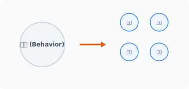
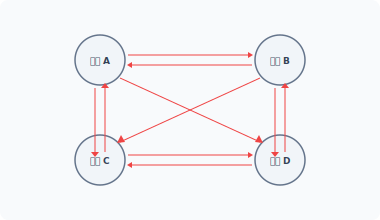
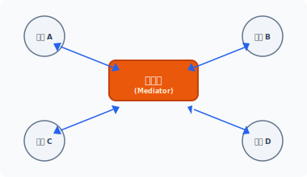


me·di·ator
[ 'mi:diertə(r) ] 🔊

CHAPTER **19**
# 중재자 패턴

중재자 패턴은 분산된 다수의 객체 역할을 조정할 때 주로 사용됩니다.

## 19.1 중재

중재는 어떤 문제를 해결하거나 조정을 돕는 것을 말합니다. 객체지향에서는 분산된 객체의 행동을 중재합니다.

### 19.1.1 분산
객체지향의 특징은 모든 행동을 하나의 객체에 집중하여 처리하지 않는다는 것입니다. 행동은 작은 단위로 분리되고, 목적 동작을 수행하기 위해 분리된 행동을 연결합니다.

#### 그림 19-1 행동 분리



**424** 3부 행동 패턴

분리된 객체는 각각의 독립된 행동을 가진 객체입니다.

### 19.1.2 상호 작용
객체지향은 하나의 커다란 행동을 작은 단위의 객체로 분산합니다. 이렇게 객체의 역할을 보다 작은 객체로 분할하는 이유는 동작을 재사용하기 위해서입니다.

#### 그림 19-2 객체의 상호 작용



객체의 행동을 작은 객체 단위로 분리하면, 객체는 목적으로 하는 행동을 수행하기 위해 객체 간에 의존 관계가 발생합니다. 이렇게 분리된 객체의 의존 관계는 구조적으로 복잡한 연결 고리를 생성합니다.

하나의 목적을 완전히 이루기 위해서는 연관된 모든 객체의 행동이 필요합니다. 분산된 작은 객체들 간에 정보를 주고받기 위해 복잡한 메시지 호출 동작이 발생합니다.

### 19.1.3 행동 제약
분산된 객체는 각각 세분화된 행동을 가지며, 분리된 객체는 서로 강력한 의존적 결합 구조를 가집니다. 또한 분리된 객체 수가 늘어날수록 구조는 더욱 복잡해지고 결합도는 단단해집니다. 그럼에도 불구하고 객체의 행동을 분산시키는 목적은 객체의 구성 단위를 재사용하기 위해서입니다.

강력한 결합 구조는 객체의 재사용을 방해하는 요인이 됩니다. 이러한 이유로 객체를 분리했지만, 분리된 객체는 강한 의존성 때문에 독립적인 행동을 할 수 없습니다. 객체의 행동 제약이

19장 중재자 패턴 **425**

발생한 것입니다.

객체를 단순히 분할하는 것은 복합 객체와 같은 큰 덩어리입니다.

### 19.1.4 중재자 패턴
중재자[^1]의 사전적 의미를 찾아보면 '중재인, 조정관, 중재기관'이라는 뜻이 있습니다.

실제 생활과 관련된 예를 들어 봅시다. 회의, 토론 등에서는 여러 사람의 패널과 사회자를 볼 수 있습니다. 사회자는 여러 패널의 발언권을 제어하고 이를 정리하는 역할을 합니다.

그리고 각종 모임에는 총무가 존재하는데, 총무는 각 회원에게 회식 비용을 받아 결제를 대행합니다. 회원이 일일이 계산하는 것은 복잡하기 때문입니다.

이처럼 이해 관계자가 많은 경우 이를 정리하는 중개인이 있으면 일을 보다 편리하게 처리할 수 있습니다.

### 19.1.5 중재를 위해 관계 정리하기
객체의 행동을 중재하기 위해서는 복잡한 구조적 관계를 개선해야 합니다.

분산된 객체는 매우 복잡하게 얽혀 있습니다. 객체는 상호 관계를 가지며 호출되면서 결합도가 급속히 증가합니다. 이렇게 되면 객체의 유연성이 떨어지고 원래 목적인 객체의 재사용도 힘들어집니다.

중재자는 객체 간 복잡한 상호 관계를 중재하며 객체 간에 복잡한 관계로 묶인 것을 재구성합니다. 즉 서로 의존적인 M:N의 관계를 가진 객체를 느슨한 1:1 관계로 변경합니다.

중재자 패턴은 객체의 관계를 하나의 객체로 정리하는 패턴입니다.

### 19.1.6 소결합
복잡하게 얽히는 객체의 연관 관계를 중재자 객체에게 집중합니다. 객체의 연관 관계를 하나의 중간 매개 객체에 집중함으로서 관계의 결합도를 해소합니다.

---
[^1]: Mediator

**426** 3부 행동 패턴

중재자 역할을 수행하는 객체를 관계 중심에 추가합니다. 중재자는 각각의 객체를 자신과 연결하고, 객체의 행위 요청을 중앙에서 제어합니다.

#### 그림 19-3 중재자 객체



객체는 더 이상 상호 간에 직접적으로 접근하지 않는 대신 중재자에게 필요한 행동을 요청합니다. 중재자 패턴을 사용하면 여러 클래스가 서로 직접적으로 호출해 복잡한 관계를 느슨한 결합으로 만듭니다. 그리고 느슨한 결합은 객체의 재사용과 유연성을 높입니다.

중재자 객체는 행동을 중재함으로써 복잡한 객체의 구조를 단순화합니다. 또한 복잡한 통신과 제어를 한 곳에 집중하여 처리하는 효과도 있습니다.

## 19.2 중재자

중재자는 객체 간 상호 작용을 제어하며 객체의 동작을 조화롭게 조정하는 역할을 수행합니다.

### 19.2.1 중재자와 동료
중재자는 하나의 중재자와 여러 동료 객체[^1]로 구성되어 있으며, 동료 객체의 강력한 결합 구조를 느슨한 결합 구조로 개선합니다.

또한 중재자는 객체 간에 상호 작용을 제어하고 조화롭게 만드는 역할을 합니다. 호출이 필요한 경우 동료 객체가 다른 동료 객체에 직접 접근해서 호출하지 않으며, 중재자를 의존해서 다른 동료 객체를 호출합니다. 즉 각각의 동료 객체가 서로 통신하는 것이 아니라 중재자를 통해 통신하는 것입니다.

---
[^1]: Colleague

19장 중재자 패턴 **427**

른 동료 객체를 호출합니다. 즉 각각의 동료 객체가 서로 통신하는 것이 아니라 중재자를 통해 통신하는 것입니다.

중재자는 동료 객체가 호출한 명령을 다시 동료 객체에 전달하고, 중재자 패턴은 동료 객체와 명령을 주고받는 중재 역할을 수행합니다.

### 19.2.2 인터페이스
중재자는 여러 동료 객체의 관계를 조정하는데, 행동을 중재하기 위해서는 다양한 메서드가 필요합니다. 이 메서드는 관계를 중재하는 모든 동료 객체에 적용되며 이 경우 공통된 인터페이스가 필요합니다.

생성된 동료 객체에 여러 방식의 중재 기능이 더 필요하다면, 복수의 concreteMediator 메서드를 생성할 수도 있습니다. concreteMediator를 설계하기 전에 먼저 Mediator 인터페이스를 생성합니다.

예제 19-1 Mediator/01/Mediator.php
```php
<?php
interface Mediator
{
    // 회원을 생성합니다.
    public function createColleague();
}
```

중재자는 관리할 동료 객체의 목록을 관리합니다. 또한 다음과 같이 Client 실행 코드에서 동적으로 동료를 생성하고 중재 목록에 추가할 수도 있습니다.

중재자의 공통된 부분을 추상화로 변경하여 개선해봅시다.

예제 19-2 Mediator/02/Mediator.php
```php
<?php
abstract class Mediator
{
    // 중재해야 될 객체의 목록을 가지고 있습니다.
    protected $Colleague = [];
```

**428** 3부 행동 패턴

```php
    // Colleague를 추가합니다.
    public function addColleague($obj)
    {
        array_push($this->Colleague, $obj);
    }

    // 동료를 생성합니다.
    abstract public function createColleague();
}
```

추상 클래스는 `$Colleague` 배열을 이용해 복수의 동료 객체를 관리합니다. 접근 속성은 추상 클래스를 상속할 수 있도록 protected로 설정합니다.

`addColleague()` 메서드는 스택 배열(`$Colleague`)에 동료 객체를 추가합니다. `$Colleague`는 복수의 객체를 보관하는 스택 구조입니다.

### 19.2.3 concreteMediator 클래스
중재자는 인터페이스/추상화와 구체적인 concreteMediator 클래스로 분리하여 설계합니다. 실제적인 중재 동작은 concreteMediator 클래스에 선언합니다.

예제 19-3 Mediator/01/Server.php
```php
<?php
// concreteMediator
class Server extends Mediator
{
    public function __construct()
    {
        echo "중재자 생성들이 되었습니다.\n";
        $this->Colleague = array();
    }

    public function createColleague()
    {
        // 동료 객체 목록을 초기화합니다.
    }
```

19장 중재자 패턴 **429**

```php
    // 중재 기능
    public function mediate($data, $user)
    {
        echo ">> ".$user." 로부터 서버 메시지를 받았습니다.\n";

        // 모든 Colleague에게 전달 받은 메시지를 통보합니다.
        foreach ($this->Colleague as $obj) {
            echo "<< ".$obj->userName()." : ";
            $obj->message($data);
        }
    }
}
```

중재자의 핵심 기능은 `mediate()` 메서드입니다. `mediate()` 메서드는 각각의 동료 객체로부터 호출되며, 호출된 `mediate()` 메서드는 다시 전달해야 하는 동료 객체의 메서드를 재호출합니다.

### 19.2.4 서브 클래스 제한
중개하는 행동마다 concreteMediator 클래스를 생성합니다. 중개 행동이 변경되는 경우 mediator 인터페이스를 적용 받은 또 다른 서브 클래스를 생성합니다. 이를 위해 미리 인터페이스/추상화를 실시한 것입니다.

하나의 concreteMediator 클래스에는 하나의 `mediate()` 메서드만 구현하고 분산된 객체는 하나의 서브 객체로 제한합니다.

### 19.2.5 집중적 통제
행동들이 여러 동료 객체로 분산되면 객체 간 결합이 발생하면서 서로 직접적으로 통신하게 됩니다. 이때 객체의 통신부는 내부적으로 캡슐화되어 있습니다. 이러한 객체의 내부적 통신은 중재자 패턴으로 변경하는 것을 힘들게 합니다.

**430** 3부 행동 패턴

## 19.3 동료 객체

동료 객체는 분산된 행동들의 독립된 객체입니다. 동료 객체는 직접 통신하지 않고 중재자를 통해서만 상호 통신하도록 제한됩니다.

### 19.3.1 통신 경로
중재자 패턴은 객체의 강력한 구조적 결합 문제점을 해결합니다.

중재자를 이용하지 않으면 다수의 동료 객체가 서로 정보를 직접 주고받습니다. 중재자 패턴은 동료 객체끼리 정보를 직접 주고받지 않도록 통신 경로를 제한합니다. 또한 서로의 참조 정보를 전달하지도 않습니다.

중재자 패턴을 이용하더라도 처리할 동료의 객체가 많으면 또 다른 문제가 발생합니다. 중재자는 하나의 객체 요청에 대해 모든 객체로 통보를 처리해야 하므로 경로의 수가 증가합니다.

중재자 패턴을 설계할 때는 경로의 수가 증가함에 따라 성능이 저하되지 않도록 신경 써서 구상해야 합니다.

### 19.3.2 인터페이스
중재자 패턴은 분산된 여러 동료 객체의 행동들을 조정해야 합니다. Mediator, Colleague와 같이 상호 간에 통신을 중개하기 위해 메서드를 사용합니다. 메서드는 객체 내부에 캡슐화되어 있습니다.

중재자와 동료 객체들 간 통신을 위해 메서드를 사전에 정의합니다. mediator는 Colleague의 메서드를 호출함으로써 동작 처리를 요청합니다. Colleague 인터페이스는 Mediator와의 통신을 처리하기 위해 동료 객체에 적용되는 인터페이스입니다.

예제 19-4 Mediator/01/Colleague.php
```php
<?php
interface Colleague
{
```

19장 중재자 패턴 **431**

```php
    // 중재자 객체를 설정합니다.
    public function setMediator();
}
```

인터페이스는 하나의 `setMediator()` 메서드를 필수고 선언합니다. 중재자는 통신을 위해 행동 객체의 정보를 갖고 있어야 합니다.

동료 객체는 복합 객체의 구조를 갖고 있습니다. 공통된 기능을 포함하기 위해 추상화로 변경합니다.

예제 19-5 Mediator/02/Colleague.php
```php
<?php
abstract class Colleague
{
    protected $Mediator;

    // 중개 객체를 설정합니다.
    // concreteMediator에 의해서 호출됩니다.
    public function setMediator($mediator)
    {
        $this->Mediator = $mediator;
    }
}
```

중재 객체의 정보를 저장할 수 있도록 프로퍼티를 하나 선언하고, 추상화 상속 후에도 접근할 수 있도록 속성을 protected로 설정합니다. `setMediator()` 메서드는 중재를 처리하는 객체의 정보를 설정합니다.

### 19.3.3 concreteColleague
추상 클래스 Colleague를 상속받아 실제적인 concreteColleague를 생성합니다. 처리할 행동에 따라 다수의 concreteColleague를 생성할 수도 있습니다.

다음 예제에서는 채팅을 위한 concreteColleague를 생성합니다. Mediator 인터페이스를 통해 객체 간 통신을 실시해봅시다.

**432** 3부 행동 패턴

예제 19-6 Mediator/02/User.php
```php
<?php
// concreteColleague
class User extends Colleague
{
    protected $name;

    public function __construct($name)
    {
        echo "Colleague가 등재되었습니다.\n";
        $this->name = $name;
    }

    // 사용자 이름을 확인합니다.
    public function userName()
    {
        return $this->name;
    }

    // 메시지를 전달합니다.
    public function send($data)
    {
        // 중개 서버로 메시지를 전송합니다.
        $this->Mediator->mediate($data, $this->name);
    }

    public function message($data)
    {
        echo "<< ".$data."\n";
    }
}
```

Colleague 객체는 독립적이며 재사용 가능한 객체이므로 통신 방법에 따라 Colleague에 구현해야 하는 메서드가 달라집니다.

이 예제의 concreteColleague는 2개의 통신 메서드 `send()`와 `message()`를 갖고 있습니다. `send()`는 중재자에게 처리를 요청하는 메서드이며, `message()`는 중재자로부터 처리를 부여받는 메서드입니다.

중재자 패턴은 요청과 부여를 통해 Colleague 객체 간 종속성을 제거합니다. 중재자 패턴은

19장 중재자 패턴 **433**

중재 기능을 캡슐화하고 각각의 객체는 행동보다 객체 연결에만 관심을 갖게 됩니다.

## 19.4 기본 실습

구현한 mediator와 Colleague를 통해 실제 채팅 통신을 처리하는 Client를 생성해보겠습니다.

### 19.4.1 관계 설정
채팅 동작을 위해 먼저 중재자 기능을 처리하는 서버 객체를 생성합니다. 그리고 Colleague 기능을 갖는 3명의 사용자 객체를 생성합니다.

각각의 Colleague에는 객체를 구별할 수 있는 이름이 있습니다. 구별되는 이름은 Colleague 생성자를 통해 지정하며, Colleague가 생성되면 각각의 Colleague에 mediator 객체의 정보를 추가 설정합니다.

예제 19-7 Mediator/02/index.php
```php
<?php
require "Mediator.php";
require "Server.php";
require "Colleague.php";
require "User.php";

// 1단계: 서버생성
$mediator = new Server;

// Colleague 1 등록
$user1 = new User("james");
$user1->setMediator($mediator);
$mediator->addColleague($user1);

// Colleague 2 등록
$user2 = new User("jiny");
$user2->setMediator($mediator);
```

**434** 3부 행동 패턴

```php
$mediator->addColleague($user2);

// Colleague 3 등록
$user3 = new User("eric");
$user3->setMediator($mediator);
$mediator->addColleague($user3);

// 중재자로 데이터를 전송합니다.
$user1->send("안녕하세요, 저는 james 입니다.");
echo "\n";

$user2->send("안녕하세요, 저는 jiny 입니다.");
echo "\n";

$user3->send("안녕하세요, 저는 eric 입니다.");
```

Mediator와 Colleague의 관계를 설정했으면 각각의 Colleague 사용자에게 메시지를 전달합니다.

```bash
$ php index.php
중재자 생성들이 되었습니다.
Colleague가 등재되었습니다.
Colleague가 등재되었습니다.
Colleague가 등재되었습니다.
>> james 로부터 서버 메시지를 받았습니다.
<< james : << 안녕하세요, 저는 james 입니다.
<< jiny : << 안녕하세요, 저는 james 입니다.
<< eric : << 안녕하세요, 저는 james 입니다.

>> jiny 로부터 서버 메시지를 받았습니다.
<< james : << 안녕하세요, 저는 jiny 입니다.
<< jiny : << 안녕하세요, 저는 jiny 입니다.
<< eric : << 안녕하세요, 저는 jiny 입니다.

>> eric 로부터 서버 메시지를 받았습니다.
<< james : << 안녕하세요, 저는 eric 입니다.
<< jiny : << 안녕하세요, 저는 eric 입니다.
<< eric : << 안녕하세요, 저는 eric 입니다.
```

19장 중재자 패턴 **435**

### 19.4.2 양방향
중재자 패턴은 다른 패턴들과 달리 양방향 통신을 처리합니다. 먼저 concreteColleague의 `send()` 메서드를 호출합니다.

```php
// 중재자로 데이터를 전송합니다.
$user1->send("안녕하세요, 저는 james 입니다.");
echo "\n";
```

메시지를 전달받은 동료 객체는 수신한 메시지를 다시 중개 객체로 전송합니다.

```php
// 메시지를 전달합니다.
public function send($data)
{
    // 중개 서버로 메시지를 전송합니다.
    $this->Mediator->mediate($data, $this->name);
}
```

전송 받은 중개 객체는 동작을 분석한 후 처리 의무가 있는 다른 동료 객체에게 행위를 요청합니다.

```php
// 중재 기능
public function mediate($data, $user)
{
    echo ">> ".$user." 로부터 서버 메시지를 받았습니다.\n";

    // 모든 Colleague에게 전달 받은 메시지를 통보합니다.
    foreach ($this->Colleague as $obj) {
        echo "<< ".$obj->userName()." : ";
        $obj->message($data);
    }
}
```

중재자 패턴은 Mediator와 Colleague 사이를 양방향 통신하면서 요청한 행위를 조정합니다.

**436** 3부 행동 패턴

## 19.5 관련 패턴

중재자 패턴은 다른 패턴들과 같이 활용되며 유사한 특징을 갖고 있습니다.

### 19.5.1 파사드 패턴
중재자 패턴과 유사한 패턴으로 파사드 패턴이 있습니다. 이 패턴은 더 편리한 인터페이스를 제공하는 추상화 작업이라고 할 수 있습니다. 파사드 패턴은 통신을 위해 높은 레벨의 인터페이스를 만든다는 점에서 중재자 패턴과 비슷하게 볼 수 있지만, 중재자 패턴은 양방향으로 통신하고 파사드는 단방향으로만 통신한다는 차이가 있습니다.

### 19.5.2 감시자 패턴
중재자는 중개 기능을 처리하는 메서드를 갖고 있습니다. 이 메서드는 각각의 Colleague 요청 처리를 감지합니다. 중재재가 Colleague의 요청을 감지할 경우 감시자[^1] 패턴을 같이 활용할 수 있습니다.

## 19.6 정리

객체지향에서는 수많은 객체들이 생성되고 관계를 맺습니다. 객체들은 강력한 결합 구조와 상호 의존 관계를 가지며, 복잡한 의존 관계를 M:N 관계로 풀어가는 것은 매우 힘든 일입니다.

중재자 패턴은 여러 객체들의 복잡한 상호 의존성을 느슨한 소결합으로 재조정합니다. 또한 1:1 관계로 통신하여 보다 간단히 처리합니다. 중재자 패턴은 생성된 객체의 재사용이 용이하도록 만들 수도 있지만, 잘못된 중재자의 설계는 더 복잡한 객체를 생성할 수 있으므로 주의할 필요가 있습니다.

---
[^1]: Observer

19장 중재자 패턴 **437**

