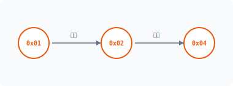
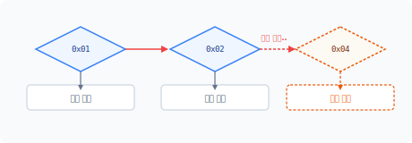
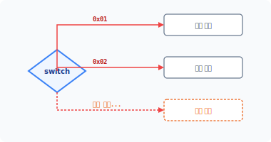
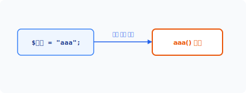
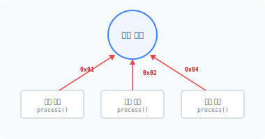
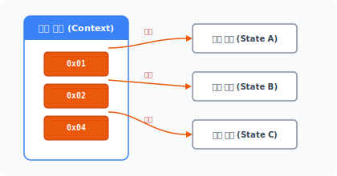


sta·tus
[ 'steɪtəs ] 🔊

CHAPTER **20**
# 상태 패턴

상태 패턴은 조건에 따른 별개의 동작을 제어문으로 사용하지 않습니다. 그 대신 객체를 캡슐화하여 독립된 동작으로 구분하는 패턴입니다. 상태 패턴은 상태 표현 객체[^1]라고 부르기도 합니다.

## 20.1 상태란

프로그램은 조건에 따라 분기해 다양한 동작을 처리합니다. 제어문은 조건[^2]의 상태값을 참과 거짓으로 판단하여 상태를 처리합니다.

### 20.1.1 값을 조건으로 사용
제어문은 주어진 조건을 비교하여 동작을 다르게 처리합니다. 제어문의 조건은 값을 이용해 참과 거짓으로 상태를 구분하고 동작을 제어하는 것입니다.

다음은 if 조건 제어문을 사용하는 예시 코드입니다.

```php
<?php
if ($status == true) {
    echo "참 입니다.\n";
```

---
[^1]: object for state
[^2]: condition

**438** 3부 행동 패턴

```php
} else {
    echo "거짓 입니다.\n";
}
```

위 코드에서는 `$status` 변수를 상수 `true` 값과 비교합니다. 제어문은 변수값 비교에 의해 '참' 동작과 '거짓' 동작으로 나뉘며, 이처럼 2가지 형태로 값의 상태를 구별하는 것을 플래그[^1]라고도 합니다.

### 20.1.2 동작을 구분하는 상태값
제어문은 주어진 값을 비교해 결과를 논리값으로 반환하거나, 논리값을 직접 0과 1로 입력하여 동작을 구분할 수 있습니다. 따라서 제어문은 단순한 상태값이 아닌 논리 연산을 통해 조건의 상태를 확장할 수 있습니다.

예를 들어 온라인 쇼핑몰에서 주문을 처리할 때 결제와 주문 상태에 따라 값을 구별합니다. 실제 운용되는 쇼핑몰은 이보다 더 복잡한 상태일 것입니다.

#### 그림 20-1 상태값 비교



주문 상태별로 값을 다르게 지정하고 이를 비교합니다. 주문 상태를 처리하기 위해 비교할 수 있는 값의 표현을 '상태'라고 합니다. 즉 상태값은 처리 로직을 구별할 수 있는 특정한 값이라고 생각하면 됩니다.

### 20.1.3 상수값을 사용하여 비교하기
다양한 종류의 상태가 있는 경우 값을 미리 정의합니다. 코드에 직접 리터럴값을 작성하여 상태를 사용하는 것보다 상수를 정의하여 사용하는 것이 편리합니다.

---
[^1]: flag

20장 상태 패턴 **439**

```php
<?php
const OPEN     = 0x01;  // 주문
const PAY      = 0x02;  // 결제중
const ORDERED  = 0x04;  // 주문완료
```

상수로 상태값을 정의하면 수정 시 소스코드를 직접 수정하지 않고도 일괄 변경할 수 있습니다.

## 20.2 상태 처리

상태값은 조건 비교를 통해 동작을 분리합니다. 전형적으로는 상태를 처리하기 위해 제어문(if)을 사용합니다.

### 20.2.1 제어문
제어문은 조건을 구별하는 프로그래밍 언어 문법입니다. 대표적인 제어문으로 if문과 switch문이 있습니다.

if문은 값을 비교하거나 값의 대소 관계를 구별합니다. 그리고 switch문은 if문 제어 기능 중 단순한 값 비교만 처리하므로 조건 비교 속도가 빠릅니다.

### 20.2.2 if문 상태 처리
if문을 사용하여 상태에 따른 동작을 구별해봅시다. 다음은 가장 전형적인 상태 처리 로직입니다.

예제 20-1 State/01/index.php
```php
<?php
const OPEN     = 0x01;  // 주문
const PAY      = 0x02;  // 결제중
const ORDERED  = 0x04;  // 주문완료
```

**440** 3부 행동 패턴

```php
$state = NULL;

$state = OPEN;

if ($state == OPEN) {
    echo "주문\n";
} else if ($state == PAY) {
    echo "결제중\n";
} else if ($state == ORDERED) {
    echo "주문완료\n";
}
```

3가지 상태를 구별하기 위해 중첩된 if문 코드를 사용합니다. 각 상태에 따라서 else if문을 사용해 체인 형태로 제어문을 연결합니다.

### 20.2.3 상태 추가
[예제 20-1]에서 작성한 코드에 상태가 추가될 수도 있습니다. 새로운 상태가 추가되면 코드를 변경해야 합니다. 새로운 상태를 추가해봅시다.

예제 20-2 State/02/index.php
```php
<?php
const OPEN     = 0x01;  // 주문
const PAY      = 0x02;  // 결제중
const ORDERED  = 0x04;  // 주문완료
const FINISH   = 0x08;  // 처리완료

$state = NULL;
$state = PAY;

if ($state == OPEN) {
    echo "주문\n";
} else if ($state == PAY) {
    echo "결제중\n";
} else if ($state == ORDERED) {
    echo "주문완료\n";
} else if ($state == FINISH) {
    echo "처리완료\n";
}
```

20장 상태 패턴 **441**

[예제 20-2]에 '처리완료' 상태값 하나를 추가했습니다. 새로운 상태값을 처리하기 위해 [그림 20-2]와 같이 조건 제어문도 함께 변경됩니다.

#### 그림 20-2 if문 조건 추가



이처럼 상태가 추가되면 제어문은 계속 확장되고 코드가 복잡해집니다. 실제 개발 현장에서는 이러한 수정과 변경 작업들이 빈번히 발생하며, 매번 코드를 변경해야 하는 유지 보수 빈도가 늘어납니다.

### 20.2.4 switch문
상태를 처리하는 대부분의 로직은 값의 비교(==)입니다. 동일한 값을 비교할 경우 if문보다 switch문이 더 효율적이며 높은 성능을 발휘합니다.

예제 20-3 State/03/index.php
```php
<?php
const OPEN     = 0x01;  // 주문
const PAY      = 0x02;  // 결제중
const ORDERED  = 0x04;  // 주문완료
const FINISH   = 0x08;  // 처리완료

$state = NULL;
$state = ORDERED;

switch ($state) {
    case OPEN:
        echo "주문\n";
        break;
    case PAY:
```

**442** 3부 행동 패턴

```php
        echo "결제중\n";
        break;
    case ORDERED:
        echo "주문완료\n";
        break;
    case FINISH:
        echo "처리완료\n";
        break;
}
```

[예제 20-2]의 if문을 switch문으로 변경했습니다.

#### 그림 20-3 switch문 조건 추가



하지만 코드 가독성과 처리 측면에서는 모두 별다른 개선점이 없습니다.

### 20.2.5 가변 함수 응용
가변 함수는 변수를 이용해 함수를 호출하는 프로그래밍 문법입니다. 변수명에 함수명을 설정한 후 변수값과 동일한 함수를 호출합니다.

#### 그림 20-4 가변 함수 호출



20장 상태 패턴 **443**

이처럼 상태 패턴의 원리는 [그림 20-4]와 같이 상태값에 따라 처리 로직을 각각의 함수로 분리합니다.

예제 20-4 State/03/func.php
```php
<?php
$state = "ordered";
if($state && function_exists($state)){
    $state();
}

// 오픈상태
function open()
{
    echo "주문\n";
}

// 결제상태
function pay()
{
    echo "결제중\n";
}

// 주문상태
function ordered()
{
    echo "주문완료\n";
}

// 완료상태
function finish()
{
    echo "처리완료\n";
}
```

복잡한 제어문은 코드 상태를 판단하기 어렵습니다. 규모가 커질수록 코드의 흐름을 이해하고 전체 동작을 파악하는 데 많은 시간이 소요됩니다. 특히 특정 상태가 제어문에 의해 숨겨진 동작일 경우 더욱 더 파악하기 어렵습니다.

앞에 나온 코드를 보면 동일한 상태값과 함수명을 사용해 동작을 구분하고 실행합니다. if문과 switch문을 사용하지 않고 가변 함수를 이용하여 상태값에 따라 동작을 실행할 수 있습니다.

**444** 3부 행동 패턴

## 20.3 패턴 구현

앞 절에서는 상태 패턴을 학습하기 전에 상태에 대한 개념과 처리 로직에 대해 먼저 학습했습니다.

### 20.3.1 상태 패턴
[예제 20-4]에서는 상태값과 가변 함수로 동작을 분기 처리하는 실습을 진행했습니다. 상태 패턴은 상태값에 따른 동작을 각각의 함수 형태로 구별하는 것과 달리 객체로 동작을 분리합니다.

객체 형태로 상태를 분리할 경우 상태의 동작을 객체에 위임할 수 있습니다. 그뿐 아니라 해당 객체에 동작을 한정시키는 국지화도 가능합니다. 상태 패턴은 객체의 상태에 따라 위임하는 객체를 변경하기 때문에 객체의 상태값과 직접적인 객체의 상태값에 영향을 받는다.

### 20.3.2 객체화
상태 패턴을 적용하기 위해 [예제 20-4] 코드를 클래스로 변경합니다.

예제 20-5 State/04/index.php
```php
<?php
class JinyOrder
{
    const OPEN     = 0x01;  // 주문
    const PAY      = 0x02;  // 결제중
    const ORDERED  = 0x04;  // 주문완료
    const FINISH   = 0x08;  // 처리완료

    public function process($state)
    {
        switch ($state) {
            case "OPEN":
                $this->stateOrder();
                break;
            case "PAY":
```

20장 상태 패턴 **445**

```php
            case "PAY":
                $this->statePAY();
                break;
            case "ORDERED":
                $this->stateORDERED();
                break;
            case "FINISH":
                $this->stateFINISH();
                break;
        }
    }

    public function stateOrder()
    {
        echo "주문\n";
    }

    public function statePAY()
    {
        echo "결제중\n";
    }

    public function stateORDERED()
    {
        echo "주문완료\n";
    }

    public function stateFINISH()
    {
        echo "처리완료\n";
    }
}

$obj = new JinyOrder();
$obj->process("FINISH");
```

클래스로 변경했지만 아직도 복잡한 제어문을 사용하고 있어 별로 나아진 것이 없어 보입니다.

### 20.3.3 상태 캡슐화
[예제 20-5]를 상태 패턴으로 변경하기 위해 각 상태의 동작을 캡슐화합니다.

**446** 3부 행동 패턴

앞에서 실습한 가변 함수의 처리 방식을 다시 살펴봅시다. 우리는 가변 함수 처리에서 각 상태의 동작을 함수 형태로 분리했습니다. 상태 패턴에서는 함수 형태가 아니라 서브 클래스 형태로 분리합니다.

상태를 서브 클래스로 캡슐화할 때는 코드가 독립적으로 수행할 수 있도록 작성하는 것이 중요합니다. 독립적인 클래스는 상태를 서로 다른 별개의 행동 객체로 관리합니다. [예제 20-6]은 상태를 클래스화합니다.

예제 20-6 State/05/StateOrder.php
```php
<?php
class StateOrder implements State
{
    public function process()
    {
        echo "주문\n";
    }
}
```

각 상태의 행동들은 클래스로 형태를 캡슐화합니다. 또한 각 클래스는 상태의 변화에 대응하며 독립적으로 실행 가능합니다. 서브 클래스는 상태에 종속적이면서 독립적인 행동이 가능하도록 구현합니다.

예제 20-7 State/05/StatePay.php
```php
<?php
class StatePAY implements State
{
    public function process()
    {
        echo "결제중\n";
    }
}
```

예제 20-8 State/05/StateOrdered.php
```php
<?php
class StateOrdered implements State
```

20장 상태 패턴 **447**

```php
{
    public function process()
    {
        echo "주문완료\n";
    }
}
```

예제 20-9 State/05/StateFinish.php
```php
<?php
class StateFinish implements State
{
    public function process()
    {
        echo "처리완료\n";
    }
}
```

[예제 20-6 ~ 예제 20-9]는 각 조건의 행동을 클래스로 캡슐화하여 분리하며 상태값에 따라 객체를 달리 호출합니다.

상태 패턴에서는 각각의 상태를 객체로 캡슐화하기 때문에 클래스 파일이 늘어난다는 단점이 있습니다. 그러나 상태 패턴을 사용하지 않고 수많은 조건문을 사용하는 것보다는 유연하게 확장할 수 있습니다.

### 20.3.4 단일 상태
상태 패턴에서 객체를 생성할 때는 단일 상태값으로 캡슐화합니다. 1개의 객체는 1개의 상태만 구현합니다.

때로는 1개의 상태 객체가 2개 이상의 상태값을 처리하는 경우도 있습니다. 복수의 상태값을 처리하려면 별도의 조건 제어문을 추가해야 합니다. 그러나 복수의 상태값을 처리하는 경우 상태 객체의 동작이 불분명해지는 상황이 발생합니다.

**448** 3부 행동 패턴

### 20.3.5 국지화
1개의 상태를 하나의 단일 객체로 생성하면 코드가 국지화되는 효과를 얻을 수 있습니다. 객체 국지화의 장점은 해당 객체에만 영향이 미친다는 것입니다. 따라서 각각의 상태를 하나의 객체로 국지화하면 상태에 따른 코드를 보다 쉽게 이해하고 수정할 수 있습니다.

### 20.3.6 인터페이스
상태 패턴은 서브 클래스 생성 시 인터페이스를 적용하는데, 이 인터페이스는 서브 클래스의 통일성을 유지하기 위해 사용합니다. 인터페이스는 모든 객체에 대응해 동일한 형태의 서브 클래스를 생성하도록 규약을 적용합니다.

상태 패턴은 모든 상태에 인터페이스를 적용하여 객체를 캡슐화합니다. 다음은 상태 인터페이스의 예제 코드입니다. 앞의 캡슐화된 상태 클래스를 보면 'implements State'로 인터페이스가 적용된 것을 확인할 수 있습니다.

예제 20-10 State/05/State.php
```php
<?php
// 상태 인터페이스를 선언합니다.
interface State
{
    public function process();
}
```

또한 각 상태 서브 클래스는 동일한 `process()` 메서드를 구현해야 합니다.

> [!NOTE]
> 인터페이스 대신 추상화(Abstract)를 상속받아 처리할 수도 있습니다. 추상화는 인터페이스와 달리 공통된 메서드를 같이 포함하여 설계할 수 있습니다.

인터페이스로 구현된 `process()` 메서드는 상태 패턴의 상태값만 바라보고 처리하는 실행 동작입니다.

20장 상태 패턴 **449**

#### 그림 20-5 상태값 바라보기



따라서 상태 객체는 특정한 상태에 종속된 동작을 가지는 의존성이 발생하게 됩니다.

## 20.4 객체 생성

상태 패턴은 상태별로 구분된 객체에 동작을 위임합니다. 위임하기 위해서는 각 상태별 객체의 생성 관리가 필요합니다.

### 20.4.1 서브 클래스
각 상태에 따라 동작하는 서브 클래스를 생성합니다. 상태 패턴은 상태마다 동작할 서브 클래스의 객체 정보를 가지고 있습니다.

#### 그림 20-6 상태 객체의 정보 및 위임 처리



**450** 3부 행동 패턴

상태에 따른 객체 정보를 변경하여 동작을 위임합니다. 상태 객체는 구체적으로 행동하는 파생 클래스와 같습니다.

### 20.4.2 인스턴스
캡슐화된 상태 클래스를 실제 객체로 생성합니다. 초기화 과정에서 상태별로 클래스의 객체를 생성합니다.

예제 20-11 State/05/Order.php
```php
<?php
class JinyOrder
{
    private $state;

    // 객체 초기화
    public function __construct()
    {
        // 상태의 서브 클래스 객체의 인스턴스를 생성합니다.
        $this->state = [
            'ORDER' => new StateOrder(),
            'PAY' => new StatePay(),
            'ORDERED' => new StateOrdered(),
            'FINISH' => new StateFinish()
        ];
    }

    // 상태의 서브 클래스를 호출합니다.
    public function process($status)
    {
        $this->state[$status]->process();
    }
}
```

상태의 객체를 저장하기 위해 배열 또는 여러 변수를 사용합니다. 각 상태에 따라 여러 변수를 추가로 사용하는 것은 상태 패턴의 단점입니다.

20장 상태 패턴 **451**

### 20.4.3 객체 생성
상태 패턴은 모든 상태에 대해 객체를 생성하고 관리하는데, 새로운 상태 객체를 생성하는 것은 시스템의 메모리 자원을 할당하는 일입니다. 객체를 생성하는 과정에서 중복된 객체가 생성될 우려도 있습니다.

중복된 객체가 생성되는 것을 방지하기 위한 방법으로 싱글턴 패턴이 있습니다. 서브 클래스를 싱글턴으로 변경하여 처리하는 것도 좋은 아이디어입니다. 이처럼 하나의 패턴만 사용하지 않고 다른 패턴과 결합해서 사용하는 경우가 많습니다.

## 20.5 상태 전환

상태 패턴은 상태값에 따라 실제 동작되는 상태 객체를 결정하고 호출합니다. 이러한 호출의 선택과 변화는 상태 전이를 통해 관리합니다.

### 20.5.1 상태 호출
상태 패턴은 객체의 상태값을 갖고 있습니다. 상태값은 동작에 의해 변경될 수 있으며, 상태값에 따라 객체를 다르게 호출할 수도 있습니다.

다음은 상태를 지정하여 객체를 호출하는 예제입니다. 주문은 각 상태에 따른 객체 동작을 실행합니다.

예제 20-12 State/05/index2.php
```php
<?php
require "State.php";
require "StateOrder.php";
require "StatePay.php";
require "StateOrdered.php";
require "StateFinish.php";

require "Order.php";
```

**452** 3부 행동 패턴

```php
$obj = new JinyOrder();
$obj->process("ORDERED");
```

```bash
$ php index2.php
주문완료
```

상태 패턴은 상태에 따라 동작하는 서브 클래스를 선택합니다. 상태값에 따라 실시간으로 객체를 변경하여 동작을 다르게 처리합니다.

### 20.5.2 상태 전이
상태 패턴에서 상태값은 고정되지 않습니다. 상태값은 동작에 따라서 변하는데 이를 상태 전이[^1]라고 합니다. 상태 전이는 통합 모델링 언어[^2](UML)의 상태 머신 다이어그램으로도 자주 나타냅니다.

상태 전이는 특정한 규칙에 의해 변동됩니다. 상태 전이는 객체의 행동과 조건 상황을 표현한 것이고, 상태 패턴은 객체를 상태별로 만들어 위임하므로 상태 전이를 명확하게 표현하는 효과가 있습니다. 이러한 규칙을 명확히 함으로써 오류 상태의 행동을 방지하는 효과도 있습니다.

### 20.5.3 상태 결정
상태 전환은 코드의 흐름에 따라 상태를 처리하며 현재 자신의 상태를 유지합니다. 상태를 공유할 때는 정적 변수를 응용하는 것이 좋습니다.

상태 처리는 주어진 상태를 처리하고 다음 상태로 이동합니다. 대부분의 상태는 스스로 알아서 다음 상태를 결정하며, 다음 상태가 결정되면 어떤 조건이나 이벤트에 따라 상태를 처리합니다.

상태 객체는 자기 자신의 상태값을 보관하지 않지만, 다음 상태로 전환되는 값은 구현되는 상태 객체에 추가로 포함할 수 있습니다. 상태 객체가 다음 상태값을 갖고 있을 때 상태 객체 간 의존성이 발생합니다.

---
[^1]: state transition
[^2]: Unified Modeling Language

20장 상태 패턴 **453**

## 20.6 실습

다음은 전구의 on/off 기능 상태를 통해 상태 패턴의 원리를 다시 한 번 학습해보겠습니다.

### 20.6.1 상태 인터페이스
먼저 상태 패턴에 대한 인터페이스를 생성합니다. 상태 클래스가 많을수록 인터페이스가 중요해집니다.

예제 20-13 State/06/lightState.php
```php
<?php
// 상태 인터페이스를 선언합니다.
interface LightState
{
    public function lightOn();
    public function lightOff();
    public function lightState();
}
```

상태 인터페이스에 메서드 3개를 정의합니다. 전구를 켜는 메서드, 끄는 메서드, 전구 상태를 가져오는 메서드입니다.

### 20.6.2 상태 객체
다음에는 상태를 처리하는 객체를 생성합니다.

예제 20-14 State/06/LightLamp.php
```php
<?php
// 객체를 구현합니다.
class LightLamp implements LightState
{
    // private 속성을 이용하여
    // 외부에서 상태에 직접 접근할 수 없도록 정의합니다.
    private $_lightstate;
```

**454** 3부 행동 패턴

```php
    public function __construct()
    {
        echo __CLASS__." 객체를 생성합니다.\n";
        // 전구의 초기 상태는 off입니다.
        $this->_lightstate = FALSE;
    }

    // 전구(LED)를 on 합니다.
    public function lightOn()
    {
        echo "전구를 on 합니다.\n";
        $this->_lightstate = TRUE;
        return $this;
    }

    // 전구(LED)를 off 합니다.
    public function lightOff()
    {
        echo "전구를 off 합니다.\n";
        $this->_lightstate = FALSE;
        return $this;
    }

    // 전구(LED)의 상태값을 반환합니다.
    public function lightState()
    {
        return $this->_lightstate;
    }
}
```

### 20.6.3 객체 구현
앞의 객체를 이용하여 상태를 실습해보겠습니다.

예제 20-15 State/06/index.php
```php
<?php
require "LightState.php";
require "LightLamp.php";
```

20장 상태 패턴 **455**

```php
$obj = new LightLamp;
echo $obj->lightOn()->lightState()."\n";
echo $obj->lightOff()->lightState()."\n";

echo $obj->lightOn()->lightState()."\n";
echo $obj->lightOn()->lightState()."\n";
```

```bash
$ php index.php
LightLamp 객체를 생성합니다.
전구를 on 합니다.
1
전구를 off 합니다.


전구를 on 합니다.
1
전구를 on 합니다.
1
```

상태값을 갖고 있을 때 메서드는 상태 체크 부분을 같이 구현해야 합니다. 상태 패턴은 if문이나 switch문과 같은 제어문을 사용하지 않아도 메서드를 이용해 상태를 처리할 수 있습니다.

## 20.7 효과

상태 패턴은 거대한 구조의 코드를 구조화하는 데 유용합니다.

### 20.7.1 조건문 해결
프로그램에서 제어문은 코드를 실행하는 데 많은 부하를 발생시키고, 코드의 가독성 또한 떨어뜨립니다. 상태 패턴은 소스 코드에서 복잡한 if문과 switch문을 제거하고 조건 분기 없이 상태값을 이용해 객체의 동작을 처리합니다.

**456** 3부 행동 패턴

### 20.7.2 런타임
상태 패턴은 상태값에 따라 객체의 동작을 수행하며 내부 상태값을 조사해 상태 객체의 행위를 위임합니다.

상태별로 위임 객체를 변경합니다. 런타임으로 위임 객체를 변경해 동적으로 행동을 변화합니다.

### 20.7.3 확장성
상태 패턴은 새로운 상태를 쉽게 추가해서 구현할 수 있습니다. 상태의 로직을 상태 객체로 변경하고, 상태에 따른 동작을 상태 객체에 위임합니다.

상태 패턴은 상태값에 따라 행동을 위임함으로써 동작을 간편하게 확장할 수 있습니다. 이렇게 확장과 변경이 간편한 것은 상태 객체가 동일한 인터페이스를 적용하고 있기 때문입니다.

### 20.7.4 변화
상태 패턴은 변경된 상태에 따라 행동을 위임합니다. 이것은 마치 상태값에 따라 자신의 클래스가 변경되는 것처럼 보입니다. 실제 클래스가 변경되는 것이 아니라 구성에 따라서 상태 객체가 변경되는 것입니다.

## 20.8 패턴 유사성

상태 패턴을 전략 패턴과 비교하면서 살펴보겠습니다.

### 20.8.1 구조의 유사성
상태 패턴은 구조적으로 전략 패턴과 매우 유사합니다. 또한 UML 표현도 비슷합니다. 두 패턴 모두 런타임으로 객체를 위임해 동작을 변경합니다. 전략 패턴은 위임된 객체를 알고리즘으로

20장 상태 패턴 **457**

생각하지만, 상태 패턴에서는 위임된 객체를 상태값의 처리로 생각합니다.

### 20.8.2 목적의 차별성
상태 패턴과 전략 패턴은 구조가 유사하지만 목적성으로 두 패턴을 구별할 수 있습니다.

전략 패턴은 객체의 상태값에 관심이 없으며, 알고리즘을 교체하고 동작을 변경시키는 것만 생각합니다. 그러나 상태 패턴은 동작하는 객체의 변경이 상태에 따라 달라집니다. 상태 패턴에서는 상태값이 매우 중요하며 다음 동작과 객체의 위임을 결정합니다.

전략 패턴은 객체를 이용해 적용 알고리즘을 변경하고, 상태 패턴은 이벤트로 발생하는 상태에 따라 객체를 변경해줍니다.

## 20.9 적용 사례

상태 패턴은 다양한 응용프로그램에서 적용하는 디자인 패턴 중 하나입니다.

### 20.9.1 TCP 프로토콜
상태 패턴을 실제 적용한 분야는 TCP 연결 프로토콜입니다. 존슨과 츠바이그는 상태 패턴을 정의하면서 인터넷 TCP 연결 통신 프로토콜 설계 시 실제 이 패턴을 적용했다고 합니다.

### 20.9.2 그래픽
그래픽 응용프로그램에도 상태 패턴을 적용합니다. 보통 그림 도구를 선택하면 선택한 도형으로 계속 그릴 수 있습니다. 이는 도형을 선택하는 것이 객체의 상태값을 변경하는 것이며, 변경된 상태값이 유지되는 것과 같습니다. 다른 도형을 선택할 경우 생성되는 도형의 모양이 변경됩니다. 상태값을 변경하면 그림 그리는 작업 객체를 변경할 수 있습니다.

**458** 3부 행동 패턴

## 20.10 정리

상태 패턴은 행동 패턴으로 분류되고 객체 내부 상태에 따른 동작 객체를 결정합니다. 상태별로 분리된 동작 객체는 독립적이며, 각 상태값에 따라 국지화된 객체 행위를 위임합니다.

상태값은 시스템 내부 또는 단계별로 변경되며, 조건 판별 없이 객체를 직접 호출하여 동작시킨다는 장점이 있습니다. 상태 패턴은 상태값을 설정 또는 변경함으로써 객체 실행을 다르게 할 수 있습니다.

20장 상태 패턴 **459**

