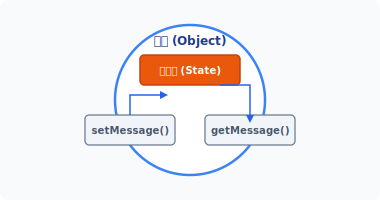
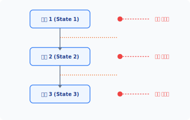
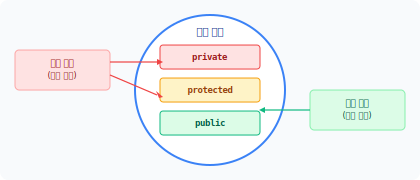
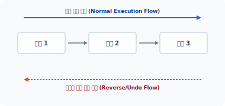
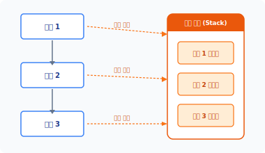
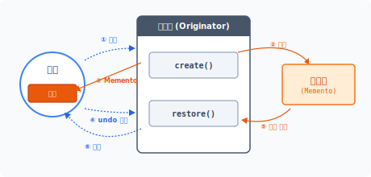
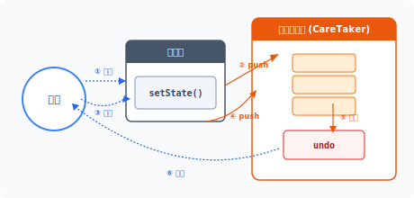


# me·men·to
[ mə│mentoʊ ] 🔊

# CHAPTER 21 메멘토 패턴

메멘토 패턴은 객체의 상태를 저장하여 이전 상태로 복구하는 패턴입니다.

## 21.1 상태 저장

객체는 고유한 상태를 갖고 있으며 객체의 상태는 프로그램 실행 중에 다른 객체에 의해 끊임없이 값이 변경됩니다.

### 21.1.1 상태값
객체는 프로퍼티와 메서드로 구성되고 프로퍼티는 객체의 상태 형태로 값을 가집니다. 그리고 메서드는 객체의 행위로 내부 상태를 변경하고, 상태값에 따라 동작을 수행합니다.

다음은 인사말을 출력하는 Hello 클래스 예제입니다.

예제 21-1 Memento/01/hello.php
```php
<?php
class Hello
{
    private $message;
```

**460** 3부 행동 패턴

```php
    public function __construct($msg)
    {
        $this->message = $msg;
    }

    public function setMessage($msg)
    {
        $this->message = $msg;
    }

    public function getMessage()
    {
        return $this->message;
    }
}
```

인사말을 출력하는 Hello 클래스는 하나의 상태값을 갖고 있습니다. 객체 내에 선언된 프로퍼티($message)에 인사말을 저장하고 읽어봅니다.

그러면 선언한 Hello 클래스를 실행하는 코드를 작성해봅시다.

예제 21-2 Memento/01/index.php
```php
<?php
require "hello.php";

// 첫 번째 인사말
$obj = new Hello("안녕하세요.");
echo $obj->getMessage()."\n";

// 상태 변경
// 두 번째 인사말
$obj->setMessage("Hello nice meet you.");
echo $obj->getMessage()."\n";
```

```bash
$ php index.php
안녕하세요.
Hello nice meet you.
```

21장 메멘토 패턴 **461**

Hello 클래스의 객체를 생성합니다. 객체의 초기 인사말은 객체 생성 과정에서 설정하고, 설정된 인사말은 `getMessage()` 메서드를 이용해 상태값을 출력합니다.

두 번째 인사말을 설정합니다. `setMessage()` 메서드는 객체의 상태값을 변경할 수 있는 행위입니다. 변경된 인사말을 다시 출력합니다.

#### 그림 21-1 객체의 상태값과 설정 방법



객체의 행위는 상태값을 읽고 변경을 수행합니다.

### 21.1.2 상태 이력
객체의 상태값이 한 번 변경되면 이전 상태로 돌아갈 수 없습니다. [예제 21-2]를 다시 살펴봅시다. 만약 이전의 인사말 메시지를 다시 출력하고 싶다면 어떻게 해야 할까요? 새로운 인사말 메시지를 출력하려면 상태값을 재설정해야 합니다.

프로그램의 동작 실행 단계 하나를 체크 포인트라고 합니다. 최신 응용프로그램은 사용자의 행위를 체크 포인트 형태로 기록합니다. 기록된 정보를 활용하면 이전 상태로 되돌릴 수 있는 객체의 복원 시점을 정할 수 있습니다.

**462** 3부 행동 패턴

#### 그림 21-2 상태 변경 시점의 체크 포인트



객체의 상태값을 체크 포인트 형태로 기록하면 이전의 객체 상태로 되돌아갈 수 있습니다. 최근 들어 많은 프로그램들이 객체 상태를 기록해 undo 기능을 구현합니다. Undo는 방금 전에 실행한 동작을 취소하는 명령입니다.

## 21.2 캡슐화

객체는 데이터와 행위를 캡슐화합니다. 캡슐화는 객체지향의 고유 특징입니다.

### 21.2.1 객체 관계
객체들은 상호 밀접한 의존 관계를 갖고 있고, 객체는 의존성 객체로 메시지를 전송하며 행위를 호출해 동작을 수행합니다.

다른 객체와 의존 관계인 복합 객체를 저장하거나 복원하는 것은 쉽지 않은 작업입니다. 단순히 하나의 객체만 복원하는 것이 아니라 복원 객체와 의존 관계인 모든 객체를 함께 이전 상태로 복원해야 합니다. 또한 복원 시 객체의 상태값도 같이 되돌려야 합니다.

복합 객체 구조의 객체를 저장하거나 복원하는 것은 단순한 작업이 아닙니다.

21장 메멘토 패턴 **463**

### 21.2.2 객체 접근
캡슐화는 외부로부터의 객체 접근과 직접적인 객체 접근, 임의의 수정을 제한합니다. 이러한 객체지향의 캡슐화는 객체의 안정성을 확보하기 위해서입니다. 하지만 캡슐화의 접근 제한 속성은 객체의 저장 및 복원을 힘들게 하는 장애물이 됩니다. 객체 상태를 복원하려면 객체 내부로 접근해야 하기 때문입니다.

객체지향에는 3가지 종류의 접근 제어 속성이 있습니다.

* Public
* Private
* protected

public 속성은 객체 내부로 누구나 접근할 수 있습니다. 하지만 private과 protected는 제한된 접근만 허락합니다. 만일 객체의 상태값이 private이나 protected라면 복원에 필요한 상태를 읽을 수 없습니다.

#### 그림 21-3 복구를 위한 접근 제한 속성



저장된 객체를 복원하기 위해 이전 상태값을 참조하여 현재 상태를 되돌려놓습니다. 객체가 다른 객체에 의존한다면 분산된 객체의 상태값까지 모두 복원해야 합니다. 이러한 복원 과정은 매우 어렵고 복잡합니다. 접근 제한이 있는 객체는 완벽하게 복구할 수 없습니다.

**464** 3부 행동 패턴

### 21.2.3 캡슐화 파괴
객체를 복원하기 위해서는 완전한 객체의 내부 접근이 필요합니다. 완전한 객체의 내부 접근을 허용하는 방법은 모두 public 속성으로 설정합니다.

하지만 객체 내부의 모든 속성을 public으로 해서 노출하면 객체를 캡슐화한 장점을 잃어버리게 됩니다. 공개된 접근 허용은 캡슐화 정책을 위반하고, 심지어 객체의 캡슐화를 파괴하기까지 합니다.

캡슐화되지 않은 객체는 오동작의 원인이 됩니다. 또한 악의적인 해킹으로 객체의 상태값이 변경될 수도 있습니다. 이처럼 객체지향에서 객체의 복원과 캡슐화 사이에는 반대되는 의견이 있으므로 기능적 보완을 위해 약간의 절충 작업이 필요합니다.

### 21.2.4 제약 해결
메멘토의 사전적 의미를 찾아보면 '사람 · 장소를 기억하기 위한 기념품'이라고 해석되어 있습니다. 이런 의미와 유사하게 메멘토 패턴은 객체 상태를 다른 객체에 저장했다가 다시 복원합니다.

객체를 복원할 때 캡슐화 정책에 영향을 주지 않으면서도 안전하게 복원하는 절충안이 필요합니다. 메멘토 패턴은 캡슐화 위반을 최소화하면서 객체 저장과 복원을 실행할 수 있도록 돕는 패턴입니다.

저장과 복원 작업을 처리하는 중간 매개체를 이용하면 보다 쉽게 상태 이력을 관리할 수 있습니다. 이러한 중간 매개체를 constraintSolver라고 합니다.

## 21.3 메멘토

메멘토는 SolverState로 객체의 상태를 관리합니다. 객체의 상태를 저장하고, 저장된 상태의 객체를 복원합니다.

21장 메멘토 패턴 **465**

### 21.3.1 객체 저장
동작 전의 상태로 객체를 되돌리는 방법은 2가지입니다. 하나는 객체를 실행하기 전에 동작을 역순으로 처리하는 로직을 다시 작성하는 방법이고, 또 하나는 객체의 동작을 되돌리기 위해 실행 전의 객체를 통째로 저장하는 방법입니다.

#### 그림 21-4 역순 처리 로직



그나마 복잡한 복원 로직을 작성하는 방법보다는 객체를 통째로 저장하는 것이 수월합니다. 하지만 객체를 임시 저장하는 것도 복원 시 캡슐화 정책과 충돌하므로 간단하지만은 않습니다.

### 21.3.2 객체 관리
객체 복원은 객체를 이전 상태로 되돌리는 것을 말합니다. 자신의 상태값을 가진 객체를 저장했다가 이전 상태로 되돌릴 때 이력을 참조하여 상태값을 변경합니다.

객체를 복원하기 위해서는 특별한 관리 방법이 필요한데, 메멘토 패턴은 캡슐화를 파괴하지 않고 객체 상태를 저장하는 방법을 제안합니다. 메멘토는 객체를 스냅샷 형태로 저장합니다.

객체를 저장하려면 저장 공간이 필요합니다. 객체를 저장하기 위해 스택 구조의 배열을 사용하며, 스택과 배열 구조는 복수의 객체를 원하는 횟수만큼 저장합니다.

#### 그림 21-5 객체의 상태를 복제



**466** 3부 행동 패턴

Undo 기능은 마지막 작업의 역순으로 동작을 취소합니다. 배열에 객체 상태를 최신 작업 순으로 저장하고, 복원할 때는 스택 자료 구조 알고리즘을 적용합니다. 스택은 FILO 구조로 마지막에 저장된 값을 제일 먼저 반환합니다.

### 21.3.3 인터페이스
메멘토는 객체 저장과 복원을 위해 2가지 인터페이스를 사용하며 인터페이스를 이용해 관리 방법을 구분합니다.

* 원조본(originator)
* 케어테이커(caretaker)

2가지 구현의 차이점은 메멘토에 얼마나 많은 접근 권한을 허용하는가의 차이입니다. 원조본(originator)은 광범위(wide)한 메멘토의 접근을 모두 허용하지만 케어테이커는 제한된(narrow) 범위 안에서 허용합니다.

### 21.3.4 Memento 클래스
메멘토 패턴을 구현하기 위해 제일 먼저 Memento 클래스를 설계합니다. Memento 클래스는 객체의 정보를 저장하는 프로퍼티와 저장된 객체에 접근하기 위한 메서드로 구성되어 있습니다.

예제 21-3 Memento/02/Memento.php
```php
<?php
// 메멘토
class Memento
{
    // 객체를 저장합니다.
    protected $obj;

    // 원조본(Originator)에 의해서 생성됩니다.
    public function __construct($obj)
    {
        // 객체를 복제합니다.
        $this->obj = clone $obj;
    }
```

21장 메멘토 패턴 **467**

```php
    // 저장된 객체를 읽어옵니다.
    public function getObject()
    {
        return $this->obj;
    }
}
```

Memento 클래스는 하나의 `$obj` 프로퍼티를 갖고 있고, `$obj`에는 저장하려는 객체 정보가 담겨 있습니다. Memento 객체는 생성 인자로 전달된 객체를 내부 프로퍼티에 복제합니다.

### 21.3.5 접근 권한
Memento 클래스는 protected 속성을 사용해 객체를 저장합니다. 앞에서 설계한 Memento 클래스를 살펴보면 프로퍼티의 속성이 protected로 설정된 것을 확인할 수 있습니다.

Memento 클래스에 저장된 복제 객체는 누구나 접근할 수 있는 클래스가 아니며, 동일한 계통의 상속 클래스만 접근 권한을 갖고 있습니다. Protected 속성은 상속된 클래스에서만 접근할 수 있고, 내부에 저장된 객체에는 오로지 공개된 메서드를 통해서만 접근할 수 있습니다. 예제에서는 별도로 구현된 공개 `getObject()` 메서드를 사용합니다.

## 21.4 Originator 클래스

원조본(Originator)은 실제 객체와 메멘토(Memento) 사이의 중간 매개체(constraintSolver) 역할을 수행합니다.

### 21.4.1 광범위 접근
메멘토 패턴에서는 객체를 저장하기 위해 직접 메멘토 객체에 접근하지 않으며 객체를 저장, 복원하기 위해 중간 매개체인 Originator 클래스를 생성합니다.

Originator 클래스는 메멘토 객체를 생성하고 메멘토를 통해 객체를 복원합니다. 예제 코드를 살펴봅시다.

**468** 3부 행동 패턴

예제 21-4 Memento/02/Originator.php
```php
<?php
// 상태를 가지고 있는 객체입니다.
class Originator
{
    // 상태를 저장하기 위해 변수를 하나 가지고 있습니다.
    protected $state;

    // 메멘토
    // 메멘토의 객체를 생성해 반환합니다.
    public function create()
    {
        echo ">메멘토 객체를 생성합니다.\n";
        return new Memento($this->state);
    }

    // 복원합니다.
    public function restore($memento)
    {
        echo ">메멘토 객체로 복원합니다.\n";
        $this->state = clone $memento->getObject();
    }

    // 상태
    // 상태를 읽어옵니다.
    public function getState()
    {
        return $this->state;
    }

    // 상태를 설정합니다.
    public function setState($state)
    {
        $this->state = $state;
    }
}
```

캡슐화는 외부의 접근을 제어함으로써 악의적인 변경을 방지합니다. 메멘토는 제한적인 접근만 허용하며 캡슐화를 위반하지 않습니다.

Originator 클래스는 객체를 복원 또는 저장하기 위한 프로퍼티 하나를 갖고 있습니다.

21장 메멘토 패턴 **469**

```php
    // 상태를 저장하기 위해 변수를 하나 가지고 있습니다.
    protected $state;
```

`$state`는 객체의 저장 및 복원을 위한 중간 매개체적인 성격의 프로퍼티입니다. 메멘토는 저장된 객체가 외부에 노출되지 않도록 경계를 유지하며 이를 위해 private 속성 대신 protected를 사용합니다.[^1]

### 21.4.2 원조본 실습
[예제 21-1]에서 실습한 Hello 객체를 메멘토 객체와 원조본 객체로 저장 복원하는 실습을 해봅시다.

예제 21-5 Memento/02/index.php
```php
<?php
require "Memento.php";
require "Originator.php";

require "hello.php";

// 원조본 객체를 생성합니다.
$origin = new Originator;

// 첫 번째 인사말
$obj = new Hello("상태1: 안녕하세요.");
echo $obj->getMessage()."\n";

// 상태1을 설정하고, 원조본을 메멘토를 통해 저장합니다.
$origin->setState($obj);
$memento = $origin->create(); // 저장

// 상태 변경
// 두 번째 인사말
$obj->setMessage("상태2: Hello nice meet you.");
echo $obj->getMessage()."\n";
```

---
[^1]: 메멘토를 이해하기 위해서는 접근 제한자(protected)에 대해 알고 있어야 합니다.

**470** 3부 행동 패턴

```php
// 메멘토를 통해 상태1을 복원합니다.
$origin->restore($memento);
$obj = $origin->getState(); // 복원
echo $obj->getMessage()."\n";
```

```bash
$ php index.php
상태1: 안녕하세요.
>메멘토 객체를 생성합니다.
상태2: Hello nice meet you.
>메멘토 객체로 복원합니다.
상태1: 안녕하세요.
```

Originator의 `create()` 메서드는 객체를 저장하기 위해 먼저 메멘토 객체를 생성하며, 메멘토 객체를 생성하기 위한 단순 팩토리 역할을 수행합니다.

#### 그림 21-6 Originator 클래스를 통한 메멘토 동작



이제 메멘토 객체로의 접근은 Originator만 가능합니다. 메멘토를 통해 Originator의 상태를 저장하고 복원을 실행합니다.

## 21.5 CareTaker 클래스

케어테이커는 실행 취소 메커니즘이고 제한적 범위의 인터페이스를 가집니다.

21장 메멘토 패턴 **471**

### 21.5.1 보관자
케어테이커는 다수의 메멘토를 보관하고 관리합니다. 또한 CareTaker 클래스와 Memento 클래스는 느슨한 구조로 연결돼 있습니다.

다음 예제는 스택 구조를 이용해 CareTaker 클래스를 구현합니다.

예제 21-6 Memento/03/caretaker.php
```php
<?php
class CareTaker
{
    protected $stack;

    // 케어테이커 생성자
    public function __construct()
    {
        // 스택을 초기화합니다. 배열로 초기화
        $this->stack = array();
    }

    // 스택에 저장합니다.
    public function push($origin)
    {
        // 원조본을 이용하여 메멘토의 인스턴스를 생성합니다.
        $memento = $origin->create();

        // 메멘토를 스택에 저장합니다.
        array_push($this->stack, $memento);
    }

    // 스택에서 객체를 읽어옵니다.
    public function undo($origin)
    {
        // 스택에서 메멘토를 읽어옵니다.
        $memento = array_pop($this->stack);

        // 메멘토를 이용하여 원조본을 복원합니다.
        $origin->restore($memento);

        // 복원된 객체를 반환합니다.
        return $origin->getState();
    }
}
```

**472** 3부 행동 패턴

CareTaker 클래스는 Memento 객체를 관리합니다. 케어테이커는 메멘토 객체를 스택 구조로 저장하며 복원 시 스택에서 메멘토를 가져옵니다.

케어테이커는 꺼내온 메멘토 객체를 다시 원조본 객체로 전달합니다. Caretaker 클래스는 메멘토 객체를 관리하는 책임을 가지며 제한적인 범위 안에서 메멘토에 접근합니다. 즉 Memento에 저장된 객체를 저장하거나 읽어오는 역할을 수행합니다. CareTaker 클래스는 메멘토를 다른 객체에 직접 넘겨줄 수도 있습니다.

### 21.5.2 시점 관리
Originator는 Memento를 통해 자신의 객체 상태를 저장합니다. CareTaker 클래스는 Originator 클래스를 이용해 객체의 상태를 저장하는 동작을 결정합니다. 케어테이커는 수동적으로 메멘토를 관리하는 역할을 합니다.

케어테이커는 먼저 원조본 객체로 메멘토의 객체를 요청한 후 자신의 저장소에 메멘토를 저장합니다. 케어테이커는 메멘토를 보관하기만 할 뿐 자체 내용을 검사하거나 수정하지 않습니다.

예제 21-7 Memento/03/index.php
```php
<?php
require "Memento.php";
require "Originator.php";
require "caretaker.php";

require "hello.php";

// 원조본, 케어테이커 객체를 생성합니다.
$origin = new Originator;
$care = new CareTaker;

// 첫 번째 인사말
$obj = new Hello("상태1: 안녕하세요.");
echo ">>".$obj->getMessage()."\n";

// 원조본에 객체를 설정, 저장합니다.
$origin->setState($obj);
$care->push($origin);
```

21장 메멘토 패턴 **473**

```php
// 상태 변경, 두 번째 인사말
// 상태2를 설정하고, 메멘토를 통해 원조본을 케어테이커에 저장합니다.
$obj->setMessage("상태2: Hello nice meet you.");
echo ">>".$obj->getMessage()."\n";
$origin->setState($obj);
$care->push($origin);

// 상태 변경, 두 번째 인사말
// 상태3을 설정하고, 메멘토를 통해 원조본을 케어테이커에 저장합니다.
$obj->setMessage("상태3: こんにちは");
echo ">>".$obj->getMessage()."\n";
$origin->setState($obj);
$care->push($origin);

// 메멘토를 통하여 상태3을 복원합니다.
$obj = $care->undo($origin);
echo "<<".$obj->getMessage()."\n";

// 메멘토를 통하여 상태2를 복원합니다.
$obj = $care->undo($origin);
echo "<<".$obj->getMessage()."\n";

// 메멘토를 통하여 상태1을 복원합니다.
$obj = $care->undo($origin);
echo "<<".$obj->getMessage()."\n";
```

```bash
$ php index.php
>>상태1: 안녕하세요.
>메멘토 객체를 생성합니다.
>>상태2: Hello nice meet you.
>메멘토 객체를 생성합니다.
>>상태3: こんにちは
>메멘토 객체를 생성합니다.
>메멘토 객체로 복원합니다.
<<상태3: こんにちは
>메멘토 객체로 복원합니다.
<<상태2: Hello nice meet you.
>메멘토 객체로 복원합니다.
<<상태1: 안녕하세요.
```

**474** 3부 행동 패턴

객체를 상태1-상태2-상태3 순서로 바꾸면서 실행하고, 객체가 실행되기 전에는 객체 상태를 저장합니다.

#### 그림 21-7 CareTaker 클래스를 이용한 복원



케어테이커 스택에 저장된 객체를 하나씩 읽어서 다시 실행해봅시다. 실행했던 순서의 역순으로 객체가 복원되는 것을 확인할 수 있습니다.

## 21.6 관련 패턴

메멘토 패턴은 다음과 같은 패턴과 같이 활용하며, 이들은 유사한 특징을 갖고 있습니다.

### 21.6.1 명령 패턴
명령 패턴은 커맨드를 캡슐화하여 요청과 동작을 구분합니다. 이때 실행을 처리하는 메서드와 실행을 취소하는 undo 기능을 같이 만들어둘 수 있으며 Undo 기능 구현 시 메멘토 패턴을 같이 응용합니다.

### 21.6.2 프로토타입 패턴
새로운 객체를 생성하고 현재 상태를 재설정하는 과정은 복잡합니다. 이 경우 원형 패턴을 이

21장 메멘토 패턴 **475**

용하여 객체를 복사할 수 있습니다. 메멘토는 객체 상태를 저장하기 위해 현재 시점의 객체를 복제합니다. 객체를 복제하면 현재 시점의 상태를 가진 객체를 빠르게 생성할 수 있습니다. 객체를 복제하는 목적은 객체 상태를 복원하기 위해서입니다.

### 21.6.3 상태 패턴
메멘토는 객체 상태값을 저장하며 상태값을 처리하는 관점에서 상태 패턴을 같이 응용할 수 있습니다.

### 21.6.4 반복자 패턴
케어테이커는 복수의 메멘토를 관리합니다. 복수의 메멘토는 배열과 스택 구조로 처리하는데, 이때 반복자 패턴을 통해 복원 과정을 반복 관리할 수 있습니다.

## 21.7 정리

메멘토 패턴을 이용해 객체의 스냅샷을 생성하고 저장합니다. 스냅샷은 특정 시점의 객체 상태를 지정하여 저장하며, 저장된 객체를 undo 형태로 읽어오면 객체 상태를 복원할 수 있습니다.

Originator와 Memento는 강력한 결합 구조로 되어 있습니다. Originator는 메멘토 객체를 생성하고 이를 이용한 동작을 실제로 처리합니다. Originator는 자신의 상태를 모두 저장해야 하는 복잡성을 메멘토로 대체할 수 있고, 케어테이커는 다수의 메멘토 객체를 보관 처리할 수 있습니다.

메멘토를 사용해서 객체를 보관할 때는 리소스가 증가됩니다.

**476** 3부 행동 패턴

