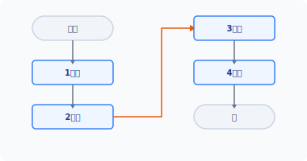
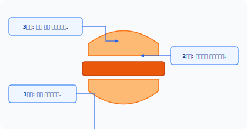
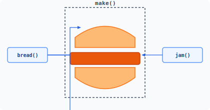
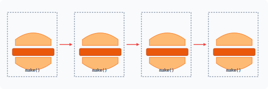
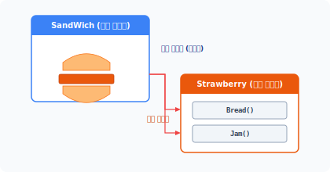
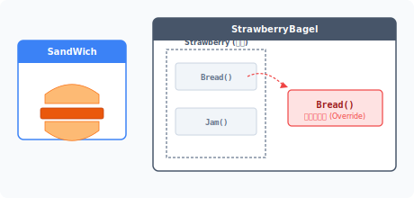
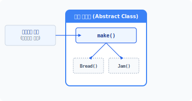
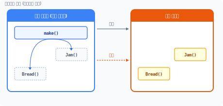
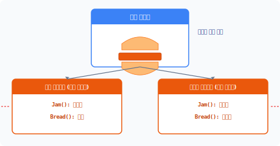
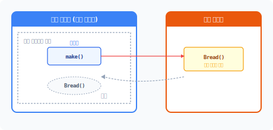


# tem·plate method
['templeit 'meθəd]

# CHAPTER 22 템플릿 메서드 패턴

템플릿 메서드 패턴은 메서드를 이용해 각 단계를 템플릿 구조화하고 행동을 구분합니다.

## 22.1 프로그램의 구조

프로그램의 코드는 구조를 갖고 있습니다. 시작을 기준으로 하여 순차적으로 코드를 읽고 해석합니다. 프로그램이 순차적으로 실행된다는 의미는 단계적으로 코드를 따라간다는 것입니다.

### 22.1.1 코드 실행 순서 분석
모든 행동에는 순서가 있으며, 우리가 무의식적으로 걸을 때도 동작에 순서가 있습니다. 프로그램은 이러한 동작을 분석해서 순차적으로 연결합니다.

#### 그림 22-1 프로그램 실행 단계



22장 템플릿 메서드 패턴 **477**

최근 들어 언플러그드 코딩 교육이 인기를 얻고 있습니다. 인간이 무의식적으로 행동하는 것을 프로그램 방식으로 분석하고 논리적으로 사고하는 훈련입니다. 프로그래밍은 사용자가 원하는 동작을 정확히 이해하고 분석하는 것부터 시작합니다. 그리고 분석된 행동과 결과를 코드로 작성합니다.

예를 들어 샌드위치 제작 방법을 코드로 작성해봅시다. 맛있는 샌드위치를 만드는 과정을 프로그래밍하기 위해 호텔 주방장을 섭외했습니다. 호텔 주방장은 컴퓨터 프로그래밍을 해본 경험이 없습니다.

개발자: "샌드위치는 어떤 모양이고 어떻게 만드나요?"
주방장: "샌드위치는 2개의 빵 안에 원하는 재료를 넣습니다."

주방장의 이야기를 들은 개발자는 주방장이 얘기한 것과 같이 샌드위치를 만드는 코드를 작성합니다.

예제 22-1 Template/01/sandwich.php
```php
<?php
class SandWich
{
    public function make()
    {
        return "빵 + 속재료 + 빵";
    }
}
```

작성한 SandWich 클래스를 이용해 샌드위치를 만들어봅시다.

예제 22-2 Template/01/index.php
```php
<?php
include "sandwich.php";

echo "배고프다. 샌드위치를 만든다.\n";
$obj = new sandwich;
echo $obj->make();
```

**478** 3부 행동 패턴

```bash
php index.php
배고프다. 샌드위치를 만든다.
빵 + 속재료 + 빵
```

주방장은 샌드위치 제작 과정을 너무 추상적으로 설명했습니다. 하지만 실제 샌드위치를 만드는 과정은 매우 복잡합니다.

### 22.1.2 단계
앞의 예제는 복잡한 샌드위치 요리 과정을 단순하게 설명했습니다. 하지만 사람들은 이 설명만 듣고도 원하는 샌드위치를 만들 수 있습니다.

인간과 컴퓨터의 차이는 무엇일까요? 인간은 어떤 행동을 추상화하고 이를 이해합니다. 또한 추상화된 각 단계의 동작을 무의식적으로 학습된 형태로 반복합니다.

실제 코딩으로 샌드위치를 만들려면 보다 상세하고 구체적인 동작을 기술해야 합니다. 동작 처리 과정을 면밀하게 살펴보면 단계별로 구분할 수 있습니다. 프로그래밍은 복잡한 동작을 단계별로, 구체적으로 구분하여 나열하는 것입니다.

#### 그림 22-2 샌드위치 생성 단계 구분



컴퓨터는 동작을 하나씩 지정해서 실행해야 하므로 컴퓨터 프로그램을 바르게 작성하는 것은 각각의 단계를 잘 구별하는 것이라고 할 수 있습니다.

22장 템플릿 메서드 패턴 **479**

예제 22-3 Template/02/sandwich.php
```php
<?php
class SandWich
{
    public function make()
    {
        // 1단계 : 빵을 하나 준비합니다.
        $food = "빵";

        // 2단계 : 준비된 빵에 속재료를 올려놓습니다.
        $food .= " + ";
        $food .= "속재료";

        // 3단계 : 속재료 위에 다시 빵 하나를 놓습니다.
        $food .= " + ";
        $food .= "빵";

        // 생성된 샌드위치를 반환합니다.
        return $food;
    }
}
```

[예제 22-3]에서는 샌드위치 생성 방법을 단계적으로 분리했습니다. 코드의 길이가 길어졌지만 실행 결과는 동일합니다.

## 22.2 템플릿

모든 샌드위치는 공통된 모양의 형틀을 갖고 있고 샌드위치를 만드는 원리와 만들어진 모습이 같습니다. 즉 샌드위치의 내용물만 다를 뿐 겉모양은 비슷합니다.

### 22.2.1 공통 로직
샌드위치의 종류는 매우 다양합니다. 하지만 만드는 방법과 구성(재료)은 동일합니다. 샌드위치는 2개의 빵 속에 속재료를 넣은 모양입니다. 이는 어떤 샌드위치라도 동일합니다.

**480** 3부 행동 패턴

공통된 특징을 적용해 샌드위치 생성 과정을 단계별로 분리합니다.

#### 그림 22-3 샌드위치 생성 과정 객체화



SandWich 클래스를 좀 더 개선해보겠습니다.

예제 22-4 Template/03/sandwich.php
```php
<?php
class SandWich
{
    public function make()
    {
        // 1단계 : 빵을 하나 준비합니다.
        $food = $this->bread();

        // 2단계 : 준비된 빵에 속재료를 올려놓습니다.
        $food .= " + ";
        $food .= $this->jam();

        // 3단계 : 속재료 위에 다시 빵 하나를 놓습니다.
        $food .= " + ";
        $food .= $this->bread();

        // 생성된 샌드위치를 반환합니다.
        return $food;
    }

    public function bread()
    {
        return "식빵";
    }
```

22장 템플릿 메서드 패턴 **481**

```php
    public function jam()
    {
        return "딸기잼";
    }
}
```

```bash
php index.php
배고프다. 샌드위치를 만든다.
식빵 + 딸기잼 + 식빵
```

샌드위치를 만들기 위한 원재료를 메서드로 분리했습니다. `make()` 메서드가 재료에 해당하는 메서드를 호출하지만 공통된 단계별 과정에는 변함이 없습니다.

### 22.2.2 템플릿
템플릿(Template)에는 '형판', '견본'이라는 뜻이 있으며, 객체지향에서의 템플릿은 공통된 처리 로직을 말합니다.

우리는 샌드위치를 만들기 위한 공통 로직을 설계했고 `make()` 메서드를 반복적으로 실행하면 됩니다. 어떤 샌드위치든지 만드는 방법은 크게 변하지 않습니다.

#### 그림 22-4 샌드위치를 만드는 템플릿 반복 수행



`make()` 메서드는 샌드위치를 만드는 알고리즘과 같습니다. `make()` 메서드와 같이 공통된 단계적 과정을 템플릿이라고 합니다.

**482** 3부 행동 패턴

계적 과정을 템플릿이라고 합니다.

## 22.3 일반화

클래스의 일반화(generalization)는 공통점을 찾아 상위 클래스로 도출하는 과정입니다. 공통점을 기준으로 1개의 클래스를 2개의 클래스로 분리합니다.

### 22.3.1 클래스 분리
일반화는 객체지향의 상속을 구현하기 위해 공통된 부분을 찾는 과정입니다. 공통된 템플릿 로직을 분리하는 이유는 중복된 코드가 발생하기 때문입니다.

일반화는 공통된 부분과 다른 부분을 분리합니다. 다양한 클래스로 객체를 확장할 때 공통된 부분만 모아서 별도로 관리하면 추후 유지 보수하기가 편합니다. 공통된 부분은 상위 클래스로, 다른 클래스는 하위 클래스로 재설계합니다.

기존의 sandwich 클래스의 공통된 부분만 남겨놓습니다. 공통된 부분은 템플릿을 처리하는 메서드입니다.

예제 22-5 Template/04/sandwich.php
```php
<?php
// 공통된 부분
class SandWich
{
    public function make()
    {
        // 1단계 : 빵을 하나 준비합니다.
        $food = $this->bread();

        // 2단계 : 준비된 빵에 속재료를 올려놓습니다.
        $food .= " + ";
        $food .= $this->jam();

        // 3단계 : 속재료 위에 다시 빵 하나를 놓습니다.
```

22장 템플릿 메서드 패턴 **483**

```php
        $food .= " + ";
        $food .= $this->bread();

        // 생성된 샌드위치를 반환합니다.
        return $food;
    }
}
```

처리 로직은 알고리즘 단계를 가지며 이 단계는 반복적으로 수행됩니다.

### 22.3.2 접근 속성
일반화를 통해 공통된 로직을 상위 클래스로 분리했습니다. 공통되지 않은 부분은 하위 클래스에 위임합니다. 상위 클래스의 템플릿 메서드는 하위 클래스의 메서드를 호출하여 사용합니다.

템플릿 메서드에서는 불필요한 접근을 제한하고 템플릿 접근만 허용합니다. 샌드위치를 만드는 사용자는 공통된 로직인 템플릿만 호출하면 되며 하위 클래스의 메서드에 직접 접근할 필요가 없습니다.

#### 그림 22-5 공통된 부분 분리(메서드 호출)



하위 클래스는 상위 클래스를 상속받으므로 외부에서 불필요한 메서드가 접근하는 것을 제한합니다. 하위 클래스의 메서드 속성은 상속된 구조에서만 접근을 허용하는 protected를 부여하여 설계합니다.

**484** 3부 행동 패턴

예제 22-6 Template/04/Strawberry.php
```php
<?php
// 공통되지 않은 부분
class Strawberry extends SandWich
{
    protected function bread()
    {
        return "식빵";
    }

    protected function jam()
    {
        return "딸기잼";
    }
}
```

샌드위치를 만드는 공통 과정은 동일하지만 완성된 샌드위치는 다를 수 있습니다. 일반화로 분리된 하위 클래스는 공통되지 않는 부분을 담을 수 있습니다. 하위 클래스만 변경하면 다양한 샌드위치를 만들 수 있습니다.

### 22.3.3 일반화 결과
일반화를 통해 분리한 클래스는 코드 중복이 발생하지 않도록 구조를 개선한 효과를 얻을 수 있습니다. 일반화로 분리된 클래스는 상속을 통해 결합합니다.

일반화를 통해 분리된 클래스를 사용하려면 실행 코드에 2개의 클래스 파일을 모두 include해야 합니다.

상속으로 구성된 클래스의 객체를 생성합니다. 하위 클래스를 사용해 객체를 생성하며, Strawberry 클래스는 SandWich 클래스를 상속합니다.

예제 22-7 Template/04/index.php
```php
<?php
include "sandwich.php";
include "strawberry.php";
```

22장 템플릿 메서드 패턴 **485**

```php
echo "배고프다. 샌드위치를 만든다.\n";
$obj = new Strawberry;
echo $obj->make();
```

```bash
php index.php
배고프다. 샌드위치를 만든다.
식빵 + 딸기잼 + 식빵
```

## 22.4 추상화

템플릿 메서드 패턴은 추상 클래스의 특징을 잘 활용하여 적용한 디자인 패턴입니다.

### 22.4.1 오버라이드
클래스 상속은 모든 내용을 포괄적으로 승계받습니다. 샌드위치를 만들 때 식빵을 사용하지 않고 베이글을 사용하려면 어떻게 해야 할까요?

Strawberry 클래스를 다시 상속하고 bread() 메서드를 오버라이드합니다.

#### 그림 22-6 메서드 오버라이드



StrawberryBagel 클래스는 Strawberry 클래스를 다시 상속합니다.

**486** 3부 행동 패턴

예제 22-8 Template/05/StrawberryBagel.php
```php
<?php
// 공통되지 않은 부분
class StrawberryBagel extends Strawberry
{
    protected function bread()
    {
        return "베이글";
    }
}
```

StrawberryBagel 클래스 내부에는 기존의 식빵을 처리하는 bread() 메서드와 베이글을 처리하는 bread() 메서드가 있습니다.

예제 22-9 Template/05/index.php
```php
<?php
include "sandwich.php";
include "strawberry.php";
include "StrawberryBagel.php";

echo "배고프다. 샌드위치를 만든다.\n";
$obj = new StrawberryBagel;
echo $obj->make();
```

```bash
php index.php
배고프다. 샌드위치를 만든다.
베이글 + 딸기잼 + 베이글
```

### 22.4.2 추상 클래스
상속을 통해 메서드를 오버라이드하면 불필요한 메서드만 남습니다. [그림 22-6]을 살펴보면 StrawberryBagel은 bread 메서드를 재정의합니다. 메서드 재정의로 인해 기존 Strawberry의 bread 메서드는 사용하지 않는 코드로 남게 됩니다. 메서드를 재정의하는 것은 클래스의 크기만 커지는 결과를 가져옵니다. 즉 불필요한 자원 낭비입니다.

22장 템플릿 메서드 패턴 **487**

일반적인 상속 구조를 추상 클래스 구조로 변경합니다. 상위 일반 클래스에 abstract 키워드만 추가하면 SandWich 클래스를 추상 클래스로 변경할 수 있습니다.

예제 22-10 Template/06/sandwich.php
```php
<?php
// 공통된 부분
abstract class SandWich
{
    // 템플릿
    public function make()
    {
        // 1단계 : 빵을 하나 준비합니다.
        $food = $this->bread();

        // 2단계 : 준비된 빵에 속재료를 올려놓습니다.
        $food .= " + ";
        $food .= $this->jam();

        // 3단계 : 속재료 위에 다시 빵 하나를 놓습니다.
        $food .= " + ";
        $food .= $this->bread();

        // 생성된 샌드위치를 반환합니다.
        return $food;
    }

    // 추상 메서드
    abstract protected function bread();
    abstract protected function jam();
}
```

추상 클래스도 동일한 상속 구조로 결합됩니다.

> [!NOTE]
> 일반 클래스와 달리 추상 클래스는 독립적인 인스턴스를 생성할 수 없습니다.

변경된 추상 클래스의 템플릿을 살펴보겠습니다. 템플릿 역할의 메서드는 선언된 추상 메서드를 호출해 사용합니다. make() 템플릿(메서드) 안에서는 식재료의 메서드를 호출해서 사용합니다. 하지만 추상 클래스 안에서는 실제 식재료의 메서드만 선언할 뿐 구현하지 않으며, 추상

**488** 3부 행동 패턴

메서드는 상속받은 하위 클래스에 실제 동작을 위임합니다.

추상화를 통해 추상 메서드를 선언하면 실제로 구현하지 않아도 호출해서 사용할 수 있습니다. 실제 구현 메서드의 호출 및 처리 동작에 대해서만 알면 됩니다. 이는 추상화를 통해 사용과 구현을 분리하는 특징입니다.

### 22.4.3 상위 클래스
템플릿 메서드 패턴은 추상 클래스를 통해 상속을 추상화합니다. 상위 클래스의 추상화는 외형적인 뼈대만 결정합니다. 또한 하위 클래스를 구현하는 기준이 됩니다.

#### 그림 22-7 추상화 상위 클래스



메서드는 상위 클래스에 공통적 기능만 구현하고, 변경되는 부분은 추상 메서드로 선언합니다. 변경할 부분을 추상 메서드로 선언하는 이유는 상속받을 때 하위 클래스에서 중복적으로 재구현되기 때문입니다. 추상 클래스를 상속한 하위 클래스에서도 일반화된 공통 로직을 호출하여 사용할 수 있습니다. 공통된 코드를 상위 클래스로 옮길 경우 추후에 효율적으로 유지 보수할 수 있습니다.

### 22.4.4 추상 메서드
템플릿 메서드 패턴은 2개의 클래스를 갖고 있습니다. 하나는 템플릿의 메서드를 정의하는 추상 클래스이고, 하나는 템플릿 구현부인 일반 클래스입니다. 또한 두 개의 클래스는 서로 밀접한 관계를 갖고 있습니다.

두 클래스의 관계는 추상 메서드의 선언을 통해 분리됩니다. 상위 클래스의 추상 메서드는 인

22장 템플릿 메서드 패턴 **489**

터페이스와 같은 성격을 갖고 있습니다. 즉, 메서드 선언만 있을 뿐, 메서드의 실체는 없습니다. 추상 클래스는 추상 메서드 선언으로 실제 구현을 하위 클래스에 위임합니다.

추상 메서드의 경우 호출 동작은 쉽게 알 수 있지만 내부 동작은 알 수 없습니다. 추상 메서드를 사용하면 호출부를 통일하는 효과를 얻을 수 있습니다.

추상 클래스를 상속하면 하위 구현 클래스는 선언된 추상 메서드를 반드시 구현해야 합니다.

### 22.4.5 하위 클래스
실제 동작은 하위 클래스에서 처리하며 하위 클래스는 일반적인 클래스입니다. 다음과 같이 베이글로 만든 샌드위치가 생성되는 클래스를 추상화로 재설계해봅시다.

예제 22-11 Template/06/StrawberryBagel.php
```php
<?php
// 공통되지 않은 부분
class StrawberryBagel extends SandWich
{
    // 추상 메서드 : 구현
    protected function bread()
    {
        return "베이글";
    }

    // 추상 메서드 : 구현
    protected function jam()
    {
        return "딸기잼";
    }
}
```

변경된 StrawberryBagel 클래스는 일반 클래스인 Strawberry를 상속하지 않고, 추상 클래스로 변경된 SandWich 클래스를 상속받습니다. StrawberryBagel 클래스는 SandWich 클래스에서 선언된 추상 메서드의 실제를 반드시 구현해야 합니다. 구현하지 않으면 오류가 발생합니다.

**490** 3부 행동 패턴

#### 그림 22-8 추상화의 하위 클래스 구현



상위 클래스의 역할은 골격을 정의하는 것이고 하위 클래스의 역할은 골격의 실제 수행을 처리하는 것입니다. 템플릿 메서드 패턴을 설계할 때 중요한 부분은 상위 클래스와 하위 클래스의 역할을 분배하는 것입니다.

### 22.4.6 추상화 결과
추상화하면 다수의 하위 클래스로 다양한 동작을 분리할 수 있고 중복된 코드도 제거할 수 있습니다. 또한 필요에 따라 처리하는 동작을 그룹별로 생성할 수도 있습니다.

추상 클래스로 변환한 코드를 실행해봅시다.

예제 22-12 Template/06/index.php
```php
<?php
include "sandwich.php";
include "StrawberryBagel.php";

echo "배고프다. 샌드위치를 만든다.\n";
$obj = new StrawberryBagel;
echo $obj->make();
```

```bash
php index.php
배고프다. 샌드위치를 만든다.
베이글 + 딸기잼 + 베이글
```

이전과 달리 Strawberry 클래스가 없어도 추상화로 베이글 샌드위치를 만들 수 있습니다. 또한 오버라이드하지 않으므로 불필요한 코드가 내포되지 않습니다.

22장 템플릿 메서드 패턴 **491**

샌드위치 생성 방법을 수정할 경우 추상 클래스만 변경하면 되는 등 구조를 보다 쉽게 개선할 수 있고 단계도 쉽게 수정할 수 있습니다.

### 22.4.7 Final 키워드
템플릿 메서드는 기능의 구조를 템플릿에 미리 정의합니다. 템플릿은 분리된 상위 클래스에 위치하고 상속을 통해 기능을 사용합니다.

템플릿은 공통된 기능으로 하위 클래스에서 오버라이딩되지 않도록 방지해야 합니다. 상속 구조에서 final 키워드를 사용하면 메서드의 오버라이딩을 방지할 수 있습니다.

## 22.5 템플릿 메서드

템플릿 메서드는 공통된 로직을 분리하여 캡슐화합니다. 공통 단계인 템플릿을 별도의 메서드로 작성합니다.

### 22.5.1 로직 변경
템플릿 메서드는 공통된 알고리즘을 정의하며, 공통된 로직을 처리하는 행동입니다. 템플릿 메서드 패턴은 로직의 전체 구조를 변경하지 않고 일부분만 수정할 때 유용합니다.

큰 틀에서 보면 비슷한 로직이지만, 미세한 차이로 인해 코드를 중복 작성하는 경우가 많습니다. 중복된 코드는 유지 보수를 어렵게 만드는 원인이 됩니다.

**492** 3부 행동 패턴

#### 그림 22-9 공통된 로직과 변화된 로직을 분리하여 처리



큰 틀의 공통된 로직만 처리하는 메서드와 변화된 작은 동작을 처리하는 메서드를 서로 분리합니다. 이러한 분리는 추상 클래스로 구현합니다.

### 22.5.2 분할과 협력
템플릿 메서드 패턴은 알고리즘과 같은 동작을 적용할 때 유용한 패턴입니다. 템플릿 메서드는 단계를 미리 정해놓고, 실제 구체적인 내용은 하위 클래스에게 요청합니다.

템플릿 메서드는 추상화를 통해 로직을 분리합니다. 이처럼 추상화를 통해 알고리즘을 분리하면 구조를 변경하지 않고도 하위 클래스로 상세 동작을 재정의할 수 있습니다. 템플릿 메서드 패턴은 알고리즘의 뼈대를 정의하는 것과 같습니다.

알고리즘은 단계별 행동을 정의하고 처리 과정을 세부적으로 묘사합니다. 또한 공통된 로직을 메서드로 캡슐화하고 캡슐화된 공통 로직은 상위 클래스에 배치합니다.

공통되지 않은 로직은 단계별로 하위 클래스에 구현을 위임합니다. 상위 템플릿은 하위 클래스에서 구현된 메서드를 호출해 사용합니다. 템플릿 메서드는 메서드 호출을 통해 복잡한 처리를 간단히 단계별로 수행할 수 있습니다.

22장 템플릿 메서드 패턴 **493**

### 22.5.3 후크
하위 클래스에서 구현되는 메서드를 후크(Hook) 메서드, primitive 메서드라고 합니다. 후크는 중복된 코드를 제거하고 처리 로직의 일부를 변경할 때 자주 사용하는 기법입니다.

#### 그림 22-10 후크



템플릿 메서드는 추상 클래스를 통해 호출 방식을 미리 정의하고 하위 클래스에서 실체를 구현합니다. 이러한 동작은 후크 기능과 유사합니다.

상속으로 후크를 구현할 때는 오버라이드를 사용합니다. 오버라이드는 기존의 메서드를 남겨둔 채 중복된 메서드를 새로 추가합니다. 하지만 추상 클래스로 후크를 처리할 때는 재정의가 아닌 미정의된 메서드를 신규로 구현합니다.

### 22.5.4 장점
템플릿 메서드는 클래스 일부를 외부에 노출하고, 외부에 노출된 메서드는 다른 객체에서 접근해 사용할 수 있습니다. 외부 접근을 허용함으로써 코드의 중복을 줄이는 효과를 얻을 수 있습니다.

공통된 메서드를 노출함으로써 처리 로직을 한 곳에 집중합니다. 템플릿 메서드는 코드를 분산하지 않고 집중화하므로 변경이 용이합니다.

## 22.6 의존성 디자인

템플릿 메서드 패턴에서는 구성 요소 간 상호 의존성이 발생합니다.

**494** 3부 행동 패턴

### 22.6.1 할리우드 원칙
템플릿 메서드는 할리우드 원칙(hollywood principle)이라는 역전 제어 구조를 사용하는데, 높은 수준의 구성 요소가 낮은 수준의 구성 요소에 의존합니다.

하위 클래스는 상위 클래스를 상속받는 서브 역할을 합니다. 하위 클래스는 구성 요소를 재구현하는 낮은 수준의 코드로 구성됩니다. 상위 클래스의 템플릿에서는 아직 구현되지 않거나 재구현될 낮은 수준의 구성 요소를 호출합니다.

할리우드 원칙을 적용해서 의존성을 설계할 때는 순환 의존성이 발생하지 않도록 주의해야 합니다. 템플릿 메서드 패턴은 리스코프 치환 원칙(The Liskov Substitution Principle, LSP)도 함께 사용합니다.

## 22.7 관련 패턴

템플릿 메서드는 다음 패턴과 함께 사용할 수 있으며 유사한 특징을 갖고 있습니다.

### 22.7.1 팩토리 메서드 패턴
팩토리 메서드 패턴은 추상화를 통해 객체의 요청과 생성을 분리합니다. 요청과 생성을 분리할 때는 템플릿 메서드 패턴을 응용합니다.

### 22.7.2 전략 패턴
템플릿 메서드는 상속 구조를 갖고 있습니다. 상위 클래스에서 먼저 큰 골격에 대한 동작의 흐름을 구현하고, 그 외의 실제적인 동작은 하위 클래스에서 구현합니다.

템플릿 메서드에서 처리하는 템플릿은 전략 패턴에서 구현하는 알고리즘과 유사하며, 전략 패턴은 위임을 통해 알고리즘 동작을 변경합니다. 템플릿 메서드 패턴은 알고리즘의 동작 일부를

---
1. 치환성은 객체 지향 프로그래밍 원칙이다. 컴퓨터 프로그램에서 자료형 S가 자료형 T의 하위형이라면 필요한 프로그램의 속성(정확성, 수행하는 업무 등) 변경 없이 자료형 T의 객체를 자료형 S의 객체로 교체(치환)할 수 있어야 한다는 원칙이다. 출처: 위키백과

22장 템플릿 메서드 패턴 **495**

변경하지만 전략 패턴은 알고리즘 동작 전체를 변경합니다.

## 22.8 정리

템플릿 메서드 패턴은 공통적인 프로세스를 묶어 처리하는 패턴입니다. 즉 일정한 프로세스가 유사한 동작을 할 때 템플릿 메서드 패턴을 적용합니다.

템플릿 메서드는 구조를 변경하지 않고 처리 로직의 일부를 재정의하는 기법입니다. 템플릿 메서드 패턴은 추상 클래스를 이용해 공통적 기능을 추상화하고, 템플릿을 이용해 처리 로직의 상세 기능을 쉽게 확장할 수 있습니다.

템플릿 메서드 패턴은 코드를 재사용하는 방법을 설명합니다. 템플릿 메서드는 상위 클래스에서 하위 클래스의 명령을 호출하는 후크 동작을 처리하는데, 이 후크 동작은 할리우드 원칙을 적용한 것입니다.

템플릿 메서드 패턴은 실제 개발에서 자주 사용되는 패턴입니다. 특히 프레임워크에서는 구조를 제어할 때 템플릿 메서드가 자주 사용되는 것을 볼 수 있습니다.

**496** 3부 행동 패턴

