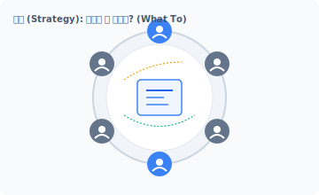
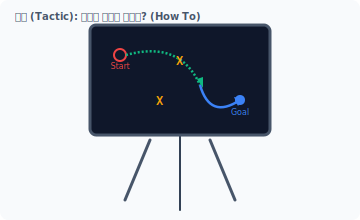
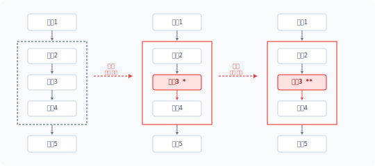
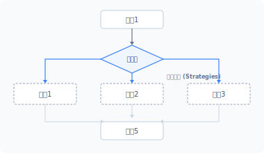
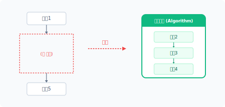
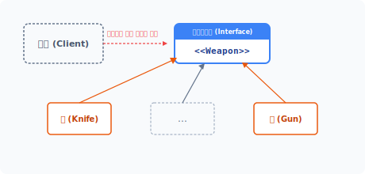
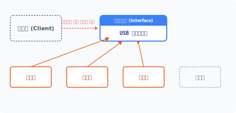
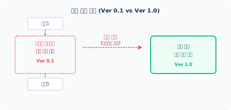
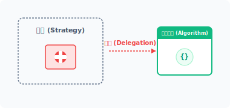


# strat·egy
['strætədʒi]

# CHAPTER 23 전략 패턴

전략 패턴은 객체 내부에서 해결해야 하는 목적을 알고리즘 객체로 분리 적용하는 기법입니다. 실제 내부 동작을 외부 알고리즘 객체로 분리하여 유연하게 동작을 변경시킬 수 있습니다.

## 23.1 문제

프로그램은 반복되는 문제를 해결합니다. 발생한 문제를 해결하는 방법은 다양한데, 이들 각각의 해결 방법을 알고리즘이라고 합니다.

### 23.1.1 전략
전략은 어떤 목표를 정하고 진행하는 큰 틀을 말하며, 군대에서 적과 싸울 때의 작전에 비유할 수 있습니다. 즉 전략은 앞으로 무엇을 할지 계획하는 것이며 'What To'를 의미합니다. 이처럼 프로그램에서 전략은 실행하는 큰 틀을 의미합니다.

#### 그림 23-1 작전 회의



23장 전략 패턴 **497**

#### 그림 23-2 작전을 수행하는 전술



한 번 계획한 전략을 수정하는 일은 쉽지 않습니다. 개발이 진행되고 있거나 완료된 프로그램에서 전략을 수정하면 많은 시간과 비용이 소모됩니다. 또한 잘못된 전략은 프로그램에 치명적인 결과를 가져옵니다. 전략은 향후 프로젝트를 완성 및 성공시키는 데 매우 중요합니다.

### 23.1.2 전술
전술은 전략과 유사한 용어로, 전략을 짜면서 정한 목표를 달성하기 위한 상세 내용이며 'How To'를 의미합니다. 또한 전술은 방법론을 의미하며 전략은 방법을 구사하는 것을 말합니다.

전술은 전략을 수행하기 위한 효과적인 행동을 말하는데, 전략 패턴에서 전략은 알고리즘입니다. 그리고 전술은 실제 알고리즘이 동작하는 상세 내용입니다.

**498** 3부 행동 패턴

## 23.2 알고리즘

프로그램의 목적은 주어진 문제를 해결하는 것이고 알고리즘은 주어진 문제를 해결하는 전술입니다.

### 23.2.1 해결 방법의 변화
한 번 개발된 프로그램은 산업 현장에서 생각보다 오랫동안 사용되고, 이러한 프로그램은 시간이 지나면서 환경적인 영향을 받으므로 변화가 필요합니다. 프로그램의 생명력은 변화에 어떻게 잘 대처하는가에 따라 결정됩니다.

프로그램의 버그 또한 환경 변화에 의해 발생되며 이 경우 코드 수정이 필요합니다. 간단한 변화는 코드 몇 줄만 수정해도 해결할 수 있지만, 잦은 코드 수정으로 변경 사항이 누적되면 더 이상 수정이 어려워집니다.

문제 해결 전략
#### 그림 23-3 문제 해결 방법 변화



외부적으로 큰 환경 변화가 있을 때는 코드 수정이 어렵습니다. 큰 변화가 요구되면 기존의 방법을 버리고 새로운 방법을 도입하는 것이 현명하며 이때 리팩터링이 필요합니다.

23장 전략 패턴 **499**

### 23.2.2 다양성
프로그램의 목표는 주어진 문제를 해결하는 것입니다. 문제를 해결하는 방법은 다양하며 한 가지 문제를 해결하는 방법은 수십, 수백 가지가 존재합니다. 또한 발생한 문제는 다르지만 유사한 방법으로 해결할 수도 있습니다.

문제 해결 전략
#### 그림 23-4 다양한 해결 방법



문제를 해결하는 방법을 다르게 적용하려고 합니다. 해결 방법이 변경되면 관련 코드도 같이 수정해야 하는데, 이때 코드를 찾고 오래된 코드를 다시 분석하는 등 많은 시간이 필요합니다.

### 23.2.3 분리
프로그램이 외부 변화에 보다 쉽게 적응하려면 변화가 예상되는 부분을 분리하는 것이 좋습니다. 코드를 분리해서 관리하면 유지 보수 측면에서 유리합니다.

변화가 예상되는 부분을 별도의 클래스로 분리합니다. 대부분 처리 로직 부분의 변화가 예상되며, 이처럼 분리된 처리 로직을 알고리즘이라고 부릅니다. 알고리즘은 문제를 해결하는 하나의 패턴입니다.

**500** 3부 행동 패턴

문제 해결 전략
#### 그림 23-5 변경된 코드를 분리



### 23.2.4 알고리즘
알고리즘은 복잡한 문제를 어떤 방법으로 실행했을 때 문제가 해결되는 방법입니다. 알고리즘을 적용하여 문제를 쉽게 해결할 수 있습니다.

알고리즘은 문제 해결을 위한 동작을 다양하게 갖고 있는데, 이 동작은 추상화하여 처리합니다. 사용자는 알고리즘의 내부 실행 동작을 이해할 필요가 없으며, 알고리즘을 사용할 수 있는 인터페이스만 확인하고 절차에 따라 호출해서 사용하면 됩니다.

## 23.3 분리

프로그램에서 알고리즘을 분리하면 향후 코드 확장이 용이해집니다. 또한 여러 알고리즘을 추가로 준비하여 코드를 개선할 수도 있습니다.

23장 전략 패턴 **501**

### 23.3.1 템플릿 메서드
템플릿 메서드 패턴은 공통된 기능을 분리하여 템플릿화하고, 추상화를 통해 상황별로 다르게 처리할 수 있도록 실제 동작을 분리합니다.

템플릿 메서드는 하나의 알고리즘을 다양한 방식으로 재정의할 수 있도록 행동을 분리하는 패턴입니다. 하지만 공통 템플릿도 코드 일부분을 수정해야 하는 경우가 발생합니다.

공통된 기능의 템플릿을 수정할 경우 기존의 상위 클래스 코드도 같이 수정해야 합니다. 이러한 수정은 객체지향의 OCP 설계 원칙에 위반됩니다.

### 23.3.2 캡슐화
분리된 알고리즘을 별도의 클래스로 캡슐화합니다. 패턴에서는 알고리즘의 캡슐화를 전략이라고 하며 캡슐화된 알고리즘은 상황에 맞게 교체하며 사용합니다.

전략 패턴은 구조를 그대로 사용하면서 캡슐화된 알고리즘으로 동작을 변경하는 행위입니다. 템플릿 메서드처럼 알고리즘의 일부만 변경하는 것이 아니라 행위의 전체를 변경할 때 사용하는 패턴입니다. 전략 패턴은 동작 객체와 알고리즘 객체 간 관계를 구성하며, 문제 해결을 위한 전체 알고리즘 객체를 변경함으로써 다른 방식의 문제 해결도 시도합니다.

### 23.3.3 구조 유지
문제 해결을 위한 알고리즘은 언제든지 수정할 수 있습니다. 하지만 코드에서 직접 알고리즘을 수정해 적용하는 것은 일관적인 방법으로 코드를 변경해야 하므로 어렵습니다. 따라서 기존 코드에서 변화되는 부분만 알고리즘으로 분리할 때는 구조를 유지하는 것이 중요합니다. 그래야 기존 코드와 분리된 알고리즘 코드가 잘 결합해서 동작합니다.

기존 프로그램의 구조를 그대로 유지하면서 새로운 변화를 적용하려면 어떻게 해야 할까요? 내부적인 구조를 유지하기 위해서는 인터페이스를 적용하여 설계합니다.

**502** 3부 행동 패턴

## 23.4 인터페이스

인터페이스를 활용하면 구조를 유지하면서 호환성 있는 하위 코드를 설계할 수 있습니다.

### 23.4.1 호환성
전략 패턴은 변화되는 부분을 찾아 알고리즘으로 분리합니다. 구조의 일부분을 알고리즘으로 분리할 때는 구조적 호환성을 유지하는 것이 중요합니다.

클래스의 구조가 분리되면 2개의 클래스는 서로 관계를 갖게 되며, 관계를 설정하고 활용하는 데는 약속된 정보가 필요합니다. 인터페이스는 관계를 유지하기 위한 약속을 정의합니다.

분할된 행동의 호환성을 유지하기 위해 인터페이스를 설계합니다.

예제 23-1 Strategy/01/Weapon.php
```php
<?php
// 무기에 대한 인터페이스를 선언합니다.
interface Weapon
{
    public function attack();
}
```

게임을 예로 들어 전략 패턴을 살펴보겠습니다. RPG 게임의 캐릭터는 여러 무기를 사용해 상대방 캐릭터를 공격합니다. 이때 캐릭터는 여러 무기를 선택하여 사용할 수 있도록 attack() 메서드를 포함한 Weapon 인터페이스를 하나 생성합니다.

### 23.4.2 구체화
전략 패턴은 공통된 부분과 변화되는 부분을 분리합니다. 전략 패턴에서 사용되는 알고리즘 클래스는 인터페이스를 적용하여 구체화합니다.

Weapon 인터페이스를 적용한 무기 클래스를 생성합니다. A 개발자는 Knife 클래스를 개발합니다.

23장 전략 패턴 **503**

예제 23-2 Strategy/01/Knife.php
```php
<?php
// 무기 인터페이스를 적용하여 객체의 실제 코드 구현을 작성합니다.
class Knife implements Weapon
{
    public function attack()
    {
        print "칼 공격합니다.";
        echo "\n";
    }
}
```

Weapon 인터페이스를 적용해 또 다른 무기 클래스를 생성합니다. B 개발자는 Gun 클래스를 개발합니다.

예제 23-3 Strategy/01/Gun.php
```php
<?php
// 무기 인터페이스를 적용하여 객체의 실제 코드 구현을 작성합니다.
class Gun implements Weapon
{
    public function attack()
    {
        print "총을 발포합니다.";
        echo "\n";
    }
}
```

Weapon 인터페이스를 응용하면 다양한 객체 클래스를 생성할 수 있습니다.

#### 그림 23-6 인터페이스를 적용한 알고리즘 객체



**504** 3부 행동 패턴

인터페이스를 활용해 캐릭터의 무기 종류를 각각 다른 알고리즘 클래스로 분리했습니다. 이것이 알고리즘의 객체화입니다.

### 23.4.3 다형성
인터페이스는 구조적 관계를 유지한다는 약속입니다. 인터페이스에서 선언한 attack() 메서드는 클래스 구조에 대한 선언만 되어 있습니다. 인터페이스는 하위 코드에 특정 구현 방법을 고정하지 않고 약속된 인터페이스만 유지하면 됩니다.

다형성은 인터페이스를 통해 프로그램을 작성하는데, 메서드의 실제 내용은 인터페이스를 적용한 구현 클래스에서 작성합니다. 실제 내용은 필요에 따라 다르게 구현할 수 있습니다.

동일한 인터페이스를 가진 기능은 여럿 존재할 수 있습니다. USB 포트를 예로 들어보겠습니다. USB 포트는 컴퓨터와 기기를 연결하는 인터페이스인데 모두 동일한 규격이므로 연결하는 방법이 동일합니다. 하지만 USB에 연결된 기기의 종류와 동작은 서로 다릅니다.

#### 그림 23-7 인터페이스를 이용한 다양성



이처럼 다형성을 이용하면 변화에 쉽게 대응할 수 있습니다.

## 23.5 전략

'Strategy'는 영어로 전략이라는 의미이며, 전략 패턴은 정책(policy) 패턴이라고도 불립니다.

23장 전략 패턴 **505**

### 23.5.1 개발 부채
문제를 해결하기 위해 다양한 방법을 모두 구현할 수는 없습니다. 완벽한 방법을 찾아서 구현하는 것은 시간적으로 한계가 있습니다. 실제 개발 현장에서는 당장 성능이 떨어지더라도 동작하는 코드를 만드는 것을 우선시합니다.

문제 해결 전략
#### 그림 23-8 개발 부채



알고리즘을 실제 코드와 결합해서 설계하면 향후 유지 보수가 힘들어집니다. 이때 알고리즘을 추상화해 전략 패턴으로 전환합니다. 전략 패턴으로 변경된 알고리즘은 차후에 객체를 변경하여 보완할 수 있습니다. 알고리즘을 객체로 분리하면 향후 코드를 개선하는 데 용이합니다.

### 23.5.2 전략의 필요성
객체의 행위는 메서드로 구현하고, 구현된 메서드는 일반적으로 객체 내부에 위치합니다. 하지만 전략 패턴은 객체의 행위를 메서드로 구현하지 않고 별도의 객체로 분리합니다.

별도로 분리된 알고리즘 객체는 전략 패턴과 밀접한 관계를 가집니다. 분리된 객체는 위임을 통해 관계를 설정합니다. 위임은 객체 간에 느슨한 관계를 구성하는 방법이며, 느슨한 관계는 언제든지 쉽게 다른 객체로 변경할 수 있습니다.

**506** 3부 행동 패턴

### 23.5.3 복합 구조와 의존성
전략 패턴은 대표적인 복합 구조 형태의 객체이며 객체를 상속하는 대신 의존성으로 객체의 관계를 설정합니다. 의존된 외부의 객체는 객체 구조를 확장할 수 있습니다.

#### 그림 23-9 알고리즘 위임 의존성



전략 패턴은 처리할 알고리즘을 위임하는 형태로 객체에 실제 동작 처리를 요청합니다. 위임으로 결합된 알고리즘 객체는 다른 알고리즘 객체로 쉽게 변경할 수 있습니다. 알고리즘 하나가 모듈 형태로 위임되어 의존성 결합이 이뤄집니다.

### 23.5.4 추상화
Strategy 클래스는 추상 클래스이고, 전략 패턴에서 사용하는 인터페이스는 전략을 적용하기 위한 추상 메서드입니다.

예제 23-4 Strategy/01/Strategy.php
```php
<?php
abstract class Stategy
{
    // 추상적인 접근점
    protected $delegate;

    // 무기 교환 패턴
    public function setWeapon(Weapon $weapon)
    {
        echo "== 무기를 교환합니다. ==\n";
        $this->delegate = $weapon;
    }

    abstract public function attack();
}
```

23장 전략 패턴 **507**

추상 메서드를 이용하여 코드를 작성하는 것은 상위 구조의 형식에 맞춰 개발하기 위해서입니다. 또한 추상 메서드를 이용하여 인터페이스를 적용하는 것은 구조를 유지하면서 변화되는 부분만 분리 결합하기 위해서입니다.

### 23.5.5 구체적인 전략
전략 패턴의 실제적인 하위 클래스를 구현합니다. 전략 패턴은 특정 알고리즘에 종속되어 동작하지 않으며, 언제든지 알고리즘을 변경해서 적용할 수 있습니다.

[예제 2-5]에서는 캐릭터 클래스를 생성합니다. C 개발자는 '캐릭터' 무기에 대한 클래스를 개발하며, 전략 패턴을 사용해 캐릭터가 무기를 선택하도록 할 수 있습니다.

예제 23-5 Strategy/01/Charactor.php
```php
<?php
// 객체를 델리게이트 처리하여 호출합니다.
class Charactor extends Stategy
{
    public function attack()
    {
        if ($this->delegate == NULL) {
            // 무기가 선택되지 않은 경우
            echo "맨손 공격합니다.\n";
        } else {
            // 델리게이트
            $this->delegate->attack();
        }
    }
}
```

C 개발자는 앞에서 무기를 만든 A, B 개발자와 상관없이 캐릭터 객체를 생성할 수 있습니다. 캐릭터에서 필요한 무기 클래스는 $delegate 프로퍼티를 통해 위임 처리합니다.

인터페이스는 구체적인 행동을 구현합니다. 구체적 클래스(concrete strategy)는 전략에 대한 실제 코드를 작성하고 이 실제 코드에서는 작전, 알고리즘을 호출합니다.

**508** 3부 행동 패턴

### 23.5.6 실시간 교체
전략 패턴은 알고리즘을 상호 교환할 수 있게 합니다. 패턴화로 분리된 알고리즘 객체는 전략 객체의 외부로부터 전달 받아 관계를 설정합니다. 이를 의존성 주입이라 합니다.

전략 객체는 외부의 의존성을 매개변수 인자로 전달 받고, 전략 패턴은 위임을 통해 느슨한 결합을 처리합니다. 매개변수를 통해 의존성을 주입하면 전략 객체를 생성하는 단계에서 관계를 설정하거나 재설정할 수 있습니다. 이와 같이 설정하면 프로그램이 실행되는 도중에도 알고리즘을 손쉽게 교체할 수 있습니다.

### 23.5.7 접근점
전략 패턴을 처음 설정할 때는 알고리즘을 매개변수로 전달하여 객체 관계를 설정합니다. 하지만 프로그램 동작 중에 동적으로 알고리즘을 교체하려면 별도의 setter 메서드를 구현해야 합니다.

setWeapon() 메서드는 매개변수로 전달 받은 알고리즘을 내부 프로퍼티에 저장하고, 알고리즘 객체는 내부 변수를 통해 추상적인 접근점을 제공합니다.

[예제 23-4]를 다시 한 번 살펴봅시다. 위임을 통해 알고리즘을 동작 객체에 전달하고, 캐릭터 클래스의 attack() 메서드는 위임된 알고리즘의 attack() 메서드를 호출합니다. 이처럼 전략 패턴은 알고리즘의 메서드를 다시 호출함으로써 동적 교체 효과를 갖게 되며 새로운 확장도 용이해집니다.

## 23.6 전략 실행

전략 패턴은 객체 간 책임들을 분할하고 협력하며 효율적으로 협업하기 위해 알고리즘을 적용합니다.

23장 전략 패턴 **509**

### 23.6.1 사령관
전쟁에서 승리하려면 좋은 전략을 구사하는 사령관이 필요합니다. 사령관은 전쟁에서 직접 칼을 들고 싸우는 대신 전략에 맞게 병사를 투입하며, 병사는 자신이 맡은 지역에서 책임지고 적을 물리칩니다.

### 23.6.2 실행
앞에서 작성한 예제 코드들을 이용해 전략 패턴 코드를 작성해보겠습니다.

예제 23-6 Strategy/01/index.php
```php
<?php
// 인터페이스
include "Weapon.php";

// 무기 구현
include "Gun.php";
include "Knife.php";

// 패턴
include "Strategy.php";
include "Charactor.php";

// 전략 패턴 실행
$obj = new Charactor;
$obj->attack();

// 무기교환
$obj->setWeapon(new Knife);
$obj->attack();

// 무기교환
$obj->setWeapon(new Gun);
$obj->attack();
```

```
php index.php
맨손 공격합니다.
== 무기를 교환합니다. ==
```

**510** 3부 행동 패턴

```
칼 공격합니다.
== 무기를 교환합니다. ==
총을 발포합니다.
```

### 23.6.3 행동 통합과 객체
객체는 상태와 행동을 갖고 있습니다. 전략 패턴에서는 행동을 알고리즘으로 분리하지만 행동을 처리하면서 상태를 사용할 수 없는 것은 아닙니다. 행동을 처리하는 과정에서 상태값이 필요한 경우 프로퍼티를 추가하여 사용합니다.

전략 패턴에서는 행동을 여러 개의 알고리즘으로 분리하며 복수의 행동을 하나의 객체로 통합해 결합합니다. 하지만 복수의 행동을 조건문으로 처리하는 것보다 단일 알고리즘으로 객체를 분리하는 것이 좋습니다. 선택한 알고리즘 객체만 실행해 전술을 실행합니다.

### 23.6.4 동적 처리와 매개변수
전략 패턴은 상황별로 알고리즘을 사용할 수 있지만 모든 상황별로 알고리즘을 미리 구현할 필요는 없습니다. 다른 패턴은 객체가 확장되거나 변형되면 형태를 바꾸지만 전략 패턴은 객체의 형태를 변경하는 것이 아니라 다른 종류의 행동 객체로 교체합니다.

전략 패턴은 동적으로 알고리즘을 변경할 수 있으며, 이를 위해 세터 메서드를 제공합니다.

```php
// 무기교환
$obj->setWeapon(new Knife);
$obj->attack();
```

알고리즘을 분리하지 않으면 새로운 알고리즘을 변경하거나 추가하기 어렵습니다. 알고리즘 행동을 변경할 때는 위임을 사용합니다. 세터 메서드로 전략 객체 내에 있는 알고리즘을 변경할 수 있습니다.

알고리즘을 위임하기 위해서는 매개변수를 사용하며 인자값으로 객체를 전달합니다.

23장 전략 패턴 **511**

```php
$w = new Knife;
$obj->setWeapon($w);
unset($w);
```

위 코드와 같이 클래스의 객체를 변수에 담아 전달할 수도 있고, new 키워드로 직접 객체를 전달할 수도 있습니다. new 키워드로 객체 생성을 전달하면 새로운 변수를 생성 저장하지 않으므로 메모리를 효율적으로 이용할 수 있습니다.

setWeapon() 메서드를 이용해 무기 객체를 생성한 후 전달합니다. setWeapon() 메서드는 전달 받은 무기 객체를 위임 처리할 수 있도록 내부 프로퍼티에 저장하고 캐릭터의 attack() 메서드를 다시 실행합니다.

```php
public function attack()
{
    if ($this->delegate == NULL) {
        // 무기가 선택되지 않은 경우
        echo "맨손 공격합니다.\n";
    } else {
        // 델리게이트
        $this->delegate->attack();
    }
}
```

캐릭터의 attack() 메서드는 위임된 무기 객체가 있을 경우 무기 객체의 attack() 메서드를 호출합니다.

즉, Weapon 인터페이스를 먼저 선언하고 이를 통해 다양한 무기 객체를 생성합니다. 이렇게 생성한 무기 객체를 매개변수 인자로 전달하며, 전략 객체는 위임받은 무기 객체를 자유롭게 변경하면서 동작을 처리할 수 있습니다.

### 23.6.5 실행 중 교체
전략을 위한 알고리즘은 다양하며 알고리즘을 교체하거나 결합하려면 일정한 규격이 필요합니다. 또한 전략을 공통적으로 적용하려면 인터페이스를 설계하고, 인터페이스에 의해 알고리즘을 캡슐화합니다.

512 3부 행동 패턴

전략 패턴으로 알고리즘을 분리하여 구현하는 것은 동적으로 알고리즘을 교체하기 위해서입니다. 인터페이스로 정의된 기능을 호출할 때 서로 교환하여 복수의 기능을 호출해 처리합니다.

전략 패턴은 위임을 구현하기 위해 추상적인 접근점을 생성합니다. 추상적인 접근은 위임된 객체를 가리키는 연결 고리입니다. 위임되는 객체의 정보는 매개변수로 전달합니다. 관계를 가진 내부 프로퍼티를 참조하여 객체를 서로 교환하고, 위임을 통해 내부 처리를 변화시킵니다.

## 23.7 적용 사례

전략 패턴은 실제 프로젝트에서 가장 많이 사용되는 패턴 유형 중 하나입니다.

### 23.7.1 정렬 적용 사례
전략 패턴은 다양한 알고리즘을 적용하여 처리할 때 매우 유용합니다. 대표적으로 정렬은 버블 정렬, 셸 정렬, 퀵 정렬 등 다양한 알고리즘을 갖고 있습니다. 즉, 전략 패턴은 알고리즘을 변경하여 문제를 해결하는 데 매우 유용합니다.

### 23.7.2 통신 적용 사례
전략 패턴은 통신 프로토콜을 변경하는 시스템에도 적용할 수 있습니다. 모바일 접속 시 LTE 프로토콜을 사용할지, Wifi 프로토콜을 사용할지 등의 알고리즘을 전략 패턴으로 구현할 수 있습니다.

## 23.8 관련 패턴

전략 패턴은 다음 패턴과 함께 활용합니다. 또한 이 패턴들은 유사한 특징을 갖고 있습니다.

23장 전략 패턴 **513**

### 23.8.1 플라이웨이트 패턴
전략 패턴으로 분리된 알고리즘 객체를 공유하여 사용하는 경우도 있습니다. 알고리즘을 공유할 때는 플라이웨이트 패턴을 응용합니다.

### 23.8.2 추상 팩토리 패턴
전략 패턴은 알고리즘을 교체하여 사용합니다. 객체를 교체한다는 측면에서 추상 팩토리 패턴과 유사점이 있습니다. 추상 팩토리는 공장, 부품, 제품 등 객체를 교체할 수 있기 때문입니다.

### 23.8.3 상태 패턴
전략 패턴은 알고리즘을 위임으로 사용합니다. 위임을 적극적으로 적용하여 관계를 형성하는 것이 상태 패턴과 많이 유사합니다.

행동 패턴에 유사한 점은 있지만 처리하려는 목적이 서로 다릅니다. 전략 패턴의 경우 변경 여부는 정할 수 있지만 필요에 의해 알고리즘을 변경하는데, 상태 패턴에서는 상태가 변할 때 위임 객체도 변경됩니다.

## 23.9 정리

전략 패턴을 이용하면 원하는 알고리즘을 선택적으로 교환할 수 있습니다. 또한 다양한 알고리즘을 응용하려면 기능을 파악하고 문제를 해결할 수 있도록 학습이 필요합니다.

상속은 공통된 내용을 분리해서 처리하는 대표적인 방법입니다. 하지만 상속은 클래스의 결합도를 증가시키고 객체의 크기를 키웁니다. 최근에는 상속보다 위임 처리를 통해 구성 형태로 사용하는 것을 선호합니다.

인터페이스는 알고리즘의 구현 클래스를 적용하며, 사용 여부에 관계 없이 선언된 메서드를 반드시 구현해야 하는 오버헤드가 발생합니다.

전략 패턴은 알고리즘의 객체를 교환하여 사용한다는 측면에서 유용한 패턴입니다. 교환되는

**514** 3부 행동 패턴

처리 로직을 알고리즘화하여 객체의 군을 형성할 수도 있습니다.

전략 패턴은 행동 변경 시 조건문을 사용하지 않습니다. 알고리즘 캡슐화를 통해 조건문 없이도 원하는 행동으로 교체할 수 있습니다. 하지만 알고리즘 객체가 교체된다는 점에서 실행 시 많은 수의 객체를 갖는다는 단점도 있습니다.

23장 전략 패턴 **515**

