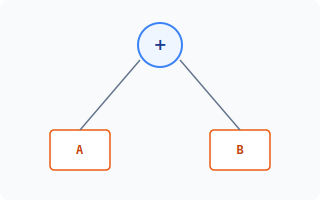
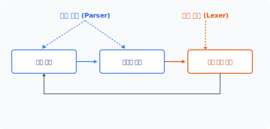
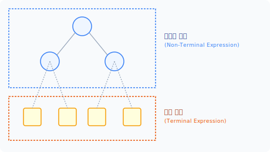


in·ter·pret·er
[ ɪn|tɜːrprɪtə(r) ] 🔊

**CHAPTER 24**
**인터프리터 패턴**

인터프리터 패턴은 간단한 언어적 문법을 표현하는 패턴입니다.

## 24.1 언어

이 세상에는 수많은 언어가 존재합니다. 컴퓨터는 0과 1로 동작하는 시스템이지만, 실제 컴퓨터를 사용할 때는 추상화된 고급 언어로 코드를 작성합니다.

### 24.1.1 저수준 언어
컴퓨터는 0과 1로 동작하는데 이를 기계어라고 합니다. 사람이 기계어로 프로그램을 작성하는 것은 어려우므로, 보다 쉽게 작성하기 위해 어셈블리와 같은 언어가 만들어졌습니다.

어셈블리어는 한 줄의 기계어에 한 줄의 명령어가 대응하는 구조입니다. 어셈블리어는 기계어를 코드로 쉽게 변환할 수 있도록 매핑 기술을 응용했습니다. 이러한 어셈블리어를 저수준 Lowlevel 언어라고 하거나, 기계어와 고급 언어 사이에 있어서 중간 언어라고 부르기도 합니다.

**516** 3부 행동 패턴

### 24.1.2 고급 언어
어셈블리어는 기계어를 쉽게 작성할 수 있도록 도와주지만 사람이 접근하기는 어렵습니다. 또한 어셈블리어는 기계어와 매우 밀접하게 관계되어 있어 모든 시스템에서 통일화된 규격도 없습니다.

고급 언어를 사용하면 시스템 특성에 구속받지 않고 일반 사람도 프로그램을 작성할 수 있습니다. 대표적으로 C언어가 있습니다. 그 외에 PHP, 자바와 같은 추상적 언어도 발전했습니다. 고급 언어의 장점은 기계어나 어셈블리어보다 편리하게 동작을 이해하고 코드를 작성할 수 있다는 점입니다.

추상화된 고급 언어를 사용하여 개발하는 것은 보다 다양한 기종에서 동작할 수 있도록 하는 것입니다. 프로그램을 여러 시스템 환경에서 구동하기 위해서는 추상화된 언어의 해석 Interpret 과정이 필요합니다.

## 24.2 언어 설계

해석자 패턴은 간단한 미니 언어를 구현하는 패턴입니다. 이 패턴은 간단한 언어의 문법을 정의하고 그 언어의 문장을 해석하는 방법을 구현합니다.

### 24.2.1 문법 표현
하나의 언어를 개발하는 일은 오랜 시간이 필요한 작업이며 시간이 지나면서 변화도 많이 일어납니다. 나중에 언어를 쉽게 확장할 수 있도록 만들려면 올바른 설계 구조를 가져야 합니다.

언어 설계의 첫 단추는 규칙을 작성하는 것입니다. 언어 규칙을 명백하게 표현해야 하므로 표기법을 작성합니다. 언어 문법을 표기하는 방법은 크게 두 종류입니다.

* 구문 도표 표기법: 그림으로 표현
* 배커스-나우르 표기법(Backus-Naur form, BNF): 문자로 표현

구문 도표는 그림으로 표현하기 때문에 쉽게 이해할 수 있지만, 수정이 어렵다는 점에서 실제 현장에서는 BNF 표기법을 더 많이 이용합니다.

24장 인터프리터 패턴 **517**

### 24.2.2 BNF 표기법
BNF 표기법은 'Backus-Naur Form'의 약자로 프로그래밍 언어를 정의할 때 사용하는 메타 표기법입니다. 문법을 수학적인 수식으로 표기할 때 많이 이용합니다.

입력된 언어의 문장을 해석하기 위해 먼저 다음과 같이 BNF 표기법으로 정의합니다.

```
<expression> ::= <expression>
```

치환 기호(::=) 왼쪽은 정의되는 대상이고 오른쪽은 내용을 의미합니다. 비종료는 `< >` 기호로 표시하고, 선택은 `|` 기호를 이용하여 문법을 표현합니다.

BNF 표기법은 정규화 표현을 처리하는 경우에도 많이 사용되며, 정규 표현식은 패턴을 정의하는 데 사용됩니다.

### 24.2.3 해석자 패턴 구조
해석자 패턴은 문장의 어휘를 해석하고 처리하기 위해 다음과 같은 5가지 구성 요소를 갖고 있습니다.

* 추상 구문 트리 인터페이스(Abstract Expression)
* 종료 기호(Terminal Expression)
* 비종료 기호(Non-Terminal Expression)
* 해석기 정보(Context)
* 문장을 나타내는 추상 구문 트리(Client)

## 24.3 처리계

새로운 언어 모델을 BNF 표기법으로 설계했다면, 실제 해석하고 처리할 구현부를 작성해야 합니다. 해석자의 처리계는 크게 어휘 분석과 구문 분석으로 나뉩니다.

**518** 3부 행동 패턴

### 24.3.1 어휘 분석
문장으로 작성된 어휘 Lex는 텍스트 문자열이고, 어휘 분석은 문장의 텍스트를 토큰으로 분리하는 작업입니다. 토큰은 문자열에서 각각의 의미와 위치를 구별하며, 어휘 분석에서 의미 있는 식별자를 구별합니다.

다음 문자열은 연산하는 동작입니다.

```php
$lex = "{{ 1 1 + }}"; // 후위 표기법 어휘
```

문자열로 작성된 언어가 어떤 구조인지 해석하기 위해서는 먼저 토큰 token 분리가 필요합니다. 연산식의 언어는 시작 식별자(`{{`)와 종료 식별자(`}}`) 안에 존재하며, 어휘는 각각의 공백으로 구분돼 있습니다. 공백 기호를 이용해 토큰을 분리합니다.

```php
$this->token = explode(" ", $text);
```

토큰으로 분리된 문자열은 1차원 배열로 반환합니다. 토큰은 어휘에서 키워드, 식별자, 상수, 리터럴, 연산자, 분리자 등을 구별하며 해석 처리를 위한 단위를 분리합니다.

### 24.3.2 구문 분석
토큰으로 분리된 어휘를 해석하기 위해 자료 구조를 생성합니다. 토큰으로 분리된 1차원 배열은 구문 분석 단계를 통해 구문 트리를 작성합니다. 구문 트리는 하나의 자료 구조입니다.

다음은 간단한 구문입니다.

```
1 + 2
```

이 구문이 어떤 구조인지 해석해봅시다. 구조 해석을 위해 BNF 표기법으로 정의한 내용에 따라 분석합니다. 분석된 구문 트리는 다음과 같은 모양이 됩니다.

24장 인터프리터 패턴 **519**

#### 그림 24-1 구문 트리



[그림 24-1]의 구문 트리는 이진 트리 구조이며, 구문 분석으로 생성된 트리 자료는 메모리에 저장됩니다.

BNF로 표현된 문법을 분석하면 part-whole 형태의 트리 구조가 됩니다. Part-whole 형태로 분석된 트리 구조는 재귀적 방법으로 처리합니다. Part-whole 트리 구조는 복합체 패턴으로 구현할 수 있습니다.

### 24.3.3 역할
해석자에는 문법 규칙이 존재합니다. 구문 분석의 첫 번째 역할은 어휘를 토큰으로 분리하고, 생성된 자료 구조를 파싱하여 문법을 검사하는 것입니다. 어휘 분석은 분리된 토큰열이 BNF로 설계한 구문과 일치하는지 확인하는 과정입니다. 그리고 해석된 문법 규칙에 따라 동작을 수행합니다. 문법이 일치하지 않을 경우 오류를 출력합니다.

구문 분석의 두 번째 역할은 어휘에서 주석, 행 바꿈, 공백 삭제 등 해석에 불필요한 정보를 정리하는 작업입니다. 부수적인 정보는 사람이 코드를 이해하기 쉽게 도와주는 것일 뿐, 실제 프로그램 동작에는 영향을 미치지 않습니다.

### 24.3.4 어휘 분석 루틴
처리계의 어휘 분석과 구문 분석은 상호 관계를 갖고 있습니다. 언어 처리는 보통 형태로 반복하면서 해석 처리를 수행합니다.

**520** 3부 행동 패턴

#### 그림 24-2 처리계 루틴



이때 구문 분석은 '문장 해석' -> '표현식 해석'을 주로 담당하고, 어휘 분석은 '다음 토큰 읽기'를 담당합니다.

### 24.3.5 Context 클래스
해석자 패턴의 Context 클래스는 표현된 어휘를 해석하기 위한 정보를 포괄적으로 갖고 있습니다. Context 클래스는 문자열로 표현된 어휘 문장의 구문을 해석하고 토큰의 전후 관계를 표시합니다.

예제 24-1 Interpreter/01/Context.php
```php
<?php
class Context
{
    private $token;

    public function __construct($text)
    {
        $this->token = explode(" ",$text);
        echo "토큰 분리\n";
        print_r($this->token);
    }

    // 시작 기호 판별
    public function isStart()
    {
        if(current($this->token) == "{{") {
            next($this->token);
            return true;
        } else {
            return false;
        }
    }
```

24장 인터프리터 패턴 **521**

```php
        } else {
            return false;
        }
    }

    public function next()
    {
        $token = current($this->token);
        next($this->token);
        return $token;
    }
}
```

Context 클래스는 해석자에게 보내는 토큰 정보이며, 구분 해석을 위한 메서드를 제공합니다.

## 24.4 중간 코드

언어를 해석해서 처리하는 컴파일러, 인터프리터와 같은 언어는 해석을 처리하는 여러 단계의 패스를 갖고 있습니다.

### 24.4.1 패스
언어의 해석과 동작은 한 번에 처리할 수 없습니다. 패스 pass는 해석과 수행을 처리하기 위한 중간 단계 과정입니다. 몇 번에 패스가 이루어지는가에 따라 해석기의 성능이 좌우됩니다.

일반적으로 두 번 이상의 패스를 가지며, 어셈블리어는 2-Pass 해석기입니다. 첫 번째 패스에서는 토큰을 분리해 식별자를 분리하고, 두 번째는 연산 등을 처리하기 위한 표현을 변경합니다.

해석자는 구문 분석된 어휘를 처리하기 위해 중간 코드를 생성합니다.

### 24.4.2 내부 구현
언어 해석 과정은 컴퓨터의 자원을 소모시킵니다. 또한 여러 단계의 패스를 통과하므로 처리 속도가 느려집니다. 2-Pass 단계는 해석기의 성능을 개선하기 위해 구문 분석된 트리를 변환

**522** 3부 행동 패턴

작업하는 것입니다.

이러한 내부 변환 작업은 스택을 이용합니다. 보통 컴파일러는 레지스터를 베이스로, 인터프리터는 스택을 베이스로 하여 변환 작업합니다. 이러한 베이스를 오퍼랜드 스택이라고 합니다.

명령은 내부 변환 과정에서 정규화 작업을 같이 수행합니다. 정규화된 명령 작업을 통해 동작을 실행하는데, 정규화 작업은 동작 코드를 치환하며 프로그램의 크기를 줄이는 효과도 있습니다.

### 24.4.3 폴란드 표기법
식별자와 연산식 등의 어휘 문장은 우선순위가 존재합니다. 중간 단계는 생성된 구문 트리를 우선순위에 맞게 변환 작업합니다.

폴란드 표기법 Polish notation은 폴란드의 얀 루카시에비치가 1920년에 산술식을 논리 표기법으로 적용한 것입니다. 이 표기법은 산술식에서 연산자와 피연산자의 위치를 변경하여 컴퓨터가 쉽게 처리하도록 도와줍니다. 산술 표현은 크게 3가지 표기법이 있습니다.

* 중위 표기법(Infix)
* 후위 표기법(Postfix)
* 전위 표기법(Prefix)

일반적으로 우리가 알고 있는 다음과 같은 수식은 중위 표기법입니다.

```
A * B + C / D
```

이 수식에서는 두 번째 연산자인 덧셈 기호(+)가 제일 먼저 나타나지만, 실제 수식에서는 나눗셈 기호(/)가 더 높은 우선순위를 가집니다. 토큰으로 분리한 자료 구조는 이러한 연산자의 우선순위를 반영하지 못합니다.

이를 위해 중간 코드에서는 연산자 우선순위에 맞게 트리 구조를 조정합니다. 순위를 변경하면 다음과 같습니다.

* 전위 표기: `+ * a b / c d`
* 후위 표기: `a b * c d / +`

24장 인터프리터 패턴 **523**

## 24.5 해석

해석자 interpreter는 통역을 의미합니다. 하나의 언어를 이해할 수 있도록 통역과 해석이 실행됩니다.

### 24.5.1 명령
언어는 복잡한 동작을 간단한 표현으로 실행하는 것이며, 동작을 실행하려면 표현 해석이 필요합니다. 표현한 구문을 해석해 명령을 쉬운 표현 방법으로 전달합니다. 이 경우 명령을 나열하여 행동을 간접적으로 전달하는 효과를 얻을 수 있습니다.

해석자는 언어 문장의 규칙을 분석하고 이를 표현하는 동작을 처리합니다. 또한 복잡한 동작을 매번 코드로 작성하는 대신, 표현을 통해 기능을 구현할 수 있습니다. 이러한 동작을 해석자라고 합니다.

### 24.5.2 기호
BNF로 정의된 특정 언어의 문장을 해석하고 처리합니다. 설계된 문법은 크게 종료 기호와 비종료 기호로 구분됩니다.

#### 그림 24-3 종료 기호



**524** 3부 행동 패턴

즉 언어의 해석은 BNF 표기틀 종료 기호가 나열하는 과정을 말합니다.

### 24.5.3 추상 구문 트리
컴퓨터 기계어와 달리 인간이 구현하는 고급 언어에는 추상적 개념이 적용됩니다. 1차원적인 자료 구조로는 추상화된 언어를 처리할 수 없으며 하나의 언어를 처리하기 위해 광범위한 자료 구조가 필요합니다.

구문 트리 syntax tree는 언어에서 표현한 구문의 정보를 가진 단순한 자료 구조입니다. 추상적이라는 의미는 실제 구문에서 나타내는 모든 세세한 것을 일일이 다루지 않는다는 것을 말합니다. 실제 구현은 추상화를 통해 하위 클래스에 위임하고 트리 형태의 어휘 구조를 복합체 패턴으로 적용합니다. 추상 구문 트리는 복합체 패턴 내에 있는 하나의 객체로 볼 수 있습니다.

추상 구문 표현 Abstract Expression은 모든 노드에 적용되는 공통된 인터페이스를 갖고 있습니다.

추상 구문 트리는 컴파일러 등을 제작할 때 사용하는 자료 구조로, 문장 정보를 나누고 평가 순서를 재정의합니다. 주요 역할은 컴파일러가 작성된 언어를 해석할 때 단계별로 중간 표현을 처리하는 것입니다.

### 24.5.4 파서
토큰과 추상 구문 트리는 어휘 구조를 분석합니다. 작성된 어휘의 규칙이 복잡할 경우 이를 처리하는 로직이 방대해질 수 있습니다. 이때 별도의 파서 parser를 사용하면 보다 효율적으로 처리할 수 있습니다.

파서는 문장의 구조를 트리 구조로 표현한 것입니다. 파서는 언어의 문법을 구체적으로 반영한다는 점에서 추상 구문 트리와 구별됩니다. 파서는 크게 두 종류의 트리로 구분합니다.

* 구조 트리
* 의존성 트리

문법 단위의 크기가 클 때는 별도의 파서와 같은 구문 생성기 사용을 권장합니다. 파서는 구성 요소를 위해 별개의 기호를 사용하여 치환하지 않습니다.

24장 인터프리터 패턴 **525**

## 24.6 클래스 표현

해석자 패턴은 계층적 언어를 해석하여 처리하기 위한 구조입니다. 클래스의 계통으로 문법 규칙을 구성해 연산을 처리합니다.

### 24.6.1 노드
노드는 구문 트리에서 최상위 인터페이스입니다. 노드의 실제 구현은 하위 클래스에서 정의합니다.

예제 24-2 Interface/01/Expression.php
```php
<?php
interface Expression
{
    public function interpret();
}
```

Interpreter() 메서드는 컨텍스트 context의 구문을 해석합니다.

먼저 전달 받은 컨텍스트 구문은 문자열을 해석해 토큰을 생성합니다. 토큰으로 구별된 구문은 해석을 통해 구문 트리를 생성합니다. 실제 노드가 구문을 해석할 때는 처리 단위를 구별할 수 있는 토큰을 갖고 오며 토큰을 통해 표현을 구별합니다.

### 24.6.2 비종료 기호
비종료 기호는 식별자와 같이 종료되지 않은 기호이고 해석을 위해 전개되는 표현이며 기호나 규칙에 대한 노드만 가진 트리를 말합니다.

BNF 문법에서 오른쪽에 나타나는 모든 기호에 대해 클래스를 선언합니다. 비종료 기호의 추상 구문 트리 해석 interpret을 구현합니다.

**526** 3부 행동 패턴

예제 24-3 Interpreter/01/Add.php
```php
<?php
// 비종료 기호
class Add implements Expression
{
    private $left;
    private $right;

    public function __construct($left, $right)
    {
        $this->left = $left;
        $this->right = $right;
    }

    public function interpret()
    {
        return $this->left->interpret() + $this->right->interpret();
    }
}
```

확장된 BNF 표기에서는 비종료 기호를 반복 사용하도록 설계할 수 있습니다. 반복적인 기호를 사용할 경우 플라이웨이트 패턴을 이용해 기호를 공유할 수 있습니다.

### 24.6.3 종료 기호
종료 기호 terminal는 문법 해석의 마지막 종착점으로, BNF 표기가 더 이상 문자 또는 숫자로 치환되지 않는 최종적인 기호를 말합니다.

여기서는 종료 기호의 추상 구문 트리 해석을 구현해보겠습니다.

예제 24-4 Interpreter/01/Terminal.php
```php
<?php
// 종료 기호
class Terminal implements Expression
{
    private $n;

    public function __construct($n)
```

24장 인터프리터 패턴 **527**

```php
    {
        $this->n = $n;
    }

    public function interpret()
    {
        return $this->n;
    }
}
```

### 24.6.4 클라이언트
해석자 패턴의 클라이언트 client는 표현 문장을 나타내는 추상 구문 트리를 말합니다. 추상 구문 트리는 non-terminal 클래스와 terminal 클래스의 객체로 구성되고 구성 객체의 interpret()를 호출합니다.

예제 24-5 Interpreter/01/index.php
```php
<?php
require "Expression.php";
require "Context.php";
require "Terminal.php";
require "Add.php";

$lex = "{{ 1 1 + }}"; // 후위 표기법 어휘
$context = new Context($lex);

if( $token = $context->isStart()) {
    echo "연산 해석 시작\n";
    $stack = []; // 스택
    while(true){
        $token = $context->next();
        if($token == "}}") {
            echo "구문 연산 종료\n";
            break;
        } if(is_numeric($token)) {
            echo $token." 스택 저장\n";
            array_push($stack, new Terminal($token));
        } else if($token == "+") {
```

**528** 3부 행동 패턴

```php
            echo "+ 연산 ";

            // 스택에서 두 개의 피연산자를 읽음
            $left = array_pop($stack);
            $right = array_pop($stack);

            // 비종료 연산을 수행합니다.
            $add = new Add($left, $right);
            $value = $add->interpret();
            echo "= ".$value."\n";
            // 결과를 다시 스택에 저장합니다.
            array_push($stack, new Terminal($value));
        }
    }
} else {
    echo "판별할 수 없는 해석입니다.";
}

echo "최종 결과 = ".array_pop($stack)->interpret();
```

```
$ php index.php
토큰 분리
Array
(
    [0] => {{
    [1] => 1
    [2] => 1
    [3] => +
    [4] => }}
)
연산 해석 시작
1 스택 저장
1 스택 저장
+ 연산 = 2
구문 연산 종료
최종 결과 = 2
```

24장 인터프리터 패턴 **529**

## 24.7 관련 패턴

인터프리터 패턴을 적용할 때는 다음과 같은 패턴도 같이 활용되며 이들은 유사한 특징을 갖고 있습니다.

### 24.7.1 복합체 패턴
해석자 패턴은 구문 트리를 생성합니다. 해석자 패턴이 트리 구조를 가진 측면에서 복합체 패턴을 응용합니다. 또한 복합체 패턴을 사용할 때도 해석자 패턴을 응용할 수 있으며, 복합체 패턴이 하나의 언어 구조로 정의될 때 해석자 패턴으로 변경됩니다.

### 24.7.2 플라이웨이트 패턴
BNF 표기 시 '비종료 기호'가 반복적으로 수행됩니다. 어떤 명령이 반복적으로 수행될 때 해당 정의가 공유될 수 있는데, 이때 플라이웨이트 패턴을 응용합니다.

### 24.7.3 방문자 패턴
해석자 패턴은 구문 트리의 각 노드를 순회하여 처리하는데, 노드를 순회할 때 방문자 패턴을 응용합니다.

## 24.8 정리

해석자는 미니 언어를 처리하는 패턴으로, 우리가 인터프리터 언어를 구현하는 것과 같습니다. 어떤 행위의 처리 로직을 매번 구현하는 것보다 간단한 문장 표현으로 행위 처리를 대체할 수 있습니다. 이때 문장을 해석하고 처리하는 패턴이 해석자 패턴입니다.

해석자 패턴은 문법의 규칙을 클래스로 표현합니다. 클래스를 변경하면 문법 규칙을 쉽게 변경할 수 있고, 기존의 클래스를 상속해 확장할 수도 있습니다. 해석자 패턴은 정규 표현식, SQL

**530** 3부 행동 패턴

구문, 셸 해석 등이 있으며 컴파일러 등을 구현할 때도 널리 사용됩니다. 또한 해석자 패턴은 데이터를 주고받을 때도 유용하게 적용할 수 있으며, JSON과 같이 문자열로 변환된 데이터의 구조를 해석할 때도 사용할 수 있습니다.

해석자 패턴은 특정 언어를 분석해 트리 구조를 생성 처리하므로 프로그램 속도가 저하될 수 있습니다. 복잡한 표현 분석은 해석자 패턴으로 처리하는 것이 부담스러우므로 별도의 파서 분석기를 이용하는 것이 좋습니다. 별도의 파서를 만들어 처리하면 코드 성능 저하를 다소 줄일 수 있습니다.

해석자 패턴은 디자인 패턴 중 가장 어렵고 복잡한 구조입니다.

해석자 패턴을 적용하는 것은 간단한 문법을 처리하기 위해서이며 일반적인 개발 언어처럼 고효율 처리를 위한 패턴 로직이 아닙니다. 일반적인 프로그래밍 언어 해석은 이보다 훨씬 복잡합니다.

24장 인터프리터 패턴 **531**

